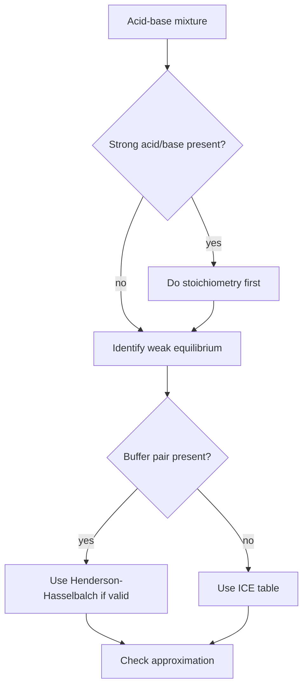

# Acid-Base Equilibria, Buffers, and Titrations

Acid-base equilibria extend pH calculations beyond strong acids and bases. Weak acids and bases only partially ionize, salts can change pH through hydrolysis, buffers resist pH change, and titration curves reveal which species controls pH at each stage.

In the Ebbing and Gammon sequence this topic sits near weak acid ionization, polyprotic acids, base ionization, salt hydrolysis, common-ion effect, buffers, and titration curves. That placement matters because general chemistry is cumulative: a later calculation usually reuses earlier ideas about measurement, atomic structure, bonding, molecular motion, or equilibrium. The aim of this page is to turn the chapter-level ideas into a working reference that can be used for problem solving without copying the textbook's wording or examples.

## Definitions

The following definitions give the vocabulary and notation used in this page. Treat them as operational definitions: each one says what can be counted, measured, compared, or conserved in a chemical argument.

- $K_a$ is the acid-ionization constant for a weak acid.
- $K_b$ is the base-ionization constant for a weak base.
- Polyprotic acid can donate more than one proton in steps.
- Common-ion effect suppresses ionization by adding a product ion.
- Buffer is a mixture of a weak acid and conjugate base or weak base and conjugate acid.
- Henderson-Hasselbalch equation relates buffer pH to acid/base ratio.
- Equivalence point is where stoichiometric amounts have reacted.
- Half-equivalence point in a weak acid titration has $\mathrm{pH}=pK_a$.

Definitions in chemistry often connect a symbolic representation to a physical sample. A formula such as $\mathrm{H_2O}$ names a substance, gives the atomic ratio inside one molecule, and supplies the molar mass used in a macroscopic calculation. A state symbol such as $\mathrm{(aq)}$ is not cosmetic; it says the species is dispersed in water and may be treated as ions when writing a net ionic equation. In the same way, constants such as $R$, $K_w$, $F$, or $N_A$ are compact definitions of the measurement system being used.

## Key results

The central results are:

- Weak acid: $K_a=[H_3O^+][A^-]/[HA]$.
- Weak base: $K_b=[BH^+][OH^-]/[B]$.
- Conjugate relation: $K_aK_b=K_w$ for a conjugate pair.
- Henderson-Hasselbalch: $\mathrm{pH}=pK_a+\log([A^-]/[HA])$.
- Percent ionization: ionized acid concentration divided by initial acid concentration times 100 percent.
- At weak acid-strong base equivalence, pH is usually greater than 7 because conjugate base hydrolyzes.

The order of operations is crucial. First perform any strong stoichiometric reaction, then identify the equilibrium system left behind. A buffer problem is not simply a formula problem; it is a mixture whose weak acid and conjugate base amounts may be changed by added strong acid or base before equilibrium is considered.

A good way to use these results is to state the chemical model first, then substitute numbers second. For acid-base equilibria, the model usually answers questions such as what particles are present, what is conserved, which process is idealized, and which measurement is being interpreted. Once that sentence is clear, the algebra becomes a bookkeeping problem rather than a search for a memorized pattern.

Units are part of the result, not decoration. Whenever a formula contains an empirical constant, a tabulated value, or a ratio of measured quantities, the units tell you whether the expression has been used in the intended form. This is especially important in general chemistry because several equations have nearly identical algebra but different meanings: pressure can be a measured state variable, an equilibrium correction, or a colligative effect; energy can be heat flow, enthalpy, internal energy, or free energy.

The strongest check is an independent chemical interpretation. Ask whether the sign agrees with direction, whether a concentration can be negative, whether a mole ratio follows the balanced equation, whether an equilibrium shift opposes the stress, and whether a microscopic description explains the macroscopic number. These checks connect acid-base equilibria to neighboring topics instead of leaving it as an isolated technique.

A second check is to compare the limiting cases. If a reactant amount goes to zero, a product amount cannot remain large. If temperature rises in a gas sample at fixed volume, pressure should not fall in an ideal model. If an acid is diluted, hydronium concentration should normally decrease unless a coupled equilibrium supplies more. Limiting cases often reveal algebra that has been rearranged correctly but applied to the wrong chemical situation.

Finally, keep symbolic and particulate representations side by side. A balanced equation, an equilibrium expression, an orbital diagram, or a polymer repeat unit is a compact symbol for a population of particles. Translating that symbol into words forces you to say what is reacting, what is being counted, and what is being held constant. That translation is usually the difference between a calculation that can be adapted to a new problem and one that only imitates a worked example.

## Visual



| Titration region | Dominant calculation |
|---|---|
| Initial weak acid | weak acid ICE table |
| Before equivalence | buffer after stoichiometry |
| Half-equivalence | $pH=pK_a$ |
| Equivalence | conjugate base hydrolysis |
| After equivalence | excess strong base |

## Worked example 1: Weak acid pH by ICE table

Problem. Find the pH of 0.100 M acetic acid with $K_a=1.8\times10^{-5}$.

    Method.

    1. Write $\mathrm{HA+H_2O\rightleftharpoons H_3O^+ + A^-}$.
2. Let $x=[H_3O^+]$ formed.
3. Equilibrium concentrations are $[HA]=0.100-x$, $[H_3O^+]=x$, $[A^-]=x$.
4. Write $K_a=x^2/(0.100-x)=1.8\times10^{-5}$.
5. Because $K_a$ is small, approximate $0.100-x\approx0.100$.
6. Then $x=\sqrt{(1.8\times10^{-5})(0.100)}=1.34\times10^{-3}\ \mathrm{M}$.
7. pH $=-\log(1.34\times10^{-3})=2.87$.
8. Check $x/0.100=1.34\%$, so the approximation is acceptable.

    Checked answer. pH is 2.87. The pH is higher than 1.00 for a 0.100 M strong acid, as expected for a weak acid.

    The important habit is to identify the conserved quantity before reaching for an equation. In this example the units, coefficients, charges, or particles chosen in the first step control every later step. The final numerical answer is not accepted merely because it came from a formula; it is checked against the chemical picture. If the magnitude, sign, units, or limiting condition contradicts that picture, the calculation has to be restarted from the definition rather than patched at the end.

## Worked example 2: Buffer after adding strong acid

Problem. A buffer contains 0.200 mol acetic acid and 0.300 mol acetate in 1.00 L. Add 0.0500 mol HCl. Find the pH using $pK_a=4.74$.

    Method.

    1. Strong acid reacts with conjugate base: $\mathrm{H^+ + A^-\to HA}$.
2. Acetate moles decrease: $0.300-0.0500=0.250\ \mathrm{mol}$.
3. Acetic acid moles increase: $0.200+0.0500=0.250\ \mathrm{mol}$.
4. Use mole ratio in Henderson-Hasselbalch because volume cancels for both species.
5. $\mathrm{pH}=4.74+\log(0.250/0.250)$.
6. The logarithm is zero, so pH is 4.74.

    Checked answer. The buffer pH is 4.74. Equal acid and conjugate base amounts give pH equal to pKa.

    The important habit is to identify the conserved quantity before reaching for an equation. In this example the units, coefficients, charges, or particles chosen in the first step control every later step. The final numerical answer is not accepted merely because it came from a formula; it is checked against the chemical picture. If the magnitude, sign, units, or limiting condition contradicts that picture, the calculation has to be restarted from the definition rather than patched at the end.

## Code

The snippet below is intentionally small, but it is runnable and mirrors the calculation style used in the worked examples. It keeps units visible in variable names so that the computation remains auditable.

```python
from math import sqrt, log10

def weak_acid_pH(C, Ka):
    h = sqrt(Ka * C)
    return -log10(h)

def buffer_pH(pKa, mol_base, mol_acid):
    return pKa + log10(mol_base / mol_acid)

pH_acetic = weak_acid_pH(0.100, 1.8e-5)
pH_buffer = buffer_pH(4.74, 0.250, 0.250)
print(pH_acetic, pH_buffer)
```

## Common pitfalls

- Using Henderson-Hasselbalch before neutralizing added strong acid or base. Avoid it by doing stoichiometry first.
- Assuming equivalence point is always pH 7. Avoid it by checking whether conjugate acid or base hydrolyzes.
- Ignoring approximation checks in weak acid ICE tables. Avoid it by computing percent ionization after solving.
- Using initial molarity instead of post-reaction moles in buffers. Avoid it by updating the acid/base pair amounts.
- Treating polyprotic acid steps as equally strong. Avoid it by using stepwise $K_a$ values and usually dominant first ionization.
- Confusing endpoint with equivalence point. Avoid it by separating indicator color change from stoichiometric completion.

## Connections

- [acids, bases, and pH](/chemistry/general/acids-bases-and-ph)
- [chemical equilibrium](/chemistry/general/chemical-equilibrium)
- [aqueous reactions and solution stoichiometry](/chemistry/general/aqueous-reactions-and-solution-stoichiometry)
- [solubility and complex-ion equilibria](/chemistry/general/solubility-and-complex-ion-equilibria)
