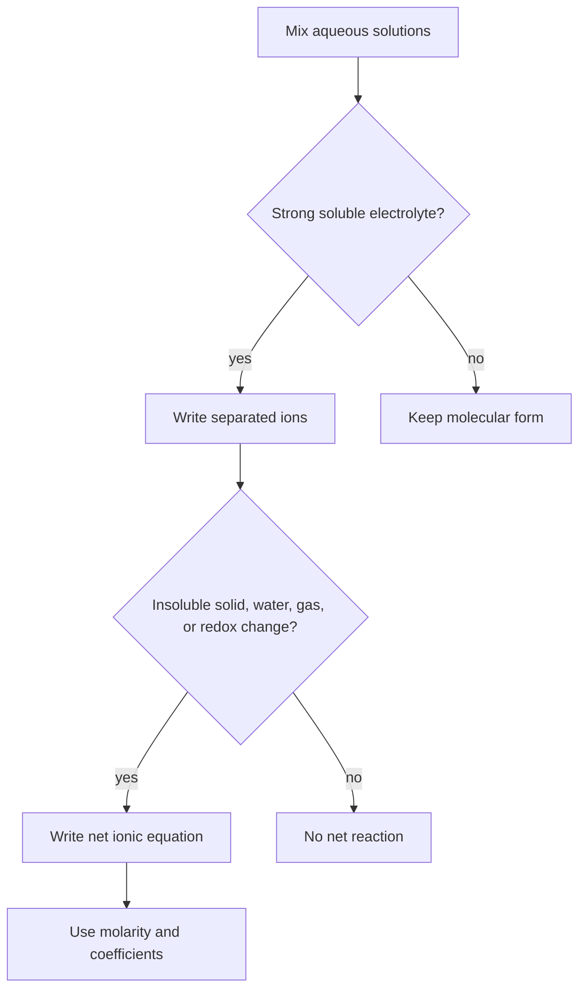

# Aqueous Reactions and Solution Stoichiometry

Many general chemistry reactions occur in water, where soluble ionic compounds separate into ions and reactions are often driven by formation of a precipitate, weak electrolyte, gas, or redox product. Aqueous reaction chemistry therefore combines symbolic equations with solubility, charge, and concentration.

In the Ebbing and Gammon sequence this topic sits near ionic theory of solutions, solubility rules, precipitation, acid-base reactions, redox reactions, molarity, dilution, gravimetric analysis, and volumetric analysis. That placement matters because general chemistry is cumulative: a later calculation usually reuses earlier ideas about measurement, atomic structure, bonding, molecular motion, or equilibrium. The aim of this page is to turn the chapter-level ideas into a working reference that can be used for problem solving without copying the textbook's wording or examples.

## Definitions

The following definitions give the vocabulary and notation used in this page. Treat them as operational definitions: each one says what can be counted, measured, compared, or conserved in a chemical argument.

- An electrolyte produces ions in solution and conducts electricity.
- A nonelectrolyte dissolves without forming a significant concentration of ions.
- A precipitate is an insoluble solid formed from ions in solution.
- A molecular equation shows complete formulas for reactants and products.
- A complete ionic equation separates strong soluble electrolytes into ions.
- A net ionic equation removes spectator ions and shows the chemical change.
- Molarity is $M=\mathrm{mol\ solute}/\mathrm{L\ solution}$.
- Dilution conserves solute moles while increasing solution volume.

Definitions in chemistry often connect a symbolic representation to a physical sample. A formula such as $\mathrm{H_2O}$ names a substance, gives the atomic ratio inside one molecule, and supplies the molar mass used in a macroscopic calculation. A state symbol such as $\mathrm{(aq)}$ is not cosmetic; it says the species is dispersed in water and may be treated as ions when writing a net ionic equation. In the same way, constants such as $R$, $K_w$, $F$, or $N_A$ are compact definitions of the measurement system being used.

## Key results

The central results are:

- Molarity relation: $n=MV$ with volume in liters.
- Dilution equation: $M_1V_1=M_2V_2$.
- Precipitation occurs when ion combinations form a compound whose solubility is very small.
- Neutralization core: $\mathrm{H^+ + OH^- \to H_2O}$ for strong acid and strong base.
- Oxidation is loss of electrons; reduction is gain of electrons.
- Net ionic equations must balance atoms and total charge.

The strongest skill in aqueous chemistry is deciding what species actually exist in solution. A formula written with state symbol $\mathrm{(aq)}$ may represent separated ions, whereas a precipitate remains a solid formula unit. Once species are identified, stoichiometry proceeds in moles, usually obtained from molarity and volume.

A good way to use these results is to state the chemical model first, then substitute numbers second. For aqueous reactions, the model usually answers questions such as what particles are present, what is conserved, which process is idealized, and which measurement is being interpreted. Once that sentence is clear, the algebra becomes a bookkeeping problem rather than a search for a memorized pattern.

Units are part of the result, not decoration. Whenever a formula contains an empirical constant, a tabulated value, or a ratio of measured quantities, the units tell you whether the expression has been used in the intended form. This is especially important in general chemistry because several equations have nearly identical algebra but different meanings: pressure can be a measured state variable, an equilibrium correction, or a colligative effect; energy can be heat flow, enthalpy, internal energy, or free energy.

The strongest check is an independent chemical interpretation. Ask whether the sign agrees with direction, whether a concentration can be negative, whether a mole ratio follows the balanced equation, whether an equilibrium shift opposes the stress, and whether a microscopic description explains the macroscopic number. These checks connect aqueous reactions to neighboring topics instead of leaving it as an isolated technique.

A second check is to compare the limiting cases. If a reactant amount goes to zero, a product amount cannot remain large. If temperature rises in a gas sample at fixed volume, pressure should not fall in an ideal model. If an acid is diluted, hydronium concentration should normally decrease unless a coupled equilibrium supplies more. Limiting cases often reveal algebra that has been rearranged correctly but applied to the wrong chemical situation.

Finally, keep symbolic and particulate representations side by side. A balanced equation, an equilibrium expression, an orbital diagram, or a polymer repeat unit is a compact symbol for a population of particles. Translating that symbol into words forces you to say what is reacting, what is being counted, and what is being held constant. That translation is usually the difference between a calculation that can be adapted to a new problem and one that only imitates a worked example.

## Visual



| Reaction class | Driving observation | Net ionic focus |
|---|---|---|
| Precipitation | Cloudy solid forms | Insoluble ionic product |
| Acid-base | Heat, indicator shift, water formation | Proton transfer |
| Redox | Metal deposition, color change, gas | Electron transfer |
| Complex formation | Dissolution or color change | Lewis acid-base bonding |

## Worked example 1: Net ionic equation for precipitation

Problem. Solutions of $\mathrm{AgNO_3}$ and $\mathrm{NaCl}$ are mixed. Write the net ionic equation.

    Method.

    1. Write the molecular equation: $\mathrm{AgNO_3(aq)+NaCl(aq)\to AgCl(s)+NaNO_3(aq)}$.
2. Separate soluble strong electrolytes into ions: $\mathrm{Ag^+ + NO_3^- + Na^+ + Cl^- \to AgCl(s)+Na^+ + NO_3^-}$.
3. Identify spectator ions: $\mathrm{Na^+}$ and $\mathrm{NO_3^-}$ appear unchanged on both sides.
4. Cancel spectator ions.
5. Check atoms and charge in the remaining equation.

    Checked answer. $\mathrm{Ag^+(aq)+Cl^-(aq)\to AgCl(s)}$. Charge is $+1-1=0$ on the left and zero on the solid product.

    The important habit is to identify the conserved quantity before reaching for an equation. In this example the units, coefficients, charges, or particles chosen in the first step control every later step. The final numerical answer is not accepted merely because it came from a formula; it is checked against the chemical picture. If the magnitude, sign, units, or limiting condition contradicts that picture, the calculation has to be restarted from the definition rather than patched at the end.

## Worked example 2: Titration molarity from neutralization

Problem. A 25.00 mL sample of sulfuric acid requires 32.40 mL of 0.1500 M NaOH for complete neutralization. Find the acid molarity, assuming $\mathrm{H_2SO_4}$ supplies two acidic protons.

    Method.

    1. Write the balanced neutralization: $\mathrm{H_2SO_4+2NaOH\to Na_2SO_4+2H_2O}$.
2. Convert base volume to liters: $0.03240\ \mathrm{L}$.
3. Find moles NaOH: $0.1500\times0.03240=0.004860\ \mathrm{mol}$.
4. Use the mole ratio: moles $\mathrm{H_2SO_4}=0.004860/2=0.002430\ \mathrm{mol}$.
5. Convert acid volume to liters: $0.02500\ \mathrm{L}$.
6. Find molarity: $0.002430/0.02500=0.09720\ \mathrm{M}$.

    Checked answer. $0.09720\ \mathrm{M\ H_2SO_4}$. The acid molarity is less than the NaOH molarity because each acid molecule consumes two hydroxide ions.

    The important habit is to identify the conserved quantity before reaching for an equation. In this example the units, coefficients, charges, or particles chosen in the first step control every later step. The final numerical answer is not accepted merely because it came from a formula; it is checked against the chemical picture. If the magnitude, sign, units, or limiting condition contradicts that picture, the calculation has to be restarted from the definition rather than patched at the end.

## Code

The snippet below is intentionally small, but it is runnable and mirrors the calculation style used in the worked examples. It keeps units visible in variable names so that the computation remains auditable.

```python
def molarity_from_titration(base_M, base_mL, acid_mL, base_per_acid):
    base_mol = base_M * base_mL / 1000.0
    acid_mol = base_mol / base_per_acid
    return acid_mol / (acid_mL / 1000.0)

acid_M = molarity_from_titration(0.1500, 32.40, 25.00, 2)
print(f"{acid_M:.5f} M")
```

## Common pitfalls

- Writing every soluble compound as a molecule in net ionic equations. Avoid it by dissociating strong soluble electrolytes before canceling spectators.
- Canceling ions that change phase or oxidation state. Avoid it by canceling only species identical in form and state.
- Using milliliters directly in $n=MV$. Avoid it by converting to liters or using consistent volume ratios intentionally.
- Forgetting acid-base stoichiometric coefficients. Avoid it by writing the balanced neutralization before calculating molarity.
- Calling any cloudy mixture a precipitate reaction without checking solubility rules. Avoid it by identifying the insoluble product explicitly.
- Balancing redox by atoms but not charge. Avoid it by checking electron balance and total charge.

## Connections

- [stoichiometry](/chemistry/general/stoichiometry)
- [acid-base equilibria, buffers, and titrations](/chemistry/general/acid-base-equilibria-buffers-and-titrations)
- [solubility and complex-ion equilibria](/chemistry/general/solubility-and-complex-ion-equilibria)
- [electrochemistry](/chemistry/general/electrochemistry)
