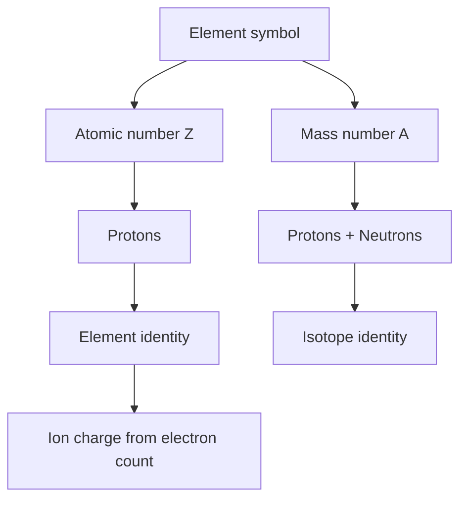

# Atoms, Molecules, and Ions

Atomic theory explains why matter combines in definite ratios and why chemical equations can be balanced at all. Atoms have nuclear charge, isotopic mass, and electron structure; molecules and ions are the formulas by which those atoms appear in chemical substances. Naming and formula writing are therefore not side tasks; they are the language that makes stoichiometry and bonding possible.

In the Ebbing and Gammon sequence this topic sits near atomic theory, nuclear atom, isotopes, atomic masses, formulas, names, and balanced equations. That placement matters because general chemistry is cumulative: a later calculation usually reuses earlier ideas about measurement, atomic structure, bonding, molecular motion, or equilibrium. The aim of this page is to turn the chapter-level ideas into a working reference that can be used for problem solving without copying the textbook's wording or examples.


*Figure: Ball-and-stick model of a water molecule. Image: [Wikimedia Commons](https://commons.wikimedia.org/wiki/File:Water-3D-balls.png), Benjah-bmm27, public domain.*

## Definitions

The following definitions give the vocabulary and notation used in this page. Treat them as operational definitions: each one says what can be counted, measured, compared, or conserved in a chemical argument.

- An atom is the smallest unit of an element that retains that element's chemical identity.
- The atomic number $Z$ is the number of protons in the nucleus.
- The mass number $A$ is the total number of protons and neutrons.
- Isotopes are atoms of the same element with different numbers of neutrons.
- Atomic mass is the abundance-weighted average mass of naturally occurring isotopes.
- A molecule is a neutral group of covalently bonded atoms.
- An ion is a charged atom or group of atoms; cations are positive and anions are negative.
- A chemical formula states the kinds and ratios of atoms or ions in a substance.

Definitions in chemistry often connect a symbolic representation to a physical sample. A formula such as $\mathrm{H_2O}$ names a substance, gives the atomic ratio inside one molecule, and supplies the molar mass used in a macroscopic calculation. A state symbol such as $\mathrm{(aq)}$ is not cosmetic; it says the species is dispersed in water and may be treated as ions when writing a net ionic equation. In the same way, constants such as $R$, $K_w$, $F$, or $N_A$ are compact definitions of the measurement system being used.

## Key results

The central results are:

- Number of neutrons: $N = A - Z$.
- Average atomic mass: $\bar{m}=\sum_i f_i m_i$, where $f_i$ is fractional abundance.
- Charge balance in ionic formulas requires total positive charge plus total negative charge equals zero.
- Diatomic elemental molecules commonly include $\mathrm{H_2, N_2, O_2, F_2, Cl_2, Br_2, I_2}$.
- A molecular equation must conserve atoms; a net ionic equation must conserve atoms and charge.
- A coefficient multiplies an entire formula unit; a subscript belongs to the formula.

The nuclear atom supplies the identity of an element, while the electrons largely control chemical behavior. Because isotopic masses differ, the atomic mass on the periodic table is usually not a whole number. Because ions carry charge, ionic formulas are written by charge balance rather than by guessing. These distinctions prevent common errors such as changing subscripts to balance equations or treating an isotope symbol as if it named a different element.

A good way to use these results is to state the chemical model first, then substitute numbers second. For atoms, molecules, and ions, the model usually answers questions such as what particles are present, what is conserved, which process is idealized, and which measurement is being interpreted. Once that sentence is clear, the algebra becomes a bookkeeping problem rather than a search for a memorized pattern.

Units are part of the result, not decoration. Whenever a formula contains an empirical constant, a tabulated value, or a ratio of measured quantities, the units tell you whether the expression has been used in the intended form. This is especially important in general chemistry because several equations have nearly identical algebra but different meanings: pressure can be a measured state variable, an equilibrium correction, or a colligative effect; energy can be heat flow, enthalpy, internal energy, or free energy.

The strongest check is an independent chemical interpretation. Ask whether the sign agrees with direction, whether a concentration can be negative, whether a mole ratio follows the balanced equation, whether an equilibrium shift opposes the stress, and whether a microscopic description explains the macroscopic number. These checks connect atoms, molecules, and ions to neighboring topics instead of leaving it as an isolated technique.

A second check is to compare the limiting cases. If a reactant amount goes to zero, a product amount cannot remain large. If temperature rises in a gas sample at fixed volume, pressure should not fall in an ideal model. If an acid is diluted, hydronium concentration should normally decrease unless a coupled equilibrium supplies more. Limiting cases often reveal algebra that has been rearranged correctly but applied to the wrong chemical situation.

Finally, keep symbolic and particulate representations side by side. A balanced equation, an equilibrium expression, an orbital diagram, or a polymer repeat unit is a compact symbol for a population of particles. Translating that symbol into words forces you to say what is reacting, what is being counted, and what is being held constant. That translation is usually the difference between a calculation that can be adapted to a new problem and one that only imitates a worked example.

## Visual



| Species | Protons | Neutrons | Electrons | Charge |
|---|---:|---:|---:|---:|
| $^{23}\mathrm{Na}$ | 11 | 12 | 11 | 0 |
| $^{23}\mathrm{Na^+}$ | 11 | 12 | 10 | +1 |
| $^{35}\mathrm{Cl^-}$ | 17 | 18 | 18 | -1 |
| $^{37}\mathrm{Cl^-}$ | 17 | 20 | 18 | -1 |

## Worked example 1: Average atomic mass from isotopes

Problem. Chlorine has two major isotopes: $^{35}\mathrm{Cl}$ with mass 34.969 amu and 75.78 percent abundance, and $^{37}\mathrm{Cl}$ with mass 36.966 amu and 24.22 percent abundance. Find the average atomic mass.

    Method.

    1. Convert percentages to fractions: $0.7578$ and $0.2422$.
2. Multiply each isotope mass by its fractional abundance: $34.969(0.7578)=26.498$ amu.
3. Do the same for the second isotope: $36.966(0.2422)=8.952$ amu.
4. Add the weighted contributions: $26.498+8.952=35.450$ amu.
5. Round consistently with the data to $35.45$ amu.

    Checked answer. The average atomic mass is $35.45\ \mathrm{amu}$. The answer lies closer to 35 than 37 because the lighter isotope is more abundant.

    The important habit is to identify the conserved quantity before reaching for an equation. In this example the units, coefficients, charges, or particles chosen in the first step control every later step. The final numerical answer is not accepted merely because it came from a formula; it is checked against the chemical picture. If the magnitude, sign, units, or limiting condition contradicts that picture, the calculation has to be restarted from the definition rather than patched at the end.

## Worked example 2: Formula and name from ion charges

Problem. Write the formula and name for the compound made from $\mathrm{Ca^{2+}}$ and nitrate, $\mathrm{NO_3^-}$.

    Method.

    1. Identify charges: calcium is $+2$ and nitrate is $-1$.
2. The formula must have zero total charge.
3. Two nitrate ions supply total charge $-2$ to balance one calcium ion at $+2$.
4. Use parentheses because more than one polyatomic nitrate ion is present: $\mathrm{Ca(NO_3)_2}$.
5. Name the cation first and the anion second: calcium nitrate.

    Checked answer. $\mathrm{Ca(NO_3)_2}$, calcium nitrate. The charge sum is $+2+2(-1)=0$, so the formula is neutral.

    The important habit is to identify the conserved quantity before reaching for an equation. In this example the units, coefficients, charges, or particles chosen in the first step control every later step. The final numerical answer is not accepted merely because it came from a formula; it is checked against the chemical picture. If the magnitude, sign, units, or limiting condition contradicts that picture, the calculation has to be restarted from the definition rather than patched at the end.

## Code

The snippet below is intentionally small, but it is runnable and mirrors the calculation style used in the worked examples. It keeps units visible in variable names so that the computation remains auditable.

```python
def weighted_average(isotopes):
    return sum(mass * abundance for mass, abundance in isotopes)

chlorine = [(34.969, 0.7578), (36.966, 0.2422)]
avg_mass = weighted_average(chlorine)

def ionic_formula_charge(cation_charge, anion_charge, anion_count):
    return cation_charge + anion_charge * anion_count

charge_check = ionic_formula_charge(+2, -1, 2)
print(round(avg_mass, 3), charge_check)
```

## Common pitfalls

- Treating mass number as atomic mass. Avoid it by remembering that mass number belongs to one isotope and atomic mass is an average.
- Changing subscripts while balancing equations. Avoid it by only changing coefficients after formulas are correct.
- Dropping parentheses around repeated polyatomic ions. Avoid it by using parentheses when a polyatomic ion has a subscript greater than one.
- Assuming all compounds are molecular. Avoid it by checking whether the formula is ionic, molecular, or acid before naming.
- Forgetting charge conservation in net ionic equations. Avoid it by summing charges on both sides after balancing atoms.
- Reading periodic table groups without considering transition metals. Avoid it by using Roman numerals when a metal can form multiple cations.

## Connections

- [chemistry and measurement](/chemistry/general/chemistry-and-measurement)
- [stoichiometry](/chemistry/general/stoichiometry)
- [electron configurations and periodic trends](/chemistry/general/electron-configurations-and-periodic-trends)
- [ionic and covalent bonding](/chemistry/general/ionic-and-covalent-bonding)
