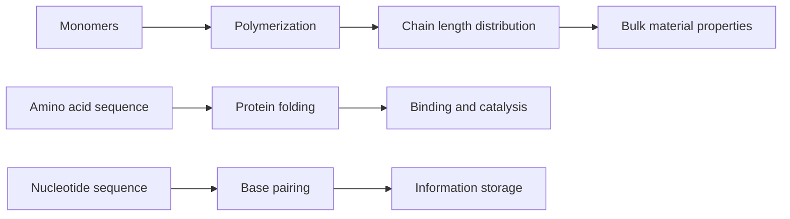

# Biochemistry and Polymer Materials

Polymer and biological chemistry apply bonding, structure, and intermolecular forces to very large molecules. Synthetic polymers show how repeating covalent units create materials, while biological polymers such as proteins and nucleic acids show how sequence, shape, and noncovalent interactions store information and perform functions.

In the Ebbing and Gammon sequence this topic sits near synthetic polymers, electrically conducting polymers, proteins, nucleic acids, and introductory biological macromolecules. That placement matters because general chemistry is cumulative: a later calculation usually reuses earlier ideas about measurement, atomic structure, bonding, molecular motion, or equilibrium. The aim of this page is to turn the chapter-level ideas into a working reference that can be used for problem solving without copying the textbook's wording or examples.

## Definitions

The following definitions give the vocabulary and notation used in this page. Treat them as operational definitions: each one says what can be counted, measured, compared, or conserved in a chemical argument.

- Monomer is a small molecule that can become part of a polymer chain.
- Polymer is a macromolecule made from repeating units.
- Degree of polymerization is the number of repeat units in an average chain.
- Addition polymerization joins monomers without eliminating a small molecule.
- Condensation polymerization joins monomers while eliminating a small molecule such as water.
- Protein is a polymer of amino acids connected by peptide bonds.
- Nucleic acid is a polymer of nucleotides that stores and transfers genetic information.
- Carbohydrates and lipids are major biomolecular classes; carbohydrates often store energy or structure, while lipids are hydrophobic membrane and energy-storage molecules.

Definitions in chemistry often connect a symbolic representation to a physical sample. A formula such as $\mathrm{H_2O}$ names a substance, gives the atomic ratio inside one molecule, and supplies the molar mass used in a macroscopic calculation. A state symbol such as $\mathrm{(aq)}$ is not cosmetic; it says the species is dispersed in water and may be treated as ions when writing a net ionic equation. In the same way, constants such as $R$, $K_w$, $F$, or $N_A$ are compact definitions of the measurement system being used.

## Key results

The central results are:

- Number-average molar mass approximation: $M_n\approx(\mathrm{degree\ of\ polymerization})(M_{repeat})$.
- Peptide bond formation is a condensation reaction between carboxyl and amino groups.
- Protein primary structure is amino acid sequence; higher structures depend on hydrogen bonding, ionic interactions, hydrophobic effects, disulfide bonds, and metal coordination.
- DNA base pairing: A pairs with T, and G pairs with C in standard double-stranded DNA.
- Hydrophobic effect helps drive folding and membrane formation in water.
- Conducting polymers require extended conjugation and appropriate charge carriers.

Macromolecular properties are emergent. A single covalent repeat unit does not have the toughness of a polymer sample, and a single peptide bond does not explain enzyme specificity. Chain length, branching, cross-linking, sequence, stereochemistry, and noncovalent interactions collectively determine the material or biological function.

A good way to use these results is to state the chemical model first, then substitute numbers second. For biochemistry and polymer materials, the model usually answers questions such as what particles are present, what is conserved, which process is idealized, and which measurement is being interpreted. Once that sentence is clear, the algebra becomes a bookkeeping problem rather than a search for a memorized pattern.

Units are part of the result, not decoration. Whenever a formula contains an empirical constant, a tabulated value, or a ratio of measured quantities, the units tell you whether the expression has been used in the intended form. This is especially important in general chemistry because several equations have nearly identical algebra but different meanings: pressure can be a measured state variable, an equilibrium correction, or a colligative effect; energy can be heat flow, enthalpy, internal energy, or free energy.

The strongest check is an independent chemical interpretation. Ask whether the sign agrees with direction, whether a concentration can be negative, whether a mole ratio follows the balanced equation, whether an equilibrium shift opposes the stress, and whether a microscopic description explains the macroscopic number. These checks connect biochemistry and polymer materials to neighboring topics instead of leaving it as an isolated technique.

A second check is to compare the limiting cases. If a reactant amount goes to zero, a product amount cannot remain large. If temperature rises in a gas sample at fixed volume, pressure should not fall in an ideal model. If an acid is diluted, hydronium concentration should normally decrease unless a coupled equilibrium supplies more. Limiting cases often reveal algebra that has been rearranged correctly but applied to the wrong chemical situation.

Finally, keep symbolic and particulate representations side by side. A balanced equation, an equilibrium expression, an orbital diagram, or a polymer repeat unit is a compact symbol for a population of particles. Translating that symbol into words forces you to say what is reacting, what is being counted, and what is being held constant. That translation is usually the difference between a calculation that can be adapted to a new problem and one that only imitates a worked example.

## Visual



| Biomolecular class | Building blocks | Important bonds or forces | General role |
|---|---|---|---|
| Carbohydrates | monosaccharides | glycosidic bonds, hydrogen bonding | energy and structure |
| Lipids | fatty acids, glycerol, sterol units | hydrophobic interactions, ester bonds | membranes and energy storage |
| Proteins | amino acids | peptide bonds, folding interactions | catalysis, structure, transport |
| Nucleic acids | nucleotides | phosphodiester bonds, base pairing | genetic information |

## Worked example 1: Average molar mass from degree of polymerization

Problem. A polyethylene sample has average degree of polymerization 2500. Estimate number-average molar mass using repeat unit $\mathrm{C_2H_4}$.

    Method.

    1. Compute repeat-unit molar mass: $2(12.01)+4(1.008)=28.05\ \mathrm{g\ mol^{-1}}$.
2. Use $M_n\approx DP\times M_{repeat}$.
3. Substitute: $M_n=2500(28.05)=70125\ \mathrm{g\ mol^{-1}}$.
4. Write in scientific notation: $7.01\times10^4\ \mathrm{g\ mol^{-1}}$.
5. This ignores end-group mass, which is negligible for such a long chain in an introductory estimate.

    Checked answer. $M_n\approx7.01\times10^4\ \mathrm{g\ mol^{-1}}$. Thousands of repeat units should give tens of thousands of grams per mole.

    The important habit is to identify the conserved quantity before reaching for an equation. In this example the units, coefficients, charges, or particles chosen in the first step control every later step. The final numerical answer is not accepted merely because it came from a formula; it is checked against the chemical picture. If the magnitude, sign, units, or limiting condition contradicts that picture, the calculation has to be restarted from the definition rather than patched at the end.

## Worked example 2: DNA complement and base counts

Problem. A DNA strand has sequence 5'-ATGCCGA-3'. Write the complementary strand and count hydrogen-bond categories.

    Method.

    1. Use base-pairing rules: A pairs with T, and G pairs with C.
2. Read each base on the given strand and write its partner: A->T, T->A, G->C, C->G, C->G, G->C, A->T.
3. The complementary sequence aligned antiparallel is 3'-TACGGCT-5'.
4. Count A-T pairs: positions 1, 2, and 7 give three A-T pairs.
5. Count G-C pairs: positions 3, 4, 5, and 6 give four G-C pairs.
6. A-T pairs have two hydrogen bonds each and G-C pairs have three each, so total hydrogen bonds are $3(2)+4(3)=18$.

    Checked answer. Complement is 3'-TACGGCT-5', with three A-T pairs, four G-C pairs, and 18 base-pair hydrogen bonds. The complement has the same length and every base has exactly one partner.

    The important habit is to identify the conserved quantity before reaching for an equation. In this example the units, coefficients, charges, or particles chosen in the first step control every later step. The final numerical answer is not accepted merely because it came from a formula; it is checked against the chemical picture. If the magnitude, sign, units, or limiting condition contradicts that picture, the calculation has to be restarted from the definition rather than patched at the end.

## Code

The snippet below is intentionally small, but it is runnable and mirrors the calculation style used in the worked examples. It keeps units visible in variable names so that the computation remains auditable.

```python
def polymer_molar_mass(degree_polymerization, repeat_mass):
    return degree_polymerization * repeat_mass

def dna_complement(seq):
    pairs = {"A": "T", "T": "A", "G": "C", "C": "G"}
    return "".join(pairs[base] for base in seq)

def dna_h_bonds(seq):
    return sum(2 if base in "AT" else 3 for base in seq)

repeat_mass = 2 * 12.01 + 4 * 1.008
print(polymer_molar_mass(2500, repeat_mass))
print(dna_complement("ATGCCGA"), dna_h_bonds("ATGCCGA"))
```

## Common pitfalls

- Treating polymers as single-molar-mass small molecules. Avoid it by remembering real samples have chain length distributions.
- Ignoring end groups for short oligomers. Avoid it by checking whether degree of polymerization is large enough for approximation.
- Confusing addition and condensation polymerization. Avoid it by looking for loss of a small molecule such as water or HCl.
- Saying all biomolecular structure is covalent. Avoid it by including hydrogen bonding, ionic, hydrophobic, and dispersion interactions.
- Writing DNA complements in the wrong direction. Avoid it by marking 5' and 3' ends explicitly.
- Treating lipids as polymers in the same sense as proteins or nucleic acids. Avoid it by recognizing lipids as a broad hydrophobic class rather than sequence polymers.

## Connections

- [organic chemistry](/chemistry/general/organic-chemistry)
- [molecular geometry and bonding theory](/chemistry/general/molecular-geometry-and-bonding-theory)
- [solutions and colligative properties](/chemistry/general/solutions-and-colligative-properties)
- [transition metals and coordination compounds](/chemistry/general/transition-metals-and-coordination-compounds)
