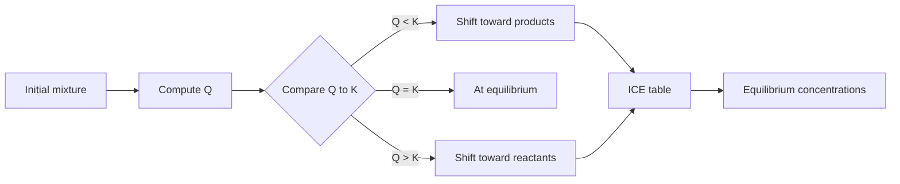

# Chemical Equilibrium

Chemical equilibrium is a dynamic state in which forward and reverse reactions continue at equal rates. The equilibrium constant describes the composition favored at a given temperature, while the reaction quotient tells whether a particular mixture will shift toward products or reactants.

In the Ebbing and Gammon sequence this topic sits near dynamic equilibrium, equilibrium constants, heterogeneous equilibria, reaction quotient, equilibrium concentrations, and Le Chatelier's principle. That placement matters because general chemistry is cumulative: a later calculation usually reuses earlier ideas about measurement, atomic structure, bonding, molecular motion, or equilibrium. The aim of this page is to turn the chapter-level ideas into a working reference that can be used for problem solving without copying the textbook's wording or examples.

## Definitions

The following definitions give the vocabulary and notation used in this page. Treat them as operational definitions: each one says what can be counted, measured, compared, or conserved in a chemical argument.

- Dynamic equilibrium means microscopic forward and reverse processes continue with no net macroscopic change.
- Equilibrium constant $K_c$ is the concentration ratio for a balanced reaction at equilibrium.
- $K_p$ is an equilibrium constant written with gas partial pressures.
- Reaction quotient $Q$ has the same form as $K$ but uses current, not necessarily equilibrium, amounts.
- Homogeneous equilibrium has all species in one phase.
- Heterogeneous equilibrium includes species in different phases; pure solids and liquids are omitted from $K$.
- ICE table tracks initial, change, and equilibrium amounts.
- Le Chatelier's principle predicts that a system at equilibrium shifts to reduce a stress.

Definitions in chemistry often connect a symbolic representation to a physical sample. A formula such as $\mathrm{H_2O}$ names a substance, gives the atomic ratio inside one molecule, and supplies the molar mass used in a macroscopic calculation. A state symbol such as $\mathrm{(aq)}$ is not cosmetic; it says the species is dispersed in water and may be treated as ions when writing a net ionic equation. In the same way, constants such as $R$, $K_w$, $F$, or $N_A$ are compact definitions of the measurement system being used.

## Key results

The central results are:

- For $\mathrm{aA+bB\rightleftharpoons cC+dD}$, $K_c=[C]^c[D]^d/[A]^a[B]^b$.
- For gases, $K_p=K_c(RT)^{\Delta n_{gas}}$.
- If $Q\lt K$, reaction proceeds forward; if $Q\gt K$, reaction proceeds reverse.
- Reverse reaction constant is $1/K$.
- Multiplying a reaction by $n$ raises $K$ to the $n$ power.
- Catalysts do not change $K$; temperature changes can change $K$.

Equilibrium constants are tied to balanced equations. Changing the equation changes the mathematical expression and therefore the numerical value of $K$. The most reliable equilibrium calculations combine a reaction table with chemical approximations that are checked afterward, rather than assumed blindly.

A good way to use these results is to state the chemical model first, then substitute numbers second. For chemical equilibrium, the model usually answers questions such as what particles are present, what is conserved, which process is idealized, and which measurement is being interpreted. Once that sentence is clear, the algebra becomes a bookkeeping problem rather than a search for a memorized pattern.

Units are part of the result, not decoration. Whenever a formula contains an empirical constant, a tabulated value, or a ratio of measured quantities, the units tell you whether the expression has been used in the intended form. This is especially important in general chemistry because several equations have nearly identical algebra but different meanings: pressure can be a measured state variable, an equilibrium correction, or a colligative effect; energy can be heat flow, enthalpy, internal energy, or free energy.

The strongest check is an independent chemical interpretation. Ask whether the sign agrees with direction, whether a concentration can be negative, whether a mole ratio follows the balanced equation, whether an equilibrium shift opposes the stress, and whether a microscopic description explains the macroscopic number. These checks connect chemical equilibrium to neighboring topics instead of leaving it as an isolated technique.

A second check is to compare the limiting cases. If a reactant amount goes to zero, a product amount cannot remain large. If temperature rises in a gas sample at fixed volume, pressure should not fall in an ideal model. If an acid is diluted, hydronium concentration should normally decrease unless a coupled equilibrium supplies more. Limiting cases often reveal algebra that has been rearranged correctly but applied to the wrong chemical situation.

Finally, keep symbolic and particulate representations side by side. A balanced equation, an equilibrium expression, an orbital diagram, or a polymer repeat unit is a compact symbol for a population of particles. Translating that symbol into words forces you to say what is reacting, what is being counted, and what is being held constant. That translation is usually the difference between a calculation that can be adapted to a new problem and one that only imitates a worked example.

## Visual



| Stress | Typical shift | Note |
|---|---|---|
| Add reactant | toward products | consumes added reactant |
| Remove product | toward products | replaces removed product |
| Compress gas mixture | side with fewer gas moles | if gas mole counts differ |
| Add catalyst | no equilibrium shift | equilibrium reached faster |
| Increase temperature | favors endothermic direction | heat treated as reagent/product |

## Worked example 1: ICE table for a simple equilibrium

Problem. For $\mathrm{N_2O_4(g)\rightleftharpoons 2NO_2(g)}$, $K_c=0.36$ at a temperature. If initial $[\mathrm{N_2O_4}]=1.00\ \mathrm{M}$ and $[\mathrm{NO_2}]=0$, find equilibrium concentrations.

    Method.

    1. Set up change: $\mathrm{N_2O_4}$ decreases by $x$, $\mathrm{NO_2}$ increases by $2x$.
2. Equilibrium concentrations are $1.00-x$ and $2x$.
3. Write $K_c=(2x)^2/(1.00-x)=0.36$.
4. Rearrange: $4x^2=0.36(1.00-x)$, so $4x^2+0.36x-0.36=0$.
5. Solve the quadratic: $x=[-0.36+\sqrt{0.36^2+4(4)(0.36)}]/8=0.258$.
6. Find concentrations: $[\mathrm{N_2O_4}]=0.742\ \mathrm{M}$ and $[\mathrm{NO_2}]=0.516\ \mathrm{M}$.

    Checked answer. $[\mathrm{N_2O_4}]=0.742\ \mathrm{M}$ and $[\mathrm{NO_2}]=0.516\ \mathrm{M}$. $(0.516)^2/0.742=0.359$, matching $K_c$ within rounding.

    The important habit is to identify the conserved quantity before reaching for an equation. In this example the units, coefficients, charges, or particles chosen in the first step control every later step. The final numerical answer is not accepted merely because it came from a formula; it is checked against the chemical picture. If the magnitude, sign, units, or limiting condition contradicts that picture, the calculation has to be restarted from the definition rather than patched at the end.

## Worked example 2: Reaction quotient direction

Problem. For $\mathrm{H_2(g)+I_2(g)\rightleftharpoons 2HI(g)}$, $K_c=50.0$. A mixture has $[H_2]=0.100$, $[I_2]=0.100$, and $[HI]=0.500\ \mathrm{M}$. Which way does it shift?

    Method.

    1. Write the quotient: $Q_c=[HI]^2/([H_2][I_2])$.
2. Substitute: $Q_c=(0.500)^2/(0.100)(0.100)$.
3. Calculate numerator $0.250$ and denominator $0.0100$.
4. Thus $Q_c=25.0$.
5. Compare with $K_c=50.0$: $Q\lt K$.
6. The mixture has too little product relative to equilibrium, so it shifts forward.

    Checked answer. The reaction shifts toward $\mathrm{HI}$ formation. Forward shift increases the numerator and decreases the denominator, raising $Q$ toward $K$.

    The important habit is to identify the conserved quantity before reaching for an equation. In this example the units, coefficients, charges, or particles chosen in the first step control every later step. The final numerical answer is not accepted merely because it came from a formula; it is checked against the chemical picture. If the magnitude, sign, units, or limiting condition contradicts that picture, the calculation has to be restarted from the definition rather than patched at the end.

## Code

The snippet below is intentionally small, but it is runnable and mirrors the calculation style used in the worked examples. It keeps units visible in variable names so that the computation remains auditable.

```python
from math import sqrt

def n2o4_equilibrium(K, initial):
    # 4x^2 + Kx - K*initial = 0
    x = (-K + sqrt(K*K + 16*K*initial)) / 8
    return initial - x, 2 * x

def reaction_direction(Q, K):
    if Q < K:
        return "forward"
    if Q > K:
        return "reverse"
    return "at equilibrium"

n2o4, no2 = n2o4_equilibrium(0.36, 1.00)
Q = 0.500**2 / (0.100 * 0.100)
print(n2o4, no2, reaction_direction(Q, 50.0))
```

## Common pitfalls

- Including pure solids or liquids in equilibrium expressions. Avoid it by omitting phases with constant activity.
- Forgetting to raise concentrations to coefficients. Avoid it by copying the balanced equation into the expression carefully.
- Using initial concentrations directly as equilibrium values. Avoid it by computing $Q$ first or building an ICE table.
- Applying Le Chatelier's principle without stoichiometry. Avoid it by checking gas mole counts and reaction direction.
- Saying catalysts change equilibrium composition. Avoid it by remembering catalysts alter rate, not $K$.
- Treating $K$ as temperature independent. Avoid it by holding temperature constant unless the problem changes it.

## Connections

- [chemical kinetics](/chemistry/general/chemical-kinetics)
- [acid-base equilibria, buffers, and titrations](/chemistry/general/acid-base-equilibria-buffers-and-titrations)
- [solubility and complex-ion equilibria](/chemistry/general/solubility-and-complex-ion-equilibria)
- [thermodynamics and free energy](/chemistry/general/thermodynamics-and-free-energy)
