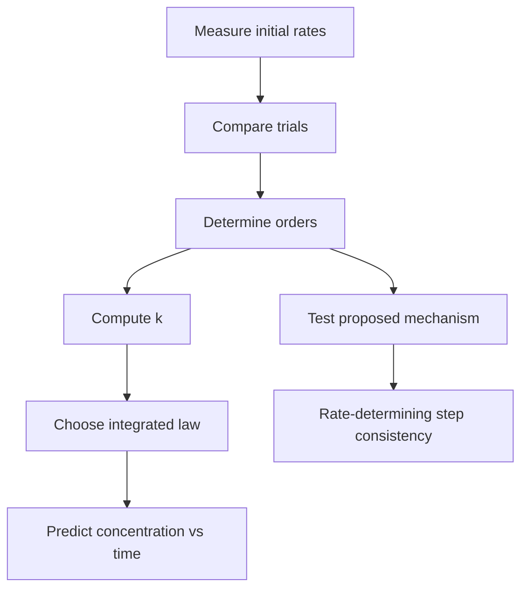

# Chemical Kinetics

Chemical kinetics studies how fast reactions occur and what molecular events control that rate. Thermodynamics can say whether products are favored, but kinetics explains whether the reaction reaches them in a second, a year, or effectively never under the given conditions.

In the Ebbing and Gammon sequence this topic sits near reaction rates, experimental rate laws, integrated rate laws, temperature effects, collision theory, transition-state theory, Arrhenius equation, mechanisms, elementary reactions, rate-determining steps, and catalysis. That placement matters because general chemistry is cumulative: a later calculation usually reuses earlier ideas about measurement, atomic structure, bonding, molecular motion, or equilibrium. The aim of this page is to turn the chapter-level ideas into a working reference that can be used for problem solving without copying the textbook's wording or examples.

## Definitions

The following definitions give the vocabulary and notation used in this page. Treat them as operational definitions: each one says what can be counted, measured, compared, or conserved in a chemical argument.

- Reaction rate is change in concentration per unit time, adjusted for stoichiometric coefficients.
- Rate law expresses rate as a function of reactant concentrations determined experimentally.
- Reaction order is the exponent of a concentration term in the rate law.
- Rate constant $k$ is the proportionality factor in a rate law.
- Integrated rate law relates concentration to time.
- Half-life is the time required for a reactant concentration to fall to half its value.
- Activation energy $E_a$ is the energy barrier for reaction.
- Catalyst increases rate by providing a lower-energy pathway and is regenerated.

Definitions in chemistry often connect a symbolic representation to a physical sample. A formula such as $\mathrm{H_2O}$ names a substance, gives the atomic ratio inside one molecule, and supplies the molar mass used in a macroscopic calculation. A state symbol such as $\mathrm{(aq)}$ is not cosmetic; it says the species is dispersed in water and may be treated as ions when writing a net ionic equation. In the same way, constants such as $R$, $K_w$, $F$, or $N_A$ are compact definitions of the measurement system being used.

## Key results

The central results are:

- Rate law example: $\mathrm{rate}=k[A]^m[B]^n$.
- Zero-order integrated law: $[A]_t=[A]_0-kt$.
- First-order integrated law: $\ln[A]_t=\ln[A]_0-kt$ and $t_{1/2}=0.693/k$.
- Second-order integrated law for one reactant: $1/[A]_t=1/[A]_0+kt$.
- Arrhenius equation: $k=Ae^{-E_a/RT}$.
- Two-temperature form: $\ln(k_2/k_1)=-(E_a/R)(1/T_2-1/T_1)$.

The rate law is not generally read from the balanced overall equation. It must be measured or derived from a valid mechanism whose elementary steps add to the overall reaction. Catalysts change mechanism and activation energy; they do not change the equilibrium constant because they speed forward and reverse reactions consistently.

A good way to use these results is to state the chemical model first, then substitute numbers second. For chemical kinetics, the model usually answers questions such as what particles are present, what is conserved, which process is idealized, and which measurement is being interpreted. Once that sentence is clear, the algebra becomes a bookkeeping problem rather than a search for a memorized pattern.

Units are part of the result, not decoration. Whenever a formula contains an empirical constant, a tabulated value, or a ratio of measured quantities, the units tell you whether the expression has been used in the intended form. This is especially important in general chemistry because several equations have nearly identical algebra but different meanings: pressure can be a measured state variable, an equilibrium correction, or a colligative effect; energy can be heat flow, enthalpy, internal energy, or free energy.

The strongest check is an independent chemical interpretation. Ask whether the sign agrees with direction, whether a concentration can be negative, whether a mole ratio follows the balanced equation, whether an equilibrium shift opposes the stress, and whether a microscopic description explains the macroscopic number. These checks connect chemical kinetics to neighboring topics instead of leaving it as an isolated technique.

A second check is to compare the limiting cases. If a reactant amount goes to zero, a product amount cannot remain large. If temperature rises in a gas sample at fixed volume, pressure should not fall in an ideal model. If an acid is diluted, hydronium concentration should normally decrease unless a coupled equilibrium supplies more. Limiting cases often reveal algebra that has been rearranged correctly but applied to the wrong chemical situation.

Finally, keep symbolic and particulate representations side by side. A balanced equation, an equilibrium expression, an orbital diagram, or a polymer repeat unit is a compact symbol for a population of particles. Translating that symbol into words forces you to say what is reacting, what is being counted, and what is being held constant. That translation is usually the difference between a calculation that can be adapted to a new problem and one that only imitates a worked example.

## Visual



| Order in A | Rate law | Linear plot | Half-life behavior |
|---:|---|---|---|
| 0 | $k$ | $[A]$ vs $t$ | decreases with $[A]_0$ |
| 1 | $k[A]$ | $\ln[A]$ vs $t$ | constant |
| 2 | $k[A]^2$ | $1/[A]$ vs $t$ | increases as concentration drops |

## Worked example 1: Rate law from initial rates

Problem. For a reaction, trial 1 has $[A]=0.100$, $[B]=0.100$, rate $2.0\times10^{-3}$. Trial 2 has $[A]=0.200$, $[B]=0.100$, rate $8.0\times10^{-3}$. Trial 3 has $[A]=0.100$, $[B]=0.300$, rate $6.0\times10^{-3}$. Find the rate law.

    Method.

    1. Compare trials 1 and 2: $[B]$ constant, $[A]$ doubles.
2. Rate increases by factor $8.0/2.0=4$, so $2^m=4$ and $m=2$.
3. Compare trials 1 and 3: $[A]$ constant, $[B]$ triples.
4. Rate increases by factor $6.0/2.0=3$, so $3^n=3$ and $n=1$.
5. Rate law is $\mathrm{rate}=k[A]^2[B]$.
6. Use trial 1 to find $k$: $2.0\times10^{-3}=k(0.100)^2(0.100)$.
7. Thus $k=2.0\ \mathrm{M^{-2}\ s^{-1}}$ if rate is in M/s.

    Checked answer. $\mathrm{rate}=2.0[A]^2[B]$ with units $\mathrm{M^{-2}\ s^{-1}}$. Using trial 2 gives $2.0(0.200)^2(0.100)=8.0\times10^{-3}$.

    The important habit is to identify the conserved quantity before reaching for an equation. In this example the units, coefficients, charges, or particles chosen in the first step control every later step. The final numerical answer is not accepted merely because it came from a formula; it is checked against the chemical picture. If the magnitude, sign, units, or limiting condition contradicts that picture, the calculation has to be restarted from the definition rather than patched at the end.

## Worked example 2: First-order half-life

Problem. A first-order decomposition has $k=0.0230\ \mathrm{min^{-1}}$. How long until 25.0 percent of the reactant remains?

    Method.

    1. Use first-order integrated law: $\ln([A]_t/[A]_0)=-kt$.
2. If 25.0 percent remains, $[A]_t/[A]_0=0.250$.
3. Substitute: $\ln(0.250)=-(0.0230)t$.
4. Compute $\ln(0.250)=-1.386$.
5. Solve: $t=1.386/0.0230=60.3\ \mathrm{min}$.

    Checked answer. $60.3\ \mathrm{min}$. Twenty-five percent remaining is two half-lives; $2(0.693/0.0230)=60.3$ min.

    The important habit is to identify the conserved quantity before reaching for an equation. In this example the units, coefficients, charges, or particles chosen in the first step control every later step. The final numerical answer is not accepted merely because it came from a formula; it is checked against the chemical picture. If the magnitude, sign, units, or limiting condition contradicts that picture, the calculation has to be restarted from the definition rather than patched at the end.

## Code

The snippet below is intentionally small, but it is runnable and mirrors the calculation style used in the worked examples. It keeps units visible in variable names so that the computation remains auditable.

```python
from math import log

def first_order_time(fraction_remaining, k):
    return -log(fraction_remaining) / k

def rate_constant(rate, concentrations, orders):
    denominator = 1.0
    for conc, order in zip(concentrations, orders):
        denominator *= conc ** order
    return rate / denominator

k = rate_constant(2.0e-3, [0.100, 0.100], [2, 1])
t = first_order_time(0.250, 0.0230)
print(k, t)
```

## Common pitfalls

- Deriving the rate law from overall coefficients. Avoid it by using experimental data unless the step is elementary.
- Confusing reaction order with stoichiometric coefficient. Avoid it by determining order by concentration dependence.
- Forgetting units of $k$ change with overall order. Avoid it by solving dimensions from rate units.
- Using the wrong integrated rate plot. Avoid it by checking which transformed concentration is linear.
- Saying a catalyst changes equilibrium yield. Avoid it by separating rate change from equilibrium position.
- Using Celsius in Arrhenius calculations. Avoid it by converting temperatures to kelvin.

## Connections

- [chemical equilibrium](/chemistry/general/chemical-equilibrium)
- [thermodynamics and free energy](/chemistry/general/thermodynamics-and-free-energy)
- [acid-base equilibria, buffers, and titrations](/chemistry/general/acid-base-equilibria-buffers-and-titrations)
- [electrochemistry](/chemistry/general/electrochemistry)
