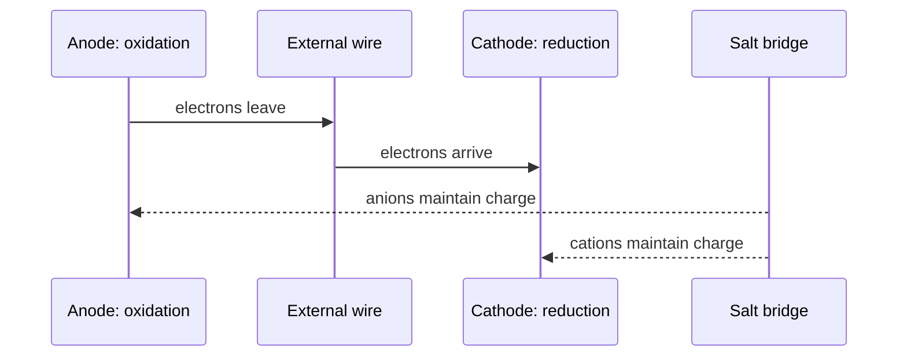

# Electrochemistry

Electrochemistry connects electron transfer to electrical work. In a galvanic cell, a spontaneous redox reaction drives electron flow; in an electrolytic cell, external electrical energy forces a nonspontaneous reaction. The bookkeeping is redox chemistry plus thermodynamics.

In the Ebbing and Gammon sequence this topic sits near balancing redox in acidic and basic solution, voltaic cells, cell notation, cell potential, standard electrode potentials, equilibrium constants from cell potentials, Nernst equation, commercial cells, electrolytic cells, and electrolysis stoichiometry. That placement matters because general chemistry is cumulative: a later calculation usually reuses earlier ideas about measurement, atomic structure, bonding, molecular motion, or equilibrium. The aim of this page is to turn the chapter-level ideas into a working reference that can be used for problem solving without copying the textbook's wording or examples.

## Definitions

The following definitions give the vocabulary and notation used in this page. Treat them as operational definitions: each one says what can be counted, measured, compared, or conserved in a chemical argument.

- Oxidation is loss of electrons; reduction is gain of electrons.
- Anode is the electrode where oxidation occurs.
- Cathode is the electrode where reduction occurs.
- Galvanic or voltaic cell produces electrical work from a spontaneous reaction.
- Electrolytic cell consumes electrical work to drive a nonspontaneous reaction.
- Standard reduction potential measures tendency for reduction under standard conditions.
- Cell potential is $E_{cell}=E_{cathode}-E_{anode}$ when both are reduction potentials.
- Faraday constant $F$ is charge per mole of electrons, about $96485\ \mathrm{C\ mol^{-1}}$.

Definitions in chemistry often connect a symbolic representation to a physical sample. A formula such as $\mathrm{H_2O}$ names a substance, gives the atomic ratio inside one molecule, and supplies the molar mass used in a macroscopic calculation. A state symbol such as $\mathrm{(aq)}$ is not cosmetic; it says the species is dispersed in water and may be treated as ions when writing a net ionic equation. In the same way, constants such as $R$, $K_w$, $F$, or $N_A$ are compact definitions of the measurement system being used.

## Key results

The central results are:

- $E^\circ_{cell}=E^\circ_{red,cathode}-E^\circ_{red,anode}$.
- $\Delta G^\circ=-nFE^\circ_{cell}$.
- $\Delta G^\circ=-RT\ln K$, so $\ln K=nFE^\circ/(RT)$.
- Nernst equation: $E=E^\circ-(RT/nF)\ln Q$.
- At $25^\circ\mathrm{C}$, $E=E^\circ-(0.05916/n)\log Q$.
- Electrolysis charge: $q=It$ and moles electrons $=q/F$.

Cell potentials are intensive; they do not multiply when a half-reaction is multiplied to balance electrons. Free energy is extensive and does scale with reaction amount. This distinction is one of the most important electrochemistry habits.

A good way to use these results is to state the chemical model first, then substitute numbers second. For electrochemistry, the model usually answers questions such as what particles are present, what is conserved, which process is idealized, and which measurement is being interpreted. Once that sentence is clear, the algebra becomes a bookkeeping problem rather than a search for a memorized pattern.

Units are part of the result, not decoration. Whenever a formula contains an empirical constant, a tabulated value, or a ratio of measured quantities, the units tell you whether the expression has been used in the intended form. This is especially important in general chemistry because several equations have nearly identical algebra but different meanings: pressure can be a measured state variable, an equilibrium correction, or a colligative effect; energy can be heat flow, enthalpy, internal energy, or free energy.

The strongest check is an independent chemical interpretation. Ask whether the sign agrees with direction, whether a concentration can be negative, whether a mole ratio follows the balanced equation, whether an equilibrium shift opposes the stress, and whether a microscopic description explains the macroscopic number. These checks connect electrochemistry to neighboring topics instead of leaving it as an isolated technique.

A second check is to compare the limiting cases. If a reactant amount goes to zero, a product amount cannot remain large. If temperature rises in a gas sample at fixed volume, pressure should not fall in an ideal model. If an acid is diluted, hydronium concentration should normally decrease unless a coupled equilibrium supplies more. Limiting cases often reveal algebra that has been rearranged correctly but applied to the wrong chemical situation.

Finally, keep symbolic and particulate representations side by side. A balanced equation, an equilibrium expression, an orbital diagram, or a polymer repeat unit is a compact symbol for a population of particles. Translating that symbol into words forces you to say what is reacting, what is being counted, and what is being held constant. That translation is usually the difference between a calculation that can be adapted to a new problem and one that only imitates a worked example.

## Visual



| Cell type | Sign of $\Delta G$ | Sign of $E_{cell}$ | Energy role |
|---|---:|---:|---|
| Galvanic | negative | positive | produces electrical work |
| Electrolytic | positive | negative for spontaneous direction | consumes electrical work |

## Worked example 1: Standard cell potential and free energy

Problem. For $\mathrm{Zn(s)+Cu^{2+}(aq)\to Zn^{2+}(aq)+Cu(s)}$, use $E^\circ_{red}(Cu^{2+}/Cu)=+0.34$ V and $E^\circ_{red}(Zn^{2+}/Zn)=-0.76$ V. Find $E^\circ_{cell}$ and $\Delta G^\circ$.

    Method.

    1. Copper ion is reduced at the cathode because it has the higher reduction potential.
2. Zinc is oxidized at the anode; use its listed reduction potential in the subtraction.
3. $E^\circ_{cell}=0.34-(-0.76)=1.10\ \mathrm{V}$.
4. Two electrons transfer, so $n=2$.
5. Use $\Delta G^\circ=-nFE^\circ$.
6. $\Delta G^\circ=-(2)(96485)(1.10)=-2.12\times10^5\ \mathrm{J\ mol^{-1}}=-212\ \mathrm{kJ\ mol^{-1}}$.

    Checked answer. $E^\circ_{cell}=1.10\ \mathrm{V}$ and $\Delta G^\circ=-212\ \mathrm{kJ\ mol^{-1}}$. Positive cell potential corresponds to negative free energy for a galvanic cell.

    The important habit is to identify the conserved quantity before reaching for an equation. In this example the units, coefficients, charges, or particles chosen in the first step control every later step. The final numerical answer is not accepted merely because it came from a formula; it is checked against the chemical picture. If the magnitude, sign, units, or limiting condition contradicts that picture, the calculation has to be restarted from the definition rather than patched at the end.

## Worked example 2: Electrolysis mass deposited

Problem. How many grams of copper are plated from $\mathrm{Cu^{2+}}$ by a 2.00 A current running for 30.0 min?

    Method.

    1. Convert time: $30.0\ \mathrm{min}=1800\ \mathrm{s}$.
2. Charge passed: $q=It=(2.00)(1800)=3600\ \mathrm{C}$.
3. Moles electrons: $3600/96485=0.0373\ \mathrm{mol\ e^-}$.
4. Reduction is $\mathrm{Cu^{2+}+2e^-\to Cu}$, so moles Cu $=0.0373/2=0.0187$ mol.
5. Mass Cu: $0.0187\times63.55=1.19\ \mathrm{g}$.

    Checked answer. $1.19\ \mathrm{g\ Cu}$. Two moles of electrons are required per mole of copper, so metal moles must be half electron moles.

    The important habit is to identify the conserved quantity before reaching for an equation. In this example the units, coefficients, charges, or particles chosen in the first step control every later step. The final numerical answer is not accepted merely because it came from a formula; it is checked against the chemical picture. If the magnitude, sign, units, or limiting condition contradicts that picture, the calculation has to be restarted from the definition rather than patched at the end.

## Code

The snippet below is intentionally small, but it is runnable and mirrors the calculation style used in the worked examples. It keeps units visible in variable names so that the computation remains auditable.

```python
F = 96485

def cell_delta_g(n, E):
    return -n * F * E / 1000.0

def plated_mass(current_A, time_s, electrons_per_metal, molar_mass):
    charge = current_A * time_s
    mol_e = charge / F
    mol_metal = mol_e / electrons_per_metal
    return mol_metal * molar_mass

E_cell = 0.34 - (-0.76)
print(E_cell, cell_delta_g(2, E_cell))
print(plated_mass(2.00, 30.0 * 60.0, 2, 63.55))
```

## Common pitfalls

- Multiplying standard potentials by stoichiometric coefficients. Avoid it by scaling free energy, not voltage.
- Reversing anode and cathode definitions. Avoid it by remembering oxidation at anode and reduction at cathode.
- Using reduction potentials without identifying which half-reaction is reduced. Avoid it by assigning cathode first.
- Forgetting electrons in electrolysis stoichiometry. Avoid it by converting current to charge to moles electrons.
- Using natural log and base-10 Nernst forms interchangeably. Avoid it by matching constants to log type.
- Ignoring concentration effects on cell potential. Avoid it by using the Nernst equation outside standard conditions.

## Connections

- [aqueous reactions and solution stoichiometry](/chemistry/general/aqueous-reactions-and-solution-stoichiometry)
- [thermodynamics and free energy](/chemistry/general/thermodynamics-and-free-energy)
- [chemical equilibrium](/chemistry/general/chemical-equilibrium)
- [transition metals and coordination compounds](/chemistry/general/transition-metals-and-coordination-compounds)
