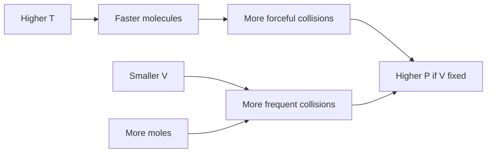

# Gases

Gases are the simplest state of matter to model quantitatively because molecules are far apart and often behave nearly ideally. The gas laws connect pressure, volume, temperature, and amount, while kinetic theory explains those relationships in terms of molecular motion and collisions.

In the Ebbing and Gammon sequence this topic sits near gas pressure, empirical gas laws, ideal gas law, gas stoichiometry, Dalton's law, kinetic theory, diffusion, effusion, and real gases. That placement matters because general chemistry is cumulative: a later calculation usually reuses earlier ideas about measurement, atomic structure, bonding, molecular motion, or equilibrium. The aim of this page is to turn the chapter-level ideas into a working reference that can be used for problem solving without copying the textbook's wording or examples.


*Figure: Molecular speed distributions connecting temperature, mass, and gas behavior. Image: [Wikimedia Commons](https://commons.wikimedia.org/wiki/File:MaxwellBoltzmann-en.svg), Pdbailey, Cryptic C62, and Lilyu, public domain.*

## Definitions

The following definitions give the vocabulary and notation used in this page. Treat them as operational definitions: each one says what can be counted, measured, compared, or conserved in a chemical argument.

- Pressure is force per unit area caused by molecular collisions with container walls.
- Standard atmosphere is $1\ \mathrm{atm}=760\ \mathrm{mmHg}=101325\ \mathrm{Pa}$.
- Boyle's law states that pressure is inversely proportional to volume at constant temperature and amount.
- Charles's law states that volume is proportional to kelvin temperature at constant pressure and amount.
- Avogadro's law states that volume is proportional to moles at constant temperature and pressure.
- Ideal gas law combines the empirical laws: $PV=nRT$.
- Partial pressure is the pressure a gas would exert if it alone occupied the mixture volume.
- Effusion is gas escape through a tiny opening; diffusion is mixing by random molecular motion.

Definitions in chemistry often connect a symbolic representation to a physical sample. A formula such as $\mathrm{H_2O}$ names a substance, gives the atomic ratio inside one molecule, and supplies the molar mass used in a macroscopic calculation. A state symbol such as $\mathrm{(aq)}$ is not cosmetic; it says the species is dispersed in water and may be treated as ions when writing a net ionic equation. In the same way, constants such as $R$, $K_w$, $F$, or $N_A$ are compact definitions of the measurement system being used.

## Key results

The central results are:

- Ideal gas law: $PV=nRT$.
- Combined gas law: $P_1V_1/T_1=P_2V_2/T_2$ for constant moles.
- Dalton's law: $P_{\mathrm{tot}}=\sum_i P_i$ and $P_i=X_iP_{\mathrm{tot}}$.
- Gas density: $d=PM/RT$.
- Kinetic energy average is proportional to kelvin temperature.
- Graham's law: $r_1/r_2=\sqrt{M_2/M_1}$.

The ideal gas law is a model, not a statement that real gases have no volume or attractions. It works best at low pressure and high temperature, where gas particles occupy a small fraction of the container and attractions are less important. Deviations become meaningful clues about intermolecular forces and molecular size.

A good way to use these results is to state the chemical model first, then substitute numbers second. For gases, the model usually answers questions such as what particles are present, what is conserved, which process is idealized, and which measurement is being interpreted. Once that sentence is clear, the algebra becomes a bookkeeping problem rather than a search for a memorized pattern.

Units are part of the result, not decoration. Whenever a formula contains an empirical constant, a tabulated value, or a ratio of measured quantities, the units tell you whether the expression has been used in the intended form. This is especially important in general chemistry because several equations have nearly identical algebra but different meanings: pressure can be a measured state variable, an equilibrium correction, or a colligative effect; energy can be heat flow, enthalpy, internal energy, or free energy.

The strongest check is an independent chemical interpretation. Ask whether the sign agrees with direction, whether a concentration can be negative, whether a mole ratio follows the balanced equation, whether an equilibrium shift opposes the stress, and whether a microscopic description explains the macroscopic number. These checks connect gases to neighboring topics instead of leaving it as an isolated technique.

A second check is to compare the limiting cases. If a reactant amount goes to zero, a product amount cannot remain large. If temperature rises in a gas sample at fixed volume, pressure should not fall in an ideal model. If an acid is diluted, hydronium concentration should normally decrease unless a coupled equilibrium supplies more. Limiting cases often reveal algebra that has been rearranged correctly but applied to the wrong chemical situation.

Finally, keep symbolic and particulate representations side by side. A balanced equation, an equilibrium expression, an orbital diagram, or a polymer repeat unit is a compact symbol for a population of particles. Translating that symbol into words forces you to say what is reacting, what is being counted, and what is being held constant. That translation is usually the difference between a calculation that can be adapted to a new problem and one that only imitates a worked example.

## Visual

| Variable | Symbol | Common units | Microscopic meaning |
|---|---:|---:|---|
| Pressure | $P$ | atm, Pa, mmHg | collision force per area |
| Volume | $V$ | L | space available to molecules |
| Amount | $n$ | mol | number of particles |
| Temperature | $T$ | K | average kinetic energy scale |
| Gas constant | $R$ | $0.082057\ \mathrm{L\ atm\ mol^{-1}\ K^{-1}}$ | unit conversion constant |



## Worked example 1: Ideal gas amount from pressure, volume, and temperature

Problem. A 2.50 L flask contains oxygen at 0.950 atm and $27.0^\circ\mathrm{C}$. How many moles of $\mathrm{O_2}$ are present?

    Method.

    1. Convert temperature to kelvin: $27.0+273.15=300.15\ \mathrm{K}$.
2. Choose $R=0.082057\ \mathrm{L\ atm\ mol^{-1}\ K^{-1}}$ to match liters and atmospheres.
3. Rearrange $PV=nRT$ to $n=PV/RT$.
4. Substitute: $n=(0.950)(2.50)/[(0.082057)(300.15)]$.
5. Calculate: $n=0.0965\ \mathrm{mol}$.

    Checked answer. $0.0965\ \mathrm{mol\ O_2}$. At about room temperature and 1 atm, one mole occupies about 24 L, so 2.5 L should hold about one-tenth mole.

    The important habit is to identify the conserved quantity before reaching for an equation. In this example the units, coefficients, charges, or particles chosen in the first step control every later step. The final numerical answer is not accepted merely because it came from a formula; it is checked against the chemical picture. If the magnitude, sign, units, or limiting condition contradicts that picture, the calculation has to be restarted from the definition rather than patched at the end.

## Worked example 2: Partial pressure in a gas mixture

Problem. A mixture contains 0.200 mol He, 0.300 mol Ne, and 0.500 mol Ar at total pressure 1.80 atm. Find the partial pressure of Ar.

    Method.

    1. Find total moles: $0.200+0.300+0.500=1.000\ \mathrm{mol}$.
2. Find argon mole fraction: $X_{Ar}=0.500/1.000=0.500$.
3. Use Dalton's law: $P_{Ar}=X_{Ar}P_{tot}$.
4. Substitute: $P_{Ar}=0.500(1.80)=0.900\ \mathrm{atm}$.
5. The other gases would contribute the remaining 0.900 atm.

    Checked answer. $P_{Ar}=0.900\ \mathrm{atm}$. Argon is half the molecules, so it supplies half the pressure in an ideal mixture.

    The important habit is to identify the conserved quantity before reaching for an equation. In this example the units, coefficients, charges, or particles chosen in the first step control every later step. The final numerical answer is not accepted merely because it came from a formula; it is checked against the chemical picture. If the magnitude, sign, units, or limiting condition contradicts that picture, the calculation has to be restarted from the definition rather than patched at the end.

## Code

The snippet below is intentionally small, but it is runnable and mirrors the calculation style used in the worked examples. It keeps units visible in variable names so that the computation remains auditable.

```python
R = 0.082057  # L atm mol^-1 K^-1

def ideal_gas_moles(P_atm, V_L, T_C):
    T_K = T_C + 273.15
    return P_atm * V_L / (R * T_K)

def partial_pressure(moles_i, total_moles, total_pressure_atm):
    return (moles_i / total_moles) * total_pressure_atm

n_o2 = ideal_gas_moles(0.950, 2.50, 27.0)
p_ar = partial_pressure(0.500, 1.000, 1.80)
print(n_o2, p_ar)
```

## Common pitfalls

- Using Celsius in gas equations. Avoid it by converting to kelvin before any proportional gas calculation.
- Mixing incompatible units for $R$. Avoid it by choosing $R$ after writing pressure and volume units.
- Forgetting water vapor pressure in gas collection over water. Avoid it by subtracting $P_{H_2O}$ from total pressure when appropriate.
- Assuming ideal behavior at high pressure. Avoid it by checking whether real-gas corrections are chemically significant.
- Confusing diffusion rate with molecular speed direction. Avoid it by remembering that random motion causes net spreading.
- Adding volumes instead of partial pressures for gas mixtures in one container. Avoid it by using mole fractions for a fixed mixture volume.

## Connections

- [stoichiometry](/chemistry/general/stoichiometry)
- [states of matter, liquids, and solids](/chemistry/general/states-of-matter-liquids-and-solids)
- [solutions and colligative properties](/chemistry/general/solutions-and-colligative-properties)
- [thermodynamics and free energy](/chemistry/general/thermodynamics-and-free-energy)
