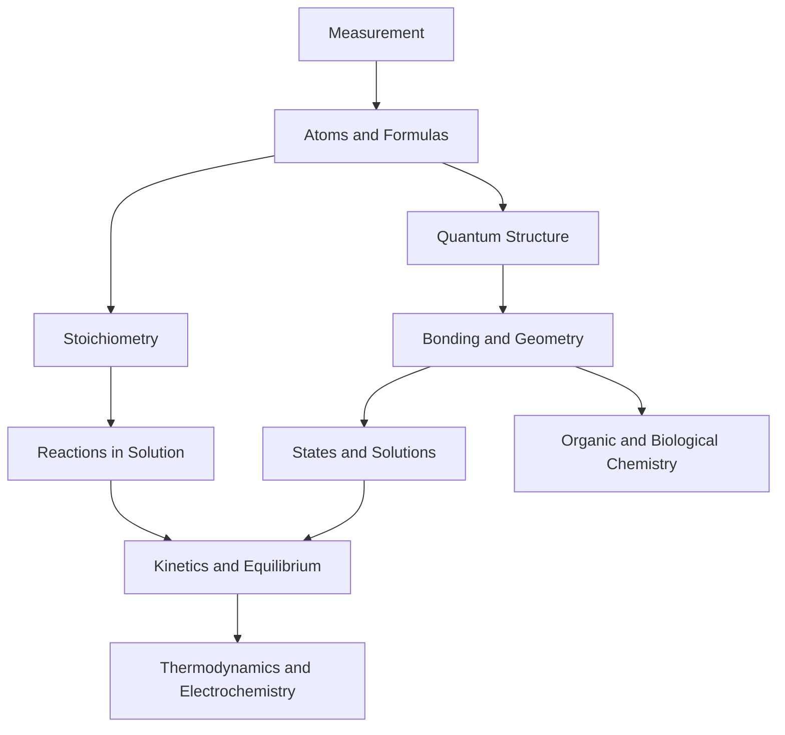

# General Chemistry

General chemistry is the bridge between observable materials and particle-level explanations. It asks how atoms combine, why reactions stop or continue, how energy and matter are conserved, and how quantitative measurements become chemical conclusions. The subject is broad, but it is not a loose collection of facts: nearly every chapter returns to structure, amount, energy, and change.

In the Ebbing and Gammon sequence this topic sits near measurement, atomic theory, bonding, reactions, equilibrium, thermodynamics, and descriptive chemistry. That placement matters because general chemistry is cumulative: a later calculation usually reuses earlier ideas about measurement, atomic structure, bonding, molecular motion, or equilibrium. The aim of this page is to turn the chapter-level ideas into a working reference that can be used for problem solving without copying the textbook's wording or examples.


*Figure: Modern periodic table connecting atomic identity to chemical families. Image: [Wikimedia Commons](https://commons.wikimedia.org/wiki/File:Periodic_Table_Of_Elements.svg), Dmarcus100, CC BY-SA 4.0.*


*Figure: Mendeleev's periodic table from the 1891 English edition of Principles of Chemistry. Image: [Wikimedia Commons](https://commons.wikimedia.org/wiki/File:Mendeleev_Table_5th_II.jpg), Dmitrii Mendeleev, public domain.*


*Figure: Bunsen burner flame types used in introductory laboratory work. Image: [Wikimedia Commons](https://commons.wikimedia.org/wiki/File:Bunsen_burner_flame_types.jpg), Arthur Jan Fijalkowski, CC BY-SA 3.0/GFDL.*


*Figure: Marie Curie, whose work on radioactivity connects chemistry, physics, and measurement. Image: [Wikimedia Commons](https://commons.wikimedia.org/wiki/File:Marie_Curie_c1920.jpg), Henri Manuel, public domain.*

## Definitions

The following definitions give the vocabulary and notation used in this page. Treat them as operational definitions: each one says what can be counted, measured, compared, or conserved in a chemical argument.

- A chemical model is a simplified description that explains observations and predicts new ones.
- Matter is anything that has mass and occupies space; chemical change rearranges matter without creating or destroying atoms.
- A mole is an amount containing Avogadro's number of specified entities, $N_A = 6.022 \times 10^{23}$.
- A balanced equation represents conservation of atoms and charge during reaction.
- A state function depends only on the current state, not the path taken to reach it.
- An equilibrium state has equal forward and reverse rates, even though microscopic change continues.
- A structure-property relationship connects bonding, shape, polarity, and intermolecular forces to measurable behavior.
- A quantitative chemical argument normally combines a conservation law, a definition, and a measured or tabulated value.

Definitions in chemistry often connect a symbolic representation to a physical sample. A formula such as $\mathrm{H_2O}$ names a substance, gives the atomic ratio inside one molecule, and supplies the molar mass used in a macroscopic calculation. A state symbol such as $\mathrm{(aq)}$ is not cosmetic; it says the species is dispersed in water and may be treated as ions when writing a net ionic equation. In the same way, constants such as $R$, $K_w$, $F$, or $N_A$ are compact definitions of the measurement system being used.

## Key results

The central results are:

- Conservation of mass: total mass is unchanged in an ordinary chemical reaction.
- Charge balance: total charge is conserved in molecular, ionic, redox, and electrochemical equations.
- Mole relation: $n = m/M$ and number of entities $= nN_A$.
- Reaction stoichiometry comes from coefficients in a balanced equation, not from subscripts alone.
- Equilibrium comparison: $Q$ predicts direction by comparison with $K$.
- Thermodynamic link: $\Delta G^\circ = -RT \ln K$.

The textbook's chapter order moves from measurement to atoms, then to reactions, structure, states of matter, equilibrium, and applications. That order is pedagogical: it first defines what can be measured, then explains what matter is made of, then uses both ideas to predict reaction amounts and properties. A useful study plan follows the same order. Do not treat acid-base equilibria, electrochemistry, or nuclear chemistry as isolated units; each one depends on conservation, particulate models, energy, and proportional reasoning.

A good way to use these results is to state the chemical model first, then substitute numbers second. For general chemistry, the model usually answers questions such as what particles are present, what is conserved, which process is idealized, and which measurement is being interpreted. Once that sentence is clear, the algebra becomes a bookkeeping problem rather than a search for a memorized pattern.

Units are part of the result, not decoration. Whenever a formula contains an empirical constant, a tabulated value, or a ratio of measured quantities, the units tell you whether the expression has been used in the intended form. This is especially important in general chemistry because several equations have nearly identical algebra but different meanings: pressure can be a measured state variable, an equilibrium correction, or a colligative effect; energy can be heat flow, enthalpy, internal energy, or free energy.

The strongest check is an independent chemical interpretation. Ask whether the sign agrees with direction, whether a concentration can be negative, whether a mole ratio follows the balanced equation, whether an equilibrium shift opposes the stress, and whether a microscopic description explains the macroscopic number. These checks connect general chemistry to neighboring topics instead of leaving it as an isolated technique.

A second check is to compare the limiting cases. If a reactant amount goes to zero, a product amount cannot remain large. If temperature rises in a gas sample at fixed volume, pressure should not fall in an ideal model. If an acid is diluted, hydronium concentration should normally decrease unless a coupled equilibrium supplies more. Limiting cases often reveal algebra that has been rearranged correctly but applied to the wrong chemical situation.

Finally, keep symbolic and particulate representations side by side. A balanced equation, an equilibrium expression, an orbital diagram, or a polymer repeat unit is a compact symbol for a population of particles. Translating that symbol into words forces you to say what is reacting, what is being counted, and what is being held constant. That translation is usually the difference between a calculation that can be adapted to a new problem and one that only imitates a worked example.

## Visual

| Ebbing and Gammon chapter | Chapter title from the TOC | Main wiki page |
|---:|---|---|
| 1 | Chemistry and Measurement | /chemistry/general/chemistry-and-measurement |
| 2 | Atoms, Molecules, and Ions | /chemistry/general/atoms-molecules-and-ions |
| 3 | Calculations with Chemical Formulas and Equations | /chemistry/general/stoichiometry |
| 4 | Chemical Reactions | /chemistry/general/aqueous-reactions-and-solution-stoichiometry |
| 5 | The Gaseous State | /chemistry/general/gases |
| 6 | Thermochemistry | /chemistry/general/thermochemistry |
| 7 | Quantum Theory of the Atom | /chemistry/general/quantum-theory-of-atoms |
| 8 | Electron Configurations and Periodicity | /chemistry/general/electron-configurations-and-periodic-trends |
| 9 | Ionic and Covalent Bonding | /chemistry/general/ionic-and-covalent-bonding |
| 10 | Molecular Geometry and Chemical Bonding Theory | /chemistry/general/molecular-geometry-and-bonding-theory |
| 11 | States of Matter; Liquids and Solids | /chemistry/general/states-of-matter-liquids-and-solids |
| 12 | Solutions | /chemistry/general/solutions-and-colligative-properties |
| 13 | Rates of Reaction | /chemistry/general/chemical-kinetics |
| 14 | Chemical Equilibrium | /chemistry/general/chemical-equilibrium |
| 15 | Acids and Bases | /chemistry/general/acids-bases-and-ph |
| 16 | Acid-Base Equilibria | /chemistry/general/acid-base-equilibria-buffers-and-titrations |
| 17 | Solubility and Complex-Ion Equilibria | /chemistry/general/solubility-and-complex-ion-equilibria |
| 18 | Thermodynamics and Equilibrium | /chemistry/general/thermodynamics-and-free-energy |
| 19 | Electrochemistry | /chemistry/general/electrochemistry |
| 20 | Nuclear Chemistry | /chemistry/general/nuclear-chemistry |
| 21 | Chemistry of the Main-Group Elements | /chemistry/general/main-group-elements |
| 22 | The Transition Elements and Coordination Compounds | /chemistry/general/transition-metals-and-coordination-compounds |
| 23 | Organic Chemistry | /chemistry/general/organic-chemistry |
| 24 | Polymer Materials: Synthetic and Biological | /chemistry/general/biochemistry-and-polymer-materials |

| Wiki page | Textbook scope it supports | Main transferable skill |
|---|---|---|
| Measurement | Chapter 1 | Units, significant figures, dimensional analysis |
| Atoms and ions | Chapter 2 | Isotopes, formulas, naming, equations |
| Stoichiometry | Chapter 3 | Mole ratios, limiting reagent, yield |
| Aqueous reactions | Chapter 4 | Net ionic equations, molarity, titration |
| Gases through solutions | Chapters 5, 11, 12 | State variables, phases, intermolecular forces |
| Thermochemistry and thermodynamics | Chapters 6, 18 | Heat, enthalpy, entropy, free energy |
| Quantum structure through bonding | Chapters 7-10 | Orbitals, periodicity, Lewis structures, geometry |
| Kinetics and equilibrium | Chapters 13-17 | Rate laws, $K$, buffers, solubility |
| Electrochemistry and nuclear chemistry | Chapters 19-20 | Electron transfer, half-lives, nuclear energy |
| Descriptive, organic, and biological chemistry | Chapters 21-24 | Element families, complexes, functional groups, polymers |



## Worked example 1: Moving from grams to molecules

Problem. A sample contains 18.0 g of water. Find the moles of water molecules, the number of water molecules, and the number of hydrogen atoms.

    Method.

    1. Use the formula $\mathrm{H_2O}$ to compute molar mass: $M = 2(1.008) + 16.00 = 18.016\ \mathrm{g\ mol^{-1}}$.
2. Convert mass to moles: $n = 18.0\ \mathrm{g}/18.016\ \mathrm{g\ mol^{-1}} = 0.999\ \mathrm{mol}$.
3. Convert moles to molecules: $0.999\ \mathrm{mol}\times 6.022\times 10^{23}\ \mathrm{molecules\ mol^{-1}} = 6.02\times 10^{23}$ molecules.
4. Each molecule contains two hydrogen atoms, so hydrogen atoms $=2(6.02\times 10^{23})=1.20\times 10^{24}$.

    Checked answer. $0.999\ \mathrm{mol\ H_2O}$, $6.02\times 10^{23}$ molecules, and $1.20\times 10^{24}$ hydrogen atoms. The mass is essentially one molar mass of water, so the molecule count should be essentially one Avogadro number.

    The important habit is to identify the conserved quantity before reaching for an equation. In this example the units, coefficients, charges, or particles chosen in the first step control every later step. The final numerical answer is not accepted merely because it came from a formula; it is checked against the chemical picture. If the magnitude, sign, units, or limiting condition contradicts that picture, the calculation has to be restarted from the definition rather than patched at the end.

## Worked example 2: Choosing the right chapter tool

Problem. A student mixes 25.00 mL of 0.1000 M HCl with 25.00 mL of 0.0800 M NaOH. Decide what concept controls the final pH before doing any logarithm.

    Method.

    1. Classify the process as a strong acid-strong base neutralization: $\mathrm{H^+ + OH^- \to H_2O}$.
2. Convert volumes to liters: $0.02500\ \mathrm{L}$ for each solution.
3. Compute acid moles: $0.1000\ \mathrm{mol\ L^{-1}}\times 0.02500\ \mathrm{L}=0.002500\ \mathrm{mol\ H^+}$.
4. Compute base moles: $0.0800\ \mathrm{mol\ L^{-1}}\times 0.02500\ \mathrm{L}=0.002000\ \mathrm{mol\ OH^-}$.
5. The limiting reactant is hydroxide, leaving $0.000500\ \mathrm{mol\ H^+}$ in a total volume of $0.05000\ \mathrm{L}$.
6. Concentration after reaction is $0.000500/0.05000=0.0100\ \mathrm{M}$, so $\mathrm{pH}=-\log(0.0100)=2.000$.

    Checked answer. The controlling idea is stoichiometry first and pH second; the final pH is 2.000. Acid was in excess, so the pH must be below 7.

    The important habit is to identify the conserved quantity before reaching for an equation. In this example the units, coefficients, charges, or particles chosen in the first step control every later step. The final numerical answer is not accepted merely because it came from a formula; it is checked against the chemical picture. If the magnitude, sign, units, or limiting condition contradicts that picture, the calculation has to be restarted from the definition rather than patched at the end.

## Code

The snippet below is intentionally small, but it is runnable and mirrors the calculation style used in the worked examples. It keeps units visible in variable names so that the computation remains auditable.

```python
from math import log10

NA = 6.022e23
mass_water_g = 18.0
molar_mass_water = 18.016
moles = mass_water_g / molar_mass_water
molecules = moles * NA
hydrogen_atoms = 2 * molecules

h_excess_mol = 0.002500 - 0.002000
h_conc = h_excess_mol / 0.05000
pH = -log10(h_conc)
print(moles, molecules, hydrogen_atoms, pH)
```

## Common pitfalls

- Studying chapters as unrelated formula lists. Avoid it by writing the conservation law or model beside every formula.
- Starting an equilibrium or pH problem before reaction stoichiometry is complete. Avoid it by checking whether a strong reaction consumes a reagent first.
- Using coefficients, subscripts, and charges interchangeably. Avoid it by naming what each number represents before calculating.
- Ignoring units in constants. Avoid it by recording units with every tabulated value.
- Assuming a large $K$ means a fast reaction. Avoid it by separating thermodynamic favorability from kinetic rate.
- Treating descriptive chemistry as memorization only. Avoid it by connecting families and functional groups to electron structure and bonding.

## Connections

- [chemistry and measurement](/chemistry/general/chemistry-and-measurement)
- [stoichiometry](/chemistry/general/stoichiometry)
- [chemical equilibrium](/chemistry/general/chemical-equilibrium)
- [organic chemistry](/chemistry/general/organic-chemistry)
