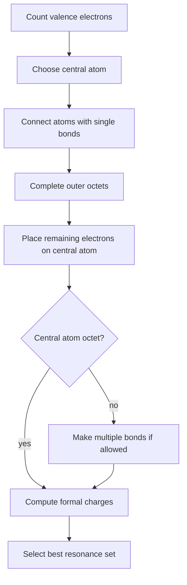

# Ionic and Covalent Bonding

Chemical bonding explains why atoms form stable substances and why those substances have particular formulas, shapes, energies, and reactivities. Ionic bonding emphasizes electrostatic attraction between ions; covalent bonding emphasizes shared electron pairs. Most real bonds lie between the ideal extremes.

In the Ebbing and Gammon sequence this topic sits near ionic bonds, electron configurations of ions, ionic radii, covalent bonds, electronegativity, Lewis formulas, resonance, octet exceptions, formal charge, bond length, and bond energy. That placement matters because general chemistry is cumulative: a later calculation usually reuses earlier ideas about measurement, atomic structure, bonding, molecular motion, or equilibrium. The aim of this page is to turn the chapter-level ideas into a working reference that can be used for problem solving without copying the textbook's wording or examples.

## Definitions

The following definitions give the vocabulary and notation used in this page. Treat them as operational definitions: each one says what can be counted, measured, compared, or conserved in a chemical argument.

- An ionic bond is electrostatic attraction between oppositely charged ions.
- A covalent bond is attraction produced by shared electron density between nuclei.
- Electronegativity is an atom's tendency to attract bonding electrons.
- A polar covalent bond has unequal sharing of electron density.
- A Lewis structure shows valence electrons as dots or bonding lines.
- Resonance represents delocalized bonding using multiple valid Lewis contributors.
- Formal charge is a bookkeeping charge assigned from a Lewis structure.
- Bond energy is the enthalpy required to break a bond in the gas phase.

Definitions in chemistry often connect a symbolic representation to a physical sample. A formula such as $\mathrm{H_2O}$ names a substance, gives the atomic ratio inside one molecule, and supplies the molar mass used in a macroscopic calculation. A state symbol such as $\mathrm{(aq)}$ is not cosmetic; it says the species is dispersed in water and may be treated as ions when writing a net ionic equation. In the same way, constants such as $R$, $K_w$, $F$, or $N_A$ are compact definitions of the measurement system being used.

## Key results

The central results are:

- Formal charge: $FC=\mathrm{valence} - \mathrm{nonbonding} - \frac{1}{2}\mathrm{bonding}$.
- Lewis structures favor complete octets, minimal formal charge, and negative formal charge on more electronegative atoms.
- Bond order increases as bond length generally decreases and bond strength increases.
- Approximate reaction enthalpy from bond energies: $\Delta H\approx\sum D(\mathrm{bonds\ broken})-\sum D(\mathrm{bonds\ formed})$.
- Ionic radius: cations are smaller than parent atoms and anions are larger.
- Electronegativity generally increases toward fluorine across the periodic table.

Lewis structures are models of electron accounting, not photographs of molecules. They are most useful when paired with formal charge and resonance reasoning. Ionic bonding is also a model: lattice energy, ion size, and charge help explain why ionic solids are hard, brittle, high-melting, and often soluble in polar solvents.

A good way to use these results is to state the chemical model first, then substitute numbers second. For ionic and covalent bonding, the model usually answers questions such as what particles are present, what is conserved, which process is idealized, and which measurement is being interpreted. Once that sentence is clear, the algebra becomes a bookkeeping problem rather than a search for a memorized pattern.

Units are part of the result, not decoration. Whenever a formula contains an empirical constant, a tabulated value, or a ratio of measured quantities, the units tell you whether the expression has been used in the intended form. This is especially important in general chemistry because several equations have nearly identical algebra but different meanings: pressure can be a measured state variable, an equilibrium correction, or a colligative effect; energy can be heat flow, enthalpy, internal energy, or free energy.

The strongest check is an independent chemical interpretation. Ask whether the sign agrees with direction, whether a concentration can be negative, whether a mole ratio follows the balanced equation, whether an equilibrium shift opposes the stress, and whether a microscopic description explains the macroscopic number. These checks connect ionic and covalent bonding to neighboring topics instead of leaving it as an isolated technique.

A second check is to compare the limiting cases. If a reactant amount goes to zero, a product amount cannot remain large. If temperature rises in a gas sample at fixed volume, pressure should not fall in an ideal model. If an acid is diluted, hydronium concentration should normally decrease unless a coupled equilibrium supplies more. Limiting cases often reveal algebra that has been rearranged correctly but applied to the wrong chemical situation.

Finally, keep symbolic and particulate representations side by side. A balanced equation, an equilibrium expression, an orbital diagram, or a polymer repeat unit is a compact symbol for a population of particles. Translating that symbol into words forces you to say what is reacting, what is being counted, and what is being held constant. That translation is usually the difference between a calculation that can be adapted to a new problem and one that only imitates a worked example.

## Visual



| Bond model | Electron picture | Typical properties |
|---|---|---|
| Ionic | electron transfer, ion lattice | high melting, brittle solids |
| Nonpolar covalent | nearly equal sharing | low polarity molecules |
| Polar covalent | unequal sharing | bond dipoles, polar reactions |
| Metallic | delocalized electrons | conductivity, malleability |

## Worked example 1: Formal charges in nitrate

Problem. Draw one Lewis contributor for $\mathrm{NO_3^-}$ and compute formal charges.

    Method.

    1. Count valence electrons: N has 5, three O atoms have $3(6)=18$, and the charge adds 1, for total 24.
2. Place N central and connect three O atoms with single bonds, using 6 electrons.
3. Complete O octets with 18 more electrons; total 24 used.
4. Nitrogen has only 6 electrons, so convert one O lone pair into an N=O double bond.
5. Formal charge on double-bonded O: $6-4-2=0$.
6. Formal charge on each single-bonded O: $6-6-1=-1$.
7. Formal charge on N: $5-0-4=+1$.

    Checked answer. One contributor has N at +1, two singly bonded O atoms at -1, and the double-bonded O at 0; three equivalent resonance contributors share the charge. Formal charges sum to -1, matching the ion charge.

    The important habit is to identify the conserved quantity before reaching for an equation. In this example the units, coefficients, charges, or particles chosen in the first step control every later step. The final numerical answer is not accepted merely because it came from a formula; it is checked against the chemical picture. If the magnitude, sign, units, or limiting condition contradicts that picture, the calculation has to be restarted from the definition rather than patched at the end.

## Worked example 2: Reaction enthalpy from bond energies

Problem. Estimate $\Delta H$ for $\mathrm{H_2 + Cl_2 \to 2HCl}$ using $D(H-H)=436$, $D(Cl-Cl)=243$, and $D(H-Cl)=431\ \mathrm{kJ\ mol^{-1}}$.

    Method.

    1. Identify bonds broken: one H-H and one Cl-Cl.
2. Energy to break bonds: $436+243=679\ \mathrm{kJ}$.
3. Identify bonds formed: two H-Cl bonds.
4. Energy released in forming bonds is represented by subtracting $2(431)=862\ \mathrm{kJ}$.
5. Compute $\Delta H\approx679-862=-183\ \mathrm{kJ}$.

    Checked answer. Estimated $\Delta H\approx -183\ \mathrm{kJ}$ per reaction as written. The negative sign means stronger product bonds form than reactant bonds broken.

    The important habit is to identify the conserved quantity before reaching for an equation. In this example the units, coefficients, charges, or particles chosen in the first step control every later step. The final numerical answer is not accepted merely because it came from a formula; it is checked against the chemical picture. If the magnitude, sign, units, or limiting condition contradicts that picture, the calculation has to be restarted from the definition rather than patched at the end.

## Code

The snippet below is intentionally small, but it is runnable and mirrors the calculation style used in the worked examples. It keeps units visible in variable names so that the computation remains auditable.

```python
def formal_charge(valence, nonbonding, bonding_electrons):
    return valence - nonbonding - bonding_electrons / 2

n_fc = formal_charge(5, 0, 8)
single_o_fc = formal_charge(6, 6, 2)
double_o_fc = formal_charge(6, 4, 4)

broken = 436 + 243
formed = 2 * 431
delta_h = broken - formed
print(n_fc, single_o_fc, double_o_fc, delta_h)
```

## Common pitfalls

- Believing resonance structures interconvert as separate molecules. Avoid it by treating them as contributors to one delocalized structure.
- Forgetting to include ion charge in valence electron count. Avoid it by adding electrons for negative charge and subtracting for positive charge.
- Choosing the least electronegative atom incorrectly. Avoid it by placing hydrogen terminal and checking common central atoms.
- Using formal charge as real charge without nuance. Avoid it by calling it a bookkeeping tool for model selection.
- Estimating bond enthalpy with liquid or solid phase assumptions. Avoid it by remembering average bond energies are gas-phase approximations.
- Assuming electronegativity difference alone determines all bond properties. Avoid it by also considering structure, lattice energy, and molecular environment.

## Connections

- [electron configurations and periodic trends](/chemistry/general/electron-configurations-and-periodic-trends)
- [molecular geometry and bonding theory](/chemistry/general/molecular-geometry-and-bonding-theory)
- [thermochemistry](/chemistry/general/thermochemistry)
- [organic chemistry](/chemistry/general/organic-chemistry)
