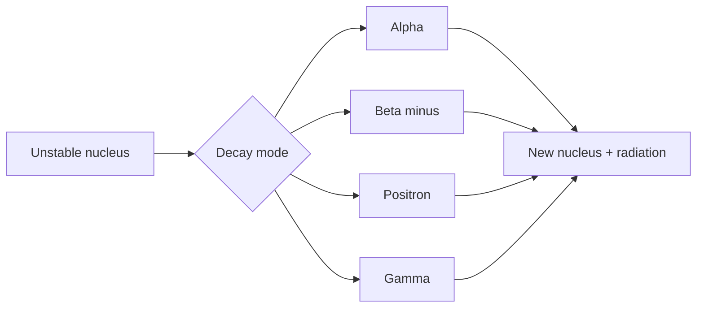

# Nuclear Chemistry

Nuclear chemistry studies changes in atomic nuclei rather than changes in electron arrangements. Radioactive decay, nuclear bombardment, fission, and fusion involve changes in proton and neutron counts, often accompanied by large energy changes because nuclear binding energies are enormous compared with chemical bond energies.

In the Ebbing and Gammon sequence this topic sits near radioactivity, nuclear bombardment reactions, radiation detection and biological effects, radioactive decay rates, isotope applications, mass-energy calculations, fission, and fusion. That placement matters because general chemistry is cumulative: a later calculation usually reuses earlier ideas about measurement, atomic structure, bonding, molecular motion, or equilibrium. The aim of this page is to turn the chapter-level ideas into a working reference that can be used for problem solving without copying the textbook's wording or examples.


*Figure: Nuclear fission as a change in nuclei rather than electron arrangements. Image: [Wikimedia Commons](https://commons.wikimedia.org/wiki/File:Nuclear_fission.svg), Fastfission, public domain.*

## Definitions

The following definitions give the vocabulary and notation used in this page. Treat them as operational definitions: each one says what can be counted, measured, compared, or conserved in a chemical argument.

- Radioactivity is spontaneous emission of particles or radiation from unstable nuclei.
- Alpha particle is a $^4_2\mathrm{He}$ nucleus.
- Beta minus particle is an electron emitted when a neutron changes to a proton.
- Positron is a positive electron emitted when a proton changes to a neutron.
- Gamma radiation is high-energy electromagnetic radiation from nuclear relaxation.
- Half-life is time required for half a radioactive sample to decay.
- Nuclear binding energy is energy associated with holding nucleons together.
- Fission splits heavy nuclei; fusion combines light nuclei.

Definitions in chemistry often connect a symbolic representation to a physical sample. A formula such as $\mathrm{H_2O}$ names a substance, gives the atomic ratio inside one molecule, and supplies the molar mass used in a macroscopic calculation. A state symbol such as $\mathrm{(aq)}$ is not cosmetic; it says the species is dispersed in water and may be treated as ions when writing a net ionic equation. In the same way, constants such as $R$, $K_w$, $F$, or $N_A$ are compact definitions of the measurement system being used.

## Key results

The central results are:

- Nuclear equations conserve mass number $A$ and atomic number $Z$.
- First-order decay: $N_t=N_0e^{-kt}$.
- Half-life relation: $t_{1/2}=0.693/k$.
- Mass-energy relation: $E=\Delta mc^2$.
- Activity is proportional to number of radioactive nuclei present.
- Fission and fusion can release energy when products have greater binding energy per nucleon.

Nuclear equations are balanced by nucleon count and nuclear charge, not by chemical valence. Half-life calculations resemble first-order kinetics because each nucleus has a constant probability of decaying per unit time. The energy scale is different: small mass defects correspond to large energies through $c^2$.

A good way to use these results is to state the chemical model first, then substitute numbers second. For nuclear chemistry, the model usually answers questions such as what particles are present, what is conserved, which process is idealized, and which measurement is being interpreted. Once that sentence is clear, the algebra becomes a bookkeeping problem rather than a search for a memorized pattern.

Units are part of the result, not decoration. Whenever a formula contains an empirical constant, a tabulated value, or a ratio of measured quantities, the units tell you whether the expression has been used in the intended form. This is especially important in general chemistry because several equations have nearly identical algebra but different meanings: pressure can be a measured state variable, an equilibrium correction, or a colligative effect; energy can be heat flow, enthalpy, internal energy, or free energy.

The strongest check is an independent chemical interpretation. Ask whether the sign agrees with direction, whether a concentration can be negative, whether a mole ratio follows the balanced equation, whether an equilibrium shift opposes the stress, and whether a microscopic description explains the macroscopic number. These checks connect nuclear chemistry to neighboring topics instead of leaving it as an isolated technique.

A second check is to compare the limiting cases. If a reactant amount goes to zero, a product amount cannot remain large. If temperature rises in a gas sample at fixed volume, pressure should not fall in an ideal model. If an acid is diluted, hydronium concentration should normally decrease unless a coupled equilibrium supplies more. Limiting cases often reveal algebra that has been rearranged correctly but applied to the wrong chemical situation.

Finally, keep symbolic and particulate representations side by side. A balanced equation, an equilibrium expression, an orbital diagram, or a polymer repeat unit is a compact symbol for a population of particles. Translating that symbol into words forces you to say what is reacting, what is being counted, and what is being held constant. That translation is usually the difference between a calculation that can be adapted to a new problem and one that only imitates a worked example.

## Visual

| Radiation | Symbol | Penetration | Nuclear change |
|---|---|---|---|
| Alpha | $^4_2\mathrm{He}$ | low | $A$ decreases by 4, $Z$ decreases by 2 |
| Beta minus | $^0_{-1}\mathrm{e}$ | moderate | $Z$ increases by 1 |
| Positron | $^0_{+1}\mathrm{e}$ | moderate | $Z$ decreases by 1 |
| Gamma | $\gamma$ | high | no change in $A$ or $Z$ |



## Worked example 1: Radioactive decay fraction remaining

Problem. A radioisotope has half-life 12.0 h. What fraction remains after 36.0 h?

    Method.

    1. Find number of half-lives: $36.0/12.0=3.00$.
2. After one half-life, fraction is $1/2$.
3. After three half-lives, fraction is $(1/2)^3=1/8$.
4. Convert to decimal: $1/8=0.125$.
5. Therefore 12.5 percent remains.

    Checked answer. Fraction remaining is 0.125, or 12.5 percent. Three half-lives should reduce the sample by repeated halving: 100 to 50 to 25 to 12.5 percent.

    The important habit is to identify the conserved quantity before reaching for an equation. In this example the units, coefficients, charges, or particles chosen in the first step control every later step. The final numerical answer is not accepted merely because it came from a formula; it is checked against the chemical picture. If the magnitude, sign, units, or limiting condition contradicts that picture, the calculation has to be restarted from the definition rather than patched at the end.

## Worked example 2: Balancing a nuclear equation

Problem. Complete $^{14}_7\mathrm{N}+^4_2\mathrm{He}\to ^{17}_8\mathrm{O}+?$.

    Method.

    1. Conserve mass number: left $A=14+4=18$.
2. Known product oxygen has $A=17$, so missing particle has $A=1$.
3. Conserve atomic number: left $Z=7+2=9$.
4. Known oxygen has $Z=8$, so missing particle has $Z=1$.
5. A particle with $A=1$ and $Z=1$ is a proton, $^1_1\mathrm{p}$.

    Checked answer. The missing particle is $^1_1\mathrm{p}$. Both total mass number and total atomic number balance to 18 and 9.

    The important habit is to identify the conserved quantity before reaching for an equation. In this example the units, coefficients, charges, or particles chosen in the first step control every later step. The final numerical answer is not accepted merely because it came from a formula; it is checked against the chemical picture. If the magnitude, sign, units, or limiting condition contradicts that picture, the calculation has to be restarted from the definition rather than patched at the end.

## Code

The snippet below is intentionally small, but it is runnable and mirrors the calculation style used in the worked examples. It keeps units visible in variable names so that the computation remains auditable.

```python
from math import log, exp

def fraction_remaining(time, half_life):
    return 0.5 ** (time / half_life)

def decay_constant(half_life):
    return log(2) / half_life

def missing_particle(left_A, left_Z, known_A, known_Z):
    return left_A - known_A, left_Z - known_Z

print(fraction_remaining(36.0, 12.0))
print(decay_constant(12.0))
print(missing_particle(14 + 4, 7 + 2, 17, 8))
```

## Common pitfalls

- Balancing nuclear equations by chemical formulas. Avoid it by conserving mass number and atomic number instead.
- Assuming half-life depends on sample size. Avoid it by remembering each half-life removes the same fraction.
- Confusing beta minus with positron emission. Avoid it by tracking whether atomic number increases or decreases.
- Using grams directly in decay law without proportionality reasoning. Avoid it by noting mass, atoms, and activity are proportional for one isotope.
- Ignoring radiation shielding differences. Avoid it by distinguishing alpha, beta, gamma, and neutron penetration.
- Comparing nuclear and chemical energies on the same scale. Avoid it by remembering nuclear mass-energy changes are much larger.

## Connections

- [quantum theory of atoms](/chemistry/general/quantum-theory-of-atoms)
- [chemical kinetics](/chemistry/general/chemical-kinetics)
- [thermodynamics and free energy](/chemistry/general/thermodynamics-and-free-energy)
- [main-group elements](/chemistry/general/main-group-elements)
