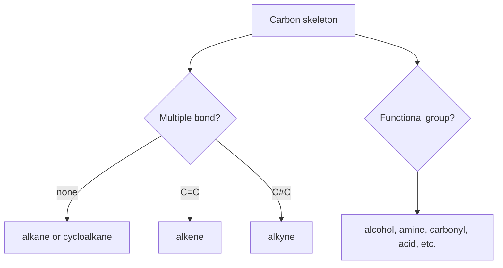

# Organic Chemistry

Organic chemistry is the chemistry of carbon compounds, especially those with C-H, C-C, C-O, C-N, and related covalent bonds. Carbon's tetravalency, ability to catenate, and capacity for single, double, triple, and aromatic bonding create enormous structural variety.

In the Ebbing and Gammon sequence this topic sits near bonding of carbon, alkanes, cycloalkanes, alkenes, alkynes, aromatic hydrocarbons, hydrocarbon naming, and oxygen- and nitrogen-containing derivatives. That placement matters because general chemistry is cumulative: a later calculation usually reuses earlier ideas about measurement, atomic structure, bonding, molecular motion, or equilibrium. The aim of this page is to turn the chapter-level ideas into a working reference that can be used for problem solving without copying the textbook's wording or examples.


*Figure: Benzene as a compact example of carbon bonding, delocalization, and aromatic structure. Image: [Wikimedia Commons](https://commons.wikimedia.org/wiki/File:Benzene-aromatic-3D-balls.png), Benjah-bmm27, public domain.*

## Definitions

The following definitions give the vocabulary and notation used in this page. Treat them as operational definitions: each one says what can be counted, measured, compared, or conserved in a chemical argument.

- Hydrocarbon contains only carbon and hydrogen.
- Alkane is a saturated hydrocarbon with single bonds.
- Alkene contains at least one carbon-carbon double bond.
- Alkyne contains at least one carbon-carbon triple bond.
- Aromatic compound contains a benzene-like delocalized pi system.
- Functional group is a characteristic atom or group that controls reactivity.
- Isomers have the same molecular formula but different structures.
- Polymer is a large molecule built from repeating monomer units.

Definitions in chemistry often connect a symbolic representation to a physical sample. A formula such as $\mathrm{H_2O}$ names a substance, gives the atomic ratio inside one molecule, and supplies the molar mass used in a macroscopic calculation. A state symbol such as $\mathrm{(aq)}$ is not cosmetic; it says the species is dispersed in water and may be treated as ions when writing a net ionic equation. In the same way, constants such as $R$, $K_w$, $F$, or $N_A$ are compact definitions of the measurement system being used.

## Key results

The central results are:

- Acyclic alkane formula: $\mathrm{C_nH_{2n+2}}$.
- Acyclic alkene with one double bond or cycloalkane formula: $\mathrm{C_nH_{2n}}$.
- Acyclic alkyne with one triple bond formula: $\mathrm{C_nH_{2n-2}}$.
- Combustion of hydrocarbons forms $\mathrm{CO_2}$ and $\mathrm{H_2O}$ when oxygen is sufficient.
- Carbon with four sigma bonds is typically $sp^3$; with one double bond $sp^2$; with one triple bond $sp$.
- Functional groups organize organic nomenclature and reaction patterns.

Introductory organic chemistry in general chemistry focuses on recognition: identify the carbon skeleton, unsaturation, aromatic rings, and functional groups. Those structural features explain boiling points, solubility, acidity, and likely reactions. The goal is not full mechanism mastery but a reliable map from structure to properties.

A good way to use these results is to state the chemical model first, then substitute numbers second. For organic chemistry, the model usually answers questions such as what particles are present, what is conserved, which process is idealized, and which measurement is being interpreted. Once that sentence is clear, the algebra becomes a bookkeeping problem rather than a search for a memorized pattern.

Units are part of the result, not decoration. Whenever a formula contains an empirical constant, a tabulated value, or a ratio of measured quantities, the units tell you whether the expression has been used in the intended form. This is especially important in general chemistry because several equations have nearly identical algebra but different meanings: pressure can be a measured state variable, an equilibrium correction, or a colligative effect; energy can be heat flow, enthalpy, internal energy, or free energy.

The strongest check is an independent chemical interpretation. Ask whether the sign agrees with direction, whether a concentration can be negative, whether a mole ratio follows the balanced equation, whether an equilibrium shift opposes the stress, and whether a microscopic description explains the macroscopic number. These checks connect organic chemistry to neighboring topics instead of leaving it as an isolated technique.

A second check is to compare the limiting cases. If a reactant amount goes to zero, a product amount cannot remain large. If temperature rises in a gas sample at fixed volume, pressure should not fall in an ideal model. If an acid is diluted, hydronium concentration should normally decrease unless a coupled equilibrium supplies more. Limiting cases often reveal algebra that has been rearranged correctly but applied to the wrong chemical situation.

Finally, keep symbolic and particulate representations side by side. A balanced equation, an equilibrium expression, an orbital diagram, or a polymer repeat unit is a compact symbol for a population of particles. Translating that symbol into words forces you to say what is reacting, what is being counted, and what is being held constant. That translation is usually the difference between a calculation that can be adapted to a new problem and one that only imitates a worked example.

## Visual

| Functional group | General form | Example property clue |
|---|---|---|
| Alcohol | $\mathrm{R-OH}$ | hydrogen bonding, polar |
| Ether | $\mathrm{R-O-R'}$ | polar acceptor, no O-H donation |
| Aldehyde | $\mathrm{R-CHO}$ | carbonyl, oxidizable |
| Ketone | $\mathrm{R-CO-R'}$ | polar carbonyl |
| Carboxylic acid | $\mathrm{R-COOH}$ | acidic, hydrogen bonding |
| Amine | $\mathrm{R-NH_2}$ | basic, hydrogen bonding |



## Worked example 1: Formula and isomers of pentane

Problem. Give the molecular formula for pentane and state how many constitutional alkane isomers it has.

    Method.

    1. Pentane is an acyclic alkane with $n=5$ carbons.
2. Use alkane formula $\mathrm{C_nH_{2n+2}}$.
3. Hydrogen count is $2(5)+2=12$, so formula is $\mathrm{C_5H_{12}}$.
4. List carbon skeletons: straight chain n-pentane.
5. Move one methyl branch to carbon 2 of butane skeleton: 2-methylbutane.
6. Use a central carbon attached to four methyl-like directions for 2,2-dimethylpropane.
7. No other unique skeleton avoids duplicate naming.

    Checked answer. Pentane has formula $\mathrm{C_5H_{12}}$ and three constitutional isomers. All isomers have five carbons and twelve hydrogens but different connectivities.

    The important habit is to identify the conserved quantity before reaching for an equation. In this example the units, coefficients, charges, or particles chosen in the first step control every later step. The final numerical answer is not accepted merely because it came from a formula; it is checked against the chemical picture. If the magnitude, sign, units, or limiting condition contradicts that picture, the calculation has to be restarted from the definition rather than patched at the end.

## Worked example 2: Combustion stoichiometry of ethanol

Problem. Balance combustion of ethanol, $\mathrm{C_2H_6O}$, and find moles $\mathrm{O_2}$ needed for 3.00 mol ethanol.

    Method.

    1. Write unbalanced reaction: $\mathrm{C_2H_6O+O_2\to CO_2+H_2O}$.
2. Balance carbon: two carbons give $2\mathrm{CO_2}$.
3. Balance hydrogen: six hydrogens give $3\mathrm{H_2O}$.
4. Count oxygen on products: $2\mathrm{CO_2}$ has 4 O atoms and $3\mathrm{H_2O}$ has 3 O atoms, total 7.
5. Ethanol supplies 1 oxygen atom, so oxygen gas must supply 6 more O atoms, or $3\mathrm{O_2}$.
6. Balanced equation: $\mathrm{C_2H_6O+3O_2\to2CO_2+3H_2O}$.
7. Use mole ratio: $3.00\ \mathrm{mol\ ethanol}\times3=9.00\ \mathrm{mol\ O_2}$.

    Checked answer. $9.00\ \mathrm{mol\ O_2}$ are required. The balanced equation conserves C, H, and O atoms.

    The important habit is to identify the conserved quantity before reaching for an equation. In this example the units, coefficients, charges, or particles chosen in the first step control every later step. The final numerical answer is not accepted merely because it came from a formula; it is checked against the chemical picture. If the magnitude, sign, units, or limiting condition contradicts that picture, the calculation has to be restarted from the definition rather than patched at the end.

## Code

The snippet below is intentionally small, but it is runnable and mirrors the calculation style used in the worked examples. It keeps units visible in variable names so that the computation remains auditable.

```python
def alkane_formula(n):
    return f"C{n}H{2*n + 2}"

def combustion_o2_for_ethanol(mol_ethanol):
    return 3.0 * mol_ethanol

functional_groups = {
    "ethanol": "alcohol",
    "acetone": "ketone",
    "acetic acid": "carboxylic acid",
}

print(alkane_formula(5))
print(combustion_o2_for_ethanol(3.00))
print(functional_groups["ethanol"])
```

## Common pitfalls

- Assuming same formula means same compound. Avoid it by checking connectivity and stereochemistry.
- Forgetting hydrogens implied by line structures. Avoid it by using carbon valence of four to count missing hydrogens.
- Naming the longest visible chain rather than longest continuous chain. Avoid it by systematically finding the parent chain.
- Ignoring functional groups when predicting properties. Avoid it by identifying heteroatoms and carbonyls first.
- Balancing combustion without counting oxygen last. Avoid it by balancing C, then H, then O.
- Calling aromatic rings ordinary alkenes. Avoid it by recognizing delocalized aromatic bonding.

## Connections

- [ionic and covalent bonding](/chemistry/general/ionic-and-covalent-bonding)
- [molecular geometry and bonding theory](/chemistry/general/molecular-geometry-and-bonding-theory)
- [thermochemistry](/chemistry/general/thermochemistry)
- [biochemistry and polymer materials](/chemistry/general/biochemistry-and-polymer-materials)
