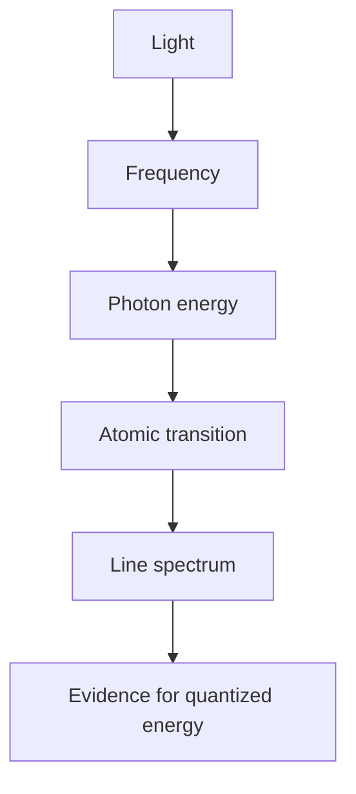

# Quantum Theory of Atoms

Quantum theory explains why atoms have discrete spectra and why electrons occupy orbitals rather than arbitrary classical paths. The chapter begins with light and photons because atomic structure was revealed through radiation: atoms absorb and emit only particular energies.

In the Ebbing and Gammon sequence this topic sits near light waves, photons, Bohr theory, quantum mechanics, quantum numbers, and atomic orbitals. That placement matters because general chemistry is cumulative: a later calculation usually reuses earlier ideas about measurement, atomic structure, bonding, molecular motion, or equilibrium. The aim of this page is to turn the chapter-level ideas into a working reference that can be used for problem solving without copying the textbook's wording or examples.

## Definitions

The following definitions give the vocabulary and notation used in this page. Treat them as operational definitions: each one says what can be counted, measured, compared, or conserved in a chemical argument.

- Wavelength $\lambda$ is the distance between repeating points on a wave.
- Frequency $\nu$ is cycles per second and has unit $\mathrm{s^{-1}}$.
- Photon is a quantum of electromagnetic radiation.
- Quantization means only certain energy values are allowed.
- An orbital is a wavefunction region associated with a probability distribution for an electron.
- Principal quantum number $n$ labels shell size and energy level.
- Angular momentum quantum number $l$ labels subshell shape.
- Magnetic quantum number $m_l$ labels orbital orientation; spin quantum number $m_s$ labels electron spin.

Definitions in chemistry often connect a symbolic representation to a physical sample. A formula such as $\mathrm{H_2O}$ names a substance, gives the atomic ratio inside one molecule, and supplies the molar mass used in a macroscopic calculation. A state symbol such as $\mathrm{(aq)}$ is not cosmetic; it says the species is dispersed in water and may be treated as ions when writing a net ionic equation. In the same way, constants such as $R$, $K_w$, $F$, or $N_A$ are compact definitions of the measurement system being used.

## Key results

The central results are:

- Wave relation: $c=\lambda\nu$.
- Photon energy: $E=h\nu=hc/\lambda$.
- Bohr hydrogen energy: $E_n=-2.18\times10^{-18}\ \mathrm{J}/n^2$.
- Hydrogen transition: $\Delta E=E_f-E_i$ and emitted photon energy is $\vert \Delta E\vert $.
- Allowed $l$ values are $0$ to $n-1$; subshell letters are $s,p,d,f$ for $l=0,1,2,3$.
- Number of orbitals in a subshell is $2l+1$.

Bohr's model works best as a historical stepping stone: it explains the hydrogen spectrum but fails for multi-electron atoms. Quantum mechanics replaces fixed circular orbits with orbitals and probability. This change is not merely philosophical; it explains periodicity, bonding direction, and spectroscopy.

A good way to use these results is to state the chemical model first, then substitute numbers second. For quantum theory of atoms, the model usually answers questions such as what particles are present, what is conserved, which process is idealized, and which measurement is being interpreted. Once that sentence is clear, the algebra becomes a bookkeeping problem rather than a search for a memorized pattern.

Units are part of the result, not decoration. Whenever a formula contains an empirical constant, a tabulated value, or a ratio of measured quantities, the units tell you whether the expression has been used in the intended form. This is especially important in general chemistry because several equations have nearly identical algebra but different meanings: pressure can be a measured state variable, an equilibrium correction, or a colligative effect; energy can be heat flow, enthalpy, internal energy, or free energy.

The strongest check is an independent chemical interpretation. Ask whether the sign agrees with direction, whether a concentration can be negative, whether a mole ratio follows the balanced equation, whether an equilibrium shift opposes the stress, and whether a microscopic description explains the macroscopic number. These checks connect quantum theory of atoms to neighboring topics instead of leaving it as an isolated technique.

A second check is to compare the limiting cases. If a reactant amount goes to zero, a product amount cannot remain large. If temperature rises in a gas sample at fixed volume, pressure should not fall in an ideal model. If an acid is diluted, hydronium concentration should normally decrease unless a coupled equilibrium supplies more. Limiting cases often reveal algebra that has been rearranged correctly but applied to the wrong chemical situation.

Finally, keep symbolic and particulate representations side by side. A balanced equation, an equilibrium expression, an orbital diagram, or a polymer repeat unit is a compact symbol for a population of particles. Translating that symbol into words forces you to say what is reacting, what is being counted, and what is being held constant. That translation is usually the difference between a calculation that can be adapted to a new problem and one that only imitates a worked example.

## Visual

| Quantum number | Allowed values | Meaning | Example |
|---|---|---|---|
| $n$ | $1,2,3,\dots$ | shell size and energy | $n=3$ |
| $l$ | $0$ to $n-1$ | subshell shape | $l=1$ means p |
| $m_l$ | $-l$ to $+l$ | orbital orientation | $-1,0,+1$ for p |
| $m_s$ | $+1/2$ or $-1/2$ | spin state | paired electrons differ |



## Worked example 1: Photon energy from wavelength

Problem. Find the energy of one photon of blue light with wavelength 450 nm.

    Method.

    1. Convert wavelength to meters: $450\ \mathrm{nm}=450\times10^{-9}\ \mathrm{m}$.
2. Use $E=hc/\lambda$.
3. Substitute $h=6.626\times10^{-34}\ \mathrm{J\ s}$ and $c=2.998\times10^8\ \mathrm{m\ s^{-1}}$.
4. Calculate numerator: $hc=1.986\times10^{-25}\ \mathrm{J\ m}$.
5. Divide by wavelength: $E=(1.986\times10^{-25})/(4.50\times10^{-7})=4.41\times10^{-19}\ \mathrm{J}$.

    Checked answer. $4.41\times10^{-19}\ \mathrm{J}$ per photon. Visible photons commonly have energies near $10^{-19}$ J.

    The important habit is to identify the conserved quantity before reaching for an equation. In this example the units, coefficients, charges, or particles chosen in the first step control every later step. The final numerical answer is not accepted merely because it came from a formula; it is checked against the chemical picture. If the magnitude, sign, units, or limiting condition contradicts that picture, the calculation has to be restarted from the definition rather than patched at the end.

## Worked example 2: Hydrogen emission energy

Problem. An electron in hydrogen falls from $n=3$ to $n=2$. Find the emitted photon energy and wavelength.

    Method.

    1. Use $E_n=-2.18\times10^{-18}/n^2\ \mathrm{J}$.
2. Compute $E_3=-2.18\times10^{-18}/9=-2.42\times10^{-19}\ \mathrm{J}$.
3. Compute $E_2=-2.18\times10^{-18}/4=-5.45\times10^{-19}\ \mathrm{J}$.
4. Change for the atom: $\Delta E=E_2-E_3=-3.03\times10^{-19}\ \mathrm{J}$.
5. The emitted photon has positive energy $3.03\times10^{-19}\ \mathrm{J}$.
6. Find wavelength: $\lambda=hc/E=(1.986\times10^{-25})/(3.03\times10^{-19})=6.56\times10^{-7}\ \mathrm{m}=656\ \mathrm{nm}$.

    Checked answer. The photon energy is $3.03\times10^{-19}\ \mathrm{J}$ and wavelength is about 656 nm. A 656 nm wavelength is in the visible red region, matching the Balmer series.

    The important habit is to identify the conserved quantity before reaching for an equation. In this example the units, coefficients, charges, or particles chosen in the first step control every later step. The final numerical answer is not accepted merely because it came from a formula; it is checked against the chemical picture. If the magnitude, sign, units, or limiting condition contradicts that picture, the calculation has to be restarted from the definition rather than patched at the end.

## Code

The snippet below is intentionally small, but it is runnable and mirrors the calculation style used in the worked examples. It keeps units visible in variable names so that the computation remains auditable.

```python
h = 6.626e-34
c = 2.998e8

def photon_energy_from_nm(wavelength_nm):
    return h * c / (wavelength_nm * 1e-9)

def hydrogen_level(n):
    return -2.18e-18 / (n * n)

E_blue = photon_energy_from_nm(450)
E_emit = abs(hydrogen_level(2) - hydrogen_level(3))
lambda_emit_nm = h * c / E_emit * 1e9
print(E_blue, lambda_emit_nm)
```

## Common pitfalls

- Treating orbitals as fixed planetary paths. Avoid it by describing them as probability distributions.
- Forgetting to convert nanometers to meters. Avoid it by writing the conversion in the equation line.
- Using the sign of atomic $\Delta E$ as photon energy. Avoid it by taking photon energy as positive and interpreting sign as emission or absorption.
- Applying Bohr energy levels to all atoms without caution. Avoid it by limiting the simple formula to hydrogen-like species.
- Allowing impossible quantum numbers. Avoid it by checking $l\lt n$ and $-l\le m_l\le l$.
- Confusing frequency and wavelength trends. Avoid it by remembering $E$ increases with frequency and decreases with wavelength.

## Connections

- [electron configurations and periodic trends](/chemistry/general/electron-configurations-and-periodic-trends)
- [ionic and covalent bonding](/chemistry/general/ionic-and-covalent-bonding)
- [molecular geometry and bonding theory](/chemistry/general/molecular-geometry-and-bonding-theory)
- [nuclear chemistry](/chemistry/general/nuclear-chemistry)
