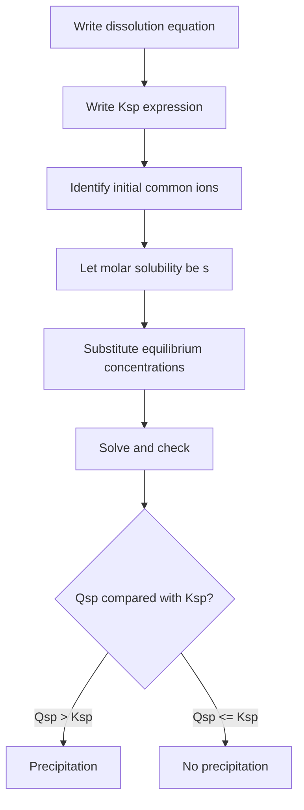

# Solubility and Complex-Ion Equilibria

Solubility equilibria describe slightly soluble ionic solids in contact with their dissolved ions. Complex-ion equilibria add a second layer: metal ions can bind ligands, lowering free metal-ion concentration and often increasing the apparent solubility of a precipitate.

In the Ebbing and Gammon sequence this topic sits near solubility product, common-ion effect, precipitation calculations, pH effects on solubility, complex-ion formation, complex ions and solubility, and qualitative analysis. That placement matters because general chemistry is cumulative: a later calculation usually reuses earlier ideas about measurement, atomic structure, bonding, molecular motion, or equilibrium. The aim of this page is to turn the chapter-level ideas into a working reference that can be used for problem solving without copying the textbook's wording or examples.

## Definitions

The following definitions give the vocabulary and notation used in this page. Treat them as operational definitions: each one says what can be counted, measured, compared, or conserved in a chemical argument.

- Solubility is the amount of solute that dissolves at equilibrium.
- Molar solubility is solubility expressed in moles per liter.
- Solubility product $K_{sp}$ is the equilibrium constant for dissolution of a slightly soluble salt.
- Ion product $Q_{sp}$ has the same form as $K_{sp}$ but uses current ion concentrations.
- Common-ion effect lowers solubility by adding an ion already present in the dissolution equilibrium.
- Selective precipitation separates ions by differences in solubility.
- Complex ion is a metal ion bonded to surrounding ligands.
- Formation constant $K_f$ measures stability of a complex ion.

Definitions in chemistry often connect a symbolic representation to a physical sample. A formula such as $\mathrm{H_2O}$ names a substance, gives the atomic ratio inside one molecule, and supplies the molar mass used in a macroscopic calculation. A state symbol such as $\mathrm{(aq)}$ is not cosmetic; it says the species is dispersed in water and may be treated as ions when writing a net ionic equation. In the same way, constants such as $R$, $K_w$, $F$, or $N_A$ are compact definitions of the measurement system being used.

## Key results

The central results are:

- For $\mathrm{AgCl(s)\rightleftharpoons Ag^+ + Cl^-}$, $K_{sp}=[Ag^+][Cl^-]$.
- Precipitation criterion: if $Q_{sp}\gt K_{sp}$, precipitate forms.
- For $\mathrm{M(OH)_n}$, solubility often depends strongly on pH through $[OH^-]$.
- Complex formation lowers free metal ion concentration and can dissolve precipitates.
- Overall equilibrium constants multiply when reactions are added.
- Qualitative analysis uses controlled precipitation, complex formation, and acid-base conditions.

The most common solubility error is to confuse molar solubility with $K_{sp}$. They have different units and different stoichiometric exponents. The dissolution equation must be written first, then ion concentrations are expressed in terms of the molar solubility and any common ions already present.

A good way to use these results is to state the chemical model first, then substitute numbers second. For solubility and complex-ion equilibria, the model usually answers questions such as what particles are present, what is conserved, which process is idealized, and which measurement is being interpreted. Once that sentence is clear, the algebra becomes a bookkeeping problem rather than a search for a memorized pattern.

Units are part of the result, not decoration. Whenever a formula contains an empirical constant, a tabulated value, or a ratio of measured quantities, the units tell you whether the expression has been used in the intended form. This is especially important in general chemistry because several equations have nearly identical algebra but different meanings: pressure can be a measured state variable, an equilibrium correction, or a colligative effect; energy can be heat flow, enthalpy, internal energy, or free energy.

The strongest check is an independent chemical interpretation. Ask whether the sign agrees with direction, whether a concentration can be negative, whether a mole ratio follows the balanced equation, whether an equilibrium shift opposes the stress, and whether a microscopic description explains the macroscopic number. These checks connect solubility and complex-ion equilibria to neighboring topics instead of leaving it as an isolated technique.

A second check is to compare the limiting cases. If a reactant amount goes to zero, a product amount cannot remain large. If temperature rises in a gas sample at fixed volume, pressure should not fall in an ideal model. If an acid is diluted, hydronium concentration should normally decrease unless a coupled equilibrium supplies more. Limiting cases often reveal algebra that has been rearranged correctly but applied to the wrong chemical situation.

Finally, keep symbolic and particulate representations side by side. A balanced equation, an equilibrium expression, an orbital diagram, or a polymer repeat unit is a compact symbol for a population of particles. Translating that symbol into words forces you to say what is reacting, what is being counted, and what is being held constant. That translation is usually the difference between a calculation that can be adapted to a new problem and one that only imitates a worked example.

## Visual



| Equilibrium | What reduces free metal ion? | Solubility effect |
|---|---|---|
| Common anion added | shifts dissolution left | decreases |
| Acid consumes basic anion | shifts dissolution right | increases |
| Ligand binds metal | removes free cation | increases |
| Added metal cation | shifts dissolution left | decreases |

## Worked example 1: Molar solubility of silver chloride

Problem. Find the molar solubility of $\mathrm{AgCl}$ in pure water if $K_{sp}=1.8\times10^{-10}$.

    Method.

    1. Write dissolution: $\mathrm{AgCl(s)\rightleftharpoons Ag^+ + Cl^-}$.
2. Let molar solubility be $s$.
3. At equilibrium, $[Ag^+]=s$ and $[Cl^-]=s$.
4. Write $K_{sp}=s^2=1.8\times10^{-10}$.
5. Solve: $s=\sqrt{1.8\times10^{-10}}=1.34\times10^{-5}\ \mathrm{M}$.

    Checked answer. Molar solubility is $1.34\times10^{-5}\ \mathrm{M}$. A very small $K_{sp}$ gives a small solubility, consistent with a slightly soluble salt.

    The important habit is to identify the conserved quantity before reaching for an equation. In this example the units, coefficients, charges, or particles chosen in the first step control every later step. The final numerical answer is not accepted merely because it came from a formula; it is checked against the chemical picture. If the magnitude, sign, units, or limiting condition contradicts that picture, the calculation has to be restarted from the definition rather than patched at the end.

## Worked example 2: Will a precipitate form?

Problem. Equal volumes of $2.0\times10^{-4}\ \mathrm{M}$ $\mathrm{AgNO_3}$ and $2.0\times10^{-4}\ \mathrm{M}$ NaCl are mixed. Does AgCl precipitate? Use $K_{sp}=1.8\times10^{-10}$.

    Method.

    1. Mixing equal volumes halves each concentration.
2. Initial post-mixing $[Ag^+]=1.0\times10^{-4}\ \mathrm{M}$ and $[Cl^-]=1.0\times10^{-4}\ \mathrm{M}$.
3. Compute ion product: $Q_{sp}=[Ag^+][Cl^-]=(1.0\times10^{-4})^2=1.0\times10^{-8}$.
4. Compare with $K_{sp}=1.8\times10^{-10}$.
5. $Q_{sp}\gt K_{sp}$, so the solution is supersaturated with respect to AgCl.
6. Precipitation occurs until ion concentrations drop to equilibrium.

    Checked answer. Yes, AgCl precipitates. The product of ion concentrations is about 56 times larger than $K_{sp}$.

    The important habit is to identify the conserved quantity before reaching for an equation. In this example the units, coefficients, charges, or particles chosen in the first step control every later step. The final numerical answer is not accepted merely because it came from a formula; it is checked against the chemical picture. If the magnitude, sign, units, or limiting condition contradicts that picture, the calculation has to be restarted from the definition rather than patched at the end.

## Code

The snippet below is intentionally small, but it is runnable and mirrors the calculation style used in the worked examples. It keeps units visible in variable names so that the computation remains auditable.

```python
from math import sqrt

def agcl_solubility(Ksp):
    return sqrt(Ksp)

def precipitates(Ksp, cation, anion):
    Q = cation * anion
    return Q, Q > Ksp

s = agcl_solubility(1.8e-10)
Q, forms = precipitates(1.8e-10, 1.0e-4, 1.0e-4)
print(s, Q, forms)
```

## Common pitfalls

- Setting molar solubility equal to $K_{sp}$. Avoid it by writing concentrations in terms of $s$ before solving.
- Forgetting dilution when solutions are mixed. Avoid it by computing post-mixing concentrations before $Q_{sp}$.
- Ignoring stoichiometric exponents for salts like $\mathrm{CaF_2}$. Avoid it by using the dissolution equation to get ion concentrations.
- Assuming common ions always come from the solid itself. Avoid it by including any external source of the same ion.
- Forgetting that pH can change solubility of basic anion salts. Avoid it by checking acid-base reactions involving the anion.
- Treating complex formation as separate from solubility. Avoid it by combining equilibria when ligands remove free metal ions.

## Connections

- [chemical equilibrium](/chemistry/general/chemical-equilibrium)
- [acid-base equilibria, buffers, and titrations](/chemistry/general/acid-base-equilibria-buffers-and-titrations)
- [transition metals and coordination compounds](/chemistry/general/transition-metals-and-coordination-compounds)
- [aqueous reactions and solution stoichiometry](/chemistry/general/aqueous-reactions-and-solution-stoichiometry)
