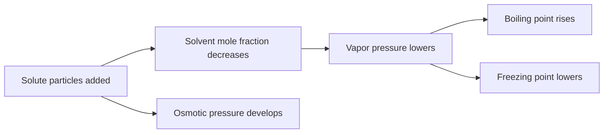

# Solutions and Colligative Properties

Solutions are homogeneous mixtures whose behavior depends on both chemical identity and particle count. Solubility asks whether a solute dissolves significantly; concentration describes how much dissolves; colligative properties measure effects that depend mainly on the number of dissolved particles.

In the Ebbing and Gammon sequence this topic sits near types of solutions, solution process, temperature and pressure effects on solubility, concentration units, vapor pressure lowering, boiling-point elevation, freezing-point depression, osmosis, ionic solutions, and colloids. That placement matters because general chemistry is cumulative: a later calculation usually reuses earlier ideas about measurement, atomic structure, bonding, molecular motion, or equilibrium. The aim of this page is to turn the chapter-level ideas into a working reference that can be used for problem solving without copying the textbook's wording or examples.


*Figure: Osmotic pressure as a colligative effect driven by dissolved particle concentration. Image: [Wikimedia Commons](https://commons.wikimedia.org/wiki/File:Osmotic_pressure_on_blood_cells_diagram.svg), LadyofHats, public domain.*


*Figure: Fractional distillation as a practical separation method for liquid mixtures. Image: [Wikimedia Commons](https://commons.wikimedia.org/wiki/File:Fractional_distillation_lab_apparatus.svg), Theresa Knott and John Kershaw, CC BY-SA 3.0/GFDL.*

## Definitions

The following definitions give the vocabulary and notation used in this page. Treat them as operational definitions: each one says what can be counted, measured, compared, or conserved in a chemical argument.

- Solute is the component dissolved in the solvent.
- Solvent is the component present in larger amount or setting the solution phase.
- Solubility is the maximum amount of solute that dissolves under specified conditions.
- Molarity is moles solute per liter of solution.
- Molality is moles solute per kilogram of solvent.
- Mole fraction is moles of one component divided by total moles.
- Colligative property depends on number of solute particles rather than identity in the ideal limit.
- Van't Hoff factor $i$ is the effective number of particles produced per formula unit.

Definitions in chemistry often connect a symbolic representation to a physical sample. A formula such as $\mathrm{H_2O}$ names a substance, gives the atomic ratio inside one molecule, and supplies the molar mass used in a macroscopic calculation. A state symbol such as $\mathrm{(aq)}$ is not cosmetic; it says the species is dispersed in water and may be treated as ions when writing a net ionic equation. In the same way, constants such as $R$, $K_w$, $F$, or $N_A$ are compact definitions of the measurement system being used.

## Key results

The central results are:

- Molarity: $M=n/V_{solution}$.
- Molality: $m=n/\mathrm{kg\ solvent}$.
- Raoult's law for ideal solution: $P_A=X_A P_A^\circ$.
- Boiling-point elevation: $\Delta T_b=iK_bm$.
- Freezing-point depression: $\Delta T_f=iK_fm$.
- Osmotic pressure: $\Pi=iMRT$.

Dissolution is favorable when solute-solvent attractions and entropy can compensate for separating solute particles and solvent particles. Colligative properties then treat the dissolved particles statistically: a solution has fewer solvent particles at the surface, a lower solvent chemical potential, and pressure or temperature shifts needed to restore phase equilibrium.

A good way to use these results is to state the chemical model first, then substitute numbers second. For solutions and colligative properties, the model usually answers questions such as what particles are present, what is conserved, which process is idealized, and which measurement is being interpreted. Once that sentence is clear, the algebra becomes a bookkeeping problem rather than a search for a memorized pattern.

Units are part of the result, not decoration. Whenever a formula contains an empirical constant, a tabulated value, or a ratio of measured quantities, the units tell you whether the expression has been used in the intended form. This is especially important in general chemistry because several equations have nearly identical algebra but different meanings: pressure can be a measured state variable, an equilibrium correction, or a colligative effect; energy can be heat flow, enthalpy, internal energy, or free energy.

The strongest check is an independent chemical interpretation. Ask whether the sign agrees with direction, whether a concentration can be negative, whether a mole ratio follows the balanced equation, whether an equilibrium shift opposes the stress, and whether a microscopic description explains the macroscopic number. These checks connect solutions and colligative properties to neighboring topics instead of leaving it as an isolated technique.

A second check is to compare the limiting cases. If a reactant amount goes to zero, a product amount cannot remain large. If temperature rises in a gas sample at fixed volume, pressure should not fall in an ideal model. If an acid is diluted, hydronium concentration should normally decrease unless a coupled equilibrium supplies more. Limiting cases often reveal algebra that has been rearranged correctly but applied to the wrong chemical situation.

Finally, keep symbolic and particulate representations side by side. A balanced equation, an equilibrium expression, an orbital diagram, or a polymer repeat unit is a compact symbol for a population of particles. Translating that symbol into words forces you to say what is reacting, what is being counted, and what is being held constant. That translation is usually the difference between a calculation that can be adapted to a new problem and one that only imitates a worked example.

## Visual

| Concentration unit | Formula | Best use | Temperature dependent? |
|---|---|---|---|
| Molarity | $n/L_{solution}$ | reactions in solution | yes, volume changes |
| Molality | $n/kg_{solvent}$ | colligative properties | no practical volume dependence |
| Mole fraction | $n_i/n_{total}$ | vapor pressure | no |
| Mass percent | mass part/mass whole | mixture reporting | no |



## Worked example 1: Freezing-point depression

Problem. A solution contains 10.0 g ethylene glycol, $\mathrm{C_2H_6O_2}$, dissolved in 200.0 g water. Estimate the freezing point. Use $K_f=1.86\ ^\circ\mathrm{C\ kg\ mol^{-1}}$ and $i=1$.

    Method.

    1. Compute molar mass of ethylene glycol: $2(12.01)+6(1.008)+2(16.00)=62.07\ \mathrm{g\ mol^{-1}}$.
2. Find moles solute: $10.0/62.07=0.161\ \mathrm{mol}$.
3. Convert solvent mass to kilograms: $200.0\ \mathrm{g}=0.2000\ \mathrm{kg}$.
4. Molality: $m=0.161/0.2000=0.805\ \mathrm{m}$.
5. Freezing depression: $\Delta T_f=iK_fm=(1)(1.86)(0.805)=1.50^\circ\mathrm{C}$.
6. Pure water freezes at $0.00^\circ\mathrm{C}$, so solution freezes at $-1.50^\circ\mathrm{C}$.

    Checked answer. The estimated freezing point is $-1.50^\circ\mathrm{C}$. A nonvolatile solute lowers the freezing point, so the sign is negative relative to pure water.

    The important habit is to identify the conserved quantity before reaching for an equation. In this example the units, coefficients, charges, or particles chosen in the first step control every later step. The final numerical answer is not accepted merely because it came from a formula; it is checked against the chemical picture. If the magnitude, sign, units, or limiting condition contradicts that picture, the calculation has to be restarted from the definition rather than patched at the end.

## Worked example 2: Osmotic pressure of a dilute solution

Problem. Find the osmotic pressure at 298 K of 0.0100 M glucose solution.

    Method.

    1. Glucose is a nonelectrolyte, so $i=1$.
2. Use $\Pi=iMRT$.
3. Choose $R=0.082057\ \mathrm{L\ atm\ mol^{-1}\ K^{-1}}$.
4. Substitute: $\Pi=(1)(0.0100)(0.082057)(298)$.
5. Calculate: $\Pi=0.244\ \mathrm{atm}$.

    Checked answer. $\Pi=0.244\ \mathrm{atm}$. A dilute solution should have osmotic pressure well below 1 atm but still measurable.

    The important habit is to identify the conserved quantity before reaching for an equation. In this example the units, coefficients, charges, or particles chosen in the first step control every later step. The final numerical answer is not accepted merely because it came from a formula; it is checked against the chemical picture. If the magnitude, sign, units, or limiting condition contradicts that picture, the calculation has to be restarted from the definition rather than patched at the end.

## Code

The snippet below is intentionally small, but it is runnable and mirrors the calculation style used in the worked examples. It keeps units visible in variable names so that the computation remains auditable.

```python
R = 0.082057

def freezing_point(mass_solute_g, molar_mass, kg_solvent, Kf, i=1):
    moles = mass_solute_g / molar_mass
    molality = moles / kg_solvent
    return 0.0 - i * Kf * molality

def osmotic_pressure(M, T, i=1):
    return i * M * R * T

print(freezing_point(10.0, 62.07, 0.2000, 1.86))
print(osmotic_pressure(0.0100, 298.0))
```

## Common pitfalls

- Using molarity instead of molality for freezing-point depression. Avoid it by checking whether the formula requires solvent mass.
- Ignoring dissociation of ionic solutes. Avoid it by including the van't Hoff factor when the model calls for it.
- Assuming all ionic solutions have ideal integer $i$ values. Avoid it by remembering ion pairing can reduce effective particle count.
- Confusing solubility with rate of dissolving. Avoid it by separating equilibrium amount from kinetic process.
- Using total solution mass as solvent mass for molality. Avoid it by using kilograms of solvent only.
- Applying Raoult's law to strongly nonideal solutions without caution. Avoid it by checking volatility and interactions.

## Connections

- [aqueous reactions and solution stoichiometry](/chemistry/general/aqueous-reactions-and-solution-stoichiometry)
- [states of matter, liquids, and solids](/chemistry/general/states-of-matter-liquids-and-solids)
- [chemical equilibrium](/chemistry/general/chemical-equilibrium)
- [acid-base equilibria, buffers, and titrations](/chemistry/general/acid-base-equilibria-buffers-and-titrations)
