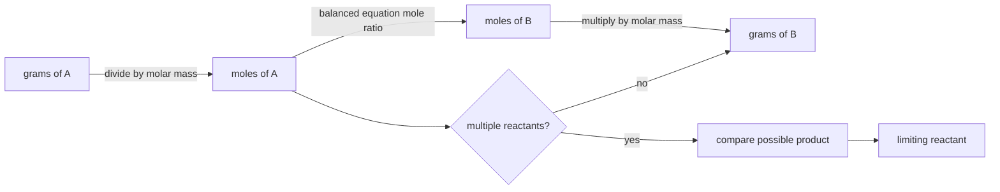

# Stoichiometry

Stoichiometry turns a balanced chemical equation into a quantitative statement about reacting amounts. Because atoms are conserved, coefficients in the balanced equation become mole ratios. The method is simple in appearance but powerful: it connects grams in a bottle, particles in a formula, and products predicted from a reaction.

In the Ebbing and Gammon sequence this topic sits near chemical formulas, mole concept, balanced equations, limiting reagents, theoretical yield, and percent yield. That placement matters because general chemistry is cumulative: a later calculation usually reuses earlier ideas about measurement, atomic structure, bonding, molecular motion, or equilibrium. The aim of this page is to turn the chapter-level ideas into a working reference that can be used for problem solving without copying the textbook's wording or examples.

## Definitions

The following definitions give the vocabulary and notation used in this page. Treat them as operational definitions: each one says what can be counted, measured, compared, or conserved in a chemical argument.

- Molar mass is the mass in grams of one mole of a substance.
- Formula mass is the sum of atomic masses in a formula unit.
- Empirical formula is the simplest whole-number atom ratio in a compound.
- Molecular formula is the actual atom count in one molecule and is a whole-number multiple of the empirical formula.
- Stoichiometric coefficient is the number before a formula in a balanced equation.
- Limiting reactant is the reactant consumed first and therefore sets the maximum product amount.
- Theoretical yield is the maximum amount of product predicted by stoichiometry.
- Percent yield is actual yield divided by theoretical yield, multiplied by 100 percent.

Definitions in chemistry often connect a symbolic representation to a physical sample. A formula such as $\mathrm{H_2O}$ names a substance, gives the atomic ratio inside one molecule, and supplies the molar mass used in a macroscopic calculation. A state symbol such as $\mathrm{(aq)}$ is not cosmetic; it says the species is dispersed in water and may be treated as ions when writing a net ionic equation. In the same way, constants such as $R$, $K_w$, $F$, or $N_A$ are compact definitions of the measurement system being used.

## Key results

The central results are:

- Mass to moles: $n=m/M$.
- Moles to particles: particles $=nN_A$.
- Mass percent of element: $\%A=\mathrm{mass\ of\ A}/\mathrm{mass\ of\ compound}\times 100\%$.
- Empirical formula from percent composition: assume 100 g, convert to moles, divide by the smallest mole amount.
- Stoichiometric conversion: $n_B=n_A(\mathrm{coefficient\ of\ B}/\mathrm{coefficient\ of\ A})$.
- Percent yield: $\%\ \mathrm{yield}=\mathrm{actual}/\mathrm{theoretical}\times100\%$.

Every stoichiometry problem has a central bridge: moles. Grams are laboratory-scale measurements, formula subscripts are particle ratios, and coefficients are reaction ratios; moles let those languages communicate. The balanced equation must be completed before a limiting reagent calculation, because using an unbalanced equation silently changes the conservation law.

A good way to use these results is to state the chemical model first, then substitute numbers second. For stoichiometry, the model usually answers questions such as what particles are present, what is conserved, which process is idealized, and which measurement is being interpreted. Once that sentence is clear, the algebra becomes a bookkeeping problem rather than a search for a memorized pattern.

Units are part of the result, not decoration. Whenever a formula contains an empirical constant, a tabulated value, or a ratio of measured quantities, the units tell you whether the expression has been used in the intended form. This is especially important in general chemistry because several equations have nearly identical algebra but different meanings: pressure can be a measured state variable, an equilibrium correction, or a colligative effect; energy can be heat flow, enthalpy, internal energy, or free energy.

The strongest check is an independent chemical interpretation. Ask whether the sign agrees with direction, whether a concentration can be negative, whether a mole ratio follows the balanced equation, whether an equilibrium shift opposes the stress, and whether a microscopic description explains the macroscopic number. These checks connect stoichiometry to neighboring topics instead of leaving it as an isolated technique.

A second check is to compare the limiting cases. If a reactant amount goes to zero, a product amount cannot remain large. If temperature rises in a gas sample at fixed volume, pressure should not fall in an ideal model. If an acid is diluted, hydronium concentration should normally decrease unless a coupled equilibrium supplies more. Limiting cases often reveal algebra that has been rearranged correctly but applied to the wrong chemical situation.

Finally, keep symbolic and particulate representations side by side. A balanced equation, an equilibrium expression, an orbital diagram, or a polymer repeat unit is a compact symbol for a population of particles. Translating that symbol into words forces you to say what is reacting, what is being counted, and what is being held constant. That translation is usually the difference between a calculation that can be adapted to a new problem and one that only imitates a worked example.

## Visual



| Task | First move | Key check |
|---|---|---|
| Empirical formula | Percent to grams to moles | Whole-number ratio |
| Molecular formula | Empirical mass to molar mass ratio | Integer multiplier |
| Limiting reagent | Compute product from each reactant | Smaller product amount controls |
| Percent yield | Compare actual to theoretical | Usually less than 100 percent |

## Worked example 1: Empirical formula from mass percentages

Problem. A compound is 40.0 percent C, 6.7 percent H, and 53.3 percent O by mass. Find its empirical formula.

    Method.

    1. Assume a 100.0 g sample: 40.0 g C, 6.7 g H, and 53.3 g O.
2. Convert each mass to moles: C $=40.0/12.01=3.33$ mol, H $=6.7/1.008=6.65$ mol, O $=53.3/16.00=3.33$ mol.
3. Divide all mole amounts by the smallest value, 3.33.
4. Ratios are C $1.00$, H $2.00$, O $1.00$.
5. Write the smallest whole-number formula: $\mathrm{CH_2O}$.

    Checked answer. The empirical formula is $\mathrm{CH_2O}$. The calculated molar mass of the empirical unit is about 30.03 g/mol, and its mass percentages reproduce the given values.

    The important habit is to identify the conserved quantity before reaching for an equation. In this example the units, coefficients, charges, or particles chosen in the first step control every later step. The final numerical answer is not accepted merely because it came from a formula; it is checked against the chemical picture. If the magnitude, sign, units, or limiting condition contradicts that picture, the calculation has to be restarted from the definition rather than patched at the end.

## Worked example 2: Limiting reagent and percent yield

Problem. Hydrogen and nitrogen react as $\mathrm{N_2 + 3H_2 \to 2NH_3}$. If 10.0 g $\mathrm{N_2}$ and 2.00 g $\mathrm{H_2}$ react and 9.50 g $\mathrm{NH_3}$ is isolated, find the limiting reagent and percent yield.

    Method.

    1. Convert $\mathrm{N_2}$ to moles: $10.0/28.02=0.357$ mol.
2. Convert $\mathrm{H_2}$ to moles: $2.00/2.016=0.992$ mol.
3. Product from nitrogen: $0.357\times(2/1)=0.714$ mol $\mathrm{NH_3}$.
4. Product from hydrogen: $0.992\times(2/3)=0.661$ mol $\mathrm{NH_3}$.
5. Hydrogen gives less product, so it is limiting.
6. Theoretical mass ammonia: $0.661\times17.03=11.3$ g.
7. Percent yield: $9.50/11.3\times100=84.1\%$.

    Checked answer. $\mathrm{H_2}$ is limiting and the percent yield is $84.1\%$. The yield is below 100 percent and nitrogen remains in excess.

    The important habit is to identify the conserved quantity before reaching for an equation. In this example the units, coefficients, charges, or particles chosen in the first step control every later step. The final numerical answer is not accepted merely because it came from a formula; it is checked against the chemical picture. If the magnitude, sign, units, or limiting condition contradicts that picture, the calculation has to be restarted from the definition rather than patched at the end.

## Code

The snippet below is intentionally small, but it is runnable and mirrors the calculation style used in the worked examples. It keeps units visible in variable names so that the computation remains auditable.

```python
def empirical_ratio(masses, molar_masses):
    moles = [m / M for m, M in zip(masses, molar_masses)]
    smallest = min(moles)
    return [x / smallest for x in moles]

ratio = empirical_ratio([40.0, 6.7, 53.3], [12.01, 1.008, 16.00])

n2 = 10.0 / 28.02
h2 = 2.00 / 2.016
nh3_from_n2 = n2 * 2
nh3_from_h2 = h2 * (2 / 3)
theoretical_g = min(nh3_from_n2, nh3_from_h2) * 17.03
percent_yield = 9.50 / theoretical_g * 100
print(ratio, percent_yield)
```

## Common pitfalls

- Using grams directly in mole ratios. Avoid it by converting every reacting mass to moles first.
- Choosing the reactant with the smaller mass as limiting. Avoid it by comparing possible product amounts instead.
- Rounding empirical formula ratios too early. Avoid it by using guard digits and checking near-integer multiples.
- Using subscripts as reaction coefficients. Avoid it by balancing the equation and using coefficients for reaction ratios.
- Reporting percent yield without units or context. Avoid it by identifying actual and theoretical yields explicitly.
- Assuming the theoretical yield is what was collected. Avoid it by separating prediction from experiment.

## Connections

- [atoms, molecules, and ions](/chemistry/general/atoms-molecules-and-ions)
- [aqueous reactions and solution stoichiometry](/chemistry/general/aqueous-reactions-and-solution-stoichiometry)
- [gases](/chemistry/general/gases)
- [thermochemistry](/chemistry/general/thermochemistry)
