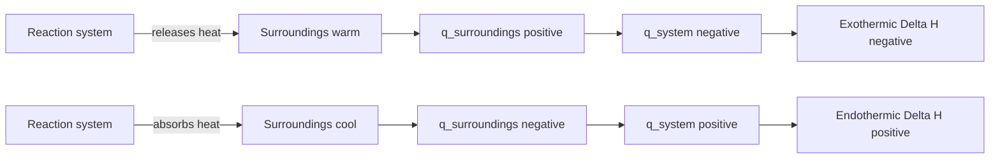

# Thermochemistry

Thermochemistry studies heat flow during chemical and physical change. It connects laboratory measurements such as temperature change to reaction quantities such as enthalpy. The main discipline is sign convention: the system is the reaction or process being studied, and heat entering or leaving that system must be tracked consistently.

In the Ebbing and Gammon sequence this topic sits near energy units, heat of reaction, enthalpy, thermochemical equations, stoichiometry with heat, calorimetry, Hess's law, standard enthalpies of formation, and fuels. That placement matters because general chemistry is cumulative: a later calculation usually reuses earlier ideas about measurement, atomic structure, bonding, molecular motion, or equilibrium. The aim of this page is to turn the chapter-level ideas into a working reference that can be used for problem solving without copying the textbook's wording or examples.


*Figure: Calorimeter apparatus used to connect temperature change to heat flow. Image: [Wikimedia Commons](https://commons.wikimedia.org/wiki/File:Calorimeter.svg), Li-on, public domain.*

## Definitions

The following definitions give the vocabulary and notation used in this page. Treat them as operational definitions: each one says what can be counted, measured, compared, or conserved in a chemical argument.

- The system is the part of the universe chosen for study; surroundings are everything else.
- Heat $q$ is energy transferred because of a temperature difference.
- Work $w$ is energy transferred when a force acts through a distance or gas expands against pressure.
- Internal energy $E$ is the total microscopic energy of a system.
- Enthalpy $H$ is a state function useful for constant-pressure heat flow.
- An exothermic process releases heat and has negative $\Delta H$ for the system.
- An endothermic process absorbs heat and has positive $\Delta H$ for the system.
- A calorimeter measures heat flow through observed temperature change.

Definitions in chemistry often connect a symbolic representation to a physical sample. A formula such as $\mathrm{H_2O}$ names a substance, gives the atomic ratio inside one molecule, and supplies the molar mass used in a macroscopic calculation. A state symbol such as $\mathrm{(aq)}$ is not cosmetic; it says the species is dispersed in water and may be treated as ions when writing a net ionic equation. In the same way, constants such as $R$, $K_w$, $F$, or $N_A$ are compact definitions of the measurement system being used.

## Key results

The central results are:

- First law: $\Delta E=q+w$.
- Constant-pressure heat: $q_p=\Delta H$.
- Heat capacity relation: $q=mc\Delta T$.
- Thermochemical equations scale with reaction amount and reverse sign when reversed.
- Hess's law: enthalpy changes add for reactions that add.
- Formation relation: $\Delta H^\circ_{rxn}=\sum n\Delta H_f^\circ(\mathrm{products})-\sum n\Delta H_f^\circ(\mathrm{reactants})$.

Because enthalpy is a state function, the path used to reach products does not matter. This makes Hess's law possible: complicated reaction enthalpies can be assembled from simpler measured or tabulated steps. Calorimetry supplies experimental heat, but the chemical conclusion requires assigning that heat to the system with the correct sign.

A good way to use these results is to state the chemical model first, then substitute numbers second. For thermochemistry, the model usually answers questions such as what particles are present, what is conserved, which process is idealized, and which measurement is being interpreted. Once that sentence is clear, the algebra becomes a bookkeeping problem rather than a search for a memorized pattern.

Units are part of the result, not decoration. Whenever a formula contains an empirical constant, a tabulated value, or a ratio of measured quantities, the units tell you whether the expression has been used in the intended form. This is especially important in general chemistry because several equations have nearly identical algebra but different meanings: pressure can be a measured state variable, an equilibrium correction, or a colligative effect; energy can be heat flow, enthalpy, internal energy, or free energy.

The strongest check is an independent chemical interpretation. Ask whether the sign agrees with direction, whether a concentration can be negative, whether a mole ratio follows the balanced equation, whether an equilibrium shift opposes the stress, and whether a microscopic description explains the macroscopic number. These checks connect thermochemistry to neighboring topics instead of leaving it as an isolated technique.

A second check is to compare the limiting cases. If a reactant amount goes to zero, a product amount cannot remain large. If temperature rises in a gas sample at fixed volume, pressure should not fall in an ideal model. If an acid is diluted, hydronium concentration should normally decrease unless a coupled equilibrium supplies more. Limiting cases often reveal algebra that has been rearranged correctly but applied to the wrong chemical situation.

Finally, keep symbolic and particulate representations side by side. A balanced equation, an equilibrium expression, an orbital diagram, or a polymer repeat unit is a compact symbol for a population of particles. Translating that symbol into words forces you to say what is reacting, what is being counted, and what is being held constant. That translation is usually the difference between a calculation that can be adapted to a new problem and one that only imitates a worked example.

## Visual



| Operation on thermochemical equation | Effect on $\Delta H$ |
|---|---:|
| Multiply all coefficients by 2 | Multiply $\Delta H$ by 2 |
| Reverse reaction | Change sign |
| Add reactions | Add enthalpy changes |
| Cancel species | Cancel only identical species in identical states |

## Worked example 1: Coffee-cup calorimetry

Problem. A reaction occurs in 100.0 g of water-like solution with specific heat $4.184\ \mathrm{J\ g^{-1}\ ^\circ C^{-1}}$. The temperature rises from 22.40 to $27.85^\circ\mathrm{C}$. Find heat absorbed by solution and heat released by reaction.

    Method.

    1. Compute temperature change: $\Delta T=27.85-22.40=5.45^\circ\mathrm{C}$.
2. Use $q_{solution}=mc\Delta T$.
3. Substitute: $q=(100.0)(4.184)(5.45)=2280\ \mathrm{J}$.
4. The solution warmed, so it absorbed heat: $q_{solution}=+2.28\ \mathrm{kJ}$.
5. Energy conservation gives $q_{rxn}=-q_{solution}=-2.28\ \mathrm{kJ}$.

    Checked answer. The solution absorbs $2.28\ \mathrm{kJ}$ and the reaction releases $2.28\ \mathrm{kJ}$. A temperature increase of the surroundings indicates an exothermic reaction.

    The important habit is to identify the conserved quantity before reaching for an equation. In this example the units, coefficients, charges, or particles chosen in the first step control every later step. The final numerical answer is not accepted merely because it came from a formula; it is checked against the chemical picture. If the magnitude, sign, units, or limiting condition contradicts that picture, the calculation has to be restarted from the definition rather than patched at the end.

## Worked example 2: Hess's law by reversing and adding

Problem. Use $\mathrm{C(s)+O_2(g)\to CO_2(g)}$, $\Delta H=-393.5\ \mathrm{kJ}$ and $\mathrm{CO(g)+1/2O_2(g)\to CO_2(g)}$, $\Delta H=-283.0\ \mathrm{kJ}$ to find $\Delta H$ for $\mathrm{C(s)+1/2O_2(g)\to CO(g)}$.

    Method.

    1. Keep the carbon combustion equation as written.
2. Reverse the CO combustion equation to place $\mathrm{CO_2}$ on the reactant side: $\mathrm{CO_2(g)\to CO(g)+1/2O_2(g)}$.
3. Changing direction changes the sign: $\Delta H=+283.0\ \mathrm{kJ}$.
4. Add the two equations and cancel $\mathrm{CO_2}$.
5. The remaining reaction is $\mathrm{C(s)+1/2O_2(g)\to CO(g)}$.
6. Add enthalpies: $-393.5+283.0=-110.5\ \mathrm{kJ}$.

    Checked answer. $\Delta H=-110.5\ \mathrm{kJ}$. Formation of CO from elements is exothermic but less exothermic than complete combustion to CO2.

    The important habit is to identify the conserved quantity before reaching for an equation. In this example the units, coefficients, charges, or particles chosen in the first step control every later step. The final numerical answer is not accepted merely because it came from a formula; it is checked against the chemical picture. If the magnitude, sign, units, or limiting condition contradicts that picture, the calculation has to be restarted from the definition rather than patched at the end.

## Code

The snippet below is intentionally small, but it is runnable and mirrors the calculation style used in the worked examples. It keeps units visible in variable names so that the computation remains auditable.

```python
def calorimetry_heat(mass_g, specific_heat, initial_C, final_C):
    delta_T = final_C - initial_C
    return mass_g * specific_heat * delta_T

q_solution_J = calorimetry_heat(100.0, 4.184, 22.40, 27.85)
q_reaction_kJ = -q_solution_J / 1000.0

hess_delta = -393.5 + 283.0
print(q_reaction_kJ, hess_delta)
```

## Common pitfalls

- Assigning the solution heat sign to the reaction without changing sign. Avoid it by using $q_{system}=-q_{surroundings}$.
- Forgetting to scale $\Delta H$ with reaction coefficients. Avoid it by multiplying enthalpy by the same factor as the equation.
- Treating enthalpy as dependent on path. Avoid it by using state-function logic for Hess cycles.
- Mixing joules and kilojoules. Avoid it by converting before adding heats.
- Using Celsius temperature rather than temperature change incorrectly. Avoid it by noting that $\Delta ^\circ C$ equals $\Delta K$ for heat capacity.
- Ignoring states in thermochemical equations. Avoid it by including phases because enthalpy depends on state.

## Connections

- [stoichiometry](/chemistry/general/stoichiometry)
- [gases](/chemistry/general/gases)
- [thermodynamics and free energy](/chemistry/general/thermodynamics-and-free-energy)
- [chemical equilibrium](/chemistry/general/chemical-equilibrium)
