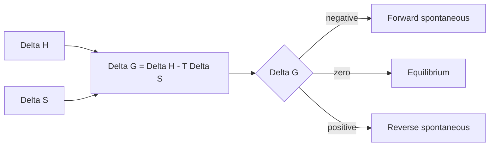

# Thermodynamics and Free Energy

Thermodynamics explains the direction and limits of chemical change. Thermochemistry measured heat; thermodynamics adds entropy and free energy so that spontaneity, maximum useful work, and equilibrium composition can be treated in one framework.

In the Ebbing and Gammon sequence this topic sits near first law, enthalpy, spontaneous processes, entropy, standard entropies, third law, Gibbs free energy, spontaneity, free energy interpretation, free energy and equilibrium constants, and temperature effects. That placement matters because general chemistry is cumulative: a later calculation usually reuses earlier ideas about measurement, atomic structure, bonding, molecular motion, or equilibrium. The aim of this page is to turn the chapter-level ideas into a working reference that can be used for problem solving without copying the textbook's wording or examples.


*Figure: Gibbs energy as the thermodynamic criterion for direction and equilibrium. Image: [Wikimedia Commons](https://commons.wikimedia.org/wiki/File:Gibbs-Energie-Veranschaulichung.svg), Johannes Schneider, CC BY-SA 4.0.*

## Definitions

The following definitions give the vocabulary and notation used in this page. Treat them as operational definitions: each one says what can be counted, measured, compared, or conserved in a chemical argument.

- Spontaneous process proceeds without continuous external forcing under specified conditions.
- Entropy $S$ measures dispersal of energy and matter among available microstates.
- Second law states that entropy of the universe increases for a spontaneous process.
- Third law assigns zero entropy to a perfect crystal at 0 K.
- Gibbs free energy $G$ combines enthalpy and entropy for constant-temperature, constant-pressure processes.
- Standard free energy change $\Delta G^\circ$ refers to standard-state conditions.
- Reaction free energy $\Delta G$ depends on current composition through $Q$.
- At equilibrium, $\Delta G=0$.

Definitions in chemistry often connect a symbolic representation to a physical sample. A formula such as $\mathrm{H_2O}$ names a substance, gives the atomic ratio inside one molecule, and supplies the molar mass used in a macroscopic calculation. A state symbol such as $\mathrm{(aq)}$ is not cosmetic; it says the species is dispersed in water and may be treated as ions when writing a net ionic equation. In the same way, constants such as $R$, $K_w$, $F$, or $N_A$ are compact definitions of the measurement system being used.

## Key results

The central results are:

- Entropy of universe: $\Delta S_{univ}=\Delta S_{sys}+\Delta S_{surr}$.
- Gibbs relation: $\Delta G=\Delta H-T\Delta S$.
- Standard reaction entropy: $\Delta S^\circ=\sum nS^\circ(products)-\sum nS^\circ(reactants)$.
- Standard free energy of reaction: $\Delta G^\circ=\sum n\Delta G_f^\circ(products)-\sum n\Delta G_f^\circ(reactants)$.
- Composition dependence: $\Delta G=\Delta G^\circ+RT\ln Q$.
- Equilibrium link: $\Delta G^\circ=-RT\ln K$.

A negative $\Delta G$ predicts spontaneity in the forward direction for the current conditions, not necessarily speed. A reaction can be spontaneous and slow because kinetics imposes an activation barrier. The equation $\Delta G=\Delta G^\circ+RT\ln Q$ is the bridge between thermodynamics and equilibrium: changing composition changes the driving force until equilibrium is reached.

A good way to use these results is to state the chemical model first, then substitute numbers second. For thermodynamics and free energy, the model usually answers questions such as what particles are present, what is conserved, which process is idealized, and which measurement is being interpreted. Once that sentence is clear, the algebra becomes a bookkeeping problem rather than a search for a memorized pattern.

Units are part of the result, not decoration. Whenever a formula contains an empirical constant, a tabulated value, or a ratio of measured quantities, the units tell you whether the expression has been used in the intended form. This is especially important in general chemistry because several equations have nearly identical algebra but different meanings: pressure can be a measured state variable, an equilibrium correction, or a colligative effect; energy can be heat flow, enthalpy, internal energy, or free energy.

The strongest check is an independent chemical interpretation. Ask whether the sign agrees with direction, whether a concentration can be negative, whether a mole ratio follows the balanced equation, whether an equilibrium shift opposes the stress, and whether a microscopic description explains the macroscopic number. These checks connect thermodynamics and free energy to neighboring topics instead of leaving it as an isolated technique.

A second check is to compare the limiting cases. If a reactant amount goes to zero, a product amount cannot remain large. If temperature rises in a gas sample at fixed volume, pressure should not fall in an ideal model. If an acid is diluted, hydronium concentration should normally decrease unless a coupled equilibrium supplies more. Limiting cases often reveal algebra that has been rearranged correctly but applied to the wrong chemical situation.

Finally, keep symbolic and particulate representations side by side. A balanced equation, an equilibrium expression, an orbital diagram, or a polymer repeat unit is a compact symbol for a population of particles. Translating that symbol into words forces you to say what is reacting, what is being counted, and what is being held constant. That translation is usually the difference between a calculation that can be adapted to a new problem and one that only imitates a worked example.

## Visual

| Sign pattern | Temperature effect | Spontaneity |
|---|---|---|
| $\Delta H\lt 0$, $\Delta S\gt 0$ | favorable at all T | always spontaneous |
| $\Delta H\gt 0$, $\Delta S\lt 0$ | unfavorable at all T | never spontaneous under standard model |
| $\Delta H\lt 0$, $\Delta S\lt 0$ | enthalpy favored, entropy opposed | spontaneous at low T |
| $\Delta H\gt 0$, $\Delta S\gt 0$ | entropy favored, enthalpy opposed | spontaneous at high T |



## Worked example 1: Spontaneity from enthalpy and entropy

Problem. A process has $\Delta H=25.0\ \mathrm{kJ\ mol^{-1}}$ and $\Delta S=80.0\ \mathrm{J\ mol^{-1}\ K^{-1}}$. Find $\Delta G$ at 298 K and decide spontaneity.

    Method.

    1. Convert entropy to kJ: $80.0\ \mathrm{J\ mol^{-1}\ K^{-1}}=0.0800\ \mathrm{kJ\ mol^{-1}\ K^{-1}}$.
2. Use $\Delta G=\Delta H-T\Delta S$.
3. Compute $T\Delta S=(298)(0.0800)=23.8\ \mathrm{kJ\ mol^{-1}}$.
4. Subtract: $\Delta G=25.0-23.8=1.2\ \mathrm{kJ\ mol^{-1}}$.
5. Positive $\Delta G$ means the forward process is not spontaneous under these conditions.

    Checked answer. $\Delta G=+1.2\ \mathrm{kJ\ mol^{-1}}$, so the forward process is nonspontaneous at 298 K. Both enthalpy and entropy are positive, so high temperature may make the process spontaneous; 298 K is just below the threshold.

    The important habit is to identify the conserved quantity before reaching for an equation. In this example the units, coefficients, charges, or particles chosen in the first step control every later step. The final numerical answer is not accepted merely because it came from a formula; it is checked against the chemical picture. If the magnitude, sign, units, or limiting condition contradicts that picture, the calculation has to be restarted from the definition rather than patched at the end.

## Worked example 2: Equilibrium constant from standard free energy

Problem. At 298 K, a reaction has $\Delta G^\circ=-11.4\ \mathrm{kJ\ mol^{-1}}$. Find $K$.

    Method.

    1. Use $\Delta G^\circ=-RT\ln K$.
2. Convert free energy to joules: $-11.4\ \mathrm{kJ\ mol^{-1}}=-11400\ \mathrm{J\ mol^{-1}}$.
3. Solve for $\ln K=-\Delta G^\circ/(RT)$.
4. Substitute: $\ln K=11400/[(8.314)(298)]$.
5. Calculate: $\ln K=4.60$.
6. Exponentiate: $K=e^{4.60}=99.5$.

    Checked answer. $K\approx 1.00\times10^2$. Negative standard free energy corresponds to $K\gt 1$, as found.

    The important habit is to identify the conserved quantity before reaching for an equation. In this example the units, coefficients, charges, or particles chosen in the first step control every later step. The final numerical answer is not accepted merely because it came from a formula; it is checked against the chemical picture. If the magnitude, sign, units, or limiting condition contradicts that picture, the calculation has to be restarted from the definition rather than patched at the end.

## Code

The snippet below is intentionally small, but it is runnable and mirrors the calculation style used in the worked examples. It keeps units visible in variable names so that the computation remains auditable.

```python
from math import exp

R = 8.314
def delta_g(delta_h_kj, delta_s_j, T):
    return delta_h_kj - T * (delta_s_j / 1000.0)

def K_from_delta_g(delta_g_kj, T):
    return exp(-(delta_g_kj * 1000.0) / (R * T))

print(delta_g(25.0, 80.0, 298.0))
print(K_from_delta_g(-11.4, 298.0))
```

## Common pitfalls

- Forgetting to convert entropy from J to kJ. Avoid it by matching units before using $\Delta G=\Delta H-T\Delta S$.
- Equating spontaneous with fast. Avoid it by separating thermodynamics from kinetics.
- Using $\Delta G^\circ$ to predict direction at nonstandard composition without $Q$. Avoid it by using $\Delta G=\Delta G^\circ+RT\ln Q$.
- Thinking equilibrium means $K=1$. Avoid it by remembering equilibrium means $\Delta G=0$, not necessarily equal concentrations.
- Ignoring temperature when comparing spontaneity. Avoid it by checking the $T\Delta S$ term explicitly.
- Using logarithm base 10 in $\Delta G^\circ=-RT\ln K$ without conversion. Avoid it by using natural log unless the equation is rewritten.

## Connections

- [thermochemistry](/chemistry/general/thermochemistry)
- [chemical equilibrium](/chemistry/general/chemical-equilibrium)
- [chemical kinetics](/chemistry/general/chemical-kinetics)
- [electrochemistry](/chemistry/general/electrochemistry)
