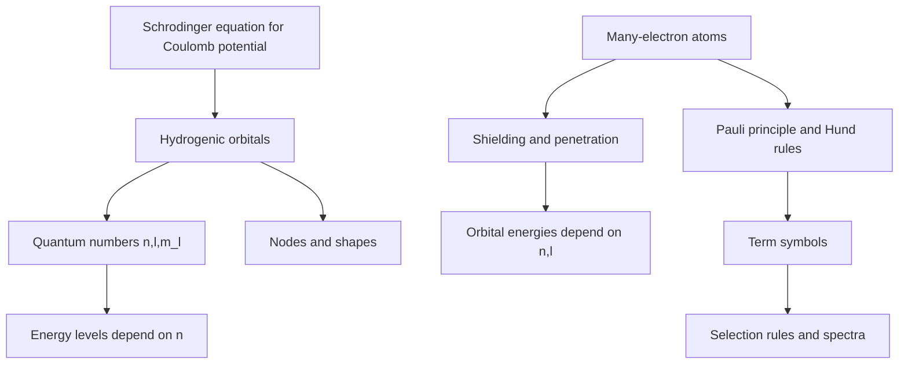

# Atomic Structure and Spectra

Atomic structure is the first major chemical application of the Schrodinger equation. Hydrogenic atoms can be solved exactly, and many-electron atoms are then understood through approximations: shielding, effective nuclear charge, orbital energies, spin, and angular momentum coupling.

Atkins uses atomic spectra to connect quantum numbers with measured transitions. Spectral lines are not arbitrary fingerprints; they are energy differences constrained by selection rules.


*Figure: Hydrogen spectral series connecting atomic energy levels to observed light. Image: [Wikimedia Commons](https://commons.wikimedia.org/wiki/File:Hydrogen_spectrum.svg), OrangeDog, CC BY-SA 3.0.*

## Definitions

A hydrogenic atom is a one-electron species with nuclear charge $+Ze$, such as $\mathrm{H}$, $\mathrm{He^+}$, or $\mathrm{Li^{2+}}$. Its energy levels are

$$
E_n=-\frac{hcR_\infty Z^2}{n^2}
$$

with principal quantum number

$$
n=1,2,3,\dots
$$

Atomic orbitals are labeled by quantum numbers:

$$
n,\quad l=0,1,\dots,n-1,\quad m_l=-l,\dots,+l
$$

The orbital angular momentum magnitude is

$$
\left[l(l+1)\right]^{1/2}\hbar
$$

and its $z$ component is

$$
m_l\hbar
$$

Electron spin has

$$
s=\frac{1}{2},
\qquad
m_s=\pm\frac{1}{2}
$$

Many-electron atoms require the Pauli principle: no two electrons in an atom may have the same set of four quantum numbers. Hund's rules give empirical guidance for term ordering in many atoms.

Term symbols summarize total angular momentum:

$$
^{2S+1}L_J
$$

where $S$ is total spin, $L$ is total orbital angular momentum, and $J$ is total angular momentum.

## Key results

For hydrogenic atoms, the spectral wavenumber for a transition from $n_i$ to $n_f$ is

$$
\tilde\nu=R_\infty Z^2\left(\frac{1}{n_f^2}-\frac{1}{n_i^2}\right)
$$

for emission with $n_i\gt n_f$. The degeneracy of a hydrogenic shell with principal quantum number $n$, ignoring spin, is

$$
\sum_{l=0}^{n-1}(2l+1)=n^2
$$

including spin, it is $2n^2$.

The radial and angular structure of orbitals explains nodal patterns. The number of angular nodes is $l$, and the number of radial nodes is

$$
n-l-1
$$

Many-electron atoms break the hydrogenic degeneracy because electron-electron repulsion and shielding make orbital energy depend on both $n$ and $l$. Penetrating orbitals such as $s$ orbitals experience greater effective nuclear charge than less penetrating orbitals with the same $n$.

Electric dipole selection rules for hydrogenic atoms are

$$
\Delta l=\pm1,
\qquad
\Delta m_l=0,\pm1
$$

For many-electron atoms in Russell-Saunders coupling, common selection rules include

$$
\Delta S=0,\qquad
\Delta L=0,\pm1,\qquad
\Delta J=0,\pm1
$$

with $J=0\to J=0$ forbidden.

Spin-orbit coupling splits terms because magnetic interactions connect spin and orbital angular momenta. The splitting grows strongly for heavier atoms.

The hydrogen atom is exactly solvable because it has one electron moving in a Coulomb potential. Separation of variables in spherical polar coordinates gives radial functions and spherical harmonics. The angular functions define orbital shapes and angular momentum, while the radial functions control size and radial nodes. The energy depends only on $n$ for a hydrogenic atom, producing large degeneracy. This degeneracy is broken in many-electron atoms because electron-electron interactions change the effective potential.

Shielding and penetration explain the ordering of subshell energies. An $s$ electron can penetrate close to the nucleus and experience a larger effective nuclear charge. A $p$ electron of the same shell penetrates less, and $d$ and $f$ electrons often penetrate still less. As a result, in many-electron atoms the energy order is not simply determined by $n$. This underlies the periodic table, the Aufbau pattern, and many exceptions caused by near-degenerate subshells.

The Pauli principle is more than a filling rule. It follows from the antisymmetry of many-electron wavefunctions under exchange of identical fermions. A Slater determinant changes sign when two electron labels are exchanged and becomes zero if two electrons occupy the same spin-orbital. This mathematical structure produces shell structure and the chemical periodicity that general chemistry introduces empirically.

Hund's rules summarize how electron-electron repulsion and spin-orbit coupling often order terms. The highest spin multiplicity is usually lowest in energy because electrons with parallel spins occupy different spatial orbitals and reduce repulsion. For a given spin, larger orbital angular momentum may be favored. Spin-orbit coupling then orders $J$ levels depending on whether a shell is less or more than half-filled. These are rules, not universal laws, but they are powerful for interpreting atomic spectra.

Spectral selection rules reflect angular momentum conservation and transition moment symmetry. Electric dipole transitions require a change in parity and usually $\Delta l=\pm1$ for one-electron hydrogenic transitions. Spin-forbidden transitions can still appear weakly when spin-orbit coupling mixes states, especially in heavy atoms. This explains why some lines are intense and others are faint but not entirely absent.

Term symbols condense a large amount of information. The superscript $2S+1$ gives spin multiplicity; the letter $L$ represents total orbital angular momentum using $S,P,D,F,\dots$ for $L=0,1,2,3,\dots$; the subscript $J$ gives total angular momentum. A term such as $^3P_2$ therefore indicates $S=1$, $L=1$, and $J=2$. Atomic spectroscopy often consists of assigning observed lines to transitions between such terms.

Quantum defects occur in atoms with one valence electron outside a core. The valence electron sees an effective potential that is Coulombic at large distances but modified by penetration into the core. Energy levels can be represented approximately as

$$
E_n=-\frac{hcR}{(n-\delta_l)^2}
$$

where $\delta_l$ is the quantum defect. It is largest for penetrating orbitals such as $s$ orbitals and smaller for high-$l$ orbitals.

Atomic structure is also the starting point for molecular bonding. Atomic orbital energies, radial extension, angular shapes, and symmetry determine how orbitals overlap to form molecular orbitals. Periodic trends in ionization energy, electron affinity, and atomic radius all come from the same quantum structure discussed here.

## Visual



| Quantum number | Values | Determines |
|---|---|---|
| $n$ | $1,2,3,\dots$ | shell size and hydrogenic energy |
| $l$ | $0$ to $n-1$ | subshell shape and angular momentum |
| $m_l$ | $-l$ to $+l$ | orientation of orbital angular momentum |
| $m_s$ | $\pm1/2$ | spin projection |
| $J$ | $\vert L-S\vert $ to $L+S$ | spin-orbit split total angular momentum |

## Worked example 1: Hydrogen Balmer transition

**Problem.** Calculate the wavelength of the hydrogen emission line for $n_i=3\to n_f=2$ using $R_\infty=1.09737\times10^7\ \mathrm{m^{-1}}$.

**Method.** Use

$$
\tilde\nu=R_\infty\left(\frac{1}{2^2}-\frac{1}{3^2}\right)
$$

1. Difference:

$$
\frac{1}{4}-\frac{1}{9}
=\frac{9-4}{36}
=\frac{5}{36}
=0.138889
$$

2. Wavenumber:

$$
\tilde\nu=(1.09737\times10^7)(0.138889)
=1.524\times10^6\ \mathrm{m^{-1}}
$$

3. Wavelength:

$$
\lambda=\frac{1}{\tilde\nu}
=6.562\times10^{-7}\ \mathrm{m}
$$

4. Convert:

$$
\lambda=656.2\ \mathrm{nm}
$$

**Checked answer.** This is the red Balmer $\mathrm{H_\alpha}$ line, so the magnitude and color are correct.

## Worked example 2: Nodes in a hydrogenic orbital

**Problem.** How many radial and angular nodes are present in a $4d$ orbital?

**Method.** For a $d$ orbital, $l=2$. For $n=4$,

$$
\mathrm{radial\ nodes}=n-l-1
$$

1. Angular nodes:

$$
l=2
$$

2. Radial nodes:

$$
n-l-1=4-2-1=1
$$

3. Total nodes:

$$
n-1=3
$$

4. Check:

$$
2+1=3
$$

**Checked answer.** A $4d$ orbital has 2 angular nodes and 1 radial node.

## Code

```python
Rinf = 1.0973731568160e7  # m^-1

def hydrogen_wavelength(n_initial, n_final, Z=1):
    wavenumber = Rinf * Z**2 * (1 / n_final**2 - 1 / n_initial**2)
    return 1 / wavenumber

for ni in [3, 4, 5, 6]:
    lam_nm = hydrogen_wavelength(ni, 2) * 1e9
    print(f"Balmer {ni}->2: {lam_nm:8.2f} nm")

def nodes(n, l):
    return {"radial": n - l - 1, "angular": l, "total": n - 1}

print(nodes(4, 2))
```

## Common pitfalls

- Treating many-electron orbital energies as hydrogenic. In many-electron atoms, $2s$ and $2p$ are not generally equal.
- Forgetting that $l=0,1,2,3$ correspond to $s,p,d,f$.
- Confusing orbital nodes with electron paths.
- Applying selection rules without checking the coupling scheme and transition type.
- Ignoring degeneracy when connecting atomic levels to partition functions.

The safest way to avoid these errors is to keep three levels of description separate. First, the one-electron hydrogenic model gives exact orbitals and energies that depend only on $n$. Second, the orbital approximation for many-electron atoms keeps orbital labels but changes their energies through shielding and electron repulsion. Third, observed spectra involve terms and transitions between many-electron states, not simply jumps between isolated one-electron pictures. A calculation may use all three languages, but it should not mix their assumptions without comment.

When assigning lines, always ask what is being conserved or changed. Energy conservation sets the photon frequency. Angular momentum conservation and parity determine strong electric-dipole selection rules. Spin conservation explains why some transitions are weak or absent in light atoms. Spin-orbit coupling relaxes pure spin labels in heavier atoms, so weak "forbidden" lines may appear. This is why spectral intensity gives structural information beyond line position.

For periodic trends, avoid explaining everything by distance alone. Nuclear charge increases across a period, shielding changes imperfectly, orbital penetration differs by subshell, and electron-electron repulsion changes with configuration. The effective nuclear charge is a model that summarizes these effects, not a directly inserted charge in the exact Hamiltonian. It is useful precisely because it compresses a many-electron problem into an interpretable one-electron picture.

One final check is to compare any atomic result with the periodic table. If an argument predicts that alkali metals should hold valence electrons tightly, that noble gases should have low ionization energies, or that $d$ and $s$ subshells always fill in a perfectly simple order, the model has been pushed too far. Atomic quantum mechanics explains periodicity, but electron correlation and near-degenerate configurations create chemically important exceptions.

For spectroscopy, record whether wavelengths are in air or vacuum when precision matters, and convert consistently between wavelength, frequency, and wavenumber.

Keep significant figures realistic: atomic spectroscopy can be extremely precise, but approximate models such as shielding rules or simple term ordering do not justify excessive numerical precision.

## Connections

- [Quantum foundations](/chemistry/physical-chemistry/quantum-foundations)
- [Molecular structure and computational chemistry](/chemistry/physical-chemistry/molecular-structure-and-computational-chemistry)
- [Electronic, laser, and magnetic resonance spectroscopy](/chemistry/physical-chemistry/electronic-laser-and-magnetic-resonance-spectroscopy)
- [Physics quantum mechanics](/physics/quantum-mechanics/)
