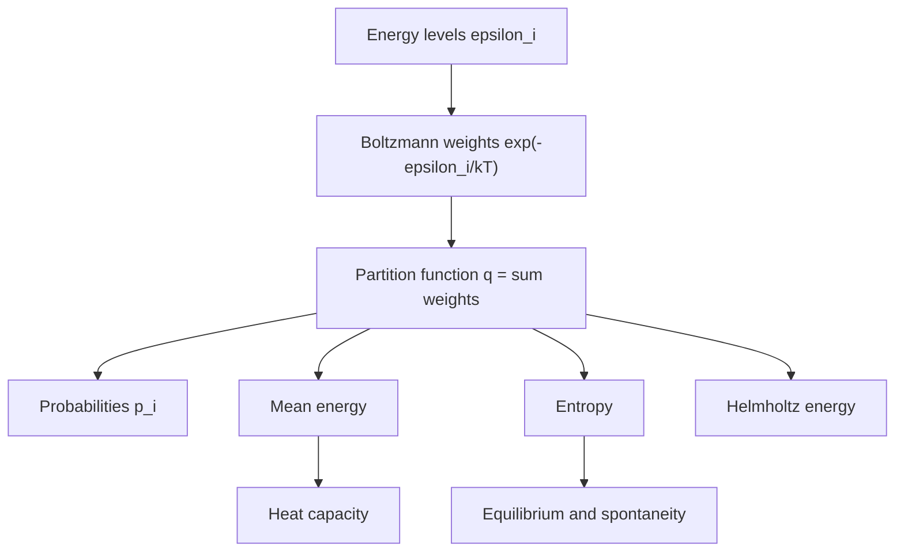

# Boltzmann Distribution and Partition Functions

Statistical thermodynamics explains macroscopic thermodynamic properties from molecular energy levels. Instead of beginning with heat engines or calorimeters, it asks how molecules distribute themselves over quantum states and how many microscopic arrangements correspond to the same observable state.

Atkins introduces the Boltzmann distribution and the molecular partition function as the central tools. Once the partition function is known, thermodynamic functions such as internal energy, entropy, Helmholtz energy, and equilibrium constants can be derived systematically.

## Definitions

A **configuration** specifies how particles are distributed among available molecular states. If level $i$ has energy $\epsilon_i$ and degeneracy $g_i$, the relative population at thermal equilibrium is given by the Boltzmann distribution:

$$
\frac{N_i}{N}
=\frac{g_i e^{-\epsilon_i/kT}}{q}
$$

where the molecular partition function is

$$
q=\sum_i g_i e^{-\epsilon_i/kT}
$$

The factor

$$
\beta=\frac{1}{kT}
$$

is often useful, so

$$
q=\sum_i g_i e^{-\beta\epsilon_i}
$$

The partition function is a weighted count of thermally accessible states. States much higher than $kT$ above the ground state contribute little; degenerate states contribute in proportion to their degeneracy.

For independent distinguishable molecules, the canonical partition function is

$$
Q=q^N
$$

For independent indistinguishable molecules in a gas,

$$
Q=\frac{q^N}{N!}
$$

The factor $1/N!$ corrects overcounting of permutations of identical particles and is essential for extensive entropy.

The Boltzmann entropy formula is

$$
S=k\ln W
$$

where $W$ is the number of microstates. In the canonical ensemble, the Helmholtz energy is

$$
A=-kT\ln Q
$$

## Key results

The probability of state $i$ is

$$
p_i=\frac{g_i e^{-\beta\epsilon_i}}{q}
$$

The mean molecular energy is

$$
\langle\epsilon\rangle
=\sum_i p_i\epsilon_i
=-\left(\frac{\partial\ln q}{\partial\beta}\right)_V
$$

For $N$ independent molecules,

$$
U=U(0)+N\langle\epsilon\rangle
$$

when the zero of energy is separated as $U(0)$ if needed.

The molecular entropy can be written as

$$
S_m=R\ln q+RT\left(\frac{\partial\ln q}{\partial T}\right)_V
$$

for distinguishable localized particles, with modifications for gases through the canonical partition function and the $N!$ correction.

For a two-level system with energies $0$ and $\epsilon$, both nondegenerate,

$$
q=1+e^{-\epsilon/kT}
$$

The upper-state fraction is

$$
p_1=\frac{e^{-\epsilon/kT}}{1+e^{-\epsilon/kT}}
$$

At low temperature, $p_1\to0$; at very high temperature, $p_1\to1/2$. If the upper level has degeneracy $g$, then

$$
q=1+g e^{-\epsilon/kT}
$$

and degeneracy can make the upper-state population important at lower temperatures than expected from energy alone.

The heat capacity follows from how mean energy changes with temperature:

$$
C_V=\left(\frac{\partial U}{\partial T}\right)_V
$$

For a two-level system, $C_V$ rises from zero, reaches a maximum when $kT$ is comparable with the level spacing, and falls again at high temperature. This peak is a Schottky anomaly.

The Boltzmann distribution can be derived by maximizing multiplicity subject to fixed total energy and fixed particle number. The most probable distribution is overwhelmingly more probable than nearby alternatives for macroscopic $N$, which is why equilibrium populations are reproducible. The Lagrange multiplier associated with energy becomes $\beta=1/kT$, connecting statistical counting to thermodynamic temperature. Temperature is therefore not merely average kinetic energy; it is the parameter that controls how rapidly probability decreases with energy.

The partition function deserves its name because it partitions population among states. If only the ground state is thermally accessible, $q$ is close to the ground-state degeneracy and the system has little thermal capacity to absorb energy. As temperature rises, more terms contribute and thermodynamic properties change. The derivative of $\ln q$ with respect to temperature or $\beta$ measures how the population distribution shifts as energy becomes thermally available.

Degeneracy is an entropy effect at the level of individual energy levels. A level with high degeneracy represents many states of the same energy, so its total Boltzmann weight is $g_ie^{-\epsilon_i/kT}$. A moderately higher but highly degenerate level can compete with a lower nondegenerate level. This is important in electronic partition functions of atoms, rotational levels with degeneracy $2J+1$, and spin systems in magnetic fields.

The zero of energy affects $q$ but not observable energy differences if handled consistently. If every energy is shifted by a constant $\epsilon_0$, then

$$
q'=\sum_i e^{-(\epsilon_i+\epsilon_0)/kT}
=e^{-\epsilon_0/kT}q
$$

This changes $A=-kT\ln q$ by $\epsilon_0$, but derivatives that depend on energy differences remain consistent. In chemical equilibrium calculations, zero-point energies and reference electronic energies must be included consistently because different species have different offsets.

The canonical ensemble assumes a system can exchange energy with a reservoir while $N$, $V$, and $T$ are fixed. A single member of the ensemble fluctuates in energy, but the ensemble average is stable. This is why the canonical partition function $Q$ includes all system microstates, not only a fixed-energy shell. The microcanonical, canonical, and grand canonical ensembles differ in constraints, but they give equivalent bulk thermodynamics for large systems when used properly.

The two-level system is a useful miniature model for many phenomena: spin populations in a magnetic field, electronic excitation, conformational two-state equilibria, and heat capacity anomalies. It shows that heat capacity is largest when temperature is comparable to the energy gap. At very low temperature, the excited level is inaccessible. At very high temperature, both levels are already nearly saturated in population, so adding heat changes populations only weakly.

Negative temperatures, discussed in advanced treatments, can occur only in systems with an upper energy bound, such as certain spin populations. They are not colder than zero; they are hotter than any positive temperature because population is inverted toward high energy. This idea is related to laser action, where stimulated emission requires an inversion rather than an ordinary Boltzmann distribution.

The partition-function approach also clarifies why molecular detail matters for macroscopic thermodynamics. Translational states dominate gas entropy, rotational states shape heat capacity, vibrational states contribute at higher temperatures, and electronic degeneracies affect high-temperature atoms and radicals. Physical chemistry repeatedly returns to the same calculation pattern: identify energy levels, build $q$, derive probabilities and thermodynamic functions.

## Visual



| Temperature regime | Boltzmann factor $e^{-\epsilon/kT}$ | Population pattern | Thermodynamic consequence |
|---|---:|---|---|
| $kT\ll\epsilon$ | very small | ground state dominates | low entropy, low heat capacity |
| $kT\approx\epsilon$ | moderate | excited states populated sensitively | heat capacity often large |
| $kT\gg\epsilon$ | near 1 | levels populated by degeneracy | entropy approaches maximum |
| high degeneracy | multiplied by $g$ | degenerate upper states amplified | entropy can favor excitation |

## Worked example 1: Population ratio in a two-level system

**Problem.** A molecule has a nondegenerate excited state $600\ \mathrm{cm^{-1}}$ above a nondegenerate ground state. Find the excited-to-ground population ratio at $300.0\ \mathrm{K}$.

**Method.** Use

$$
\frac{N_1}{N_0}=e^{-\epsilon/kT}
$$

When energy is given as a wavenumber $\tilde\nu$, the dimensionless ratio is

$$
\frac{\epsilon}{kT}=\frac{hc\tilde\nu}{kT}
=\frac{(hc/k)\tilde\nu}{T}
$$

with $hc/k=1.4388\ \mathrm{K\ cm}$.

1. Compute exponent:

$$
\frac{\epsilon}{kT}
=\frac{(1.4388\ \mathrm{K\ cm})(600\ \mathrm{cm^{-1}})}{300.0\ \mathrm{K}}
=2.8776
$$

2. Population ratio:

$$
\frac{N_1}{N_0}=e^{-2.8776}=0.0563
$$

3. Excited fraction:

$$
p_1=\frac{0.0563}{1+0.0563}=0.0533
$$

**Checked answer.** About $5.3\%$ of molecules are excited. Since the gap is almost $3kT$, the excited state is populated but not heavily.

## Worked example 2: Degeneracy in an electronic partition function

**Problem.** An atom has a ground level with degeneracy 2 at $0\ \mathrm{cm^{-1}}$ and an excited level with degeneracy 4 at $500\ \mathrm{cm^{-1}}$. Calculate $q$ and the excited-state fraction at $1000\ \mathrm{K}$.

**Method.** Use

$$
q=g_0+g_1e^{-hc\tilde\nu/kT}
$$

1. Exponent:

$$
\frac{hc\tilde\nu}{kT}
=\frac{(1.4388)(500)}{1000}
=0.7194
$$

2. Boltzmann factor:

$$
e^{-0.7194}=0.4872
$$

3. Partition function:

$$
q=2+4(0.4872)=2+1.9488=3.9488
$$

4. Excited fraction:

$$
p_1=\frac{4(0.4872)}{3.9488}
=0.4935
$$

**Checked answer.** Nearly half the atoms are excited because the excited level has twice the degeneracy of the ground level and the gap is less than $kT$.

## Code

```python
import numpy as np

HC_OVER_K = 1.438776877  # K cm

def partition_wavenumbers(levels_cm, degeneracies, T):
    levels_cm = np.array(levels_cm, dtype=float)
    degeneracies = np.array(degeneracies, dtype=float)
    weights = degeneracies * np.exp(-HC_OVER_K * levels_cm / T)
    q = weights.sum()
    return q, weights / q

levels = [0.0, 500.0]
deg = [2, 4]
for T in [100, 300, 1000, 3000]:
    q, p = partition_wavenumbers(levels, deg, T)
    print(f"T={T:5.0f} K  q={q:8.4f}  populations={p}")
```

## Common pitfalls

- Forgetting degeneracy. A high-energy level with large $g_i$ can matter more than a nondegenerate level at similar energy.
- Using $\mathrm{cm^{-1}}$ directly as joules. Convert through $hc\tilde\nu$ or use $hc/k$ for dimensionless exponents.
- Calling $q$ a probability. It is a weighted sum; probabilities are weights divided by $q$.
- Omitting $1/N!$ for an ideal gas of identical particles when deriving entropy.
- Assuming all states are populated equally. Equal population is approached only when $kT$ is much larger than all relevant spacings.

A reliable workflow is to draw or tabulate the energy levels before writing formulas. Mark the zero of energy, list degeneracies, and estimate $\epsilon_i/kT$ for each level. Terms with $\epsilon_i/kT\gt 10$ usually contribute negligibly unless their degeneracy is enormous; terms with $\epsilon_i/kT\lt 1$ often matter. This quick scale analysis prevents both overcomplicated sums and accidental omission of thermally accessible states.

Be especially careful with spectroscopic units. Atkins often uses wavenumbers because spectroscopy measures them naturally. A wavenumber $\tilde\nu$ is not an energy by itself, but $hc\tilde\nu$ is. For dimensionless Boltzmann factors, the convenient conversion is $(hc/k)\tilde\nu/T$, with $hc/k\approx1.4388\ \mathrm{K\ cm}$. If $\tilde\nu$ is in $\mathrm{cm^{-1}}$, this constant keeps the exponent unitless.

Partition functions also depend on the physical question. A two-level electronic partition function for one atom, a molecular partition function for one gas molecule, and a canonical partition function for $N$ indistinguishable gas molecules are different objects. Using $q$ where $Q$ is required can produce wrong entropy and chemical potential expressions even if population ratios look correct.

## Connections

- [Second law and entropy](/chemistry/physical-chemistry/second-law-and-entropy)
- [Molecular partition functions](/chemistry/physical-chemistry/molecular-partition-functions)
- [Thermodynamic functions from statistics](/chemistry/physical-chemistry/thermodynamic-functions-from-statistics)
- [Multiple integrals](/math/calculus/multiple-integrals)
