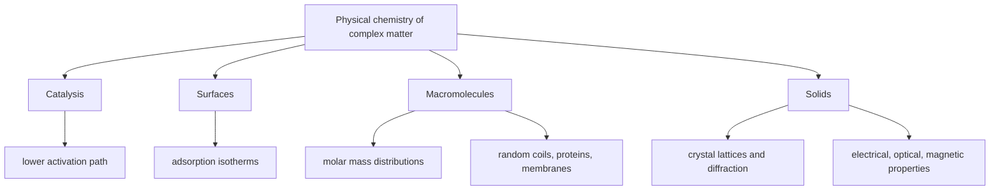

# Catalysis, Surfaces, Macromolecules, and Solids

The final scope of physical chemistry in Atkins moves from isolated molecules to complex matter: catalysts, surfaces, polymers, colloids, biological macromolecules, crystals, semiconductors, magnetic materials, and superconductors. These topics use the same thermodynamics, quantum mechanics, spectroscopy, and kinetics developed earlier, but applied to larger and more heterogeneous systems.

This page combines selected highlights: how catalysts change mechanisms, how adsorption controls surface chemistry, how macromolecular size and shape are measured, and how solid-state structure determines material properties.

## Definitions

A **catalyst** increases the rate of a reaction without being consumed in the overall stoichiometric equation. It changes the mechanism and lowers the effective activation Gibbs energy:

$$
k\propto e^{-\Delta^\ddagger G/RT}
$$

A homogeneous catalyst is in the same phase as reactants; a heterogeneous catalyst is in a different phase, commonly a solid surface.

Adsorption is binding of species to a surface. **Physisorption** is dominated by weak intermolecular forces; **chemisorption** involves stronger chemical bonding.

The Langmuir adsorption isotherm for fractional surface coverage $\theta$ is

$$
\theta=\frac{Kp}{1+Kp}
$$

for gas pressure $p$ and adsorption equilibrium constant $K$.

The Michaelis-Menten enzyme rate law is

$$
v=\frac{V_{\max}[S]}{K_M+[S]}
$$

Macromolecular molar masses may be number-average or mass-average:

$$
\bar M_n=\frac{\sum_i N_iM_i}{\sum_i N_i}
$$

$$
\bar M_w=\frac{\sum_i N_iM_i^2}{\sum_i N_iM_i}
$$

A crystal lattice is generated by translations of a unit cell. Bragg's law for diffraction is

$$
n\lambda=2d\sin\theta
$$

## Key results

Catalysts do not change the thermodynamic equilibrium constant:

$$
K=e^{-\Delta_rG^\circ/RT}
$$

because they do not change $\Delta_rG^\circ$ for the overall reaction. They accelerate forward and reverse reactions in a way consistent with the same equilibrium.

For Langmuir adsorption, low pressure gives

$$
\theta\approx Kp
$$

and high pressure gives saturation:

$$
\theta\to1
$$

If a surface reaction requires one adsorbed species, the rate may be proportional to $\theta$. If it requires two adsorbed species, the pressure dependence can be more complex because adsorption sites become limiting.

For enzyme kinetics, the limiting regimes are:

$$
[S]\ll K_M:
\qquad
v\approx \frac{V_{\max}}{K_M}[S]
$$

and

$$
[S]\gg K_M:
\qquad
v\approx V_{\max}
$$

Macromolecules behave as distributions, not single molar masses. The ratio

$$
\frac{\bar M_w}{\bar M_n}
$$

is a measure of dispersity and is at least 1.

In solids, structure determines properties. Metallic bonding gives bands with partially filled states; semiconductors have band gaps; ionic solids balance lattice energy and electrostatics; molecular solids depend on intermolecular forces. Diffraction measures periodic structure through reciprocal relationships between wavelength, spacing, and angle.

Surface electrochemistry and corrosion are coupled redox and transport problems. Fuel cells exploit controlled electrode reactions, while corrosion is unwanted galvanic chemistry distributed across a material surface.

Catalysis is kinetic, not thermodynamic. A catalyst supplies an alternative pathway with a lower activation Gibbs energy or a more favorable sequence of elementary steps. Because the catalyst is regenerated, it appears in the mechanism but not in the net reaction. The forward and reverse reactions are both accelerated, so equilibrium is reached faster but not shifted. Any claim that a catalyst increases equilibrium yield without changing conditions should be treated as a warning sign.

Homogeneous catalysis often works through coordination, acid-base activation, redox cycling, or organometallic insertion and elimination steps. The catalyst can stabilize charged transition states, hold reactants near one another, or provide a sequence of smaller barriers. Rate laws can include catalyst concentration, substrate saturation, or inhibition by products. Mechanistic analysis resembles ordinary kinetics but with catalyst resting states and turnover cycles.

Heterogeneous catalysis adds adsorption and surface structure. Reactants must reach the surface, adsorb, diffuse or reorient, react, and desorb. If adsorption is too weak, coverage is low; if too strong, products or intermediates poison the surface. Good catalysts often bind intermediates with intermediate strength, a principle related to volcano plots in catalysis. Surface defects, steps, particle size, and support materials can all change activity.

The Langmuir isotherm assumes identical independent sites and no lateral interactions. Real surfaces can be heterogeneous, multilayer adsorption can occur, and adsorbates can attract or repel one another. The BET isotherm extends adsorption ideas to multilayers and surface area measurements. Temperature-programmed desorption, surface spectroscopy, microscopy, and diffraction provide experimental probes of surface coverage and structure.

Enzymes combine catalysis with macromolecular structure. Active sites create specific microenvironments, bind substrates selectively, stabilize transition states, and couple conformational changes to chemistry. Michaelis-Menten kinetics is the entry model, but real enzymes can show cooperativity, allostery, product inhibition, pH dependence, and multiple substrates. Physical chemistry contributes by measuring rates, binding, activation parameters, and conformational dynamics.

Macromolecules require statistical descriptions because samples contain distributions of chain lengths and conformations. A random coil is not a single shape but an ensemble. The radius of gyration, end-to-end distance, viscosity, sedimentation, electrophoretic mobility, and light scattering all provide different averages. Protein and nucleic acid stability depend on a balance of conformational entropy, hydrogen bonding, hydrophobic effects, electrostatics, and solvent interactions.

Self-assembly occurs when noncovalent interactions and entropy favor organized aggregates. Micelles, bilayers, vesicles, colloids, and self-assembled monolayers form because amphiphilic or surface-active molecules reduce unfavorable contacts. The critical micelle concentration marks the onset of aggregate formation. Biological membranes are soft-matter structures whose phase behavior affects permeability, protein function, and cell organization.

Crystalline solids are described by lattices plus bases. Diffraction measures reciprocal-space information about periodic electron or nuclear density. Bragg's law is the simplest expression, but full structure determination uses intensities, systematic absences, Fourier maps, and refinement. X-ray diffraction is sensitive to electron density; neutron diffraction is sensitive to nuclei and magnetic structure; electron diffraction is useful for thin samples and surfaces.

Electronic properties of solids follow from bands. Metals have partially filled bands or overlapping valence and conduction bands. Semiconductors have band gaps small enough for thermal or optical excitation to create carriers. Insulators have larger gaps. Doping introduces controlled carrier concentrations, while defects and surfaces can dominate real material behavior. Optical, magnetic, and superconducting properties all require quantum mechanics extended from molecules to periodic systems.

## Visual



| Topic | Core model | Key measurable |
|---|---|---|
| Homogeneous catalysis | altered solution mechanism | rate law, activation parameters |
| Heterogeneous catalysis | adsorption plus surface reaction | coverage, turnover frequency |
| Enzymes | Michaelis-Menten scheme | $V_{\max}$, $K_M$ |
| Polymers | molar mass distribution and conformation | $\bar M_n$, $\bar M_w$, radius of gyration |
| Colloids/micelles | self-assembly | critical micelle concentration |
| Crystals | lattice and basis | diffraction pattern, unit cell |
| Semiconductors | electronic bands | band gap, conductivity |

## Worked example 1: Langmuir coverage and surface rate

**Problem.** A gas adsorbs on a catalyst with $K=0.80\ \mathrm{bar^{-1}}$. Calculate $\theta$ at $p=0.50\ \mathrm{bar}$ and $p=10.0\ \mathrm{bar}$. If the surface reaction rate is $r=k\theta$ with $k=2.0\times10^{-3}\ \mathrm{mol\ m^{-2}\ s^{-1}}$, find $r$ at both pressures.

**Method.** Use

$$
\theta=\frac{Kp}{1+Kp}
$$

1. At $0.50\ \mathrm{bar}$:

$$
Kp=(0.80)(0.50)=0.40
$$

$$
\theta=\frac{0.40}{1.40}=0.286
$$

2. Rate:

$$
r=(2.0\times10^{-3})(0.286)
=5.72\times10^{-4}\ \mathrm{mol\ m^{-2}\ s^{-1}}
$$

3. At $10.0\ \mathrm{bar}$:

$$
Kp=(0.80)(10.0)=8.0
$$

$$
\theta=\frac{8.0}{9.0}=0.889
$$

4. Rate:

$$
r=(2.0\times10^{-3})(0.889)
=1.78\times10^{-3}\ \mathrm{mol\ m^{-2}\ s^{-1}}
$$

**Checked answer.** Raising pressure increases coverage, but saturation prevents a twentyfold pressure increase from giving a twentyfold rate increase.

## Worked example 2: Bragg spacing from diffraction

**Problem.** X-rays with wavelength $154\ \mathrm{pm}$ give a first-order diffraction peak at $\theta=20.0^\circ$. Find the plane spacing $d$.

**Method.** Use Bragg's law:

$$
n\lambda=2d\sin\theta
$$

with $n=1$.

1. Rearrange:

$$
d=\frac{\lambda}{2\sin\theta}
$$

2. Substitute:

$$
d=\frac{154\ \mathrm{pm}}{2\sin20.0^\circ}
$$

3. Evaluate sine:

$$
\sin20.0^\circ=0.3420
$$

4. Calculate:

$$
d=\frac{154}{0.6840}=225\ \mathrm{pm}
$$

**Checked answer.** A spacing of $225\ \mathrm{pm}$ is chemically reasonable for crystal lattice planes separated by atomic-scale distances.

## Code

```python
import numpy as np

def langmuir_theta(K, p):
    return K * p / (1 + K * p)

def bragg_spacing(lambda_pm, theta_deg, order=1):
    theta = np.deg2rad(theta_deg)
    return order * lambda_pm / (2 * np.sin(theta))

for p in [0.1, 0.5, 1.0, 10.0]:
    theta = langmuir_theta(0.80, p)
    print(f"p={p:5.2f} bar theta={theta:6.3f}")

print("d spacing pm:", bragg_spacing(154.0, 20.0))
```

## Common pitfalls

- Saying a catalyst changes equilibrium. It changes rates and pathways, not the equilibrium constant of the overall reaction.
- Treating Langmuir adsorption as universal. It assumes identical independent sites and monolayer coverage.
- Interpreting $K_M$ as always equal to a binding dissociation constant. That is only true under specific kinetic limits.
- Reporting a polymer sample with a single molar mass when it is distributed.
- Forgetting that diffraction angles use $\theta$, while instruments often report $2\theta$.

For catalysis problems, start by separating thermodynamics from mechanism. Compute or reason about $\Delta_rG$ to know the equilibrium tendency, then analyze the catalytic cycle to understand rate. A catalyst may change which elementary step is rate limiting as conditions change. It may also be inhibited or poisoned, so the active catalyst concentration can be far smaller than the analytical amount added. These details are why catalytic rate laws often contain saturation or inhibition terms rather than simple first-order catalyst dependence.

For adsorption, always state the site model. Langmuir behavior assumes one molecule per site, identical sites, independent adsorption, and no multilayers. If coverage changes the heat of adsorption, or if molecules dissociate on adsorption, the algebra changes. Surface reactions can also follow Langmuir-Hinshelwood mechanisms, where two adsorbed species react, or Eley-Rideal mechanisms, where a gas-phase species reacts with an adsorbed species. The pressure dependence is different in each case.

For materials and macromolecules, remember that structure is hierarchical. A polymer has repeat-unit chemistry, chain length distribution, conformation, morphology, and bulk processing history. A solid has local bonding, unit-cell structure, defects, surfaces, and grain boundaries. Physical properties often depend on the hierarchy level that controls the measurement. A diffraction pattern may show crystal structure while conductivity is dominated by defects or dopants.

## Connections

- [Rate laws and reaction mechanisms](/chemistry/physical-chemistry/rate-laws-and-reaction-mechanisms)
- [Temperature dependence and reaction dynamics](/chemistry/physical-chemistry/temperature-dependence-and-reaction-dynamics)
- [Phase transitions and phase diagrams](/chemistry/physical-chemistry/phase-transitions-and-phase-diagrams)
- [Electrochemistry](/chemistry/physical-chemistry/electrochemistry)
