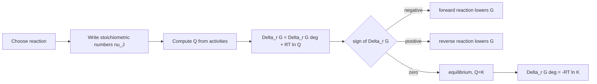

# Chemical Equilibrium

Chemical equilibrium is a thermodynamic condition, not a statement that reactions have stopped. Forward and reverse elementary events may continue, but the macroscopic composition has no further tendency to change because the Gibbs energy is at a minimum under the imposed conditions.

Atkins frames equilibrium through the reaction Gibbs energy and the extent of reaction. This approach unifies gas-phase equilibria, solution equilibria, biological coupling, and electrochemical cells: the same $\Delta_rG$ decides direction, and $\Delta_rG=0$ defines equilibrium.

## Definitions

For a reaction

$$
\mathrm{\nu_A A+\nu_B B \rightleftharpoons \nu_C C+\nu_D D}
$$

it is convenient to use stoichiometric numbers $\nu_J$ that are negative for reactants and positive for products. The extent of reaction $\xi$ relates changes in amount to stoichiometry:

$$
dn_J=\nu_J\,d\xi
$$

The reaction Gibbs energy is

$$
\Delta_rG
=\left(\frac{\partial G}{\partial \xi}\right)_{T,p}
=\sum_J \nu_J\mu_J
$$

At equilibrium,

$$
\Delta_rG=0
$$

For ideal gases or ideal solutes written in terms of activities,

$$
\Delta_rG=\Delta_rG^\circ+RT\ln Q
$$

where the reaction quotient is

$$
Q=\prod_J a_J^{\nu_J}
$$

At equilibrium, $Q=K$, so

$$
\Delta_rG^\circ=-RT\ln K
$$

The standard reaction Gibbs energy is computed from formation Gibbs energies:

$$
\Delta_rG^\circ=\sum_J \nu_J\Delta_fG^\circ(J)
$$

## Key results

The sign of $\Delta_rG$ gives direction at the current composition:

$$
\Delta_rG<0\quad \mathrm{forward\ spontaneous}
$$

$$
\Delta_rG>0\quad \mathrm{reverse\ spontaneous}
$$

$$
\Delta_rG=0\quad \mathrm{equilibrium}
$$

The equilibrium constant is controlled by standard Gibbs energy:

$$
K=e^{-\Delta_rG^\circ/RT}
$$

If $\Delta_rG^\circ\lt 0$, then $K\gt 1$ and products are favored under standard-state comparison. If $\Delta_rG^\circ\gt 0$, then $K\lt 1$ and reactants are favored.

Temperature dependence follows from the van't Hoff equation:

$$
\frac{d\ln K}{dT}
=\frac{\Delta_rH^\circ}{RT^2}
$$

If $\Delta_rH^\circ$ is approximately constant,

$$
\ln\frac{K_2}{K_1}
=-\frac{\Delta_rH^\circ}{R}
\left(\frac{1}{T_2}-\frac{1}{T_1}\right)
$$

This shows that endothermic reactions have increasing $K$ with increasing $T$, while exothermic reactions have decreasing $K$ with increasing $T$.

Pressure effects enter through activities or partial pressures. For a perfect-gas reaction, increasing pressure favors the side with fewer moles of gas when the reaction changes total gas amount:

$$
\Delta\nu_{\mathrm{gas}}=\sum_{\mathrm{gas}}\nu_J
$$

The thermodynamic statement is not "pressure shifts equilibrium" by itself; it is that pressure changes the reaction quotient $Q$ and therefore changes $\Delta_rG$ until $Q=K$ again.

Coupled reactions add Gibbs energies. If reaction 1 is unfavorable but reaction 2 is strongly favorable, their sum can proceed when

$$
\Delta_rG_{\mathrm{net}}
=\Delta_rG_1+\Delta_rG_2<0
$$

This is the thermodynamic basis of metabolic coupling.

The reaction Gibbs energy is best visualized as the slope of $G$ with respect to extent of reaction. If the slope is negative, advancing the reaction lowers $G$; if positive, reversing it lowers $G$. Equilibrium is the minimum where the slope is zero. This picture is more general than any particular expression for $Q$ because it only requires that the system be at fixed temperature and pressure and that composition changes be described by stoichiometry.

Activities make the equilibrium expression dimensionless. For a gas, $a_J$ may be approximated by $p_J/p^\circ$ at low pressure. For a solute, it may be approximated by $c_J/c^\circ$ or $b_J/b^\circ$ in ideal dilute solution. These ratios are dimensionless even if chemists casually write concentrations or pressures inside $K$. A rigorous equilibrium constant is dimensionless and depends on the chosen standard states.

The standard Gibbs energy does not tell the whole story of direction unless the system is in its standard state. A reaction with positive $\Delta_rG^\circ$ can proceed forward if $Q$ is sufficiently small. Conversely, a reaction with negative $\Delta_rG^\circ$ can be forced backward if products are accumulated enough to make $Q$ large. This is why removing a product can drive a reaction forward and why biological systems can use concentration ratios to control pathways.

Le Chatelier's principle is a qualitative summary of the quantitative condition $Q=K$. If pressure, temperature, or composition changes, the reaction quotient or equilibrium constant changes. The system then responds in the direction that restores $\Delta_rG=0$. Composition and pressure changes usually change $Q$ immediately. Temperature changes change $K$ itself through the van't Hoff relation because the relative standard chemical potentials of reactants and products change with temperature.

For gas reactions, total pressure effects depend on $\Delta\nu_{\mathrm{gas}}$. If the total pressure is increased by compression at fixed composition, the reaction quotient changes by a factor involving pressure raised to $\Delta\nu_{\mathrm{gas}}$. Reactions that reduce gas mole number are favored by higher pressure, but only when gases participate and the assumptions behind the pressure expression are valid. Adding an inert gas at constant volume does not change partial pressures of reacting ideal gases, so it need not shift equilibrium, whereas adding it at constant pressure changes volumes and partial pressures.

Temperature effects are governed by reaction enthalpy, not by mole count. The van't Hoff equation shows that an endothermic reaction has $d\ln K/dT\gt 0$ and an exothermic reaction has $d\ln K/dT\lt 0$, assuming the sign convention that $\Delta_rH^\circ$ is positive for heat absorption. This result gives the thermodynamic basis for treating heat as if it were a reactant or product in elementary Le Chatelier language, but the equation is the safer guide.

Equilibrium and kinetics must be separated. A large equilibrium constant says products are favored at equilibrium, not that equilibrium is reached quickly. Diamond is thermodynamically metastable relative to graphite under ordinary conditions but persists because the kinetic barrier is large. Ammonia synthesis is thermodynamically favored by low temperature and high pressure, but low temperature slows the rate; industrial conditions compromise equilibrium yield, rate, and catalyst performance.

Coupled reactions are central in biochemistry and electrochemistry. If an unfavorable reaction is mechanistically linked to a favorable one, the combined stoichiometric equation has a total $\Delta_rG$ equal to the sum. ATP hydrolysis, ion gradients, and redox chains all exploit this additivity. The coupling must be physical or mechanistic; merely writing two equations on paper does not make one drive the other.

## Visual



| Quantity | Meaning | Depends on current composition? | At equilibrium |
|---|---|---:|---|
| $Q$ | reaction quotient | yes | $Q=K$ |
| $K$ | equilibrium constant | no, fixed by $T$ for a specified standard state | equals $Q$ |
| $\Delta_rG$ | slope of $G$ vs extent | yes | $0$ |
| $\Delta_rG^\circ$ | standard-state reaction Gibbs energy | no, at fixed $T$ | $-RT\ln K$ |
| $\Delta_rH^\circ$ | standard reaction enthalpy | weakly, through $T$ | controls $d\ln K/dT$ |

## Worked example 1: Equilibrium constant from standard Gibbs energy

**Problem.** For a reaction at $298.15\ \mathrm{K}$, $\Delta_rG^\circ=+12.0\ \mathrm{kJ\ mol^{-1}}$. Calculate $K$.

**Method.** Use $K=e^{-\Delta_rG^\circ/RT}$.

1. Convert:

$$
\Delta_rG^\circ=12000\ \mathrm{J\ mol^{-1}}
$$

2. Compute exponent:

$$
-\frac{\Delta_rG^\circ}{RT}
=-\frac{12000}{(8.314)(298.15)}
=-\frac{12000}{2478.8}
=-4.841
$$

3. Exponentiate:

$$
K=e^{-4.841}=7.90\times10^{-3}
$$

**Checked answer.** Since $\Delta_rG^\circ\gt 0$, $K\lt 1$. The reaction is reactant-favored under standard conditions.

## Worked example 2: Direction from reaction quotient

**Problem.** Consider

$$
\mathrm{N_2(g)+3H_2(g)\rightleftharpoons 2NH_3(g)}
$$

At a certain temperature, $K=0.500$. A mixture has $p_{\mathrm{N_2}}=2.00\ \mathrm{bar}$, $p_{\mathrm{H_2}}=3.00\ \mathrm{bar}$, and $p_{\mathrm{NH_3}}=1.00\ \mathrm{bar}$. Determine the direction of spontaneous change assuming ideal gases and standard pressure $1\ \mathrm{bar}$.

**Method.** Compute

$$
Q=\frac{(p_{\mathrm{NH_3}}/p^\circ)^2}
{(p_{\mathrm{N_2}}/p^\circ)(p_{\mathrm{H_2}}/p^\circ)^3}
$$

1. Since pressures are in bar relative to $1\ \mathrm{bar}$:

$$
Q=\frac{(1.00)^2}{(2.00)(3.00)^3}
$$

2. Denominator:

$$
(2.00)(27.0)=54.0
$$

3. Quotient:

$$
Q=\frac{1.00}{54.0}=0.0185
$$

4. Compare:

$$
Q<K
$$

5. Therefore:

$$
\Delta_rG=RT\ln(Q/K)<0
$$

**Checked answer.** The forward reaction is spontaneous because the mixture has too little ammonia relative to the equilibrium composition.

## Code

```python
import math

R = 8.314462618

def K_from_delta_g(delta_g_kj, T=298.15):
    return math.exp(-delta_g_kj * 1000.0 / (R * T))

def delta_g_from_QK(Q, K, T=298.15):
    return R * T * math.log(Q / K) / 1000.0

K = K_from_delta_g(12.0)
print("K =", K)

Q = 1.0**2 / (2.0 * 3.0**3)
print("Q =", Q)
print("Delta_r G at mixture (kJ/mol) =", delta_g_from_QK(Q, 0.500))
```

## Common pitfalls

- Confusing $Q$ and $K$. $Q$ is calculated from the current mixture; $K$ is the equilibrium value at that temperature.
- Including pure solids or pure liquids in $Q$ as concentration terms. Their activities are normally 1 in their standard states.
- Forgetting stoichiometric exponents in $Q$.
- Treating $K$ as changing when pressure changes at fixed temperature. Pressure changes $Q$; $K$ changes with temperature.
- Using $\Delta_rG^\circ$ to decide direction for a nonstandard mixture. Use $\Delta_rG=\Delta_rG^\circ+RT\ln Q$.

For any equilibrium calculation, write the balanced reaction first and keep that exact stoichiometric convention throughout. If the reaction is doubled, $\Delta_rG^\circ$ doubles and the powers in $Q$ double, so the numerical equilibrium constant becomes $K^2$. The physical equilibrium composition is unchanged, but the reported $K$ depends on the written reaction. This is not a contradiction; it is a consequence of defining $K$ for a specific stoichiometric equation.

Next, decide which activities can be approximated. Pure solids and pure liquids usually have activity 1, gases may use $p/p^\circ$ at low pressure, and dilute solutes may use $c/c^\circ$ or $b/b^\circ$. Concentrated electrolytes, high-pressure gases, and nonideal mixtures require activity or fugacity corrections. Many classroom errors come from putting dimensional concentrations into logarithms; the rigorous object is always dimensionless.

Finally, distinguish a shift in equilibrium composition from a change in equilibrium constant. Adding reactant changes $Q$ immediately, so the reaction proceeds until $Q$ again equals the same $K$. Heating changes $K$ because it changes the standard chemical potentials. A catalyst changes neither $Q$ nor $K$ directly; it changes the rate at which the system approaches equilibrium.

For numerical equilibrium problems, do not round intermediate composition variables too early. Equilibrium constants can be very sensitive when small differences of large amounts determine a residual concentration. Keep extra digits through the ICE-table or extent calculation, then round the final physically meaningful quantity.

## Connections

- [Free energy and chemical potential](/chemistry/physical-chemistry/free-energy-and-chemical-potential)
- [Mixtures, solutions, and activities](/chemistry/physical-chemistry/mixtures-solutions-and-activities)
- [Electrochemistry](/chemistry/physical-chemistry/electrochemistry)
- [General chemistry equilibrium](/chemistry/general/)
