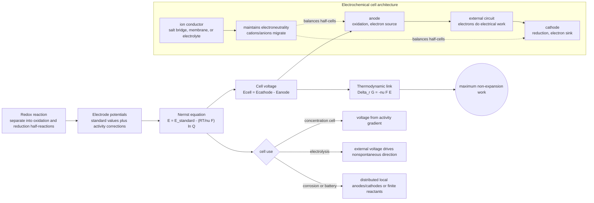

# Electrochemistry

Electrochemistry turns chemical potential differences into electrical work. When a redox reaction is split into two half-reactions connected by an external circuit, electrons can flow through a wire instead of being transferred directly in solution.

Atkins places equilibrium electrochemistry with chemical equilibrium because the cell potential is a direct measurement of reaction Gibbs energy. The Nernst equation, standard potentials, electrolyte activity, Debye-Huckel theory, fuel cells, corrosion, and biological redox chemistry all follow from this connection.


*Figure: Galvanic cell linking cell potential to reaction Gibbs energy. Image: [Wikimedia Commons](https://commons.wikimedia.org/wiki/File:Galvanic_Cell.svg), Gringer, CC BY-SA 3.0/GFDL.*

## Definitions

An **electrode** is a phase boundary where electronic and ionic charge transfer can be coupled. A **half-reaction** is an oxidation or reduction written for one electrode. A **galvanic cell** produces electrical work from a spontaneous reaction. An **electrolytic cell** uses electrical work to drive a nonspontaneous reaction.

The cell potential is

$$
E=E_{\mathrm{right}}-E_{\mathrm{left}}
$$

under the convention that reduction potentials are tabulated. The reaction Gibbs energy and cell potential are related by

$$
\Delta_rG=-\nu F E
$$

where $\nu$ is the number of electrons transferred per reaction as written and $F$ is Faraday's constant:

$$
F=96485\ \mathrm{C\ mol^{-1}}
$$

Under standard conditions,

$$
\Delta_rG^\circ=-\nu F E^\circ
$$

Combining this with $\Delta_rG=\Delta_rG^\circ+RT\ln Q$ gives the Nernst equation:

$$
E=E^\circ-\frac{RT}{\nu F}\ln Q
$$

At $298.15\ \mathrm{K}$,

$$
E=E^\circ-\frac{0.05916\ \mathrm{V}}{\nu}\log_{10}Q
$$

The equilibrium constant is linked to standard potential by

$$
\ln K=\frac{\nu F E^\circ}{RT}
$$

## Key results

Cell notation separates phase boundaries with vertical lines and salt bridges with double lines:

$$
\mathrm{Zn(s)|Zn^{2+}(aq)||Cu^{2+}(aq)|Cu(s)}
$$

For the Daniell cell,

$$
\mathrm{Zn(s)+Cu^{2+}(aq)\to Zn^{2+}(aq)+Cu(s)}
$$

the reaction quotient is

$$
Q=\frac{a_{\mathrm{Zn^{2+}}}}{a_{\mathrm{Cu^{2+}}}}
$$

and

$$
E=E^\circ-\frac{RT}{2F}\ln\frac{a_{\mathrm{Zn^{2+}}}}{a_{\mathrm{Cu^{2+}}}}
$$

Electrolyte solutions require activities because ionic interactions are strong even at modest concentrations. The ionic strength is

$$
I=\frac{1}{2}\sum_i c_i z_i^2
$$

and the Debye-Huckel limiting law for mean activity coefficients is

$$
\log_{10}\gamma_\pm=-A|z_+z_-|I^{1/2}
$$

The physical model is an ionic atmosphere: ions of opposite charge are statistically more likely nearby, lowering the chemical potential relative to an ideal solution.

For concentration cells, the standard potential may be zero, but a potential arises from different activities:

$$
E=-\frac{RT}{\nu F}\ln Q
$$

This is the electrochemical form of diffusion down a chemical-potential gradient.

The sign convention in electrochemistry is a frequent source of errors. A galvanic cell has $E\gt 0$ for the reaction as written when it can deliver electrical work spontaneously. Because

$$
\Delta_rG=-\nu FE
$$

a positive cell potential corresponds to a negative reaction Gibbs energy. If the reaction is reversed, both $\Delta_rG$ and $E$ change sign. Multiplying a half-reaction by a stoichiometric factor does not multiply its electrode potential; potentials are intensive. It does multiply the electron count used in $\Delta_rG=-\nu FE$.

Electrode potentials are not absolute in ordinary measurements. A cell voltage is a difference between two electrode potentials. The standard hydrogen electrode is assigned zero by convention, allowing other standard reduction potentials to be tabulated. This convention is analogous to choosing zero formation enthalpy for elements in reference states: it creates a consistent scale for differences.

The Nernst equation is just the equilibrium expression in electrical form. Starting from

$$
\Delta_rG=\Delta_rG^\circ+RT\ln Q
$$

and substituting $\Delta_rG=-\nu FE$ gives

$$
E=E^\circ-\frac{RT}{\nu F}\ln Q
$$

At equilibrium, no net electrical work can be obtained, so $E=0$ and $Q=K$. This gives

$$
E^\circ=\frac{RT}{\nu F}\ln K
$$

which is why a voltage measurement can determine an equilibrium constant.

Activities matter strongly for electrochemical precision. Ionic solutions are not ideal because each ion is surrounded by an ionic atmosphere of opposite net charge. The chemical potential of an ion in solution is therefore not determined by concentration alone. Mean ionic activity coefficients are used because single-ion activities cannot be measured independently without extra conventions. This limitation is not experimental clumsiness; it follows from electroneutrality and the fact that macroscopic thermodynamics measures neutral combinations.

Different cell types highlight different thermodynamic information. A concentration cell has the same electrodes and same standard potentials on both sides, so $E^\circ=0$. Its voltage arises entirely from activity differences. Such cells demonstrate that a chemical-potential gradient can be converted into electrical work. Fuel cells, in contrast, maintain reactant supply and product removal so that a redox reaction can continue delivering work. Batteries store finite chemical compositions and their voltage changes as $Q$ changes during discharge.

Corrosion is electrochemistry distributed over a surface. Some regions act as anodes where metal is oxidized; other regions act as cathodes where reduction occurs, often involving oxygen. Water, salts, oxide films, and mechanical stress can all alter local potentials and transport. Protection strategies such as sacrificial anodes work by making a more easily oxidized metal serve as the anode, preserving the structural metal as the cathode.

Electrolysis reverses the galvanic direction by applying an external potential. The thermodynamic minimum voltage comes from $\Delta_rG$, but practical electrolysis also requires overpotentials associated with slow electrode kinetics, concentration gradients, and resistance. Therefore, observing that a process is thermodynamically possible at a certain voltage does not guarantee an efficient cell at that voltage.

Biochemical redox chains use the same principles with different notation. Electrons move from donors with lower reduction potential to acceptors with higher reduction potential, producing negative $\Delta_rG$ for the coupled process. The released free energy can pump protons, build ion gradients, or drive ATP synthesis. The electrochemical potential of an ion combines concentration and electrical potential terms, making membranes natural electrochemical devices.

## Visual



This physical-electrochemistry diagram links cell architecture to thermodynamics. The half-cell subgraph shows electron flow through the external circuit and ion migration through the electrolyte, while the Nernst and free-energy nodes show how activities and reaction quotient determine voltage. The cell-use branch distinguishes concentration cells, electrolysis, corrosion, and batteries as different uses of the same electrochemical contract.

| Quantity | Formula | Interpretation |
|---|---:|---|
| Electrical work maximum | $w_{\mathrm{elec,max}}=\Delta_rG$ | reversible non-expansion work from cell |
| Cell Gibbs relation | $\Delta_rG=-\nu FE$ | positive $E$ means spontaneous galvanic reaction |
| Standard relation | $\Delta_rG^\circ=-\nu FE^\circ$ | standard cell potential from thermodynamic data |
| Nernst equation | $E=E^\circ-(RT/\nu F)\ln Q$ | composition dependence of potential |
| Equilibrium | $E=0$, $Q=K$ | no net cell work available |

## Worked example 1: Cell potential from activities

**Problem.** For

$$
\mathrm{Zn(s)+Cu^{2+}(aq)\to Zn^{2+}(aq)+Cu(s)}
$$

take $E^\circ=1.100\ \mathrm{V}$ at $298.15\ \mathrm{K}$. Estimate $E$ when $a_{\mathrm{Zn^{2+}}}=0.100$ and $a_{\mathrm{Cu^{2+}}}=1.00\times10^{-3}$.

**Method.** Use the Nernst equation with $\nu=2$:

$$
Q=\frac{a_{\mathrm{Zn^{2+}}}}{a_{\mathrm{Cu^{2+}}}}
$$

1. Reaction quotient:

$$
Q=\frac{0.100}{1.00\times10^{-3}}=100
$$

2. Log form:

$$
E=1.100-\frac{0.05916}{2}\log_{10}(100)
$$

3. Since $\log_{10}(100)=2$:

$$
E=1.100-(0.02958)(2)
$$

4. Calculate:

$$
E=1.041\ \mathrm{V}
$$

**Checked answer.** Product ion $\mathrm{Zn^{2+}}$ is high and reactant ion $\mathrm{Cu^{2+}}$ is low, so the reaction is less strongly driven than under standard conditions; $E$ decreases.

## Worked example 2: Equilibrium constant from standard cell potential

**Problem.** A redox reaction transfers $\nu=2$ electrons and has $E^\circ=0.340\ \mathrm{V}$ at $298.15\ \mathrm{K}$. Calculate $K$.

**Method.** Use

$$
\ln K=\frac{\nu F E^\circ}{RT}
$$

1. Numerator:

$$
\nu F E^\circ=(2)(96485)(0.340)=65610\ \mathrm{J\ mol^{-1}}
$$

2. Denominator:

$$
RT=(8.314)(298.15)=2478.8\ \mathrm{J\ mol^{-1}}
$$

3. Natural logarithm:

$$
\ln K=\frac{65610}{2478.8}=26.47
$$

4. Convert:

$$
K=e^{26.47}=3.12\times10^{11}
$$

**Checked answer.** A positive standard potential of a few tenths of a volt can correspond to a very large equilibrium constant because electrical work per mole of reaction is multiplied by Faraday's constant.

## Code

```python
import math

R = 8.314462618
F = 96485.33212
T = 298.15

def nernst(E0, n, Q, T=298.15):
    return E0 - (R * T / (n * F)) * math.log(Q)

def K_from_E0(E0, n, T=298.15):
    return math.exp(n * F * E0 / (R * T))

Q = 0.100 / 1.0e-3
print("Daniell cell E:", nernst(1.100, 2, Q, T))
print("K:", K_from_E0(0.340, 2, T))
```

## Common pitfalls

- Reversing an electrode without changing the sign of its potential contribution.
- Forgetting that tabulated values are reduction potentials.
- Using concentrations in the Nernst equation when activities are needed for accurate work.
- Including pure solids or liquids in $Q$.
- Treating $E^\circ$ as dependent on concentration. Standard potential is fixed at a given temperature for the specified reaction and standard states.

A disciplined electrochemistry calculation begins with the net cell reaction. Balance atoms, charge, and electrons; identify $\nu$ for the reaction exactly as written; then construct $Q$. Only after that should standard reduction potentials be combined. This order prevents the common mistake of mixing a potential for one electron convention with a reaction quotient for another stoichiometric convention.

Remember that voltage is energy per charge. Multiplying a half-reaction by 2 doubles $\Delta G^\circ$ and doubles the charge transferred, so $E^\circ$ is unchanged. This is why standard potentials are not multiplied by stoichiometric coefficients when combining half-reactions, even though Gibbs energies are. If in doubt, convert potentials to $\Delta G^\circ$, add thermodynamic quantities, then convert back to $E^\circ$.

For real cells, the measured voltage can differ from the reversible Nernst voltage because of overpotential and resistance. Activation overpotential comes from slow charge transfer, concentration overpotential from mass-transport gradients, and ohmic loss from internal resistance. Thermodynamics gives the reversible limit; electrode kinetics and transport determine practical performance.

Cell diagrams also encode direction. By convention, oxidation is written on the left and reduction on the right for a galvanic cell as written. If the calculated $E$ is negative, the spontaneous cell reaction is the reverse of the one represented. Salt bridges and porous membranes are not decorative; they maintain electroneutrality while limiting direct mixing of reactants. Without ionic conduction, electron flow would rapidly build charge separation and stop.

For pH-dependent half-reactions, include $\mathrm{H^+}$ or $\mathrm{OH^-}$ activities in $Q$. Potential-pH diagrams and biochemical standard potentials are just Nernst reasoning with these conventions made explicit.

Temperature changes affect both the Nernst slope and the standard potential, so the convenient $0.05916\ \mathrm{V}$ factor is only for $298.15\ \mathrm{K}$.

## Connections

- [Chemical equilibrium](/chemistry/physical-chemistry/chemical-equilibrium)
- [Mixtures, solutions, and activities](/chemistry/physical-chemistry/mixtures-solutions-and-activities)
- [Catalysis, surfaces, macromolecules, and solids](/chemistry/physical-chemistry/catalysis-surfaces-macromolecules-and-solids)
- [General chemistry electrochemistry](/chemistry/general/)
