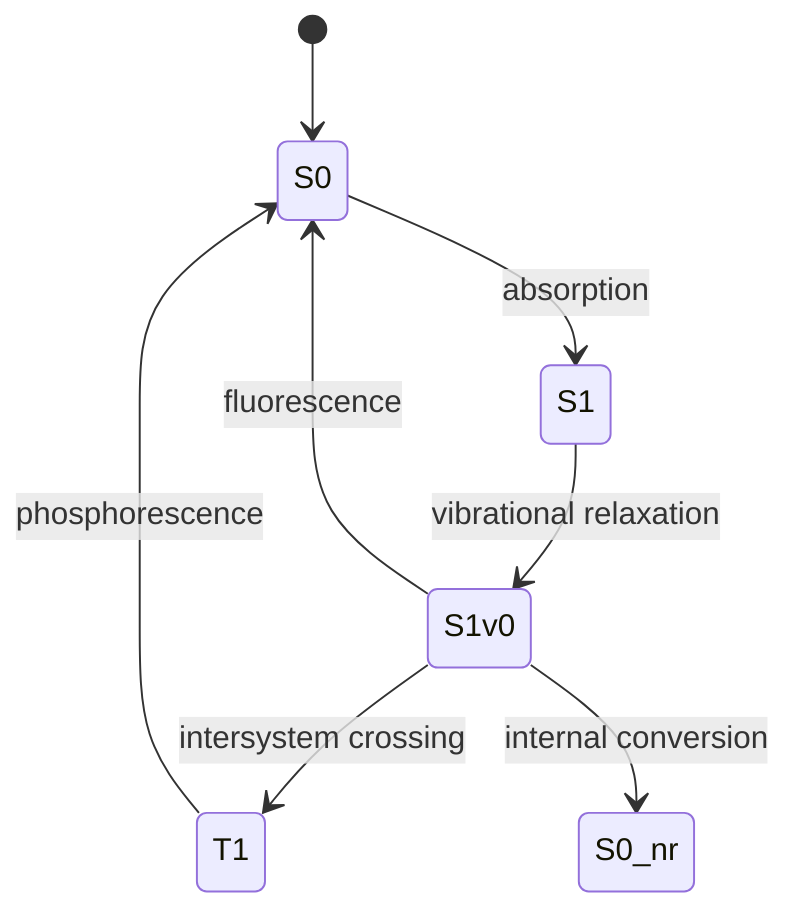

# Electronic, Laser, and Magnetic Resonance Spectroscopy

Electronic spectroscopy probes changes in electronic state, laser chemistry exploits controlled stimulated emission, and magnetic resonance detects spin energy levels in magnetic fields. Together they extend spectroscopy from rotational and vibrational motion to excited electronic surfaces and spin-dependent structure.

Atkins treats these topics as connected by transition energies, selection rules, populations, and relaxation. Whether the transition is UV-visible absorption, fluorescence, NMR, or EPR, the same physical questions recur: what are the energy levels, what couples them to radiation, and what happens after excitation?


*Figure: NMR spectrometer as magnetic-resonance apparatus for spin-dependent structure. Image: [Wikimedia Commons](https://commons.wikimedia.org/wiki/File:NMR_spectrometer.jpg), Tiia Monto, CC BY-SA 3.0.*

## Definitions

For electronic absorption,

$$
\Delta E=h\nu=\frac{hc}{\lambda}
$$

The Franck-Condon principle states that electronic transitions are fast compared with nuclear motion, so transitions are vertical on a potential energy diagram.

Fluorescence is spin-allowed radiative decay, typically

$$
S_1\to S_0+h\nu
$$

Phosphorescence is spin-forbidden or weakly allowed radiative decay, often

$$
T_1\to S_0+h\nu
$$

Laser action requires population inversion and optical feedback. Stimulated emission produces photons coherent with the stimulating radiation.

For NMR, a nucleus with spin angular momentum has magnetic moment

$$
\boldsymbol{\mu}=\gamma\mathbf{I}
$$

In a magnetic field $B_0$, a spin-$1/2$ nucleus has transition angular frequency

$$
\omega_0=\gamma B_0
$$

or frequency

$$
\nu_0=\frac{\gamma B_0}{2\pi}
$$

The chemical shift is

$$
\delta=\frac{\nu-\nu_{\mathrm{ref}}}{\nu_{\mathrm{ref}}}\times10^6
$$

in ppm. For EPR, the electron Zeeman energy is often written

$$
\Delta E=g\mu_BB_0
$$

## Key results

Electronic spectra often show vibronic structure because electronic transitions change both electronic and vibrational states. The intensity pattern depends on vibrational overlap integrals:

$$
\left|\int \chi_{v'}^\ast\chi_v\,dQ\right|^2
$$

These are Franck-Condon factors.

The Jablonski diagram organizes absorption, internal conversion, fluorescence, intersystem crossing, and phosphorescence. Nonradiative processes compete with radiative processes, so quantum yield is a kinetic ratio.

For a simple fluorescence process,

$$
\Phi_f=\frac{k_f}{k_f+k_{\mathrm{nr}}+k_{\mathrm{isc}}+\cdots}
$$

NMR chemical shifts arise from local electronic shielding:

$$
B_{\mathrm{local}}=B_0(1-\sigma)
$$

Different chemical environments produce different resonance frequencies. Spin-spin coupling splits resonances according to neighboring magnetic nuclei. For simple first-order proton spectra, $n$ equivalent neighboring spin-$1/2$ nuclei split a line into $n+1$ peaks with binomial intensities.

Relaxation returns spin populations and coherences toward equilibrium. $T_1$ is spin-lattice relaxation; $T_2$ is spin-spin relaxation. Fourier-transform NMR records a time-domain free induction decay and transforms it into a frequency-domain spectrum.

EPR detects unpaired electrons. The $g$ value reports electronic environment, and hyperfine splitting reports coupling to magnetic nuclei.

Electronic absorption bands are often broad in solution because electronic excitation is accompanied by vibrational and solvent changes. A vertical Franck-Condon transition places the molecule on the excited-state potential surface at the ground-state geometry. The molecule then relaxes vibrationally and through solvent reorganization before emitting or reacting. This sequence explains Stokes shifts: fluorescence usually occurs at longer wavelength than absorption because some excitation energy has been lost nonradiatively before emission.

The fate of an excited state is kinetic competition. Radiative decay, internal conversion, intersystem crossing, energy transfer, electron transfer, bond cleavage, and chemical reaction can all compete. A quantum yield is a fraction, not a rate constant. It becomes high for fluorescence when radiative decay competes successfully against nonradiative pathways. Heavy atoms can enhance spin-orbit coupling and increase intersystem crossing, making phosphorescence or triplet chemistry more important.

Laser action requires more than emission. At thermal equilibrium, lower energy states are more populated than upper states, so absorption dominates stimulated emission. Population inversion reverses that relation for the lasing transition. A pumping mechanism creates the inversion, and an optical cavity provides feedback. The output is intense, directional, narrow in frequency, and coherent, which makes lasers valuable for high-resolution spectroscopy and time-resolved chemistry.

Time-resolved laser experiments can follow reaction dynamics on femtosecond to nanosecond scales. A pump pulse prepares an excited state or starts a reaction; a probe pulse interrogates the system after a controlled delay. This method connects spectroscopy to molecular motion on potential energy surfaces, including bond breaking, internal conversion, and electron transfer.

NMR shielding is a local electronic response. The applied magnetic field induces electron circulation, and the induced field changes the field experienced by the nucleus. Electronegative atoms, pi systems, ring currents, hydrogen bonding, and conformation can all shift resonances. Chemical shift is therefore a structural probe. Reporting in ppm removes the trivial scaling with spectrometer field.

Spin-spin coupling gives connectivity and geometry. Coupling constants are transmitted through bonds and depend on electron distribution and bond angles. The Karplus relation connects vicinal proton-proton coupling to dihedral angle, making NMR a conformational tool. Equivalent nuclei do not split each other in first-order spectra, while strongly coupled systems require more complete quantum analysis.

Relaxation controls both spectral linewidth and experimental design. $T_1$ describes recovery of longitudinal magnetization and depends on how efficiently molecular motions at the Larmor frequency exchange energy with the surroundings. $T_2$ describes decay of transverse coherence and influences linewidth. Pulse sequences manipulate spin coherences to obtain multidimensional spectra, decoupling, nuclear Overhauser effects, and solid-state information.

EPR is analogous to NMR but electron magnetic moments are much larger, so EPR frequencies are typically in the microwave region at accessible magnetic fields. Hyperfine coupling to nearby nuclei splits lines and reveals where unpaired spin density resides. Transition-metal complexes add zero-field splitting and anisotropic $g$ tensors, making EPR a sensitive probe of electronic structure.

Magnetic resonance and optical spectroscopy often complement one another. UV-visible spectra report electronic energy gaps, fluorescence reports excited-state relaxation, NMR reports closed-shell structure and dynamics, and EPR reports radicals or paramagnetic centers. A physical chemist often combines these methods to build a consistent picture of molecular structure and change.

## Visual



| Method | Transition | Main information |
|---|---|---|
| UV-visible | electronic states | chromophores, conjugation, excited states |
| Fluorescence | radiative excited-state decay | environments, lifetimes, quantum yields |
| Laser spectroscopy | stimulated emission or narrowband excitation | high resolution, dynamics |
| NMR | nuclear spin transitions | structure, connectivity, dynamics |
| EPR | electron spin transitions | radicals, metal centers, hyperfine couplings |

## Worked example 1: Photon energy in visible absorption

**Problem.** A molecule absorbs at $\lambda=450\ \mathrm{nm}$. Calculate the photon energy in joules and the molar excitation energy in $\mathrm{kJ\ mol^{-1}}$.

**Method.** Use $E=hc/\lambda$ and multiply by $N_A$.

1. Convert wavelength:

$$
\lambda=450\ \mathrm{nm}=4.50\times10^{-7}\ \mathrm{m}
$$

2. Photon energy:

$$
E=\frac{(6.626\times10^{-34})(2.998\times10^8)}
{4.50\times10^{-7}}
=4.42\times10^{-19}\ \mathrm{J}
$$

3. Molar energy:

$$
E_m=(4.42\times10^{-19})(6.022\times10^{23})
=2.66\times10^5\ \mathrm{J\ mol^{-1}}
$$

4. Convert:

$$
E_m=266\ \mathrm{kJ\ mol^{-1}}
$$

**Checked answer.** Visible photons have energies of a few hundred $\mathrm{kJ\ mol^{-1}}$, comparable with chemical bond energies.

## Worked example 2: NMR frequency and chemical shift

**Problem.** In a $400.000\ \mathrm{MHz}$ proton NMR spectrometer, a signal appears $1200\ \mathrm{Hz}$ downfield from TMS. What is its chemical shift?

**Method.** Use

$$
\delta=\frac{\Delta\nu}{\nu_{\mathrm{ref}}}\times10^6
$$

1. Spectrometer frequency:

$$
\nu_{\mathrm{ref}}=400.000\ \mathrm{MHz}
=4.00000\times10^8\ \mathrm{Hz}
$$

2. Frequency offset:

$$
\Delta\nu=1200\ \mathrm{Hz}
$$

3. Chemical shift:

$$
\delta=\frac{1200}{4.00000\times10^8}\times10^6
$$

4. Calculate:

$$
\delta=3.00\ \mathrm{ppm}
$$

**Checked answer.** The ppm value is independent of field strength for the same chemical environment, which is why shifts are reported in ppm.

## Code

```python
import numpy as np

h = 6.62607015e-34
c = 2.99792458e8
NA = 6.02214076e23

def photon_energy(lambda_nm):
    E = h * c / (lambda_nm * 1e-9)
    return E, E * NA / 1000

def chemical_shift(offset_hz, spectrometer_mhz):
    return offset_hz / (spectrometer_mhz * 1e6) * 1e6

for lam in [300, 450, 600]:
    E, Em = photon_energy(lam)
    print(f"{lam} nm: {E:.3e} J photon, {Em:.1f} kJ/mol")

print("shift ppm:", chemical_shift(1200, 400.000))
```

## Common pitfalls

- Confusing absorption wavelength with fluorescence wavelength. Emission is often red-shifted after relaxation.
- Ignoring spin selection rules when comparing fluorescence and phosphorescence.
- Treating NMR chemical shift in hertz as field-independent. The ppm value is field-independent; hertz separations scale with field.
- Assuming every nucleus is NMR active. A nucleus must have nonzero spin.
- Forgetting that EPR usually requires unpaired electrons.

When interpreting electronic spectra, separate the electronic energy gap from the observed band maximum. The maximum depends on Franck-Condon factors, solvent relaxation, vibronic structure, and linewidth. A broad absorption band does not correspond to one sharply defined geometry-free number. For quantitative work, specify whether you mean vertical excitation energy, adiabatic excitation energy, emission maximum, or zero-zero transition.

For fluorescence and phosphorescence, draw the kinetic scheme. Quantum yield and lifetime together can identify radiative and nonradiative rates. A high fluorescence intensity can result from strong absorption, high quantum yield, high concentration, or instrumental factors, so intensity alone is not a molecular constant. Oxygen quenching, heavy-atom effects, and solvent polarity can all change excited-state pathways.

For NMR, keep chemical shift and coupling conceptually separate. Chemical shift reports electronic shielding of a nucleus. Scalar coupling reports through-bond communication between magnetic nuclei. Integration reports relative numbers of nuclei if relaxation and acquisition are handled properly. Exchange, conformational motion, and strong coupling can distort simple first-order interpretations, so spectra should be read with the time scale of the experiment in mind.

Magnetic resonance spectra also depend on sample conditions. Solvent, temperature, concentration, pH, paramagnetic impurities, viscosity, and exchange processes can move peaks or broaden them. For EPR, frozen solutions and single crystals can reveal anisotropy that is averaged in fluid solution. Reporting conditions is therefore part of the spectroscopic result, not an afterthought.

In optical spectroscopy, concentration matters through absorbance and reabsorption. Very concentrated samples can distort band shapes, quench emission, or violate simple Beer-Lambert behavior.

Baseline correction and calibration matter because small frequency or phase errors can be mistaken for chemical effects.

## Connections

- [Atomic structure and spectra](/chemistry/physical-chemistry/atomic-structure-and-spectra)
- [Molecular symmetry and group theory](/chemistry/physical-chemistry/molecular-symmetry-and-group-theory)
- [Rate laws and reaction mechanisms](/chemistry/physical-chemistry/rate-laws-and-reaction-mechanisms)
- [Physics quantum mechanics](/physics/quantum-mechanics/)
