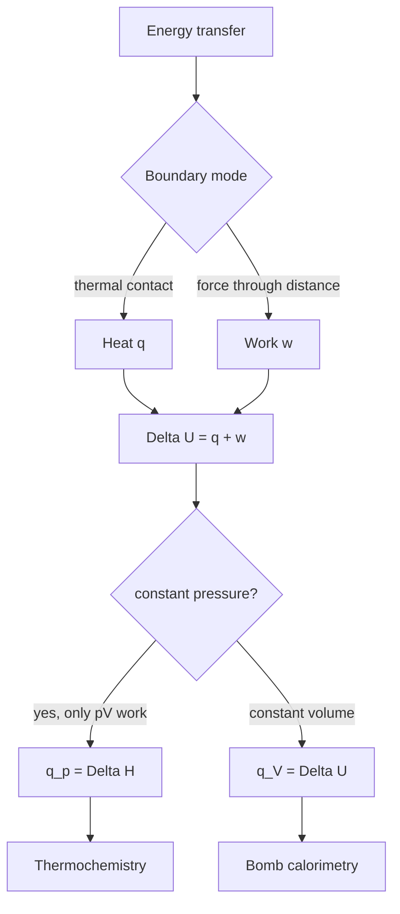

# First Law and Thermochemistry

The First Law is the bookkeeping rule for energy. It says that energy can cross a system boundary as heat or work, but the system's internal energy changes only by the net amount transferred. In physical chemistry, this turns calorimetry, expansion work, reaction enthalpies, and heat capacities into one coherent language.

Atkins uses the First Law to connect molecular changes with measurable thermal effects. The same formalism explains why a gas cools or warms during expansion, why reactions at constant pressure are reported as enthalpies, and why Hess's law works.


*Figure: Calorimeter apparatus as the laboratory setting for First Law energy accounting. Image: [Wikimedia Commons](https://commons.wikimedia.org/wiki/File:Calorimeter.svg), Li-on, public domain.*

## Definitions

A **system** is the part of the universe under study; the **surroundings** are everything else. A **closed system** exchanges energy but not matter. An **isolated system** exchanges neither matter nor energy. The internal energy $U$ is a state function, so $\Delta U$ depends only on initial and final states.

The First Law for a closed system is

$$
\Delta U=q+w
$$

or, for infinitesimal changes,

$$
dU=\delta q+\delta w
$$

The symbols $\delta q$ and $\delta w$ indicate path-dependent transfers, not state functions. In the chemistry sign convention, $q\gt 0$ and $w\gt 0$ when energy enters the system.

Expansion work is

$$
\delta w_{\mathrm{exp}}=-p_{\mathrm{ex}}\,dV
$$

and therefore

$$
w=-\int_{V_i}^{V_f}p_{\mathrm{ex}}\,dV
$$

For reversible expansion, $p_{\mathrm{ex}}=p$ at every step:

$$
w_{\mathrm{rev}}=-\int_{V_i}^{V_f}p\,dV
$$

The enthalpy is

$$
H=U+pV
$$

At constant pressure with only expansion work,

$$
\Delta H=q_p
$$

Heat capacities are

$$
C_V=\left(\frac{\partial U}{\partial T}\right)_V,
\qquad
C_p=\left(\frac{\partial H}{\partial T}\right)_p
$$

For a perfect gas,

$$
C_{p,m}-C_{V,m}=R
$$

## Key results

For reversible isothermal expansion of a perfect gas,

$$
\begin{aligned}
w_{\mathrm{rev}}
&=-\int_{V_i}^{V_f}\frac{nRT}{V}\,dV\\
&=-nRT\ln\frac{V_f}{V_i}
\end{aligned}
$$

For expansion against a constant external pressure,

$$
w=-p_{\mathrm{ex}}(V_f-V_i)
$$

For free expansion into a vacuum,

$$
p_{\mathrm{ex}}=0,
\qquad
w=0
$$

A perfect gas has internal energy depending only on temperature:

$$
dU=C_V\,dT
$$

so an isothermal perfect-gas process has $\Delta U=0$. If an isothermal perfect gas expands reversibly, the work it performs is exactly offset by heat absorbed from the surroundings:

$$
q_{\mathrm{rev}}=-w_{\mathrm{rev}}
$$

Thermochemistry uses reaction enthalpy:

$$
\Delta_r H^\circ=\sum_J \nu_J\Delta_f H^\circ(J)
$$

where stoichiometric numbers $\nu_J$ are positive for products and negative for reactants. Hess's law follows because $H$ is a state function: reaction enthalpies add algebraically. Kirchhoff's law corrects reaction enthalpy with temperature:

$$
\Delta_r H^\circ(T_2)
=\Delta_r H^\circ(T_1)+\int_{T_1}^{T_2}\Delta_r C_p^\circ\,dT
$$

If $\Delta_r C_p^\circ$ is approximately constant,

$$
\Delta_r H^\circ(T_2)
\approx
\Delta_r H^\circ(T_1)+\Delta_r C_p^\circ(T_2-T_1)
$$

For reversible adiabatic expansion of a perfect gas with constant heat capacities,

$$
pV^\gamma=\mathrm{constant},
\qquad
TV^{\gamma-1}=\mathrm{constant},
\qquad
\gamma=\frac{C_p}{C_V}
$$

The First Law is often summarized as conservation of energy, but its practical use depends on identifying the boundary and the permitted modes of transfer. A reaction in a sealed bomb calorimeter, a gas pushing a piston, and a battery driving a motor can all have the same $\Delta U$ form, yet very different partitions between $q$, expansion work, and additional work. Atkins emphasizes this bookkeeping because thermodynamic signs become straightforward once the system is clearly defined. Energy entering the system is positive; energy leaving the system is negative.

The distinction between reversible and irreversible work is central. Reversible expansion supplies the maximum work for a chosen isothermal path because the external pressure is matched to the internal pressure at every stage. Irreversible expansion wastes some potential work whenever the pressure difference is finite. This does not violate energy conservation; it means that the same initial and final states can involve different amounts of heat exchanged with the surroundings. Work is therefore not a property stored in the system. It is a record of how the change was performed.

Calorimetry gives the experimental bridge from thermal observation to state functions. At constant volume, no expansion work is possible, so heat measured by a bomb calorimeter equals $\Delta U$ when additional work is absent. At constant pressure, heat equals $\Delta H$ under the same restriction. This is why chemical tables usually list enthalpies rather than internal energies: many reactions are performed open to the atmosphere, and $q_p$ is directly accessible. The enthalpy definition $H=U+pV$ packages the expansion work needed to make room for products into a convenient state function.

The relation between $\Delta H$ and $\Delta U$ is especially simple for gas-producing or gas-consuming reactions:

$$
\Delta H=\Delta U+\Delta(pV)
$$

For ideal gases at fixed temperature,

$$
\Delta(pV)=\Delta n_{\mathrm{gas}}RT
$$

so

$$
\Delta H=\Delta U+\Delta n_{\mathrm{gas}}RT
$$

This correction is small for condensed-phase reactions but can matter when gas stoichiometry changes. It is also a reminder that thermodynamic data depend on the specified state and temperature.

Hess's law is not a separate empirical trick; it follows from enthalpy being a state function. If a target reaction can be written as a sum of other reactions, its enthalpy is the same sum of their enthalpies. This permits construction of reaction enthalpies from formation enthalpies, combustion data, phase-change enthalpies, or bond enthalpy approximations. Formation enthalpies use elements in their reference states as zero, so they are conventions that make comparisons consistent, not claims that elements contain no energy.

Heat capacities connect calorimetry with temperature changes. They are slopes of $U(T)$ or $H(T)$ under specified constraints, and they encode how molecular degrees of freedom absorb energy. Monatomic ideal gases have only translational energy and therefore $C_{V,m}=3R/2$. Linear molecules gain rotational contributions near ordinary temperatures, while high-frequency vibrations may remain thermally inactive until much higher temperatures. This molecular interpretation is developed later through partition functions, but the thermodynamic definitions already indicate why heat capacities depend on substance and temperature.

Adiabatic processes provide a good test of the formalism. In an adiabatic expansion, $q=0$, so the system's internal energy changes through work alone. For a perfect gas, expansion lowers $T$ because $U$ depends on $T$. Reversible adiabatic relations such as $pV^\gamma=\mathrm{constant}$ apply only under restrictive assumptions: perfect-gas behavior, constant heat capacities, and reversibility. A rapid expansion may be approximately adiabatic but not reversible, so it need not follow the same path equation.

## Visual



| Process | Constraint | Work | Heat relation for perfect gas |
|---|---|---:|---|
| Free expansion | $p_{\mathrm{ex}}=0$ | $0$ | $q=0$ if isolated |
| Constant external pressure | $p_{\mathrm{ex}}$ fixed | $-p_{\mathrm{ex}}\Delta V$ | $q=\Delta U-w$ |
| Reversible isothermal | $T$ fixed, $p_{\mathrm{ex}}=p$ | $-nRT\ln(V_f/V_i)$ | $q=-w$ |
| Reversible adiabatic | $q=0$ | $\Delta U$ | $TV^{\gamma-1}=\mathrm{constant}$ |
| Constant pressure reaction | $p$ fixed | often $-p\Delta V$ | $q_p=\Delta H$ |

## Worked example 1: Reversible isothermal expansion work

**Problem.** Calculate $w$, $q$, and $\Delta U$ when $2.00\ \mathrm{mol}$ of a perfect gas expands reversibly and isothermally at $298.15\ \mathrm{K}$ from $10.0\ \mathrm{L}$ to $25.0\ \mathrm{L}$.

**Method.** Use the perfect-gas reversible isothermal expression. For a perfect gas at constant temperature, $\Delta U=0$.

1. Volume ratio:

$$
\frac{V_f}{V_i}=\frac{25.0}{10.0}=2.50
$$

2. Work:

$$
\begin{aligned}
w
&=-nRT\ln\frac{V_f}{V_i}\\
&=-(2.00)(8.314\ \mathrm{J\ K^{-1}\ mol^{-1}})(298.15\ \mathrm{K})\ln(2.50)\\
&=-(4958\ \mathrm{J})(0.9163)\\
&=-4544\ \mathrm{J}
\end{aligned}
$$

3. Internal energy:

$$
\Delta U=0
$$

4. Heat from the First Law:

$$
\Delta U=q+w
\quad\Rightarrow\quad
q=-w=+4544\ \mathrm{J}
$$

**Checked answer.** $w=-4.54\ \mathrm{kJ}$, $q=+4.54\ \mathrm{kJ}$, and $\Delta U=0$. Expansion work is negative because the system does work on the surroundings.

## Worked example 2: Kirchhoff correction for reaction enthalpy

**Problem.** At $298.15\ \mathrm{K}$, suppose a reaction has $\Delta_rH^\circ=-92.2\ \mathrm{kJ\ mol^{-1}}$ and $\Delta_rC_p^\circ=-40.0\ \mathrm{J\ K^{-1}\ mol^{-1}}$. Estimate $\Delta_rH^\circ$ at $700.0\ \mathrm{K}$.

**Method.** Use Kirchhoff's law with constant $\Delta_rC_p^\circ$.

1. Temperature change:

$$
\Delta T=700.0-298.15=401.85\ \mathrm{K}
$$

2. Enthalpy correction:

$$
\begin{aligned}
\Delta_rC_p^\circ\Delta T
&=(-40.0\ \mathrm{J\ K^{-1}\ mol^{-1}})(401.85\ \mathrm{K})\\
&=-16074\ \mathrm{J\ mol^{-1}}\\
&=-16.1\ \mathrm{kJ\ mol^{-1}}
\end{aligned}
$$

3. Corrected enthalpy:

$$
\Delta_rH^\circ(700.0\ \mathrm{K})
=-92.2-16.1
=-108.3\ \mathrm{kJ\ mol^{-1}}
$$

**Checked answer.** The reaction becomes more exothermic at the higher temperature because the products have lower heat capacity than the reactants.

## Code

```python
import numpy as np

R = 8.314462618

def reversible_isothermal_work(n, T, Vi, Vf):
    return -n * R * T * np.log(Vf / Vi)

def kirchhoff(delta_h_298_kj, delta_cp_j, T2, T1=298.15):
    return delta_h_298_kj + delta_cp_j * (T2 - T1) / 1000.0

n, T = 2.0, 298.15
for Vf in [15.0, 25.0, 50.0]:
    w = reversible_isothermal_work(n, T, 10.0, Vf)
    print(f"Vf={Vf:5.1f} L, w={w/1000:7.3f} kJ, q={-w/1000:7.3f} kJ")

for T2 in [350, 500, 700]:
    print(T2, kirchhoff(-92.2, -40.0, T2))
```

## Common pitfalls

- Confusing state functions with path functions. $\Delta U$ and $\Delta H$ are state changes; $q$ and $w$ depend on the path.
- Using system pressure instead of external pressure for irreversible expansion work. Only reversible expansion lets you set $p_{\mathrm{ex}}=p$ throughout.
- Forgetting the sign convention. Expansion work is negative for the system under the chemistry convention.
- Assuming $q_p=\Delta H$ when non-expansion work is present. The relation requires only pressure-volume work.
- Applying $C_p-C_V=R$ to liquids and solids. That simple relation is for perfect gases.

For thermochemistry, always attach the physical state to every species. The enthalpy change for forming $\mathrm{H_2O(l)}$ differs from that for forming $\mathrm{H_2O(g)}$ by the enthalpy of vaporization. Likewise, carbon as graphite and carbon as diamond are different reference states. A balanced chemical equation without phase labels is incomplete for thermodynamic calculation.

Calorimeter sign conventions also deserve care. The heat released by a reaction is absorbed by the calorimeter, so $q_{\mathrm{rxn}}=-q_{\mathrm{cal}}$ when the calorimeter and reaction are the chosen pair. If a temperature rises in a bomb calorimeter, the reaction usually has negative $\Delta U$ for the amount burned. Confusing the calorimeter as system with the reaction as system reverses signs.

When using average bond enthalpies, remember that they are approximations over many molecular environments. They are useful for estimates and trends, but Hess's law with formation enthalpies or calorimetric data is more reliable. Bond enthalpy calculations also usually refer to gas-phase bond breaking, so phase changes may need to be included for comparison with condensed-phase reactions.

## Connections

- [Properties of gases](/chemistry/physical-chemistry/properties-of-gases)
- [Second law and entropy](/chemistry/physical-chemistry/second-law-and-entropy)
- [General chemistry thermochemistry](/chemistry/general/thermochemistry)
- [Physics energy and heat](/physics/general/thermodynamics)
