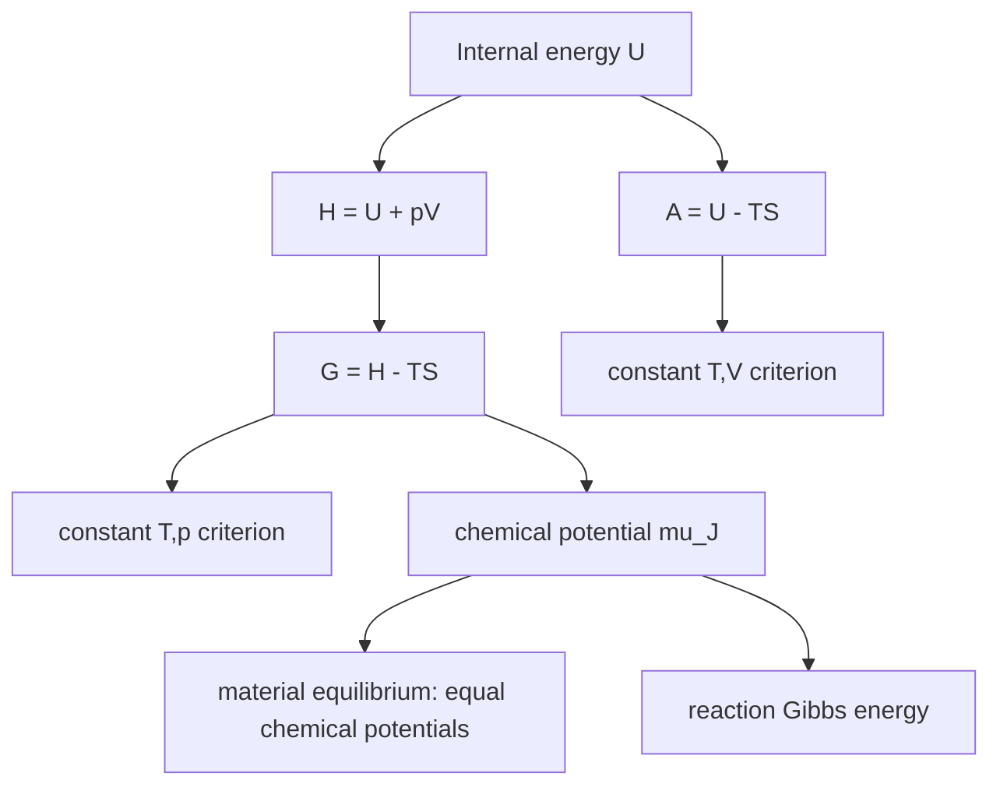

# Free Energy and Chemical Potential

Free energies translate the Second Law into criteria that use the variables chemists usually control. Instead of tracking both system and surroundings every time, the Helmholtz energy $A$ and Gibbs energy $G$ tell us whether a process can happen and how much useful work it can deliver under specified constraints.

The chemical potential is the central quantity that lets thermodynamics handle changing composition. It is the partial molar Gibbs energy and therefore the energetic "price" of adding a small amount of a substance to a mixture at fixed temperature and pressure.


*Figure: Gibbs energy minimum as the thermodynamic basis of chemical potential and equilibrium. Image: [Wikimedia Commons](https://commons.wikimedia.org/wiki/File:Gibbs-Energie-Veranschaulichung.svg), Johannes Schneider, CC BY-SA 4.0.*

## Definitions

The Helmholtz energy is

$$
A=U-TS
$$

and the Gibbs energy is

$$
G=H-TS=U+pV-TS
$$

For a closed system with only pressure-volume work, their differentials are

$$
dA=-S\,dT-p\,dV
$$

and

$$
dG=V\,dp-S\,dT
$$

For systems with variable composition,

$$
dG=V\,dp-S\,dT+\sum_J \mu_J\,dn_J
$$

where the chemical potential is

$$
\mu_J=\left(\frac{\partial G}{\partial n_J}\right)_{T,p,n_{K\ne J}}
$$

For a pure substance, $\mu=G_m$. For a perfect gas,

$$
\mu(T,p)=\mu^\circ(T)+RT\ln\frac{p}{p^\circ}
$$

For an ideal solution component,

$$
\mu_J=\mu_J^\ast+RT\ln x_J
$$

For a real solution, activity replaces mole fraction:

$$
\mu_J=\mu_J^\circ+RT\ln a_J
$$

The Gibbs-Duhem equation constrains partial molar quantities:

$$
\sum_J n_J\,d\mu_J=0
$$

at constant temperature and pressure.

## Key results

At constant temperature and volume,

$$
dA\le 0
$$

with equality at equilibrium. The maximum non-expansion work available from a closed system at constant $T$ and $V$ is

$$
w_{\mathrm{add,max}}=\Delta A
$$

At constant temperature and pressure,

$$
dG\le 0
$$

with equality at equilibrium. The maximum non-expansion work available at constant $T$ and $p$ is

$$
w_{\mathrm{add,max}}=\Delta G
$$

The natural variables of $G$ imply Maxwell relations. Starting from $dG=Vdp-SdT$, identify

$$
V=\left(\frac{\partial G}{\partial p}\right)_T,
\qquad
-S=\left(\frac{\partial G}{\partial T}\right)_p
$$

Equality of mixed second derivatives gives

$$
\left(\frac{\partial V}{\partial T}\right)_p
=-\left(\frac{\partial S}{\partial p}\right)_T
$$

Similarly, from $dA=-SdT-pdV$:

$$
\left(\frac{\partial S}{\partial V}\right)_T
=\left(\frac{\partial p}{\partial T}\right)_V
$$

The Gibbs energy of a pure substance depends on pressure through molar volume:

$$
dG_m=V_m\,dp
$$

For a condensed phase with nearly constant $V_m$,

$$
G_m(p_2)\approx G_m(p_1)+V_m(p_2-p_1)
$$

For a perfect gas, integration gives the logarithmic pressure dependence already stated:

$$
\Delta G_m=RT\ln\frac{p_2}{p_1}
$$

The value of free energy is not absolute in most chemical uses; differences are what matter. The Helmholtz energy asks how much work is available from a system held at constant temperature and volume. The Gibbs energy asks the same kind of question for constant temperature and pressure, which is the more common chemical environment. The price paid for using $G$ is that pressure-volume work is already accounted for, so the work directly connected with $\Delta G$ is non-expansion work such as electrical, surface, or mechanical work other than simple expansion.

The origin of the Gibbs criterion is the entropy of the universe. At constant $T$ and $p$, heat exchanged with the surroundings is tied to the system enthalpy. Substitution into $\Delta S_{\mathrm{univ}}$ gives

$$
\Delta S_{\mathrm{univ}}=-\frac{\Delta G_{\mathrm{sys}}}{T}
$$

Thus a negative $\Delta G$ is not a new law; it is the Second Law rewritten for a common set of constraints. If the constraints change, the correct potential may change. For example, at constant $T$ and $V$, $A$ replaces $G$.

Chemical potential is powerful because it turns composition change into ordinary calculus. If a small amount $dn_J$ of component $J$ is added to a mixture at fixed $T$ and $p$, the Gibbs energy changes by $\mu_Jdn_J$ plus corresponding terms for any other changes. Material equilibrium requires equality of chemical potential for each component across phases. A volatile liquid is in equilibrium with its vapor when the chemical potential of the liquid equals that of the vapor. A solute diffuses because its chemical potential is not uniform, not simply because its concentration is not uniform.

The logarithmic pressure dependence of $\mu$ for a perfect gas has several consequences. Compressing a gas increases its chemical potential, and expansion lowers it. This is why gases tend to flow from high pressure to low pressure: the direction lowers total Gibbs energy. For mixtures, each gas has its own chemical potential governed by partial pressure in the ideal limit. Reaction quotients are built from these chemical potentials, which is why pressure appears in gas equilibrium constants.

Activities preserve the same formal structure when ideality fails. Instead of abandoning

$$
\mu=\mu^\circ+RT\ln(\mathrm{composition})
$$

one replaces composition by activity:

$$
\mu=\mu^\circ+RT\ln a
$$

This is not cosmetic. Activity is the thermodynamically effective escaping tendency or reacting tendency of a species relative to its standard state. In real gases, fugacity plays the analogous role; in real solutions, activity coefficients correct mole fractions, molalities, or concentrations.

Maxwell relations are more than mathematical curiosities. They let difficult derivatives be replaced by measurable ones. For example,

$$
\left(\frac{\partial S}{\partial p}\right)_T
=-\left(\frac{\partial V}{\partial T}\right)_p
$$

relates entropy changes with pressure to thermal expansion. Such identities are possible because $G$, $A$, $H$, and $U$ are state functions with exact differentials. The equality of mixed partial derivatives is a mathematical expression of thermodynamic consistency.

Partial molar quantities also prevent a common misconception about mixtures. The contribution of one mole of a substance to a mixture is not necessarily its pure molar property. Adding a mole of salt to water can contract the solution; adding a volatile solute can lower solvent chemical potential; adding one component to a binary mixture can force the other component's chemical potential to change through the Gibbs-Duhem equation. The mixture is a coupled thermodynamic object.

## Visual



| Thermodynamic potential | Definition | Natural variables | Equilibrium criterion |
|---|---:|---|---|
| $U$ | internal energy | $S,V,\{n_J\}$ | isolated systems |
| $H$ | $U+pV$ | $S,p,\{n_J\}$ | useful for constant-pressure heat |
| $A$ | $U-TS$ | $T,V,\{n_J\}$ | decreases at constant $T,V$ |
| $G$ | $H-TS$ | $T,p,\{n_J\}$ | decreases at constant $T,p$ |
| $\mu_J$ | $(\partial G/\partial n_J)_{T,p}$ | mixture composition | equal at material equilibrium |

## Worked example 1: Gibbs energy change for gas compression

**Problem.** Calculate $\Delta G_m$ when $1.00\ \mathrm{mol}$ of a perfect gas at $298.15\ \mathrm{K}$ is compressed isothermally from $1.00\ \mathrm{bar}$ to $10.0\ \mathrm{bar}$.

**Method.** Use the perfect-gas pressure dependence of molar Gibbs energy:

$$
\Delta G_m=RT\ln(p_2/p_1)
$$

1. Pressure ratio:

$$
\frac{p_2}{p_1}=10.0
$$

2. Substitute:

$$
\begin{aligned}
\Delta G_m
&=(8.314\ \mathrm{J\ K^{-1}\ mol^{-1}})(298.15\ \mathrm{K})\ln(10.0)\\
&=(2478.8\ \mathrm{J\ mol^{-1}})(2.3026)\\
&=5707\ \mathrm{J\ mol^{-1}}
\end{aligned}
$$

3. Convert:

$$
\Delta G_m=5.71\ \mathrm{kJ\ mol^{-1}}
$$

**Checked answer.** Compression raises chemical potential, so $\Delta G_m$ is positive. The logarithmic dependence means a tenfold pressure increase costs about $5.7\ \mathrm{kJ\ mol^{-1}}$ at room temperature.

## Worked example 2: Gibbs-Duhem relation in a binary mixture

**Problem.** A binary liquid mixture at fixed $T$ and $p$ has $n_A=3.00\ \mathrm{mol}$ and $n_B=1.00\ \mathrm{mol}$. If a composition change causes $d\mu_A=+20.0\ \mathrm{J\ mol^{-1}}$, what must $d\mu_B$ be?

**Method.** Use the binary Gibbs-Duhem equation:

$$
n_A\,d\mu_A+n_B\,d\mu_B=0
$$

1. Rearrange:

$$
d\mu_B=-\frac{n_A}{n_B}d\mu_A
$$

2. Substitute:

$$
d\mu_B=-\frac{3.00}{1.00}(20.0\ \mathrm{J\ mol^{-1}})
$$

3. Calculate:

$$
d\mu_B=-60.0\ \mathrm{J\ mol^{-1}}
$$

**Checked answer.** The chemical potentials cannot vary independently. Because there is three times as much $A$ as $B$, a small increase in $\mu_A$ must be balanced by a larger decrease in $\mu_B$.

## Code

```python
import numpy as np

R = 8.314462618
T = 298.15

pressures = np.array([0.1, 1.0, 2.0, 5.0, 10.0, 100.0])  # bar
mu_relative = R * T * np.log(pressures / 1.0) / 1000.0   # kJ/mol

for p, dmu in zip(pressures, mu_relative):
    print(f"p={p:7.2f} bar  mu-mu_standard={dmu:8.3f} kJ/mol")

def gibbs_duhem_binary(nA, nB, dmuA):
    return -(nA / nB) * dmuA

print("dmu_B:", gibbs_duhem_binary(3.0, 1.0, 20.0), "J/mol")
```

## Common pitfalls

- Treating $G$ as always minimized. The simple $dG\le 0$ criterion requires constant $T$ and $p$ with appropriate work restrictions.
- Confusing $\Delta G$ with $\Delta G^\circ$. Standard values refer to standard states; actual values include composition or pressure terms.
- Forgetting that chemical potential is a partial derivative. It changes with composition even at fixed $T$ and $p$.
- Varying one chemical potential in a mixture independently of the others. The Gibbs-Duhem equation prevents that.
- Using mole fraction where activity is required for concentrated or strongly interacting solutions.

A good way to choose the correct free energy is to ask what the surroundings hold fixed. If $S$ and $V$ are fixed, $U$ is natural. If $S$ and $p$ are fixed, $H$ is natural. If $T$ and $V$ are fixed, $A$ is natural. If $T$ and $p$ are fixed, $G$ is natural. Chemical laboratory problems usually use $G$ because temperature and pressure are controlled, but electrochemical, surface, and biological systems may require attention to additional work terms.

Chemical potential should also be interpreted locally. Matter flows from high chemical potential to low chemical potential when allowed, just as heat flows from high temperature to low temperature. A concentration gradient contributes to a chemical-potential gradient, but electrical potential, pressure, interactions, and external fields can contribute too. This is why ions in membranes move according to electrochemical potential rather than concentration alone.

In calculations, never put a dimensional quantity directly inside a logarithm. Expressions like $RT\ln p$ are shorthand for $RT\ln(p/p^\circ)$. The standard state may be hidden typographically, but it is conceptually present. This matters when comparing tables, deriving equilibrium constants, or switching between bar and pascal.

When a result seems to say that a process with positive $\Delta G^\circ$ "cannot happen," translate it into actual conditions. Positive standard Gibbs energy only says the standard-state comparison favors reactants. Changing activities, coupling to another process, applying electrical work, or removing products can make the actual $\Delta G$ negative.

## Connections

- [Second law and entropy](/chemistry/physical-chemistry/second-law-and-entropy)
- [Mixtures, solutions, and activities](/chemistry/physical-chemistry/mixtures-solutions-and-activities)
- [Chemical equilibrium](/chemistry/physical-chemistry/chemical-equilibrium)
- [Engineering math partial derivatives](/math/engineering-math/)
