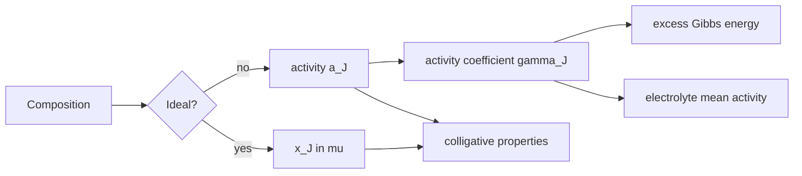

# Mixtures, Solutions, and Activities

Mixtures are where chemical potential becomes unavoidable. The properties of a solution are not just weighted averages of pure-component properties; each component contributes a partial molar amount that depends on composition and intermolecular interactions.

Atkins develops simple mixtures from ideal gas mixing through ideal and nonideal liquid solutions, then extends the discussion to activities, colligative properties, and electrolyte solutions. The central idea is that equilibrium is governed by chemical potential, while composition enters through activity rather than bare concentration whenever nonideality matters.


*Figure: Osmotic pressure as a macroscopic consequence of chemical-potential differences in solution. Image: [Wikimedia Commons](https://commons.wikimedia.org/wiki/File:Osmotic_pressure_on_blood_cells_diagram.svg), LadyofHats, public domain.*

## Definitions

The **partial molar quantity** of component $J$ for an extensive property $X$ is

$$
\bar X_J=\left(\frac{\partial X}{\partial n_J}\right)_{T,p,n_{K\ne J}}
$$

For volume,

$$
V=\sum_J n_J\bar V_J
$$

For Gibbs energy,

$$
G=\sum_J n_J\mu_J
$$

The **ideal solution** expression for a solvent or component is

$$
\mu_J=\mu_J^\ast+RT\ln x_J
$$

Raoult's law for an ideal solution is

$$
p_J=x_Jp_J^\ast
$$

Henry's law for a dilute solute is

$$
p_B=K_Bx_B
$$

where $K_B$ is Henry's law constant for the solute in that solvent.

The **activity** $a_J$ is defined so the chemical potential keeps the perfect-looking form

$$
\mu_J=\mu_J^\circ+RT\ln a_J
$$

For a real solution,

$$
a_J=\gamma_J x_J
$$

when the mole-fraction convention is used. The activity coefficient $\gamma_J$ measures deviation from ideality.

Colligative properties depend mainly on the number of solute particles, not their chemical identity, in the dilute ideal limit:

$$
\Delta T_b=K_b b,
\qquad
\Delta T_f=K_f b,
\qquad
\Pi=cRT
$$

where $b$ is molality, $c$ is molar concentration, and $\Pi$ is osmotic pressure.

## Key results

The Gibbs energy of mixing for two perfect gases or an ideal solution is

$$
\Delta_{\mathrm{mix}}G
=nRT(x_A\ln x_A+x_B\ln x_B)
$$

Because $0\lt x_J\lt 1$, each $\ln x_J\lt 0$, so ideal mixing is spontaneous:

$$
\Delta_{\mathrm{mix}}G<0
$$

The entropy of ideal mixing is

$$
\Delta_{\mathrm{mix}}S
=-nR(x_A\ln x_A+x_B\ln x_B)
$$

and the enthalpy of ideal mixing is

$$
\Delta_{\mathrm{mix}}H=0
$$

so the ideal driving force is entropic.

The Gibbs-Duhem equation applies to activities and activity coefficients. For a binary solution at constant $T$ and $p$,

$$
x_A\,d\ln a_A+x_B\,d\ln a_B=0
$$

For regular solutions, deviations from Raoult's law are often expressed through activity coefficients. A simple symmetric model has

$$
RT\ln\gamma_A=w x_B^2,
\qquad
RT\ln\gamma_B=w x_A^2
$$

where $w$ reflects unlike-versus-like interaction differences.

For electrolytes, individual ion activities cannot be measured independently in ordinary thermodynamics. Mean ionic activity and mean activity coefficient are used. For a salt $\mathrm{M_pX_q}$,

$$
a_\pm=(a_+^p a_-^q)^{1/(p+q)}
$$

Debye-Huckel theory captures the limiting effect of ionic atmospheres:

$$
\log_{10}\gamma_\pm=-A|z_+z_-|I^{1/2}
$$

in the limiting law, where ionic strength is

$$
I=\frac{1}{2}\sum_i c_i z_i^2
$$

Partial molar quantities are necessary because molecules in a mixture experience surroundings different from those in pure substances. If ethanol is added to water, the total volume is not the sum of pure molar volumes multiplied by mole numbers. Hydrogen bonding, packing, and disruption of water structure change the incremental volume. The partial molar volume is therefore the slope of total volume with respect to added amount at fixed $T$, $p$, and other mole numbers. The same idea applies to enthalpy, entropy, and Gibbs energy.

The chemical potential of a component in a mixture is the partial molar Gibbs energy. It governs phase equilibrium, osmosis, vapor pressure, and reaction equilibrium. A solvent in a solution has lower chemical potential than the pure solvent in an ideal solution because

$$
\mu_A=\mu_A^\ast+RT\ln x_A
$$

and $x_A\lt 1$. This lowering is entropic in origin for ideal solutions. It explains vapor-pressure lowering, boiling-point elevation, freezing-point depression, and osmotic pressure without needing a special molecular attraction between solute and solvent.

Raoult's law and Henry's law are complementary limiting laws. Raoult's law is approached by a component that is nearly pure, because its molecular environment resembles the pure liquid. Henry's law is approached by a dilute solute, because each solute molecule is mostly surrounded by solvent and has a different standard proportionality. A binary solution can show Raoult behavior for the solvent and Henry behavior for the solute in the same dilute composition range.

Nonideal solutions require activities because composition alone does not fully describe escaping tendency. Positive deviations from Raoult's law occur when unlike interactions are less favorable than like interactions; molecules escape more readily to the vapor. Negative deviations occur when unlike interactions are more favorable; vapor pressures are suppressed. Strong deviations can produce azeotropes and liquid-liquid phase separation, linking solution thermodynamics to phase diagrams.

The Gibbs energy of mixing provides a stability criterion. For an ideal binary solution,

$$
\Delta_{\mathrm{mix}}G=nRT[x_A\ln x_A+x_B\ln x_B]
$$

is negative for all intermediate compositions. For a nonideal solution, an excess Gibbs energy term may make the curve concave in some region. If the curvature becomes negative enough, a homogeneous mixture is unstable with respect to separation into two phases of different compositions. Common-tangent constructions in phase diagrams come from minimizing total Gibbs energy.

Colligative properties share a common source: solute lowers the chemical potential of the solvent. Freezing point is depressed because the solution solvent must be cooled further before its chemical potential matches that of the pure solid solvent. Boiling point is elevated because a higher temperature is needed for the solution solvent chemical potential to match the vapor at external pressure. Osmotic pressure is the mechanical pressure needed to raise the solution solvent chemical potential back to that of the pure solvent across a semipermeable membrane.

Electrolytes complicate the story because each formula unit produces multiple ions and because Coulomb interactions are long ranged. Ionic strength weights concentrations by charge squared, so a small amount of a multivalent ion can affect activity coefficients strongly. The Debye-Huckel limiting law predicts that mean activity coefficients decrease from 1 as ionic strength increases from zero. At higher concentrations, ion size, specific association, solvent structure, and short-range interactions require extended models or experimental activity data.

A practical calculation must also respect standard-state conventions. Activities based on mole fraction, molality, and concentration use different standard states. The numerical value of an activity coefficient has meaning only with its convention. This is why equilibrium constants and electrochemical potentials must state their standard states carefully.

## Visual

| Law or concept | Mathematical form | Applies to | Physical meaning |
|---|---:|---|---|
| Raoult's law | $p_A=x_Ap_A^\ast$ | solvent, ideal or near pure | vapor pressure reduced by dilution |
| Henry's law | $p_B=K_Bx_B$ | dilute solute | solubility controlled by solute-solvent interactions |
| Activity | $a_J=\gamma_Jx_J$ | real solutions | effective composition in chemical potential |
| Ideal mixing | $\Delta_{\mathrm{mix}}G=nRT\sum x_J\ln x_J$ | ideal gases/solutions | entropy-driven spontaneous mixing |
| Osmotic pressure | $\Pi=cRT$ | dilute solutions | pressure needed to stop solvent flow |
| Debye-Huckel limiting law | $\log\gamma_\pm=-A\vert z_+z_-\vert I^{1/2}$ | very dilute electrolytes | ion atmospheres lower effective chemical potential |



## Worked example 1: Gibbs energy and entropy of ideal mixing

**Problem.** Mix $1.00\ \mathrm{mol}$ of $\mathrm{N_2}$ and $3.00\ \mathrm{mol}$ of $\mathrm{H_2}$ at $298.15\ \mathrm{K}$ and the same initial pressure. Calculate $\Delta_{\mathrm{mix}}G$ and $\Delta_{\mathrm{mix}}S$.

**Method.** Use ideal mixing formulas with total amount $n=4.00\ \mathrm{mol}$.

1. Mole fractions:

$$
x_{\mathrm{N_2}}=\frac{1.00}{4.00}=0.250,
\qquad
x_{\mathrm{H_2}}=\frac{3.00}{4.00}=0.750
$$

2. Composition sum:

$$
\begin{aligned}
\sum x_J\ln x_J
&=(0.250)\ln(0.250)+(0.750)\ln(0.750)\\
&=(0.250)(-1.3863)+(0.750)(-0.2877)\\
&=-0.3466-0.2158\\
&=-0.5624
\end{aligned}
$$

3. Gibbs energy:

$$
\begin{aligned}
\Delta_{\mathrm{mix}}G
&=nRT\sum x_J\ln x_J\\
&=(4.00)(8.314)(298.15)(-0.5624)\\
&=-5570\ \mathrm{J}
\end{aligned}
$$

4. Entropy:

$$
\Delta_{\mathrm{mix}}S
=-nR\sum x_J\ln x_J
=(4.00)(8.314)(0.5624)
=18.7\ \mathrm{J\ K^{-1}}
$$

**Checked answer.** $\Delta_{\mathrm{mix}}G=-5.57\ \mathrm{kJ}$ and $\Delta_{\mathrm{mix}}S=+18.7\ \mathrm{J\ K^{-1}}$. The signs match spontaneous ideal mixing.

## Worked example 2: Osmotic pressure of a dilute solution

**Problem.** A protein solution has concentration $2.50\times10^{-4}\ \mathrm{mol\ L^{-1}}$ at $298.15\ \mathrm{K}$. Estimate the osmotic pressure in pascals and mmHg assuming ideal dilute behavior.

**Method.** Use $\Pi=cRT$ with SI units.

1. Convert concentration:

$$
c=2.50\times10^{-4}\ \mathrm{mol\ L^{-1}}
=0.250\ \mathrm{mol\ m^{-3}}
$$

2. Substitute:

$$
\begin{aligned}
\Pi
&=(0.250\ \mathrm{mol\ m^{-3}})
(8.314\ \mathrm{J\ K^{-1}\ mol^{-1}})
(298.15\ \mathrm{K})\\
&=619.7\ \mathrm{Pa}
\end{aligned}
$$

3. Convert to mmHg using $1\ \mathrm{mmHg}=133.322\ \mathrm{Pa}$:

$$
\Pi=\frac{619.7}{133.322}=4.65\ \mathrm{mmHg}
$$

**Checked answer.** The osmotic pressure is small but measurable. The units work because $\mathrm{J\ m^{-3}}=\mathrm{Pa}$.

## Code

```python
import numpy as np

R = 8.314462618
T = 298.15

def ideal_mixing(n_moles):
    n_moles = np.array(n_moles, dtype=float)
    total = n_moles.sum()
    x = n_moles / total
    s = np.sum(x * np.log(x))
    delta_g = total * R * T * s
    delta_s = -total * R * s
    return x, delta_g, delta_s

x, dg, ds = ideal_mixing([1.0, 3.0])
print("mole fractions:", x)
print("Delta_mix G (kJ):", dg / 1000)
print("Delta_mix S (J/K):", ds)

def osmotic_pressure(c_mol_L, T=298.15):
    c_mol_m3 = c_mol_L * 1000.0
    return c_mol_m3 * R * T

print("Pi Pa:", osmotic_pressure(2.5e-4))
```

## Common pitfalls

- Treating mole fraction, molarity, and molality as interchangeable. Their differences matter outside very dilute aqueous solutions.
- Applying Raoult's law to a dilute solute when Henry's law is appropriate.
- Forgetting that ideal mixing has $\Delta H=0$ but not $\Delta G=0$.
- Using individual ion activity coefficients as if they were directly measurable thermodynamic quantities.
- Ignoring activity in equilibrium calculations for concentrated solutions or electrolytes.

Before applying an ideal-solution formula, identify which component is in its limiting region. A solvent near $x_A=1$ may obey Raoult's law even while the solute obeys Henry's law. The same species can use different standard states depending on whether it is treated as solvent, solute, gas, or electrolyte. Writing the chemical potential expression first is often safer than memorizing which law to apply.

For colligative properties, check whether the solute dissociates, associates, or reacts. The simple formulas count solute particles in the dilute ideal limit. Electrolytes require van't Hoff factors as a first correction, but ion pairing and activity effects can make the effective particle count concentration-dependent. Polymers and proteins can show nonideal osmotic behavior that is deliberately used to infer molar mass and interactions.

Partial molar quantities are slopes, not simple fractions. If a graph of total volume versus amount is curved, the partial molar volume changes with composition. The tangent slope gives the partial molar value at that composition, while the total mixture property comes from summing $n_J\bar X_J$. This distinction is essential in solution thermodynamics and in interpreting experimental data.

## Connections

- [Free energy and chemical potential](/chemistry/physical-chemistry/free-energy-and-chemical-potential)
- [Chemical equilibrium](/chemistry/physical-chemistry/chemical-equilibrium)
- [Electrochemistry](/chemistry/physical-chemistry/electrochemistry)
- [General chemistry solutions](/chemistry/general/)
