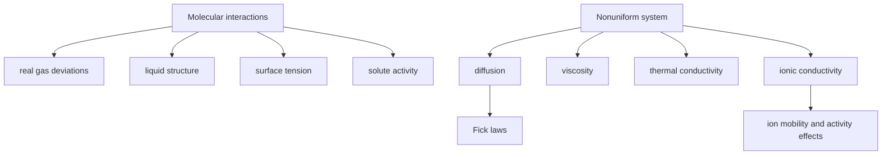

# Molecular Interactions and Transport

Molecular interactions explain why real gases, liquids, surfaces, and condensed phases deviate from ideal models. Transport properties then describe how molecules, momentum, energy, and charge move when a system is not at uniform equilibrium.

Atkins connects these ideas across gases, liquids, electrolyte solutions, diffusion, and molecular beams. The same microscopic forces that produce virial coefficients and liquid structure also influence viscosity, diffusion, conductivity, and rates of encounters.

## Definitions

An electric dipole moment is

$$
\boldsymbol{\mu}=\sum_i q_i\mathbf{r}_i
$$

Polarizability measures the induced dipole moment in an electric field:

$$
\boldsymbol{\mu}_{\mathrm{ind}}=\alpha\mathbf{E}
$$

Intermolecular attractions include dipole-dipole, dipole-induced dipole, and dispersion interactions. A common model for a pair potential is the Lennard-Jones form:

$$
V(r)=4\epsilon\left[\left(\frac{\sigma}{r}\right)^{12}
-\left(\frac{\sigma}{r}\right)^6\right]
$$

The $r^{-12}$ term models short-range repulsion, and the $r^{-6}$ term models dispersion attraction.

For molecular motion in gases, the root-mean-square speed is

$$
c_{\mathrm{rms}}=\left(\frac{3RT}{M}\right)^{1/2}
$$

The mean speed is

$$
\bar c=\left(\frac{8RT}{\pi M}\right)^{1/2}
$$

Diffusion follows Fick's first law:

$$
J=-D\frac{\partial c}{\partial x}
$$

and Fick's second law:

$$
\frac{\partial c}{\partial t}
=D\frac{\partial^2 c}{\partial x^2}
$$

For ions, molar conductivity is

$$
\Lambda_m=\frac{\kappa}{c}
$$

where $\kappa$ is conductivity.

## Key results

The Maxwell speed distribution for gases explains why molecular speeds spread broadly even at fixed temperature. Lighter molecules and higher temperatures give higher speeds.

Effusion through a small hole follows Graham's law:

$$
\frac{r_1}{r_2}=\left(\frac{M_2}{M_1}\right)^{1/2}
$$

Transport coefficients in dilute gases can be interpreted through mean free path $\lambda$ and mean speed. Although detailed constants depend on the model, the qualitative forms are:

$$
D\sim \frac{1}{3}\lambda\bar c
$$

for diffusion and similar kinetic-theory forms for viscosity and thermal conductivity.

For diffusion from a point-like initial distribution in one dimension, the probability density is Gaussian:

$$
P(x,t)=\frac{1}{(4\pi Dt)^{1/2}}
\exp\left(-\frac{x^2}{4Dt}\right)
$$

and the mean square displacement is

$$
\langle x^2\rangle=2Dt
$$

In three dimensions,

$$
\langle r^2\rangle=6Dt
$$

Electrolyte conductivities deviate from ideality because moving ions disturb their ionic atmospheres and experience electrophoretic drag. Kohlrausch's law for strong electrolytes at low concentration is often written

$$
\Lambda_m=\Lambda_m^\circ-Kc^{1/2}
$$

The Stokes-Einstein relation connects diffusion of a spherical particle in a liquid to viscosity:

$$
D=\frac{kT}{6\pi\eta a}
$$

where $a$ is hydrodynamic radius.

Intermolecular forces are strongly distance dependent. Ion-ion interactions vary as $1/r$, ion-dipole interactions as roughly $1/r^2$ after orientation effects, dipole-dipole interactions as $1/r^3$ for fixed orientations, and dispersion attractions as $1/r^6$. Repulsions rise very steeply at short range because electron clouds resist overlap through Pauli exclusion and electrostatic repulsion. The balance of attraction and repulsion creates equilibrium separations in liquids and molecular solids.

Dispersion forces are universal because instantaneous electron-density fluctuations can induce correlated dipoles in neighboring species. They increase with polarizability, so large, heavy, easily distorted molecules often have stronger dispersion attractions. This explains trends in boiling points among noble gases and nonpolar molecules. Hydrogen bonding, ion-dipole interactions, and permanent dipole interactions add more directional or stronger contributions when molecular structure permits.

Transport in gases can be understood through molecular flights interrupted by collisions. The mean free path decreases as pressure increases because molecules collide more frequently. Diffusion in gases is faster than in liquids because molecules travel longer distances between collisions. Viscosity of dilute gases can increase with temperature because faster molecules transport momentum more effectively, even though liquid viscosity usually decreases with temperature as cohesive structure is disrupted.

Liquid transport is more collective. A diffusing solute must move through a fluctuating cage of neighboring solvent molecules. The Stokes-Einstein equation treats the solvent as a continuum with viscosity $\eta$ and the solute as a sphere of radius $a$. This is an approximation, but it captures why larger particles diffuse more slowly and why diffusion is slower in more viscous media.

The diffusion equation is mathematically the same type of partial differential equation as the heat equation. A localized concentration profile spreads out with time, and the characteristic distance grows as $t^{1/2}$, not as $t$. This square-root scaling is crucial: diffusion is efficient over small cellular distances but poor over macroscopic distances unless aided by convection, stirring, or flow.

Electrolyte transport couples diffusion, migration, and sometimes convection. Ions move down concentration gradients and also respond to electric fields. Their mobilities depend on solvation, size, charge, and solvent viscosity. In a strong electrolyte, increasing concentration can lower molar conductivity because ion atmospheres and electrophoretic effects hinder independent ion motion. Weak electrolytes add the complication of incomplete dissociation.

Intermolecular interactions also determine surface phenomena. Molecules at an interface have fewer neighbors than molecules in the bulk, giving rise to surface tension. Surfactants reduce surface tension by adsorbing at interfaces and replacing unfavorable contacts. Micelles form when amphiphiles self-assemble to hide hydrophobic tails from water while exposing polar head groups. These ideas connect interactions to macromolecules and soft matter.

Molecular beams provide a way to study collision dynamics under controlled conditions. By preparing narrow distributions of velocity and direction, experiments can measure scattering angles, energy transfer, and reaction probabilities. These microscopic observations support the kinetic and dynamic models used for reaction rates.

In all transport problems, a flux is paired with a thermodynamic force. Concentration gradients, temperature gradients, velocity gradients, and electric potential gradients drive matter, heat, momentum, and charge flow. Linear laws such as Fick's law hold near equilibrium; far from equilibrium, nonlinear behavior and coupling between flows can become important.

## Visual



| Transport property | Flux | Driving gradient | Typical law |
|---|---|---|---|
| Diffusion | matter | concentration | $J=-D\,dc/dx$ |
| Viscosity | momentum | velocity | shear stress $\propto d v/dz$ |
| Thermal conductivity | energy | temperature | heat flux $\propto -dT/dx$ |
| Ionic conductivity | charge | electric potential | current from ion mobility |
| Effusion | gas molecules | pressure/density | rate $\propto M^{-1/2}$ |

## Worked example 1: RMS speed of nitrogen

**Problem.** Calculate the root-mean-square speed of $\mathrm{N_2}$ at $298.15\ \mathrm{K}$. Use $M=28.0134\ \mathrm{g\ mol^{-1}}$.

**Method.** Use

$$
c_{\mathrm{rms}}=\sqrt{\frac{3RT}{M}}
$$

with $M$ in $\mathrm{kg\ mol^{-1}}$.

1. Convert molar mass:

$$
M=28.0134\ \mathrm{g\ mol^{-1}}
=2.80134\times10^{-2}\ \mathrm{kg\ mol^{-1}}
$$

2. Numerator:

$$
3RT=3(8.314)(298.15)=7437\ \mathrm{J\ mol^{-1}}
$$

3. Divide by molar mass:

$$
\frac{7437}{2.80134\times10^{-2}}
=2.655\times10^5\ \mathrm{m^2\ s^{-2}}
$$

4. Square root:

$$
c_{\mathrm{rms}}=515\ \mathrm{m\ s^{-1}}
$$

**Checked answer.** A few hundred meters per second is the expected thermal speed for light gas molecules at room temperature.

## Worked example 2: Diffusion distance

**Problem.** A small molecule has diffusion coefficient $D=1.0\times10^{-9}\ \mathrm{m^2\ s^{-1}}$ in water. Estimate the root-mean-square displacement in three dimensions after $10.0\ \mathrm{s}$.

**Method.** Use

$$
\langle r^2\rangle=6Dt
$$

1. Substitute:

$$
6Dt=6(1.0\times10^{-9})(10.0)
=6.0\times10^{-8}\ \mathrm{m^2}
$$

2. Square root:

$$
r_{\mathrm{rms}}=\sqrt{6.0\times10^{-8}}
=2.45\times10^{-4}\ \mathrm{m}
$$

3. Convert:

$$
r_{\mathrm{rms}}=0.245\ \mathrm{mm}
$$

**Checked answer.** Molecular diffusion is effective over micrometer to submillimeter distances but slow over centimeters without convection.

## Code

```python
import numpy as np

R = 8.314462618

def rms_speed(T, molar_mass_g):
    M = molar_mass_g / 1000.0
    return np.sqrt(3 * R * T / M)

def rms_diffusion_distance(D, t, dimensions=3):
    return np.sqrt(2 * dimensions * D * t)

print("N2 rms speed:", rms_speed(298.15, 28.0134), "m/s")
for t in [0.01, 1.0, 10.0, 100.0]:
    print(t, rms_diffusion_distance(1e-9, t), "m")
```

## Common pitfalls

- Using molar mass in grams inside SI kinetic-energy formulas.
- Treating diffusion as directed motion. Mean displacement is zero; mean square displacement grows with time.
- Forgetting that conductivity depends on both concentration and mobility.
- Applying dilute-gas transport formulas to dense liquids without modification.
- Interpreting intermolecular potentials too literally at very short range; simple forms are models.

For transport calculations, first identify the driving force and the geometry. One-dimensional Fick's law is not automatically valid for radial diffusion to a sphere, diffusion through a membrane, or diffusion with reaction. Boundary conditions matter as much as the diffusion coefficient. A constant surface concentration, an impermeable wall, and an instantaneous point source lead to different mathematical solutions.

In electrolyte transport, electroneutrality often constrains what can move independently. A cation cannot diffuse far ahead of its counterion without building an electric field that pulls it back and pushes the counterion forward. This coupling produces salt diffusion coefficients and liquid junction potentials. Treating ions as independent neutral solutes can give qualitatively wrong results.

Intermolecular potentials are also averages over electronic and nuclear motion. The Lennard-Jones model captures broad trends, but hydrogen bonding, directionality, polarizability anisotropy, and many-body effects can be decisive. Use simple potentials to reason about attraction, repulsion, and length scales, then turn to experimental parameters or simulations for quantitative liquid and biomolecular systems.

Transport coefficients are state-dependent material properties. A diffusion coefficient measured at one temperature, viscosity, solvent composition, or ionic strength should not be reused blindly under different conditions. In liquids especially, small temperature changes can noticeably change viscosity and therefore diffusion. In gases, pressure and mean free path are often the key variables. Always pair a reported transport coefficient with its experimental state.

At interfaces, transport and thermodynamics meet. Adsorption can deplete bulk concentration, surface charge can create electric double layers, and confined pores can make diffusion anisotropic. These complications are common in membranes, catalysts, electrodes, colloids, and biological channels.

For dimensional estimates, compare the observation length with $\sqrt{2Dt}$ or $\sqrt{6Dt}$ before assuming diffusion is fast enough. This quick check often explains why stirring, flow, or active transport is required in real systems.

State whether diffusion is one-dimensional, radial, or three-dimensional.

Geometry changes the answer.

## Connections

- [Properties of gases](/chemistry/physical-chemistry/properties-of-gases)
- [Mixtures, solutions, and activities](/chemistry/physical-chemistry/mixtures-solutions-and-activities)
- [Rate laws and reaction mechanisms](/chemistry/physical-chemistry/rate-laws-and-reaction-mechanisms)
- [Physics statistical mechanics](/physics/general/)
