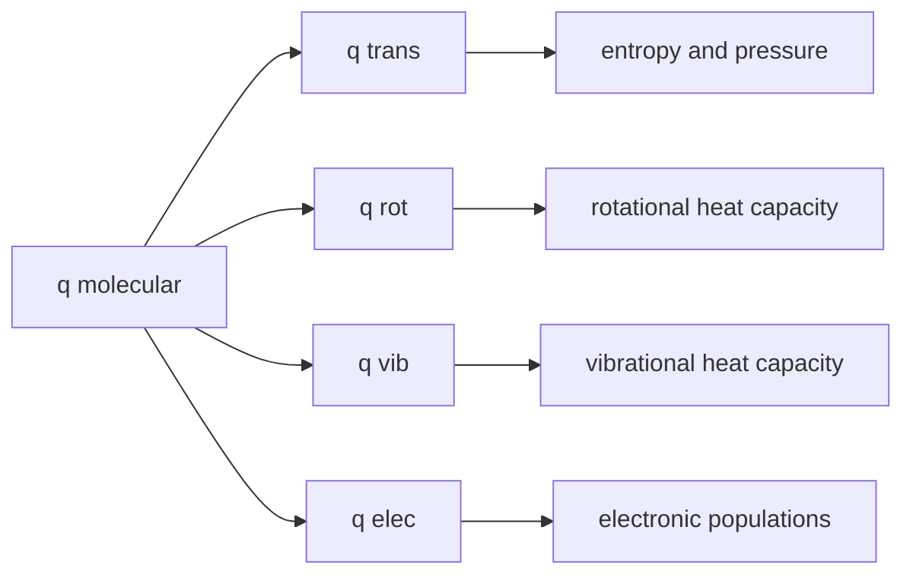

# Molecular Partition Functions

Molecular partition functions factor the motion and internal structure of a molecule into translational, rotational, vibrational, and electronic contributions. This is where quantum energy levels become practical thermodynamic tools.

For many gases, the separability approximation is accurate enough that one can write the molecular partition function as a product. Each factor has a distinct temperature dependence, which explains heat capacities, entropies, and equilibrium constants.

## Definitions

When molecular energy is approximately separable,

$$
\epsilon=\epsilon_{\mathrm{trans}}+\epsilon_{\mathrm{rot}}+\epsilon_{\mathrm{vib}}+\epsilon_{\mathrm{elec}}
$$

the molecular partition function factors:

$$
q=q_{\mathrm{trans}}q_{\mathrm{rot}}q_{\mathrm{vib}}q_{\mathrm{elec}}
$$

The translational partition function for one molecule in volume $V$ is

$$
q_{\mathrm{trans}}
=\frac{V}{\Lambda^3}
$$

where the thermal wavelength is

$$
\Lambda=\left(\frac{h^2}{2\pi mkT}\right)^{1/2}
$$

For a linear rigid rotor at temperatures high compared with its rotational temperature,

$$
q_{\mathrm{rot}}=\frac{T}{\sigma\theta_{\mathrm{rot}}}
$$

where $\sigma$ is the symmetry number and

$$
\theta_{\mathrm{rot}}=\frac{hcB}{k}
$$

For a nonlinear rigid rotor,

$$
q_{\mathrm{rot}}
=\frac{\sqrt{\pi}}{\sigma}
\left(\frac{T^3}{\theta_A\theta_B\theta_C}\right)^{1/2}
$$

For a harmonic oscillator vibration with vibrational temperature $\theta_{\mathrm{vib}}=h\nu/k$,

$$
q_{\mathrm{vib}}=\frac{1}{1-e^{-\theta_{\mathrm{vib}}/T}}
$$

when the zero of energy is set at the vibrational ground state. Including zero-point energy uses a different convention:

$$
q_{\mathrm{vib}}=\frac{e^{-\theta_{\mathrm{vib}}/(2T)}}{1-e^{-\theta_{\mathrm{vib}}/T}}
$$

The electronic partition function is

$$
q_{\mathrm{elec}}=\sum_i g_i e^{-\epsilon_i/kT}
$$

## Key results

Translational motion is usually the largest contributor to entropy because $q_{\mathrm{trans}}$ is proportional to volume and to $T^{3/2}$:

$$
q_{\mathrm{trans}}\propto V T^{3/2}m^{3/2}
$$

For an ideal monatomic gas, translational energy gives

$$
U_{\mathrm{trans}}=\frac{3}{2}nRT
$$

and

$$
C_{V,\mathrm{trans}}=\frac{3}{2}nR
$$

For a linear molecule at sufficiently high temperature, rotational energy contributes

$$
U_{\mathrm{rot}}=nRT,
\qquad
C_{V,\mathrm{rot}}=nR
$$

For a nonlinear molecule,

$$
U_{\mathrm{rot}}=\frac{3}{2}nRT,
\qquad
C_{V,\mathrm{rot}}=\frac{3}{2}nR
$$

A harmonic vibrational mode contributes

$$
U_{\mathrm{vib}}
=nR\theta_{\mathrm{vib}}
\frac{1}{e^{\theta_{\mathrm{vib}}/T}-1}
$$

above the chosen zero of energy, and

$$
C_{V,\mathrm{vib}}
=nR\left(\frac{\theta_{\mathrm{vib}}}{T}\right)^2
\frac{e^{\theta_{\mathrm{vib}}/T}}
{(e^{\theta_{\mathrm{vib}}/T}-1)^2}
$$

Vibrations with $\theta_{\mathrm{vib}}\gg T$ are mostly frozen out, while rotations with small $\theta_{\mathrm{rot}}$ are thermally active at ordinary temperatures.

The symmetry number $\sigma$ prevents overcounting indistinguishable rotational orientations. Homonuclear diatomics have $\sigma=2$, heteronuclear diatomics usually have $\sigma=1$.

The factorization $q=q_{\mathrm{trans}}q_{\mathrm{rot}}q_{\mathrm{vib}}q_{\mathrm{elec}}$ is an approximation, not a theorem for all molecules. It assumes that the total molecular energy is a sum of nearly independent contributions. Rotation-vibration coupling, anharmonicity, electronic excitation changing geometry, and strong external fields can break the separation. Nevertheless, the factorization is accurate enough for many gases and gives direct insight into why different degrees of freedom become thermally active on different temperature scales.

Translational partition functions are enormous for molecules in ordinary containers because the spacing between translational energy levels is tiny. The thermal wavelength $\Lambda$ is usually much smaller than the container dimensions. The expression $q_{\mathrm{trans}}=V/\Lambda^3$ can be read as the number of thermal de Broglie-sized cells available to the molecule. Larger volume, larger mass, and higher temperature all increase the number of accessible translational states.

The rotational partition function depends strongly on molecular shape. Linear molecules have two rotational degrees of freedom because rotation around the molecular axis contributes little for point masses along that axis. Nonlinear molecules have three. The rotational temperatures $\theta_A$, $\theta_B$, and $\theta_C$ encode moments of inertia; large molecules with large moments of inertia have small rotational temperatures and many populated rotational levels even at low temperature. Symmetry numbers matter because rotating a symmetric molecule can produce an indistinguishable configuration already counted.

Vibrational partition functions show why equipartition fails at ordinary temperature for high-frequency modes. A classical harmonic oscillator would contribute $R$ to $C_V$ per mole of vibrational modes, but quantum spacing suppresses excitation when $h\nu\gg kT$. As temperature rises, the vibrational heat capacity approaches the classical limit. This gradual activation explains why heat capacities of gases often increase with temperature.

Electronic partition functions are usually simple at room temperature because electronic gaps are large. Many closed-shell molecules have $q_{\mathrm{elec}}\approx g_0$, often 1. At high temperatures, in atoms, radicals, transition-metal complexes, and plasmas, low-lying electronic states can contribute significantly. Electronic degeneracy also contributes entropy even when only the ground electronic term is populated.

Nuclear spin is often omitted in elementary thermodynamic partition functions, but it can matter in spectroscopy and in precise statistical mechanics. Homonuclear molecules such as $\mathrm{H_2}$ have ortho and para nuclear-spin modifications with different allowed rotational levels. The interplay of nuclear spin symmetry and rotational wavefunction symmetry affects rotational populations and heat capacities at low temperature.

A practical thermodynamic calculation must use the proper standard state. The translational partition function contains volume, so converting molecular partition functions into standard molar entropies or equilibrium constants requires specifying a standard pressure or concentration. For an ideal gas, the standard molar volume at pressure $p^\circ$ is $RT/p^\circ$, and this volume enters the translational contribution.

The same partition functions connect to spectroscopy. Rotational constants measured by microwave spectroscopy determine moments of inertia used in $q_{\mathrm{rot}}$. Vibrational wavenumbers measured by IR or Raman spectroscopy determine $\theta_{\mathrm{vib}}$ and zero-point energies. Electronic spectra identify excited states for $q_{\mathrm{elec}}$. Thus spectroscopy supplies the molecular data that statistical thermodynamics needs.

## Visual

| Contribution | Typical energy scale | Partition function trend | Heat capacity behavior |
|---|---:|---|---|
| Translation | very small level spacing in macroscopic box | $q\propto VT^{3/2}$ | always active for gases |
| Rotation | microwave, small $\theta_{\mathrm{rot}}$ | $q\propto T$ for linear rotors | active near room temperature for many molecules |
| Vibration | infrared, large $\theta_{\mathrm{vib}}$ | $q=1/(1-e^{-\theta/T})$ | frozen at low $T$, active at high $T$ |
| Electronic | visible/UV or larger gaps | sum over electronic terms | often ground state only at ordinary $T$ |



## Worked example 1: Translational partition function of argon

**Problem.** Estimate $q_{\mathrm{trans}}$ for one Ar atom in a $1.00\ \mathrm{L}$ container at $298.15\ \mathrm{K}$. Use $m=39.948\ \mathrm{u}$ and $1\ \mathrm{u}=1.66054\times10^{-27}\ \mathrm{kg}$.

**Method.** Compute $\Lambda$ and then $q=V/\Lambda^3$.

1. Mass:

$$
m=(39.948)(1.66054\times10^{-27})
=6.6335\times10^{-26}\ \mathrm{kg}
$$

2. Thermal wavelength:

$$
\Lambda=\left(\frac{h^2}{2\pi mkT}\right)^{1/2}
$$

Using $h=6.6261\times10^{-34}\ \mathrm{J\ s}$ and $k=1.38065\times10^{-23}\ \mathrm{J\ K^{-1}}$:

$$
\Lambda=1.60\times10^{-11}\ \mathrm{m}
$$

3. Volume:

$$
V=1.00\ \mathrm{L}=1.00\times10^{-3}\ \mathrm{m^3}
$$

4. Partition function:

$$
q_{\mathrm{trans}}
=\frac{1.00\times10^{-3}}{(1.60\times10^{-11})^3}
=2.44\times10^{29}
$$

**Checked answer.** The value is enormous because translational energy levels in a macroscopic container are extremely closely spaced.

## Worked example 2: Vibrational population of HCl

**Problem.** HCl has a vibrational wavenumber near $2886\ \mathrm{cm^{-1}}$. Estimate the fraction of molecules in $v=1$ relative to $v=0$ at $298.15\ \mathrm{K}$ using the harmonic oscillator.

**Method.** Adjacent vibrational levels are separated by $hc\tilde\nu$, so

$$
\frac{N_1}{N_0}=e^{-hc\tilde\nu/kT}
$$

1. Vibrational temperature:

$$
\theta_{\mathrm{vib}}=(1.4388\ \mathrm{K\ cm})(2886\ \mathrm{cm^{-1}})
=4152\ \mathrm{K}
$$

2. Exponent:

$$
\frac{\theta_{\mathrm{vib}}}{T}
=\frac{4152}{298.15}
=13.93
$$

3. Ratio:

$$
\frac{N_1}{N_0}=e^{-13.93}=8.9\times10^{-7}
$$

**Checked answer.** Almost all HCl molecules are in $v=0$ at room temperature. This is why vibrational heat capacity is small at ordinary temperatures for high-frequency stretches.

## Code

```python
import numpy as np

h = 6.62607015e-34
k = 1.380649e-23
u = 1.66053906660e-27
c2 = 1.438776877  # K cm

def q_trans(V_m3, mass_u, T):
    m = mass_u * u
    Lambda = np.sqrt(h**2 / (2 * np.pi * m * k * T))
    return V_m3 / Lambda**3

def vib_population_ratio(wavenumber_cm, T):
    return np.exp(-c2 * wavenumber_cm / T)

print(q_trans(1.0e-3, 39.948, 298.15))
for T in [100, 298.15, 1000, 3000]:
    print(T, vib_population_ratio(2886.0, T))
```

## Common pitfalls

- Forgetting the volume dependence of $q_{\mathrm{trans}}$. Translational entropy changes with volume.
- Using a rotational high-temperature approximation when $T$ is not large compared with $\theta_{\mathrm{rot}}$.
- Omitting the symmetry number in rotational partition functions.
- Mixing zero-point conventions in vibrational partition functions.
- Assuming electronic excited states always matter. Many molecules have electronic gaps too large for thermal population at room temperature.

When building a molecular partition function, decide the energy zero before combining factors. If vibrational zero-point energy is included in $q_{\mathrm{vib}}$, then it should also be included consistently when comparing reactants and products. If the zero is set at the vibrational ground state, zero-point energies must be added elsewhere for reaction energetics. Mixing conventions is one of the easiest ways to get wrong equilibrium constants.

Also check temperature scales before applying high-temperature formulas. Rotational approximations usually work when $T\gg\theta_{\mathrm{rot}}$, but hydrogen and other light molecules can violate this at low temperature. Vibrational modes often require the opposite caution: many have $\theta_{\mathrm{vib}}$ of thousands of kelvins, so they are not classically active at room temperature. The phrase "degree of freedom" is therefore not enough; quantum spacing decides thermal activity.

Finally, distinguish molecular symmetry from degeneracy. The rotational symmetry number $\sigma$ corrects overcounted indistinguishable orientations. Degeneracy counts distinct states of the same energy. Both appear as divisors or multipliers in statistical formulas, but they have different origins. Homonuclear molecules, nuclear spin species, and electronic terms are common places where this distinction matters.

A useful consistency check is to ask which contribution changes when a variable changes. Increasing volume affects translation but not rotation, vibration, or electronic terms for an isolated ideal gas molecule. Isotopic substitution affects translation, rotation, and vibration through mass, but usually not the electronic energy surface strongly. Heating affects every factor through Boltzmann accessibility, but the response is largest for modes with spacings comparable to $kT$.

For polyatomic molecules, count vibrational modes before multiplying vibrational partition functions. Each normal mode contributes a factor, but degeneracies and low-frequency torsions may require special treatment beyond the simple harmonic oscillator.

Low-frequency internal rotations are a common source of error because they are not quite vibrations and not quite free rotations. Treating them as harmonic oscillators can underestimate entropy.

For precise work, compare harmonic oscillator, hindered rotor, and free rotor limits before choosing the approximation.

The entropy can change appreciably.

## Connections

- [Boltzmann distribution and partition functions](/chemistry/physical-chemistry/boltzmann-distribution-and-partition-functions)
- [Thermodynamic functions from statistics](/chemistry/physical-chemistry/thermodynamic-functions-from-statistics)
- [Rotational, vibrational, and Raman spectroscopy](/chemistry/physical-chemistry/rotational-vibrational-and-raman-spectroscopy)
- [Quantum models of motion](/chemistry/physical-chemistry/quantum-models-of-motion)
