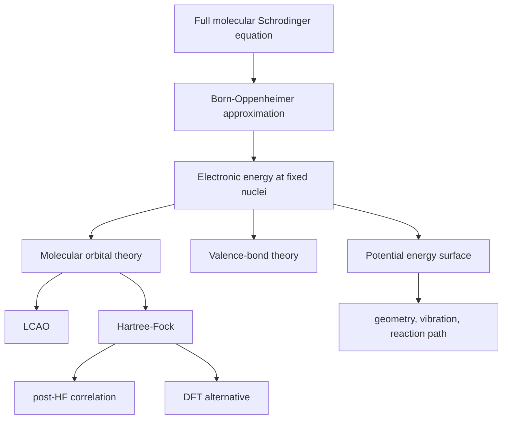

# Molecular Structure and Computational Chemistry

Molecular structure arises when atomic nuclei and electrons are treated quantum mechanically but with useful approximations. The exact many-particle Schrodinger equation is too difficult for most molecules, so chemical bonding is understood through the Born-Oppenheimer approximation, valence-bond theory, molecular orbital theory, and computational methods.

Atkins presents these models as complementary. Valence-bond language emphasizes localized bonds and resonance; molecular orbital language emphasizes delocalized orbitals and orbital energies; computational chemistry turns both into numerical predictions.


*Figure: Benzene as a familiar molecule where structure, bonding models, and computation meet. Image: [Wikimedia Commons](https://commons.wikimedia.org/wiki/File:Benzene-aromatic-3D-balls.png), Benjah-bmm27, public domain.*

## Definitions

The **Born-Oppenheimer approximation** separates electronic and nuclear motion because nuclei are much heavier than electrons. The electronic Schrodinger equation is solved at fixed nuclear positions, giving an electronic energy that acts as a potential energy surface for nuclear motion.

In valence-bond theory, a bond forms by pairing electrons in overlapping atomic orbitals. A simple covalent bond wavefunction resembles

$$
\psi_{\mathrm{VB}}=\psi_A(1)\psi_B(2)+\psi_A(2)\psi_B(1)
$$

combined with an antisymmetric spin function for electron pairing.

In molecular orbital theory, molecular orbitals are constructed as linear combinations of atomic orbitals:

$$
\psi_i=\sum_r c_{ri}\chi_r
$$

For two identical atomic orbitals $\chi_A$ and $\chi_B$, bonding and antibonding combinations are

$$
\psi_+=N_+(\chi_A+\chi_B)
$$

and

$$
\psi_-=N_-(\chi_A-\chi_B)
$$

Bond order in simple MO theory is

$$
b=\frac{N_{\mathrm{bonding}}-N_{\mathrm{antibonding}}}{2}
$$

The Hartree-Fock method approximates the many-electron wavefunction by a single Slater determinant and optimizes spin-orbitals self-consistently. Electron correlation is the part of electron-electron interaction not captured by the average-field Hartree-Fock picture.

## Key results

The variational principle states that for any acceptable trial wavefunction $\psi$,

$$
E[\psi]=\frac{\int \psi^\ast \hat H\psi\,d\tau}{\int \psi^\ast\psi\,d\tau}
\ge E_0
$$

This makes computational chemistry possible: improve the trial function and the energy moves downward toward the true ground-state energy.

For a two-orbital LCAO problem, overlap matters:

$$
S=\int \chi_A\chi_B\,d\tau
$$

The normalization constants are

$$
N_+=\frac{1}{\sqrt{2(1+S)}},
\qquad
N_-=\frac{1}{\sqrt{2(1-S)}}
$$

Constructive overlap increases electron density between nuclei and stabilizes bonding orbitals. Destructive overlap creates a node between nuclei and destabilizes antibonding orbitals.

Homonuclear diatomic molecules can be classified with $\sigma$, $\pi$, gerade/ungerade, and bonding/antibonding labels. Heteronuclear diatomics have unequal atomic orbital energies; the bonding orbital is weighted more toward the lower-energy atomic orbital.

The Huckel approximation applies a simplified MO treatment to conjugated $\pi$ systems. It expresses orbital energies in terms of Coulomb and resonance parameters:

$$
E=\alpha+x\beta
$$

where the dimensionless roots $x$ come from the secular determinant.

Computational chemistry methods trade cost and accuracy:

$$
\mathrm{HF < MP2 < coupled\ cluster}
$$

in systematic wavefunction methods, while density functional theory often offers a practical balance for larger molecules.

The Born-Oppenheimer approximation creates the potential energy surface concept. For each fixed nuclear geometry, the electronic energy is computed. Moving the nuclei maps out a surface whose minima correspond to stable structures, whose saddle points correspond to transition states, and whose curvature near a minimum gives vibrational frequencies. Reaction dynamics and spectroscopy both use this surface, so molecular structure is not only a static geometry but a landscape.

Valence-bond theory emphasizes electron pairing between atoms. It maps naturally onto Lewis structures, hybridization, localized bonds, and resonance. A molecule such as benzene is not switching among Kekule structures; rather, the VB wavefunction is a combination of structures. Resonance stabilization is the lowering of energy produced by mixing valid bonding patterns. The language is chemically intuitive, especially for reaction mechanisms that move electron pairs.

Molecular orbital theory instead assigns electrons to orbitals that can extend over an entire molecule. It explains delocalization, conjugation, aromaticity, photoelectron spectra, and magnetism. The paramagnetism of $\mathrm{O_2}$ is a classic success because two electrons occupy degenerate antibonding $\pi^\ast$ orbitals with parallel spins. A localized Lewis picture can hide this feature, while MO occupancy makes it direct.

The LCAO method is controlled by energy match, overlap, and symmetry. Atomic orbitals interact strongly when they are similar in energy, overlap spatially, and have compatible symmetry. If overlap is zero by symmetry, no bonding interaction results even if the orbitals are close in energy. If one atomic orbital is much lower in energy than another, the bonding MO is weighted toward the lower orbital and the antibonding MO toward the higher one. This is essential for polar bonds.

The secular determinant formalism turns orbital mixing into linear algebra. For basis functions $\chi_r$, the variational principle leads to equations involving Hamiltonian integrals $H_{rs}$ and overlap integrals $S_{rs}$. Nontrivial coefficients require a determinant to vanish. Huckel theory simplifies this by setting many integrals to zero or to empirical constants, allowing quick prediction of $\pi$ orbital energies and coefficients in conjugated hydrocarbons.

Hartree-Fock theory replaces explicit instantaneous electron correlation with an average field. Each electron moves in the field of nuclei and the average distribution of other electrons. Exchange is treated exactly for a single determinant, but dynamic correlation is missing. Post-Hartree-Fock methods such as configuration interaction, Moller-Plesset perturbation theory, and coupled cluster improve correlation by including excited determinants or perturbative corrections.

Density functional theory uses the electron density rather than the many-electron wavefunction as the central variable. In principle, the ground-state density determines the ground-state energy. In practice, the exchange-correlation functional must be approximated. DFT is popular because it often captures correlation at lower cost than high-level wavefunction methods, but results can depend strongly on functional choice, dispersion corrections, and basis sets.

Computational predictions should be interpreted as model-dependent. Optimized geometries, vibrational frequencies, charges, orbital energies, and reaction barriers depend on level of theory, basis set, solvation model, and treatment of conformational sampling. Physical chemistry uses computation not as a black box but as an approximate solution of the quantum mechanical structure problem with known assumptions.

Molecular structure also links to spectroscopy. Rotational constants test predicted geometries, vibrational frequencies test force constants, UV-visible spectra test electronic excited states, and NMR or EPR parameters test electronic environments. A good structural model should explain multiple kinds of data consistently.

## Visual



| Model | Main picture | Strength | Limitation |
|---|---|---|---|
| Valence bond | localized electron pairs | chemical structures, resonance | less natural for delocalized spectra |
| MO theory | delocalized orbitals | magnetism, spectra, conjugation | orbital occupancy can feel abstract |
| Huckel | simplified $\pi$ MO | fast conjugated-system trends | ignores $\sigma$ framework and correlation |
| Hartree-Fock | average-field determinant | systematic orbital calculation | misses electron correlation |
| DFT | density-based energy functional | useful for larger systems | functional choice matters |

## Worked example 1: Bond order of $\mathrm{O_2}$

**Problem.** Use the MO electron count of $\mathrm{O_2}$ to find its bond order. The valence configuration has 8 bonding and 4 antibonding electrons.

**Method.** Use

$$
b=\frac{N_b-N_a}{2}
$$

1. Identify electron counts:

$$
N_b=8,
\qquad
N_a=4
$$

2. Substitute:

$$
b=\frac{8-4}{2}
$$

3. Calculate:

$$
b=2
$$

4. Interpret: two unpaired electrons occupy degenerate antibonding $\pi^\ast$ orbitals in the ground state.

**Checked answer.** MO theory predicts a double bond and paramagnetism for $\mathrm{O_2}$, matching experiment better than a simple Lewis structure alone.

## Worked example 2: Normalization of bonding LCAO combination

**Problem.** Two normalized atomic orbitals have overlap $S=0.20$. Find the normalization constant for $\psi_+=N(\chi_A+\chi_B)$.

**Method.** Use

$$
N_+=\frac{1}{\sqrt{2(1+S)}}
$$

1. Substitute:

$$
2(1+S)=2(1.20)=2.40
$$

2. Square root:

$$
\sqrt{2.40}=1.549
$$

3. Normalization:

$$
N_+=\frac{1}{1.549}=0.645
$$

4. Check by direct normalization:

$$
\int \psi_+^2d\tau=N^2(1+1+2S)=N^2(2+0.40)=1
$$

$$
N^2=\frac{1}{2.40}
$$

**Checked answer.** $N_+=0.645$. Positive overlap increases the unnormalized norm, so the normalization constant is smaller than $1/\sqrt2$.

## Code

```python
import numpy as np

def bond_order(n_bonding, n_antibonding):
    return (n_bonding - n_antibonding) / 2

def lcao_norm(S, bonding=True):
    if bonding:
        return 1 / np.sqrt(2 * (1 + S))
    return 1 / np.sqrt(2 * (1 - S))

print("O2 bond order:", bond_order(8, 4))
for S in [0.0, 0.2, 0.5]:
    print(S, lcao_norm(S, True), lcao_norm(S, False))
```

## Common pitfalls

- Treating the Born-Oppenheimer approximation as exact. Nonadiabatic effects matter in photochemistry and some electron-transfer processes.
- Forgetting antibonding electrons when calculating bond order.
- Assuming all molecular orbitals are equally shared in heteronuclear molecules.
- Confusing resonance structures with rapidly switching molecules. Resonance is a wavefunction description.
- Treating Hartree-Fock orbital energies as exact excitation energies.

When comparing VB and MO descriptions, do not ask which one is "true" in a simplistic sense. Both are approximate languages for the same electronic structure problem. VB structures are often closer to how chemists draw mechanisms and localized bonds. MOs are often closer to spectroscopy, magnetism, and delocalization. A mature interpretation can translate between them: localized bonds can be formed from combinations of delocalized orbitals, and resonance structures can be reexpressed in orbital language.

For computational results, convergence of the calculation is not the same as accuracy of the model. A self-consistent field calculation can converge tightly to the wrong answer if the basis set is too small, the functional is inappropriate, dispersion is missing, or the wrong spin state is used. Geometry optimization can find a local minimum that is not the global minimum. Frequency analysis is needed to distinguish minima from transition states.

Orbital pictures should be used with humility. MOs are useful interpretive tools, but only the total wavefunction or density is directly tied to observables in a rigorous way. Orbital energies can guide ionization trends and reactivity, yet they should not be treated as exact measured quantities except in limited theorems and approximations. Always connect orbital arguments back to energy, symmetry, overlap, and electron occupancy.

## Connections

- [Atomic structure and spectra](/chemistry/physical-chemistry/atomic-structure-and-spectra)
- [Molecular symmetry and group theory](/chemistry/physical-chemistry/molecular-symmetry-and-group-theory)
- [Electronic, laser, and magnetic resonance spectroscopy](/chemistry/physical-chemistry/electronic-laser-and-magnetic-resonance-spectroscopy)
- [Physics quantum mechanics](/physics/quantum-mechanics/)
