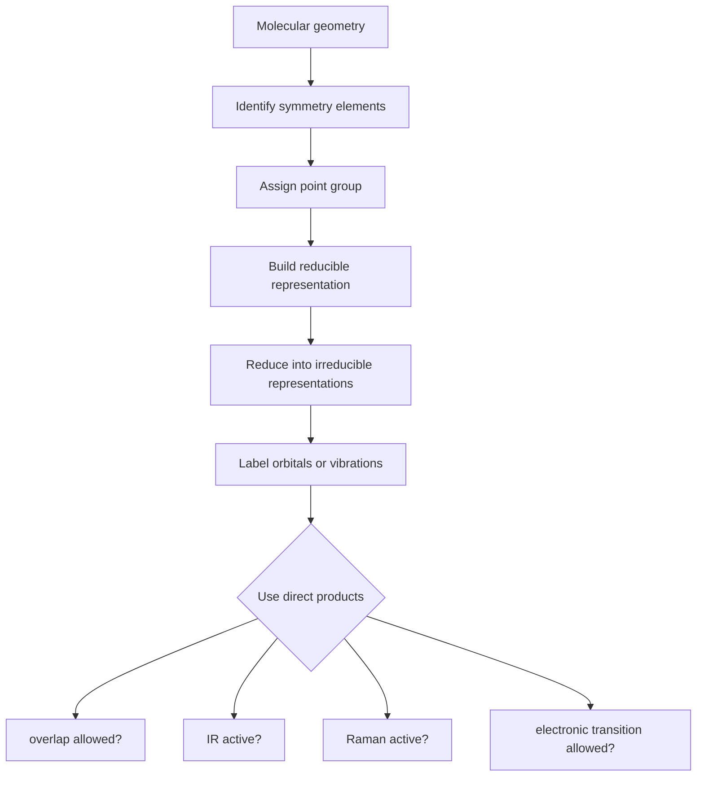

# Molecular Symmetry and Group Theory

Molecular symmetry organizes structure, bonding, and spectroscopy. Rather than treating every orbital overlap or vibrational motion separately, group theory tells us which combinations can interact, which integrals vanish, and which transitions are allowed.

Atkins introduces point groups, symmetry operations, character tables, and symmetry labels as practical tools. The core payoff is selection: symmetry decides whether an orbital overlap, matrix element, or vibrational transition can be nonzero.


*Figure: Methane as a high-symmetry molecule with tetrahedral geometry. Image: [Wikimedia Commons](https://commons.wikimedia.org/wiki/File:Methane-3D-balls.png), Benjah-bmm27, public domain.*

## Definitions

A **symmetry operation** moves a molecule into an indistinguishable orientation. A **symmetry element** is the geometrical object associated with the operation.

Common symmetry operations include:

$$
E
$$

identity,

$$
C_n
$$

rotation by $2\pi/n$,

$$
\sigma
$$

reflection,

$$
i
$$

inversion, and

$$
S_n
$$

improper rotation.

A **point group** is the complete set of symmetry operations for a molecule, all leaving at least one point fixed.

A **representation** assigns a matrix to each symmetry operation. Its **character** is the trace of that matrix. An **irreducible representation** cannot be reduced into smaller independent representations and is labeled by symbols such as $A_1$, $A_2$, $B_1$, $B_2$, and $E$.

The reduction formula for how many times irreducible representation $\Gamma_i$ appears in a reducible representation $\Gamma$ is

$$
a_i=\frac{1}{h}\sum_R n_R\chi^{(\Gamma)}(R)\chi^{(i)}(R)
$$

where $h$ is the group order, $n_R$ is the number of operations in class $R$, and $\chi$ denotes a character.

An integral can be nonzero only if the direct product of all factors contains the totally symmetric representation.

## Key results

For orbital overlap,

$$
S=\int \psi_a\psi_b\,d\tau
$$

is nonzero only if

$$
\Gamma(\psi_a)\otimes\Gamma(\psi_b)
$$

contains the totally symmetric representation. This is why orbitals of incompatible symmetry do not form bonding and antibonding pairs.

For electric dipole transitions, the transition moment integral is

$$
\mu_{fi}=\int \psi_f^\ast \hat \mu \psi_i\,d\tau
$$

The transition is allowed only if

$$
\Gamma(\psi_f)\otimes\Gamma(\mu_x,\mu_y,\mu_z)\otimes\Gamma(\psi_i)
$$

contains the totally symmetric representation.

For vibrational spectroscopy, an infrared-active normal mode must transform like one of the Cartesian coordinates $x$, $y$, or $z$, because the vibration must change the dipole moment. A Raman-active normal mode must transform like a quadratic function such as $x^2$, $xy$, or $z^2$, because the vibration must change polarizability.

For nonlinear molecules with $N$ atoms, the number of vibrational normal modes is

$$
3N-6
$$

For linear molecules, it is

$$
3N-5
$$

Symmetry also simplifies secular determinants in MO theory by forming symmetry-adapted linear combinations (SALCs). Instead of mixing all atomic orbitals, one mixes only orbitals with the same symmetry label.

Point-group assignment is a skill built from a decision process. One first looks for very high symmetry such as linear molecules or tetrahedral, octahedral, and icosahedral groups. If not present, the highest-order rotation axis is identified. Perpendicular $C_2$ axes, horizontal and vertical mirror planes, inversion centers, and improper axes then distinguish groups such as $C_{nv}$, $C_{nh}$, $D_n$, $D_{nh}$, and $D_{nd}$. Small mistakes in point group assignment propagate into wrong selection rules, so careful geometry inspection matters.

Character tables are compact summaries of how functions transform under symmetry operations. Rows are irreducible representations; columns are classes of operations. The characters for $x,y,z$ tell which translations or dipole components transform in a given way. The quadratic functions tell Raman activity. Rotations $R_x,R_y,R_z$ are useful for subtracting rotational degrees of freedom when analyzing vibrations.

Reducible representations arise naturally. For vibrations, one can assign displacement vectors to atoms and count how many remain unmoved by each symmetry operation, including how their vector components transform. The resulting characters form a reducible representation for all $3N$ Cartesian displacements. Subtract translations and rotations, then reduce the remainder to get the symmetry species of normal modes. This procedure turns geometry into spectroscopic predictions.

The direct product rule for integrals is one of the most useful group-theory results in chemistry. An integral over all space can be nonzero only if the integrand is totally symmetric. For overlap, the integrand is a product of two orbitals. For a transition moment, it is initial state, dipole operator, and final state. For vibronic coupling, it may include electronic and vibrational symmetries. The result is a selection rule without evaluating the integral explicitly.

Symmetry labels also clarify degeneracy. In many point groups, $E$ irreducible representations are doubly degenerate and $T$ representations are triply degenerate. Degenerate orbitals or vibrations must transform together as a set. Lowering symmetry can split degeneracies, which is why distortions, ligand fields, and crystal environments change spectra.

The mutual exclusion rule for centrosymmetric molecules is a direct symmetry result. If a molecule has an inversion center, vibrations that are ungerade can be IR active because $x,y,z$ are ungerade, while gerade vibrations can be Raman active because quadratic functions are gerade. A normal mode cannot be both gerade and ungerade, so IR and Raman activity are mutually exclusive. Molecules without inversion symmetry need not obey this rule.

SALCs provide a systematic way to build molecular orbitals in polyatomic molecules. Ligand orbitals are combined into symmetry-adapted groups, and only SALCs with the same symmetry as a central atom orbital can mix. This reduces the size of secular problems and explains bonding patterns in molecules such as $\mathrm{H_2O}$, $\mathrm{NH_3}$, and transition-metal complexes.

Group theory does not replace chemical judgment. It can say an interaction is forbidden by symmetry or allowed by symmetry, but it does not by itself give the magnitude. Allowed overlap may still be small because orbitals are far apart or poorly energy matched. A symmetry-allowed transition may still be weak because the transition moment is numerically small. Symmetry is a filter, not a complete quantitative theory.

## Visual



| Operation | Symbol | Example meaning |
|---|---|---|
| Identity | $E$ | do nothing |
| Proper rotation | $C_n$ | rotate by $360^\circ/n$ |
| Reflection | $\sigma$ | reflect through a plane |
| Inversion | $i$ | send $(x,y,z)$ to $(-x,-y,-z)$ |
| Improper rotation | $S_n$ | rotate then reflect perpendicular to axis |

## Worked example 1: Vibrational mode count for water

**Problem.** How many normal modes does $\mathrm{H_2O}$ have?

**Method.** Water is nonlinear and has $N=3$ atoms.

1. Total Cartesian displacements:

$$
3N=3(3)=9
$$

2. Remove translations:

$$
9-3=6
$$

3. Remove rotations for a nonlinear molecule:

$$
6-3=3
$$

4. Therefore:

$$
3N-6=3
$$

**Checked answer.** Water has three vibrational modes: symmetric stretch, bend, and antisymmetric stretch.

## Worked example 2: Direct product test in $C_{2v}$

**Problem.** In $C_{2v}$, suppose an initial state has symmetry $A_1$, a final state has symmetry $B_1$, and $x$ transforms as $B_1$. Is the $x$-polarized transition symmetry allowed?

**Method.** Test whether

$$
\Gamma_f\otimes\Gamma_x\otimes\Gamma_i
$$

contains $A_1$.

1. Substitute:

$$
B_1\otimes B_1\otimes A_1
$$

2. In $C_{2v}$,

$$
B_1\otimes B_1=A_1
$$

3. Then:

$$
A_1\otimes A_1=A_1
$$

4. Since the product is totally symmetric, the transition is symmetry allowed.

**Checked answer.** The transition is allowed for $x$ polarization by symmetry. Intensity can still be small for other physical reasons.

## Code

```python
# Direct products for C2v using sign characters under (E, C2, sigma_v(xz), sigma_v'(yz))
irreps = {
    "A1": (1, 1, 1, 1),
    "A2": (1, 1, -1, -1),
    "B1": (1, -1, 1, -1),
    "B2": (1, -1, -1, 1),
}

def direct_product(*labels):
    chars = [1, 1, 1, 1]
    for label in labels:
        chars = [a * b for a, b in zip(chars, irreps[label])]
    for name, rep in irreps.items():
        if tuple(chars) == rep:
            return name
    raise ValueError("No match")

print(direct_product("B1", "B1", "A1"))
print(direct_product("A2", "B1"))
```

## Common pitfalls

- Confusing symmetry operation with symmetry element.
- Assigning point groups before checking all operations.
- Forgetting to remove translations and rotations when counting vibrations.
- Assuming symmetry-allowed means intense. Symmetry is a necessary condition, not the only intensity factor.
- Multiplying characters from different point groups. Direct products must be within the same group.

A practical point-group workflow prevents most errors. Sketch the molecule in a clear orientation, identify the principal axis, check for perpendicular $C_2$ axes, then check mirror planes and inversion. If the molecule is slightly distorted in reality, decide whether the idealized or actual symmetry is appropriate for the problem. Spectroscopy of a distorted molecule may show bands that are forbidden in the higher ideal symmetry.

When reducing representations, keep classes and operations distinct. A character table column may represent a class containing several operations; the reduction formula includes the class size $n_R$. Omitting that factor gives wrong counts. After reduction, the sum of dimensions must match the dimension of the original representation. This provides a quick arithmetic check.

For vibrational analysis, subtract translations and rotations only after forming the full $3N$ displacement representation. Linear and nonlinear molecules differ in the number of rotations removed. Then use the character table to decide IR and Raman activity. This workflow is slower than guessing, but it is reliable and scales to molecules where visual assignment is not obvious.

If a direct product or reduction result seems surprising, test it against a simple physical picture. A totally symmetric vibration should preserve all symmetry operations, an antisymmetric stretch should change sign under some operations, and an orbital with a nodal plane should be antisymmetric to reflection through that plane. Character tables formalize these observations; they should not feel disconnected from molecular shape.

## Connections

- [Molecular structure and computational chemistry](/chemistry/physical-chemistry/molecular-structure-and-computational-chemistry)
- [Rotational, vibrational, and Raman spectroscopy](/chemistry/physical-chemistry/rotational-vibrational-and-raman-spectroscopy)
- [Electronic, laser, and magnetic resonance spectroscopy](/chemistry/physical-chemistry/electronic-laser-and-magnetic-resonance-spectroscopy)
- [Engineering math linear algebra](/math/engineering-math/)
