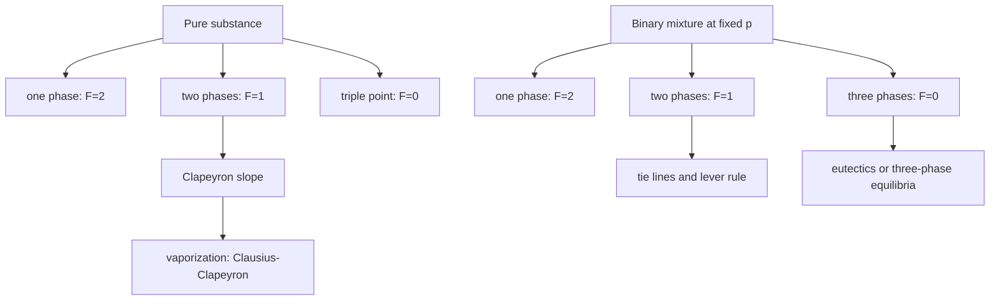

# Phase Transitions and Phase Diagrams

Phase diagrams compress a large amount of thermodynamic information into a visual map. They show which phases are stable at given temperature, pressure, and composition, and they mark the conditions under which phases coexist.

Atkins develops both pure-substance phase diagrams and mixture phase diagrams because the same chemical-potential idea controls vaporization, fusion, sublimation, azeotropes, eutectics, liquid crystals, and materials purification. A phase boundary is not just a line on a graph; it is the set of conditions where chemical potentials are equal across phases.


*Figure: Pressure-temperature phase diagram of water. Image: [Wikimedia Commons](https://commons.wikimedia.org/wiki/File:Phase_diagram_of_water.svg), Cmglee, CC BY-SA 3.0.*

## Definitions

A **phase** is a form of matter uniform in chemical composition and physical state. A **component** is the minimum number of independent species needed to describe the composition of all phases. A **constituent** is an actual chemical species present.

For a one-component system at phase equilibrium between phases $\alpha$ and $\beta$,

$$
\mu^\alpha(T,p)=\mu^\beta(T,p)
$$

The **phase rule** is

$$
F=C-P+2
$$

where $F$ is the variance or number of independent intensive variables, $C$ is the number of components, and $P$ is the number of phases. At fixed pressure for condensed binary diagrams, the reduced rule is

$$
F=C-P+1
$$

The **Clapeyron equation** gives the slope of a phase boundary:

$$
\frac{dp}{dT}
=\frac{\Delta_{\mathrm{trs}}S}{\Delta_{\mathrm{trs}}V}
=\frac{\Delta_{\mathrm{trs}}H}{T\Delta_{\mathrm{trs}}V}
$$

For vaporization or sublimation, if the vapor is a perfect gas and condensed-phase volume is neglected, the Clausius-Clapeyron equation is

$$
\frac{d\ln p}{dT}
=\frac{\Delta_{\mathrm{vap}}H}{RT^2}
$$

If $\Delta_{\mathrm{vap}}H$ is constant,

$$
\ln\frac{p_2}{p_1}
=-\frac{\Delta_{\mathrm{vap}}H}{R}
\left(\frac{1}{T_2}-\frac{1}{T_1}\right)
$$

For binary liquid-vapor diagrams, a **tie line** at fixed temperature or pressure connects coexisting phase compositions. The **lever rule** gives phase amounts:

$$
\frac{n_\alpha}{n_\beta}
=\frac{\mathrm{distance\ from\ overall\ composition\ to\ }\beta}
{\mathrm{distance\ from\ overall\ composition\ to\ }\alpha}
$$

## Key results

For a pure substance, phase boundaries meet at the triple point, where solid, liquid, and vapor coexist. Since $C=1$ and $P=3$,

$$
F=1-3+2=0
$$

so the triple point has no freedom: both $T$ and $p$ are fixed. Along a two-phase boundary,

$$
F=1-2+2=1
$$

so choosing $T$ fixes $p$, or choosing $p$ fixes $T$.

The critical point terminates the liquid-vapor boundary. Above the critical temperature, there is no sharp liquid-vapor phase transition; a supercritical fluid can have liquid-like density and gas-like transport.

The sign of the solid-liquid slope follows from the Clapeyron equation. Most substances have $\Delta_{\mathrm{fus}}V\gt 0$, so the melting point rises with pressure. Water is unusual because ice is less dense than liquid water, so $\Delta_{\mathrm{fus}}V\lt 0$ and the melting line has negative slope.

In binary liquid-vapor diagrams, fractional distillation works because vapor and liquid compositions differ. Azeotropes are exceptions where vapor and liquid have the same composition at a boiling extremum, so simple distillation cannot pass that composition.

In binary liquid-solid diagrams, eutectics are compositions that melt or freeze at a minimum temperature. At the eutectic temperature in a simple binary eutectic,

$$
C=2,\quad P=3,\quad F=2-3+1=0
$$

at fixed pressure, so solid $A$, solid $B$, and liquid coexist invariantly.

The most important idea behind a phase diagram is equality of chemical potentials. A phase is stable when its chemical potential is lower than alternatives at the same $T$ and $p$. A boundary occurs when two phases have equal chemical potential. If the system crosses the boundary, the lower-$\mu$ phase changes, and a phase transformation becomes thermodynamically favorable. This interpretation prevents phase diagrams from becoming memorized pictures: every line is a balance of molar Gibbs energies.

The Clapeyron equation follows by differentiating the equality $\mu^\alpha=\mu^\beta$ along a coexistence curve. For each phase,

$$
d\mu=V_m\,dp-S_m\,dT
$$

so equality of changes gives

$$
(V_m^\beta-V_m^\alpha)dp=(S_m^\beta-S_m^\alpha)dT
$$

and therefore

$$
\frac{dp}{dT}=\frac{\Delta S}{\Delta V}
$$

This derivation is compact but conceptually rich: phase-boundary slopes are ratios of entropy and volume changes.

The Clausius-Clapeyron approximation works best for vaporization and sublimation because gas volume dominates condensed-phase volume. If the vapor behaves ideally, $\Delta V\approx RT/p$, and substitution into Clapeyron gives the logarithmic vapor-pressure relation. Plotting $\ln p$ against $1/T$ often gives an approximately straight line whose slope yields $\Delta_{\mathrm{vap}}H/R$ with a sign convention. Curvature appears when the enthalpy of vaporization changes appreciably with temperature or the vapor is not ideal.

The phase rule is a counting rule with chemical content. In a one-component two-phase system, only one intensive variable is free. This is why the boiling point of a pure liquid is fixed once the external pressure is fixed. At the triple point of a pure substance, no intensive freedom remains. In a binary mixture at fixed pressure, a two-phase region has one freedom: if temperature is fixed, the compositions of the two phases are fixed by the ends of the tie line, and the overall composition determines only the relative amounts.

Binary liquid-vapor diagrams explain distillation. If vapor is richer in the more volatile component than the liquid, repeated vaporization and condensation enrich the distillate. An azeotrope breaks this strategy because liquid and vapor compositions become equal at the azeotropic point. The mixture then boils like a pure substance at that composition even though it contains two components. The thermodynamic cause is nonideal solution behavior strong enough to create an extremum in boiling temperature or vapor pressure.

Liquid-solid diagrams are central in materials chemistry. Eutectics are important because they melt at lower temperature than either pure component and solidify into fine two-phase microstructures. Peritectics and incongruent melting show that compounds in a binary system may be stable as solids but not as liquids of the same composition. Such diagrams guide alloy preparation, solder selection, ceramic processing, and semiconductor purification.

Zone refining and zone leveling use phase diagrams under non-equilibrium operating conditions. If impurities are more soluble in the melt than in the solid, a moving molten zone can sweep impurities toward one end of a solid rod. The equilibrium diagram explains the direction of partitioning, while the practical purification depends on repeated passes and controlled solidification. This is a good example of equilibrium thermodynamics informing a process that is deliberately run dynamically.

Liquid crystals broaden the meaning of phase. A mesophase can have orientational order without full positional order, so it is neither an ordinary liquid nor an ordinary crystal. Their phase diagrams depend on temperature, composition, and molecular shape, and their optical anisotropy makes display technology possible. The same phase-rule logic still applies, but the phases have more subtle structural order.

## Visual



| Feature | Pure substance | Binary mixture |
|---|---|---|
| Phase boundary | Line in $p$-$T$ plane | Region in $T$-$x$ or $p$-$x$ plane |
| Coexistence condition | equal $\mu$ of same substance | equal component chemical potentials across phases |
| Invariant point | triple point | eutectic, peritectic, three-phase point |
| Distillation relevance | boiling point | vapor and liquid compositions differ |
| Materials relevance | melting/freezing | alloy microstructure, zone refining, liquid crystals |

## Worked example 1: Vapor pressure from Clausius-Clapeyron

**Problem.** A liquid has vapor pressure $100.0\ \mathrm{kPa}$ at $350.0\ \mathrm{K}$ and $\Delta_{\mathrm{vap}}H=35.0\ \mathrm{kJ\ mol^{-1}}$. Estimate its vapor pressure at $330.0\ \mathrm{K}$.

**Method.** Use the integrated Clausius-Clapeyron equation.

1. Write the relation:

$$
\ln\frac{p_2}{p_1}
=-\frac{\Delta_{\mathrm{vap}}H}{R}
\left(\frac{1}{T_2}-\frac{1}{T_1}\right)
$$

2. Substitute:

$$
\frac{1}{330.0}-\frac{1}{350.0}
=0.0030303-0.0028571
=1.7316\times 10^{-4}\ \mathrm{K^{-1}}
$$

3. Enthalpy factor:

$$
\frac{\Delta_{\mathrm{vap}}H}{R}
=\frac{35000}{8.314}
=4210\ \mathrm{K}
$$

4. Log pressure ratio:

$$
\ln\frac{p_2}{p_1}
=-(4210)(1.7316\times 10^{-4})
=-0.729
$$

5. Pressure:

$$
p_2=100.0e^{-0.729}
=48.2\ \mathrm{kPa}
$$

**Checked answer.** Lower temperature gives lower vapor pressure. The estimate $48\ \mathrm{kPa}$ is plausible for a $20\ \mathrm{K}$ decrease with a moderate vaporization enthalpy.

## Worked example 2: Lever rule in a two-phase region

**Problem.** At a certain temperature, a binary liquid-vapor system has liquid composition $x_B^{(l)}=0.20$ and vapor composition $x_B^{(v)}=0.70$. A sample has overall composition $z_B=0.40$. Find the fraction of the total amount in the vapor phase.

**Method.** Use material balance:

$$
z_B=f_vx_B^{(v)}+(1-f_v)x_B^{(l)}
$$

1. Substitute:

$$
0.40=f_v(0.70)+(1-f_v)(0.20)
$$

2. Expand:

$$
0.40=0.70f_v+0.20-0.20f_v
$$

3. Collect:

$$
0.20=0.50f_v
$$

4. Solve:

$$
f_v=0.40
$$

**Checked answer.** The overall composition is closer to the liquid composition than to the vapor composition, so less than half the sample should be vapor. The answer $40\%$ vapor is consistent.

## Code

```python
import numpy as np

R = 8.314462618

def vapor_pressure_clausius(p1, T1, T2, delta_h_vap):
    exponent = -(delta_h_vap / R) * (1.0 / T2 - 1.0 / T1)
    return p1 * np.exp(exponent)

def vapor_fraction(z, x_liq, x_vap):
    return (z - x_liq) / (x_vap - x_liq)

for T in [320, 330, 340, 350]:
    p = vapor_pressure_clausius(100.0, 350.0, T, 35000.0)
    print(f"T={T} K  p={p:7.2f} kPa")

print("vapor fraction:", vapor_fraction(0.40, 0.20, 0.70))
```

## Common pitfalls

- Using the phase rule without checking whether pressure is fixed. Condensed phase diagrams often use the reduced form.
- Reading a two-phase composition from the overall composition. Phase compositions come from tie-line endpoints; the overall composition gives amounts through the lever rule.
- Applying Clausius-Clapeyron over too wide a temperature range while treating $\Delta H$ as constant.
- Confusing a eutectic with an azeotrope. A eutectic is liquid-solid behavior; an azeotrope is liquid-vapor behavior.
- Ignoring metastability. Supercooling and supersaturation can delay phase change but do not redefine equilibrium boundaries.

When reading a phase diagram, first identify the axes and what is held fixed. A $p$-$T$ diagram for a pure substance, a $T$-$x$ diagram at fixed pressure, and a $p$-$x$ diagram at fixed temperature answer different questions. Then identify the region, not just the nearest curve. A point in a two-phase region represents an overall composition and temperature; the actual phase compositions are found at boundary intersections connected by a tie line.

For lever-rule calculations, draw the tie line and label distances before inserting numbers. The amount of a phase is proportional to the distance from the overall composition to the opposite phase boundary. This "opposite side" rule is easy to reverse if done mentally. A quick check is that if the overall composition lies close to the liquid boundary, most of the sample should be liquid.

For phase-boundary slopes, return to Clapeyron rather than memorized signs. The sign depends on both entropy and volume changes. Vaporization has positive $\Delta S$ and large positive $\Delta V$, so vapor pressure rises with temperature. Fusion usually has positive $\Delta S$ and positive $\Delta V$, but water has negative $\Delta V$ for melting ice, giving a negative melting-line slope.

## Connections

- [Properties of gases](/chemistry/physical-chemistry/properties-of-gases)
- [Mixtures, solutions, and activities](/chemistry/physical-chemistry/mixtures-solutions-and-activities)
- [Molecular interactions and transport](/chemistry/physical-chemistry/molecular-interactions-and-transport)
- [General chemistry phase changes](/chemistry/general/)
