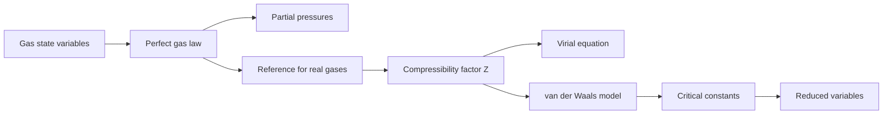

# Properties of Gases

Gases are the simplest macroscopic systems in physical chemistry because their pressure, volume, temperature, and amount of substance are tightly connected by equations of state. Atkins begins equilibrium thermodynamics with gases because a gas lets us see how empirical laws, molecular pictures, and calculus-based thermodynamics support one another.

The perfect gas is the reference model: molecules are treated as point particles with negligible intermolecular forces except during collisions. Real gases depart from that model when attractions, repulsions, and finite molecular size become important, especially at high pressure and near condensation.


*Figure: Maxwell-Boltzmann molecular speed distributions for noble gases. Image: [Wikimedia Commons](https://commons.wikimedia.org/wiki/File:MaxwellBoltzmann-en.svg), Pdbailey with SVG conversion by Lilyu, public domain.*

## Definitions

A **state variable** is a property that describes the present condition of the system. For a simple pure gas, the usual variables are pressure $p$, volume $V$, temperature $T$, and amount $n$. An **equation of state** relates them:

$$
p=f(T,V,n)
$$

The **perfect gas equation** is

$$
pV=nRT
$$

where $R=8.314462618\ \mathrm{J\ K^{-1}\ mol^{-1}}$. The molar volume is $V_m=V/n$, so the perfect gas law may also be written $pV_m=RT$.

For mixtures, the mole fraction and partial pressure of component $J$ are

$$
x_J=\frac{n_J}{\sum_K n_K},
\qquad
p_J=x_Jp
$$

when the mixture behaves perfectly. The **compressibility factor** measures deviations from perfect behavior:

$$
Z=\frac{pV_m}{RT}
$$

For a perfect gas, $Z=1$ at all pressures and temperatures. For a real gas, $Z$ may be smaller than 1 when attractions dominate and larger than 1 when repulsions dominate.

Two common real-gas equations are the virial equation and the van der Waals equation. The pressure virial form is

$$
Z=1+B'(T)p+C'(T)p^2+\cdots
$$

and the molar-volume form is

$$
Z=1+\frac{B(T)}{V_m}+\frac{C(T)}{V_m^2}+\cdots
$$

The van der Waals equation is

$$
p=\frac{RT}{V_m-b}-\frac{a}{V_m^2}
$$

where $a$ represents attractive interactions and $b$ represents excluded volume.

## Key results

Boyle's law, Charles's law, and Avogadro's principle combine into the perfect gas law in the low-pressure limit:

$$
pV=\mathrm{constant}\quad (n,T\ \mathrm{constant})
$$

$$
V\propto T\quad (n,p\ \mathrm{constant}),
\qquad
V\propto n\quad (p,T\ \mathrm{constant})
$$

The gas laws are limiting laws. They work well when the gas is dilute enough that the average separation between molecules is large compared with molecular dimensions and the potential energy of interaction is small compared with thermal energy.

The van der Waals equation gives a useful qualitative correction. The observed pressure is lower than the perfect-gas value because attractions reduce the impulse delivered to the walls. The accessible volume is lower than $V_m$ because molecules occupy finite space. Rearranging,

$$
\left(p+\frac{a}{V_m^2}\right)(V_m-b)=RT
$$

Critical constants follow from the inflection point of the critical isotherm:

$$
\left(\frac{\partial p}{\partial V_m}\right)_T=0,
\qquad
\left(\frac{\partial^2 p}{\partial V_m^2}\right)_T=0
$$

For the van der Waals model,

$$
V_{m,c}=3b,
\qquad
p_c=\frac{a}{27b^2},
\qquad
T_c=\frac{8a}{27Rb}
$$

Reduced variables compare a state with its critical point:

$$
p_r=\frac{p}{p_c},
\qquad
V_r=\frac{V_m}{V_{m,c}},
\qquad
T_r=\frac{T}{T_c}
$$

The principle of corresponding states says that many gases have similar reduced equations of state when expressed using these variables.

The pressure of a gas also has a mechanical interpretation that is useful throughout the subject. A gas exerts pressure because molecules transfer momentum to the container walls. Higher temperature increases the average kinetic energy and therefore increases the rate and severity of wall collisions. Larger volume lowers the collision frequency at the walls. This molecular picture is not needed to use the perfect gas equation, but it explains why the equation has the structure it does and why it fails when molecules are close enough for attractions and repulsions to matter.

The distinction between a limiting law and an exact law is important. The perfect gas law is approached as $p\to0$ because the average separation between molecules grows large. In that limit, potential-energy contributions from intermolecular forces become negligible compared with translational kinetic energy. A real gas at ordinary laboratory pressure may be close enough to ideal for rough stoichiometry, but precision thermodynamics uses fugacity or measured equations of state. The virial equation is especially valuable because each coefficient carries information about molecular interactions: the second virial coefficient reflects pair interactions, the third virial coefficient reflects three-body effects, and so on.

The sign of the second virial coefficient is physically meaningful. If attractions dominate at a given temperature, $B(T)$ is negative and $Z\lt 1$ at sufficiently low density: the gas pressure is lower than the perfect-gas value because molecules are pulled slightly back from the wall by neighboring molecules. If repulsions dominate, $B(T)$ is positive and $Z\gt 1$: finite molecular size and short-range repulsion raise the pressure. The Boyle temperature is the temperature at which $B(T)=0$, so a real gas obeys the perfect gas law unusually well over a wider low-pressure range, even though higher virial terms still remain.

The van der Waals equation should be read as a model rather than a high-accuracy correlation. Its attraction parameter $a$ lowers pressure by an amount proportional to concentration squared, because attractions depend on pair encounters. Its excluded-volume parameter $b$ reduces the volume available for molecular translation. These two corrections are enough to predict liquid-vapor loops and a critical point, which the perfect gas law cannot do. However, near the critical point real fluids show fluctuation behavior that the simple mean-field van der Waals model cannot capture quantitatively.

Critical phenomena matter because above $T_c$ a gas cannot be liquefied by pressure alone. Below $T_c$, compression can produce a two-phase liquid-vapor region; at $T_c$, the distinction between liquid and gas disappears. Supercritical fluids combine high density with transport properties closer to gases, which is why they are useful in extraction and materials processing. In the language of phase diagrams, the critical point is the endpoint of a coexistence curve; in the language of equations of state, it is the point where an isotherm has a horizontal inflection.

Gas mixtures introduce another layer of idealization. Dalton's law assumes each gas contributes to the total pressure as if it occupied the container alone at the same temperature. This is reliable for low-pressure mixtures because molecular identity barely affects translational pressure. In real mixtures, unlike interactions can be different from like interactions, so activity or fugacity replaces partial pressure in accurate equilibrium work. Even then, the perfect-gas partial pressure remains the reference concept for defining standard states and reaction quotients.

A final practical theme is dimensional discipline. The same equation can look different depending on whether $R$ is expressed in $\mathrm{J\ K^{-1}\ mol^{-1}}$, $\mathrm{L\ bar\ K^{-1}\ mol^{-1}}$, or $\mathrm{L\ atm\ K^{-1}\ mol^{-1}}$. Real-gas constants $a$ and $b$ are also unit-dependent. Many numerical errors in gas calculations are not conceptual errors but unit mismatches, especially when pressure is converted between pascals, bar, atmospheres, torr, and millimeters of mercury.

## Visual

| Model or quantity | Main equation | Best use | Limitation |
|---|---:|---|---|
| Perfect gas | $pV=nRT$ | Dilute gases, reference states | Ignores attractions and molecular size |
| Dalton mixture | $p_J=x_Jp$ | Gas mixtures at low pressure | Fails when mixture nonideality is strong |
| Compressibility factor | $Z=pV_m/RT$ | Measures real-gas deviation | Descriptive unless paired with model/data |
| Virial equation | $Z=1+B/V_m+C/V_m^2+\cdots$ | Accurate empirical corrections | Coefficients depend on $T$ and gas identity |
| van der Waals | $p=RT/(V_m-b)-a/V_m^2$ | Qualitative real-gas physics, criticality | Quantitatively rough near critical point |



## Worked example 1: Pressure from a column of liquid

**Problem.** A mercury barometer has a mercury column of height $760.0\ \mathrm{mm}$ at a place where $g=9.80665\ \mathrm{m\ s^{-2}}$. Mercury has density $13.595\ \mathrm{g\ cm^{-3}}$. Calculate the pressure in pascals and atmospheres.

**Method.** The pressure at the base of a liquid column is the weight per area:

$$
p=\rho gh
$$

**Steps.**

1. Convert density:

$$
\rho=13.595\ \mathrm{g\ cm^{-3}}
=13.595\times 10^3\ \mathrm{kg\ m^{-3}}
$$

2. Convert height:

$$
h=760.0\ \mathrm{mm}=0.7600\ \mathrm{m}
$$

3. Substitute:

$$
\begin{aligned}
p&=(13.595\times 10^3\ \mathrm{kg\ m^{-3}})
(9.80665\ \mathrm{m\ s^{-2}})
(0.7600\ \mathrm{m})\\
&=1.0132\times 10^5\ \mathrm{Pa}
\end{aligned}
$$

4. Convert to atmospheres:

$$
\frac{1.0132\times 10^5\ \mathrm{Pa}}{101325\ \mathrm{Pa\ atm^{-1}}}
=0.9999\ \mathrm{atm}
$$

**Checked answer.** The pressure is essentially $1.013\times 10^5\ \mathrm{Pa}=1.000\ \mathrm{atm}$. The check is that $760\ \mathrm{mmHg}$ is the conventional atmospheric-pressure height.

## Worked example 2: Real-gas pressure with van der Waals corrections

**Problem.** Estimate the pressure of $1.000\ \mathrm{mol}$ of $\mathrm{CO_2}$ in a $1.000\ \mathrm{L}$ vessel at $300.0\ \mathrm{K}$ using the perfect gas equation and the van der Waals equation. Use $a=3.592\ \mathrm{L^2\ bar\ mol^{-2}}$ and $b=0.04267\ \mathrm{L\ mol^{-1}}$.

**Method.** For $n=1$, $V_m=1.000\ \mathrm{L\ mol^{-1}}$. Use $R=0.08314\ \mathrm{L\ bar\ K^{-1}\ mol^{-1}}$.

1. Perfect gas pressure:

$$
\begin{aligned}
p_{\mathrm{ideal}}
&=\frac{RT}{V_m}\\
&=\frac{(0.08314)(300.0)}{1.000}\\
&=24.94\ \mathrm{bar}
\end{aligned}
$$

2. Excluded-volume term:

$$
\frac{RT}{V_m-b}
=\frac{(0.08314)(300.0)}{1.000-0.04267}
=\frac{24.94}{0.95733}
=26.05\ \mathrm{bar}
$$

3. Attraction correction:

$$
\frac{a}{V_m^2}
=\frac{3.592}{(1.000)^2}
=3.592\ \mathrm{bar}
$$

4. van der Waals pressure:

$$
p=26.05-3.592=22.46\ \mathrm{bar}
$$

5. Compressibility factor:

$$
Z=\frac{pV_m}{RT}
=\frac{(22.46)(1.000)}{24.94}
=0.901
$$

**Checked answer.** The real-gas estimate is $22.5\ \mathrm{bar}$, lower than the ideal value because attractions dominate at this state. The result $Z\lt 1$ confirms that interpretation.

## Code

```python
import numpy as np

R = 0.08314  # L bar K^-1 mol^-1
a = 3.592   # CO2, L^2 bar mol^-2
b = 0.04267 # CO2, L mol^-1
T = 300.0

Vm = np.linspace(0.08, 5.0, 200)
p_ideal = R * T / Vm
p_vdw = R * T / (Vm - b) - a / Vm**2
Z_vdw = p_vdw * Vm / (R * T)

for volume in [0.5, 1.0, 2.0, 5.0]:
    p = R * T / (volume - b) - a / volume**2
    z = p * volume / (R * T)
    print(f"Vm={volume:4.1f} L/mol  p={p:7.2f} bar  Z={z:6.3f}")
```

## Common pitfalls

- Treating $pV=nRT$ as exact for all gases. It is a limiting model; check pressure, temperature, and phase proximity.
- Forgetting that $V_m$ in van der Waals equations is molar volume. If using total volume, use the $n$-dependent form.
- Mixing pressure units inside $R$. Use $8.314\ \mathrm{J\ K^{-1}\ mol^{-1}}$ with pascals and cubic meters, or $0.08314\ \mathrm{L\ bar\ K^{-1}\ mol^{-1}}$ with liters and bar.
- Interpreting $a$ and $b$ as universal constants. They depend on the gas.
- Assuming $Z\lt 1$ always means a gas is "more ideal." It means attractions reduce pressure relative to the perfect-gas value at that state.

## Connections

- [General chemistry gases](/chemistry/general/gases)
- [First law and thermochemistry](/chemistry/physical-chemistry/first-law-and-thermochemistry)
- [Phase transitions and phase diagrams](/chemistry/physical-chemistry/phase-transitions-and-phase-diagrams)
- [Physics thermodynamics](/physics/general/thermodynamics)
