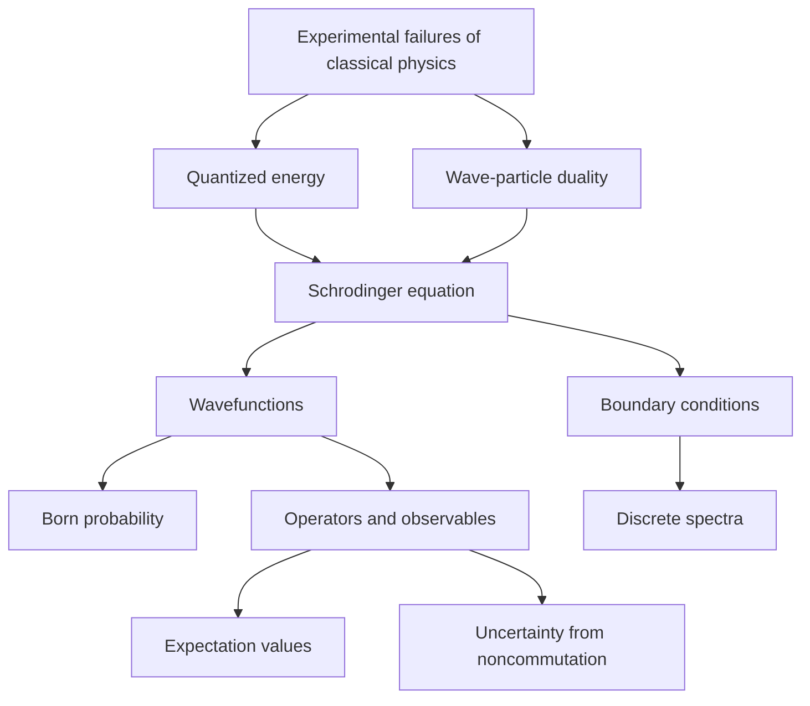

# Quantum Foundations

Quantum theory supplies the molecular energy levels used by statistical thermodynamics and spectroscopy. Classical mechanics predicts continuous energies and definite trajectories, but microscopic experiments show quantization, wave-particle duality, uncertainty, and probabilistic measurement.

Atkins develops quantum mechanics as the structure language of physical chemistry: orbitals, bonding, spectra, and molecular symmetry all depend on wavefunctions and operators. The foundational postulates are mathematical, but their chemical meaning is concrete: they determine allowed energies and transition intensities.

## Definitions

Planck's relation connects photon energy and frequency:

$$
E=h\nu
$$

The de Broglie relation connects matter wavelength and momentum:

$$
\lambda=\frac{h}{p}
$$

The wavefunction $\psi$ is a probability amplitude. The Born interpretation states that, in one dimension,

$$
|\psi(x)|^2\,dx
$$

is the probability of finding the particle between $x$ and $x+dx$. A normalized wavefunction satisfies

$$
\int_{-\infty}^{\infty}|\psi(x)|^2\,dx=1
$$

The time-independent Schrodinger equation is

$$
\hat H\psi=E\psi
$$

For one particle in one dimension,

$$
\hat H=-\frac{\hbar^2}{2m}\frac{d^2}{dx^2}+V(x)
$$

so

$$
-\frac{\hbar^2}{2m}\frac{d^2\psi}{dx^2}+V(x)\psi=E\psi
$$

An observable is represented by a Hermitian operator. If $\psi$ is an eigenfunction of $\hat A$,

$$
\hat A\psi=a\psi
$$

then $a$ is a possible measurement result.

The expectation value is

$$
\langle A\rangle=\int \psi^\ast \hat A\psi\,d\tau
$$

## Key results

The uncertainty principle for position and momentum is

$$
\Delta x\,\Delta p_x\ge \frac{\hbar}{2}
$$

It is not a statement of poor instrumentation; it follows from the wave nature of matter and the noncommutation of operators:

$$
[\hat x,\hat p_x]=i\hbar
$$

The momentum operator in one dimension is

$$
\hat p_x=-i\hbar\frac{d}{dx}
$$

For a free particle with constant potential, wave-like solutions have the form

$$
\psi=e^{ikx}
$$

and

$$
p=\hbar k
$$

which reproduces $\lambda=2\pi/k=h/p$.

Boundary conditions produce quantization. A wavefunction must normally be finite, single-valued, continuous, and have a continuous first derivative where the potential is finite. If only certain wavelengths fit the boundary conditions, then only certain energies are allowed.

Superposition is central:

$$
\psi=c_1\psi_1+c_2\psi_2+\cdots
$$

If the basis functions are stationary states, the coefficients determine probabilities, and interference between terms can affect spatial distributions and transition amplitudes.

The early evidence for quantum theory came from failures of classical physics in several different settings. Blackbody radiation required quantized oscillator energies to avoid the ultraviolet catastrophe. The photoelectric effect required light to deliver energy in packets, because increasing intensity at too low a frequency did not eject electrons. Atomic line spectra showed that atoms emit and absorb only specific frequencies. Heat capacities of solids fell at low temperature rather than staying at the classical equipartition value. These observations all pointed to discrete energy exchange and wave-like matter.

The Schrodinger equation should be treated as a postulate, much like Newton's laws in classical mechanics. Its credibility comes from its consequences. For a free particle it gives wave solutions consistent with the de Broglie relation. For bound systems it produces discrete energies. For atoms and molecules it predicts orbitals, bonding patterns, and spectra. The equation does not describe a classical path; it describes a state from which probabilities and observable averages are calculated.

Normalization is not optional because probability must sum to 1. In three dimensions the condition is

$$
\int |\psi(\mathbf r)|^2\,d\tau=1
$$

where $d\tau$ may be $dx\,dy\,dz$ or a coordinate-appropriate volume element such as $r^2\sin\theta\,dr\,d\theta\,d\phi$. Coordinate changes therefore matter. A radial wavefunction in an atom may be largest at the nucleus, while the radial probability distribution includes the $4\pi r^2$ shell-volume factor and may peak away from the nucleus.

Operators encode measurement. The Hamiltonian operator corresponds to total energy, the momentum operator to momentum, and position acts by multiplication. If a system is in an eigenstate of an operator, measurement of that observable gives the corresponding eigenvalue with certainty. If not, the wavefunction can be expanded in eigenfunctions, and the squared coefficients give probabilities for the different outcomes. This is why superposition is physically consequential rather than merely algebraic.

Commutation determines compatibility. If two operators commute, they can have simultaneous eigenfunctions and their observables can be specified together. If they do not commute, there is an uncertainty relation. Position and momentum are the classic pair, but angular momentum components also fail to commute with one another. This is why an orbital can have well-defined $L^2$ and $L_z$, but not simultaneous definite $L_x$, $L_y$, and $L_z$.

Complex wavefunctions are not an exotic extra. Traveling waves naturally use complex exponentials, and time-dependent quantum mechanics uses phase factors such as $e^{-iEt/\hbar}$. The measurable probability density is real, but relative phase affects interference and transition amplitudes. Molecular orbital signs, phases, and nodal patterns therefore matter deeply even though only $\vert \psi\vert ^2$ is directly interpreted as probability density.

Boundary conditions supply much of chemistry. A wavefunction confined by a box, attracted by a Coulomb potential, or localized in a bond must satisfy mathematical restrictions. Only certain shapes fit, and those shapes determine energies. This is why confinement in conjugated molecules changes color, why smaller quantum dots absorb at shorter wavelengths, and why vibrational frequencies depend on bond strength and reduced mass.

The postulates of quantum mechanics also explain why spectroscopy is selective. A transition is not allowed merely because two levels have the right energy difference. Radiation interacts through an operator, often the electric dipole moment, and the transition moment integral must be nonzero. Symmetry and overlap decide whether this happens. Thus the foundations here connect directly to group theory and spectroscopy later in the wiki.

## Visual



| Concept | Mathematical form | Chemical consequence |
|---|---:|---|
| Photon quantization | $E=h\nu$ | spectra measure energy gaps |
| Matter waves | $\lambda=h/p$ | electron diffraction, orbitals |
| Born rule | probability density $\vert \psi\vert ^2$ | electron density and orbital interpretation |
| Schrodinger equation | $\hat H\psi=E\psi$ | allowed molecular energies |
| Operator expectation | $\langle A\rangle=\int\psi^\ast\hat A\psi d\tau$ | measurable averages |
| Uncertainty | $\Delta x\Delta p\ge\hbar/2$ | no classical electron orbits |

## Worked example 1: de Broglie wavelength of an electron

**Problem.** Estimate the de Broglie wavelength of an electron accelerated through $100\ \mathrm{V}$ from rest. Ignore relativistic effects.

**Method.** The kinetic energy gained is $eV$. For nonrelativistic motion,

$$
E_k=\frac{p^2}{2m_e}
$$

so

$$
p=(2m_eeV)^{1/2}
$$

and $\lambda=h/p$.

1. Energy:

$$
E_k=(1.602\times10^{-19}\ \mathrm{C})(100\ \mathrm{V})
=1.602\times10^{-17}\ \mathrm{J}
$$

2. Momentum:

$$
p=\sqrt{2(9.109\times10^{-31})(1.602\times10^{-17})}
=5.40\times10^{-24}\ \mathrm{kg\ m\ s^{-1}}
$$

3. Wavelength:

$$
\lambda=\frac{6.626\times10^{-34}}{5.40\times10^{-24}}
=1.23\times10^{-10}\ \mathrm{m}
$$

**Checked answer.** $\lambda=0.123\ \mathrm{nm}$, comparable to atomic spacings, which is why electrons can diffract from crystals.

## Worked example 2: Normalizing a simple wavefunction

**Problem.** Normalize $\psi(x)=Nx$ on $0\le x\le a$ and $\psi=0$ elsewhere.

**Method.** Require

$$
\int_0^a |Nx|^2\,dx=1
$$

1. Set up:

$$
N^2\int_0^a x^2\,dx=1
$$

2. Integrate:

$$
\int_0^a x^2\,dx=\frac{a^3}{3}
$$

3. Solve:

$$
N^2\frac{a^3}{3}=1
$$

$$
N^2=\frac{3}{a^3}
$$

4. Choose positive real normalization:

$$
N=\sqrt{\frac{3}{a^3}}
=\frac{\sqrt{3}}{a^{3/2}}
$$

**Checked answer.** The normalized function is $\psi(x)=\sqrt{3/a^3}\,x$. Its units are $L^{-1/2}$, correct for a one-dimensional wavefunction.

## Code

```python
import numpy as np
from scipy.integrate import quad

h = 6.62607015e-34
me = 9.1093837015e-31
e = 1.602176634e-19

def electron_wavelength(volts):
    p = np.sqrt(2 * me * e * volts)
    return h / p

print("lambda at 100 V (nm):", electron_wavelength(100) * 1e9)

a = 2.0
N = np.sqrt(3 / a**3)
integral, error = quad(lambda x: (N * x)**2, 0, a)
print("normalization constant:", N)
print("integral:", integral, "error estimate:", error)
```

## Common pitfalls

- Treating $\psi$ itself as a probability. The probability density is $\vert \psi\vert ^2$.
- Forgetting normalization before calculating expectation values.
- Assuming a negative wavefunction has negative probability. Sign and phase matter through interference, not direct probability.
- Applying classical trajectories to bound electrons. Quantum states are spatial distributions, not planetary orbits.
- Ignoring boundary conditions; they are often the source of quantized energies.

A useful habit is to state the Hilbert-space object before interpreting it. Are you discussing a wavefunction, a probability density, an operator, an eigenvalue, or an expectation value? Many conceptual mistakes come from sliding between these. For example, an orbital drawing is usually a surface of constant amplitude or density, not a literal boundary that contains an electron.

When evaluating integrals, include the correct volume element. In spherical coordinates, $d\tau=r^2\sin\theta\,dr\,d\theta\,d\phi$, so radial probability includes an $r^2$ factor. This is why an electron in a hydrogen $1s$ orbital has maximum density at the nucleus but maximum radial probability at a nonzero radius. Density and shell probability answer different questions.

For uncertainty, avoid the measurement-disturbance oversimplification. Disturbance can occur, but the deeper statement is that some operators do not share exact simultaneous eigenstates. The spread is built into the state. This interpretation is essential for understanding zero-point energy, tunneling, and the absence of classical rest for confined particles.

Dimensional analysis is a useful guardrail in quantum work. A one-dimensional normalized wavefunction has units of $L^{-1/2}$, a three-dimensional one has units of $L^{-3/2}$, and operators must return quantities with the units of their observables. Checking units often catches missing volume elements, missing $\hbar$, and incorrect normalization constants before the physics is interpreted.

When a result is complex-valued, ask whether the observable should be real. Probabilities, energies, and expectation values of Hermitian operators must be real even when the intermediate wavefunctions and amplitudes are complex.

Approximation is normal in quantum chemistry. The important habit is to state the approximation, identify the small parameter or neglected coupling, and check whether the conclusion depends on what was neglected.

This is especially important when moving from one-particle models to many-electron molecules.

## Connections

- [Quantum models of motion](/chemistry/physical-chemistry/quantum-models-of-motion)
- [Atomic structure and spectra](/chemistry/physical-chemistry/atomic-structure-and-spectra)
- [Physics quantum mechanics](/physics/quantum-mechanics/)
- [Engineering math differential equations](/math/engineering-math/)
