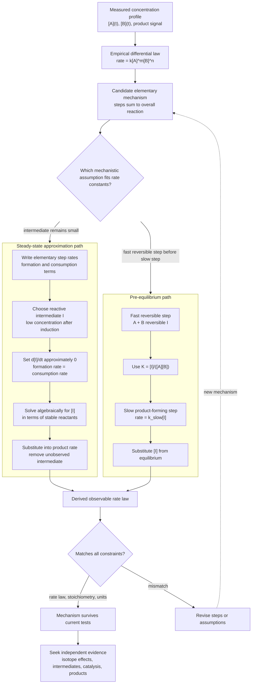

# Rate Laws and Reaction Mechanisms

Chemical kinetics studies how fast reactions occur and what molecular sequence produces the observed rate law. Equilibrium says where a reaction can go; kinetics says how quickly it gets there and by what route.

Atkins builds kinetics from empirical rate laws, integrated forms, elementary reactions, and mechanism approximations. The most important practical skill is separating the experimentally observed rate law from the proposed molecular mechanism that explains it.

## Definitions

For a reaction

$$
\mathrm{aA+bB\to products}
$$

the rate may be expressed as

$$
v=-\frac{1}{a}\frac{d[A]}{dt}
=-\frac{1}{b}\frac{d[B]}{dt}
$$

A rate law has the form

$$
v=k[A]^m[B]^n
$$

where $m$ and $n$ are reaction orders determined experimentally, not necessarily stoichiometric coefficients. The overall order is $m+n$.

For a first-order reaction,

$$
\frac{d[A]}{dt}=-k[A]
$$

and

$$
[A]_t=[A]_0e^{-kt}
$$

For a second-order reaction in one reactant,

$$
\frac{d[A]}{dt}=-k[A]^2
$$

and

$$
\frac{1}{[A]_t}=\frac{1}{[A]_0}+kt
$$

The half-life is the time for a concentration to fall to half its initial value. For first order,

$$
t_{1/2}=\frac{\ln2}{k}
$$

An elementary reaction is a single molecular event. Its molecularity can be unimolecular, bimolecular, or rarely termolecular. A mechanism is a sequence of elementary steps.

## Key results

Integrated rate laws allow rate constants to be obtained by linear plots:

| Order | Integrated form | Linear plot | Half-life |
|---|---:|---|---|
| Zero | $[A]_t=[A]_0-kt$ | $[A]$ vs $t$ | $[A]_0/(2k)$ |
| First | $\ln[A]_t=\ln[A]_0-kt$ | $\ln[A]$ vs $t$ | $\ln2/k$ |
| Second | $1/[A]_t=1/[A]_0+kt$ | $1/[A]$ vs $t$ | $1/(k[A]_0)$ |

For reversible first-order reactions,

$$
\mathrm{A\rightleftharpoons B}
$$

with forward rate constant $k_f$ and reverse rate constant $k_r$, the relaxation toward equilibrium has characteristic constant

$$
k_{\mathrm{obs}}=k_f+k_r
$$

The steady-state approximation sets the concentration derivative of a reactive intermediate nearly to zero:

$$
\frac{d[I]}{dt}\approx0
$$

The pre-equilibrium approximation assumes an early reversible step reaches equilibrium before the slow step consumes its product.

For consecutive first-order reactions,

$$
\mathrm{A\xrightarrow{k_1}B\xrightarrow{k_2}C}
$$

intermediate $B$ rises and then falls. Its concentration is

$$
[B](t)=\frac{k_1[A]_0}{k_2-k_1}
\left(e^{-k_1t}-e^{-k_2t}\right)
$$

when $k_1\ne k_2$.

Enzyme kinetics in the Michaelis-Menten scheme,

$$
\mathrm{E+S\rightleftharpoons ES\to E+P}
$$

gives

$$
v=\frac{V_{\max}[S]}{K_M+[S]}
$$

under steady-state assumptions.

Experimental kinetics begins with reliable concentration or signal measurements as functions of time. Spectrophotometry, conductivity, pressure measurements, mass spectrometry, NMR, stopped-flow methods, flash photolysis, and relaxation techniques each access different time scales and reaction types. The measured signal must be related to concentration, and side reactions, mixing times, and temperature control can determine whether the extracted rate law is meaningful.

Initial-rate methods are useful because concentrations of products and intermediates are still small. By varying one initial concentration while holding others fixed, the order with respect to that species can be estimated. Isolation methods place one reactant in large excess so its concentration changes little; the observed rate law becomes pseudo-first-order or pseudo-zero-order in the limiting species. This simplifies analysis but requires checking that the excess concentration truly remains effectively constant.

Integrated rate laws are diagnostic but not foolproof. A straight line in $\ln[A]$ versus $t$ suggests first-order behavior, but experimental noise or limited conversion can make several models appear plausible. Nonlinear regression to the differential or integrated form, residual analysis, and independent experiments at varied initial concentrations provide stronger evidence. Units of $k$ are also diagnostic: first-order $k$ has $\mathrm{s^{-1}}$, second-order $k$ often has $\mathrm{L\ mol^{-1}\ s^{-1}}$, and zero-order $k$ has concentration per time.

Mechanisms must reproduce the observed rate law and stoichiometry, but that does not prove uniqueness. Multiple mechanisms can lead to the same empirical law. A proposed mechanism gains credibility when it also explains isotope effects, intermediates, catalysis, stereochemistry, solvent effects, activation parameters, and product distributions. Physical chemistry therefore treats mechanisms as models constrained by evidence, not as direct observations unless intermediates or transition states are independently characterized.

The steady-state approximation is most appropriate for reactive intermediates present at low concentration because their formation and consumption rates nearly balance after a short induction period. It should not be applied automatically to any species that is difficult to observe. The pre-equilibrium approximation, in contrast, assumes a reversible step rapidly equilibrates before a slower product-forming step. Choosing between them requires chemical judgment about relative rate constants.

Chain reactions introduce initiation, propagation, branching, inhibition, and termination. A small radical concentration can sustain rapid conversion through propagation cycles. Explosions occur when chain branching or heat release accelerates faster than termination or heat removal. Polymerization kinetics uses related ideas: initiation creates active centers, propagation grows chains, and termination removes active centers. The molecular weight distribution depends on these competing rates.

Enzyme kinetics is a special but important mechanism class. Michaelis-Menten behavior saturates because enzyme active sites become occupied at high substrate concentration. $V_{\max}$ reflects the total active enzyme concentration and catalytic turnover, while $K_M$ combines several microscopic rate constants. Inhibitors alter apparent parameters in diagnostic ways: competitive inhibitors raise apparent $K_M$ without changing $V_{\max}$ in the simplest model, while other inhibition modes have different signatures.

Reactions approaching equilibrium require both forward and reverse rates. Near equilibrium, relaxation methods perturb the system slightly and measure the exponential return. The relaxation time often gives sums of forward and reverse rate constants, while the equilibrium constant gives their ratio. This is a powerful way to measure fast reactions that are hard to follow by direct mixing.

Kinetic isotope effects provide mechanistic clues because isotopic substitution changes vibrational zero-point energies and sometimes tunneling probabilities. A large primary hydrogen/deuterium isotope effect suggests H transfer in or before the rate-determining step. Smaller secondary effects can report hybridization changes. These effects connect kinetics back to quantum vibrational structure.

## Visual



The mechanism diagram separates empirical rate-law fitting from two derivation architectures: steady-state and pre-equilibrium. Each subgraph shows the algebraic handoff that removes an unobserved intermediate from the final observable rate law. The feedback loop is explicit because agreement with the measured law is necessary but not enough; mechanisms still need independent chemical evidence.

## Worked example 1: First-order rate constant from half-life

**Problem.** A first-order decomposition has half-life $35.0\ \mathrm{min}$. Find $k$ in $\mathrm{s^{-1}}$ and the fraction remaining after $2.00\ \mathrm{h}$.

**Method.** Use $k=\ln2/t_{1/2}$ and $[A]_t/[A]_0=e^{-kt}$.

1. Convert half-life:

$$
t_{1/2}=35.0\ \mathrm{min}=2100\ \mathrm{s}
$$

2. Rate constant:

$$
k=\frac{0.6931}{2100}
=3.30\times10^{-4}\ \mathrm{s^{-1}}
$$

3. Convert reaction time:

$$
t=2.00\ \mathrm{h}=7200\ \mathrm{s}
$$

4. Fraction remaining:

$$
\frac{[A]_t}{[A]_0}=e^{-(3.30\times10^{-4})(7200)}
=e^{-2.376}
=0.0928
$$

**Checked answer.** Two hours is 3.43 half-lives, and $(1/2)^{3.43}=0.093$, matching the exponential result.

## Worked example 2: Steady-state mechanism

**Problem.** For the mechanism

$$
\mathrm{A \xrightarrow{k_1} I}
$$

$$
\mathrm{I+B \xrightarrow{k_2} P}
$$

$$
\mathrm{I \xrightarrow{k_3} Q}
$$

derive the rate of product $P$ using the steady-state approximation for $I$.

**Method.** Write formation and consumption terms for $I$.

1. Intermediate balance:

$$
\frac{d[I]}{dt}=k_1[A]-k_2[I][B]-k_3[I]
$$

2. Steady state:

$$
0=k_1[A]-[I](k_2[B]+k_3)
$$

3. Solve for $[I]$:

$$
[I]=\frac{k_1[A]}{k_2[B]+k_3}
$$

4. Product rate:

$$
v_P=k_2[I][B]
$$

5. Substitute:

$$
v_P=\frac{k_1k_2[A][B]}{k_2[B]+k_3}
$$

**Checked answer.** At high $[B]$, $v_P\to k_1[A]$ because every intermediate is captured by $B$. At low $[B]$, $v_P\approx(k_1k_2/k_3)[A][B]$.

## Code

```python
import numpy as np
from scipy.optimize import curve_fit

def first_order(t, A0, k):
    return A0 * np.exp(-k * t)

t = np.array([0, 600, 1200, 1800, 2400, 3000], dtype=float)
A = np.array([1.000, 0.820, 0.670, 0.550, 0.450, 0.368])

params, covariance = curve_fit(first_order, t, A, p0=[1.0, 3e-4])
A0_fit, k_fit = params
print("A0:", A0_fit)
print("k s^-1:", k_fit)
print("half-life s:", np.log(2) / k_fit)
```

## Common pitfalls

- Reading reaction orders from stoichiometric coefficients. Orders are experimental unless the step is elementary.
- Using linearized plots without checking residuals; nonlinear fitting is often better.
- Applying steady state to a stable product rather than a reactive intermediate.
- Forgetting units of $k$ change with reaction order.
- Treating catalysts as absent from rate laws. Catalysts can appear in the rate law even though they are regenerated.

Before deriving a rate law from a mechanism, write every elementary step with its own rate expression. Only elementary steps allow stoichiometric exponents to become rate-law exponents directly. Then identify intermediates, catalysts, and stable species. Intermediates must be eliminated from the final rate law because they are usually not controlled experimental concentrations. Catalysts may remain if their total concentration affects the rate.

Check limiting behavior after deriving any complicated expression. If a reactant concentration goes to zero, the rate should usually go to zero. If a capturing reagent becomes very large, a branching mechanism may approach a maximum rate. These limits often reveal algebra mistakes and also give chemical interpretation. The steady-state example on this page illustrates how low- and high-$[B]$ limits produce different apparent orders.

For enzyme or chain mechanisms, remember that observed orders can change with concentration range. Michaelis-Menten kinetics is first order in substrate at low $[S]$ and zero order at high $[S]$. Radical chains can show half-order dependences when termination is bimolecular. Apparent orders are therefore properties of a regime, not necessarily universal constants for the reaction.

Temperature control is part of kinetic measurement. Because rate constants often change exponentially with temperature, a small uncontrolled temperature drift can masquerade as a concentration effect or produce poor reproducibility. Reported rate constants should therefore include temperature, solvent, ionic strength when relevant, and the method used to initiate and monitor the reaction.

Mass balance is another basic check. The concentration changes implied by a mechanism must reproduce the overall stoichiometric equation when elementary steps are added and intermediates are canceled.

A rate-determining step is a useful phrase only when one step clearly controls the flux. In many mechanisms, several steps and equilibria jointly shape the observed rate law.

Use the derived rate law, not intuition alone, to identify that control.

## Connections

- [Chemical equilibrium](/chemistry/physical-chemistry/chemical-equilibrium)
- [Temperature dependence and reaction dynamics](/chemistry/physical-chemistry/temperature-dependence-and-reaction-dynamics)
- [Catalysis, surfaces, macromolecules, and solids](/chemistry/physical-chemistry/catalysis-surfaces-macromolecules-and-solids)
- [General chemistry kinetics](/chemistry/general/)
