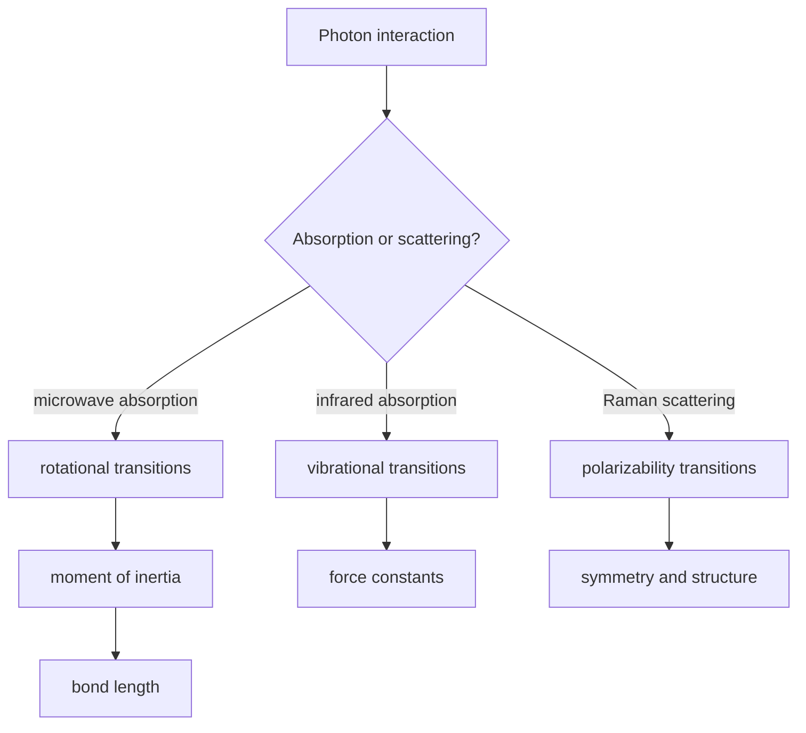

# Rotational, Vibrational, and Raman Spectroscopy

Rotational and vibrational spectroscopy read molecular motion directly. Microwave spectra reveal moments of inertia and bond lengths, infrared spectra reveal vibrational frequencies and dipole changes, and Raman spectra reveal polarizability changes and symmetry.

Atkins treats spectroscopy as quantum mechanics made observable: photons are absorbed or scattered when their energy matches allowed molecular energy differences and when transition moments satisfy selection rules.


*Figure: Molecular energy-level diagram for Raman scattering and infrared absorption. Image: [Wikimedia Commons](https://commons.wikimedia.org/wiki/File:Raman_energy_levels.svg), Moxfyre based on work by Pavlina2.0, CC BY-SA 3.0.*


*Figure: Raman spectrometer as real instrumentation behind scattering spectra. Image: [Wikimedia Commons](https://commons.wikimedia.org/wiki/File:Raman-Spektrometer.jpg), IOM Leipzig, CC BY 4.0.*

## Definitions

For a rigid linear rotor,

$$
E_J=hcBJ(J+1)
$$

where

$$
B=\frac{h}{8\pi^2cI}
$$

when $B$ is in wavenumber units. The moment of inertia of a diatomic molecule is

$$
I=\mu r^2
$$

Microwave rotational absorption requires a permanent electric dipole moment and follows

$$
\Delta J=\pm1
$$

For a harmonic oscillator,

$$
E_v=\left(v+\frac{1}{2}\right)hc\tilde\nu
$$

and the ideal vibrational selection rule is

$$
\Delta v=\pm1
$$

Infrared activity requires a changing dipole moment:

$$
\left(\frac{\partial \mu}{\partial Q}\right)_0\ne0
$$

Raman activity requires a changing polarizability:

$$
\left(\frac{\partial \alpha}{\partial Q}\right)_0\ne0
$$

For a diatomic molecule, the fundamental vibrational wavenumber is

$$
\tilde\nu=\frac{1}{2\pi c}\sqrt{\frac{k}{\mu}}
$$

## Key results

Rotational transition wavenumbers for a rigid rotor are

$$
\tilde\nu_{J\to J+1}=2B(J+1)
$$

so adjacent lines are separated by

$$
2B
$$

This spacing gives the moment of inertia and then bond length.

Real vibrations are anharmonic. A common expression is

$$
G(v)=\tilde\nu_e\left(v+\frac{1}{2}\right)
-\tilde\nu_ex_e\left(v+\frac{1}{2}\right)^2
$$

Anharmonicity makes higher transitions weakly allowed, shifts hot bands, and causes level spacings to decrease as $v$ increases.

Vibration-rotation spectra combine changes in both $v$ and $J$. For a diatomic fundamental transition, the rotational branches are roughly:

$$
\Delta J=-1\quad P\ \mathrm{branch}
$$

$$
\Delta J=+1\quad R\ \mathrm{branch}
$$

The $Q$ branch with $\Delta J=0$ is absent for many simple diatomic vibrational-rotational spectra but appears in other molecular symmetries and transition types.

Raman scattering shifts the frequency of incident light. Stokes lines leave the molecule with more energy; anti-Stokes lines leave it with less energy. Anti-Stokes lines are weaker at ordinary temperature because fewer molecules begin in excited states.

For polyatomic molecules, normal modes are classified by symmetry. A center of inversion gives a mutual exclusion rule: in centrosymmetric molecules, modes that are IR active are not Raman active, and Raman active modes are not IR active.

Spectral linewidths contain dynamical information. Natural linewidth comes from finite excited-state lifetime through an energy-time uncertainty relation. Doppler broadening comes from molecular motion toward or away from the radiation source. Pressure broadening comes from collisions that interrupt phase coherence. Instrumental resolution adds another contribution. A measured line shape therefore reflects both molecular energy levels and the environment in which molecules are observed.

Rotational spectra are especially precise because microwave frequencies can be measured accurately and rotational levels depend directly on moments of inertia. Isotopic substitution changes reduced mass while leaving the equilibrium geometry nearly unchanged. Comparing rotational constants of isotopologues allows structural determination. For polyatomic molecules, three principal moments of inertia can be extracted for asymmetric tops, though spectra become more complex.

Centrifugal distortion is the first correction to the rigid rotor. As $J$ increases, rotation stretches the bond slightly, increasing the moment of inertia and decreasing level spacings relative to the rigid prediction. A common correction is

$$
\tilde F(J)=BJ(J+1)-DJ^2(J+1)^2
$$

where $D$ is the centrifugal distortion constant. Observing deviations from equal rotational spacing provides information about bond flexibility.

Vibrational anharmonicity explains overtones and combination bands. The harmonic oscillator predicts only $\Delta v=\pm1$, but real molecular potentials are not exactly parabolic. Anharmonic wavefunctions and dipole moment functions allow weak transitions with $\Delta v=\pm2,\pm3,\dots$. Combination bands involve simultaneous excitation of more than one normal mode. These features make real IR spectra richer than the simple harmonic picture.

The intensity of an IR band depends on the dipole derivative with respect to the normal coordinate. A strong polar bond stretch can produce intense absorption, while a symmetric vibration in a nonpolar environment may be weak or absent. Raman intensity depends on polarizability change. Symmetric stretches that strongly distort the electron cloud can be intense in Raman even when weak in IR. This complementarity is one reason IR and Raman spectra are often interpreted together.

Vibration-rotation spectra show the coupling of vibrational and rotational energy. The $P$ and $R$ branches flank the band origin, and their spacing contains rotational constants in the lower and upper vibrational states. Because bond length changes slightly with vibrational excitation, $B$ differs between states. Careful analysis gives both equilibrium bond lengths and anharmonic corrections.

For polyatomic molecules, normal coordinates are collective motions, not independent local bonds. A "C=O stretch" label is often useful, but the true normal mode can include motion of several atoms. Coupling is strongest when local motions have similar frequencies and compatible symmetry. This is why isotopic substitution can shift and mix bands, helping assign spectra.

Astrophysical and environmental applications rely heavily on rotational and vibrational spectra. Rotational spectra identify small molecules in interstellar space because cold gas populates low $J$ states. Infrared spectra identify greenhouse gases because vibrational transitions absorb terrestrial radiation. The same selection rule that makes a molecule IR active in the lab makes it relevant to atmospheric radiative balance.

## Visual



| Spectroscopy | Energy scale | Selection condition | Structural information |
|---|---|---|---|
| Pure rotational | microwave | permanent dipole, $\Delta J=\pm1$ | bond lengths, moments of inertia |
| Infrared vibrational | IR | changing dipole moment | force constants, functional groups |
| Vibration-rotation | IR with fine structure | vibrational and rotational rules | bond length and anharmonicity |
| Raman | scattered visible/near-IR | changing polarizability | symmetric modes, molecular symmetry |

## Worked example 1: Bond length from rotational spacing

**Problem.** A diatomic molecule has adjacent pure rotational lines separated by $20.0\ \mathrm{cm^{-1}}$. Its reduced mass is $1.14\times10^{-26}\ \mathrm{kg}$. Estimate the bond length.

**Method.** Rotational spacing is $2B$, so $B=10.0\ \mathrm{cm^{-1}}$. Use

$$
B=\frac{h}{8\pi^2cI}
$$

with $B$ in $\mathrm{m^{-1}}$, then $I=\mu r^2$.

1. Convert:

$$
B=10.0\ \mathrm{cm^{-1}}=1000\ \mathrm{m^{-1}}
$$

2. Moment of inertia:

$$
I=\frac{h}{8\pi^2cB}
$$

$$
I=\frac{6.626\times10^{-34}}
{8\pi^2(2.998\times10^8)(1000)}
=2.80\times10^{-47}\ \mathrm{kg\ m^2}
$$

3. Bond length:

$$
r=\sqrt{\frac{I}{\mu}}
=\sqrt{\frac{2.80\times10^{-47}}{1.14\times10^{-26}}}
$$

$$
r=4.96\times10^{-11}\ \mathrm{m}
=49.6\ \mathrm{pm}
$$

**Checked answer.** The value is very short, consistent with a light molecule and large rotational spacing.

## Worked example 2: Force constant from IR wavenumber

**Problem.** A diatomic molecule with reduced mass $1.05\times10^{-26}\ \mathrm{kg}$ has an IR stretch at $2140\ \mathrm{cm^{-1}}$. Estimate the force constant.

**Method.** Use

$$
k=(2\pi c\tilde\nu)^2\mu
$$

with $\tilde\nu$ in $\mathrm{m^{-1}}$.

1. Convert:

$$
2140\ \mathrm{cm^{-1}}=2.140\times10^5\ \mathrm{m^{-1}}
$$

2. Frequency:

$$
c\tilde\nu=(2.998\times10^8)(2.140\times10^5)
=6.416\times10^{13}\ \mathrm{s^{-1}}
$$

3. Angular frequency:

$$
2\pi c\tilde\nu=4.031\times10^{14}\ \mathrm{s^{-1}}
$$

4. Force constant:

$$
k=(4.031\times10^{14})^2(1.05\times10^{-26})
=1.71\times10^3\ \mathrm{N\ m^{-1}}
$$

**Checked answer.** A high wavenumber and large force constant are consistent with a multiple bond such as CO.

## Code

```python
import numpy as np

h = 6.62607015e-34
c = 2.99792458e8

def bond_length_from_spacing(spacing_cm, reduced_mass):
    B_m = (spacing_cm / 2.0) * 100.0
    I = h / (8 * np.pi**2 * c * B_m)
    return np.sqrt(I / reduced_mass)

def force_constant_from_wavenumber(wavenumber_cm, reduced_mass):
    wn_m = wavenumber_cm * 100.0
    return (2 * np.pi * c * wn_m)**2 * reduced_mass

print("r pm:", bond_length_from_spacing(20.0, 1.14e-26) * 1e12)
print("k N/m:", force_constant_from_wavenumber(2140.0, 1.05e-26))
```

## Common pitfalls

- Forgetting to convert $\mathrm{cm^{-1}}$ to $\mathrm{m^{-1}}$ when using SI constants.
- Expecting homonuclear diatomics to show pure rotational microwave spectra. They have no permanent dipole.
- Treating all vibrational modes as IR active. The dipole derivative must be nonzero.
- Confusing Raman shifts with absorbed photon frequencies.
- Ignoring anharmonicity when interpreting overtones or high vibrational levels.

For rotational spectra, always distinguish line position from line spacing. In a rigid rotor, line positions are $2B(J+1)$ and adjacent spacing is $2B$. If the problem gives spacing, divide by 2 to obtain $B$. If it gives the first line, identify whether that line corresponds to $J=0\to1$. Small indexing mistakes produce bond lengths wrong by square-root factors.

For vibrational spectra, treat a normal-mode label as an assignment, not a complete description. A band near a characteristic functional-group frequency is useful, but coupling, hydrogen bonding, isotopic substitution, and molecular symmetry can shift or split it. In polyatomic molecules, normal modes are collective and can mix when frequencies are close.

For Raman spectra, the incident laser frequency is not the molecular transition frequency. The molecular information is in the Raman shift, the difference between incident and scattered light. Stokes and anti-Stokes intensities depend on initial vibrational populations, so their ratio can be used as a temperature probe when other factors are controlled.

Selection rules are derived for idealized models. Real spectra can show weak forbidden lines because of centrifugal distortion, anharmonicity, vibronic coupling, collisions, or symmetry lowering. A weak unexpected band should not immediately be dismissed as noise; it may reveal the correction to the simple model that carries the most structural information.

Temperature also changes spectra through populations. Rotational envelopes broaden as higher $J$ levels are populated, hot bands appear from excited vibrational states, and anti-Stokes Raman lines grow relative to Stokes lines. Always connect intensities to the initial-state distribution as well as transition strength.

Instrument resolution should be compared with expected line spacing. If the resolution is too low, rotational fine structure or isotope splitting may be hidden inside a broad envelope.

Report whether peak positions are quoted as wavelength, frequency, or wavenumber, because equal spacings in one scale are not equal in another.

This prevents misleading spectral comparisons.

State the scale.

## Connections

- [Quantum models of motion](/chemistry/physical-chemistry/quantum-models-of-motion)
- [Molecular symmetry and group theory](/chemistry/physical-chemistry/molecular-symmetry-and-group-theory)
- [Molecular partition functions](/chemistry/physical-chemistry/molecular-partition-functions)
- [Engineering math complex analysis](/math/engineering-math/)
