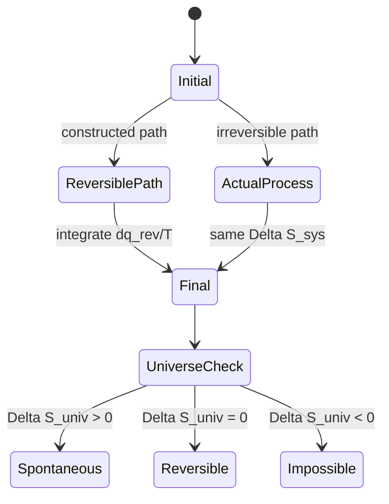

# Second Law and Entropy

The Second Law explains why energy conservation is not enough to predict change. A hot object and a cold object may exchange energy without violating the First Law in either direction, but heat flows spontaneously from hot to cold. Entropy supplies the missing directionality.

In Atkins' treatment, entropy begins as a thermodynamic state function defined through reversible heat transfer, then gains a molecular interpretation through the number of accessible microstates. The bridge between those views is central to equilibrium, phase change, free energy, and statistical thermodynamics.


*Figure: Carnot cycle shown on a pressure-volume diagram. Image: [Wikimedia Commons](https://commons.wikimedia.org/wiki/File:Carnot-cycle-p-V-diagram.svg), Derkleinebauer, public domain.*

## Definitions

The thermodynamic definition of entropy change is

$$
dS=\frac{\delta q_{\mathrm{rev}}}{T}
$$

For a finite change,

$$
\Delta S=\int_i^f\frac{\delta q_{\mathrm{rev}}}{T}
$$

The path used in the integral must be reversible, but the result is the entropy change between the states even when the actual process is irreversible.

The entropy change of the universe is

$$
\Delta S_{\mathrm{univ}}
=\Delta S_{\mathrm{sys}}+\Delta S_{\mathrm{surr}}
$$

The Second Law states

$$
\Delta S_{\mathrm{univ}}>0\quad \mathrm{spontaneous},
\qquad
\Delta S_{\mathrm{univ}}=0\quad \mathrm{reversible\ equilibrium}
$$

The Clausius inequality is

$$
dS\ge \frac{\delta q}{T}
$$

with equality for reversible transfer.

The statistical definition, due to Boltzmann, is

$$
S=k\ln W
$$

where $W$ is the number of microstates compatible with the macroscopic state and $k$ is Boltzmann's constant.

For heating at constant heat capacity,

$$
\Delta S=nC_m\ln\frac{T_f}{T_i}
$$

For an isothermal phase transition at its transition temperature,

$$
\Delta_{\mathrm{trs}}S=\frac{\Delta_{\mathrm{trs}}H}{T_{\mathrm{trs}}}
$$

For isothermal expansion of a perfect gas,

$$
\Delta S=nR\ln\frac{V_f}{V_i}
=nR\ln\frac{p_i}{p_f}
$$

## Key results

A Carnot cycle is the reference reversible heat engine. Its efficiency is

$$
\eta_{\mathrm{rev}}=1-\frac{T_c}{T_h}
$$

where $T_h$ and $T_c$ are the hot and cold reservoir temperatures. No engine operating between the same two reservoirs can be more efficient.

For a reversible engine,

$$
\frac{q_h}{T_h}+\frac{q_c}{T_c}=0
$$

which motivates entropy as the state function that tracks reversible heat divided by temperature.

Entropy changes for the surroundings are often simple because the surroundings may be modeled as a large reservoir at constant temperature:

$$
\Delta S_{\mathrm{surr}}=-\frac{q_{\mathrm{sys}}}{T_{\mathrm{surr}}}
$$

For a process at constant pressure where $q_{\mathrm{sys}}=\Delta H_{\mathrm{sys}}$,

$$
\Delta S_{\mathrm{surr}}=-\frac{\Delta H_{\mathrm{sys}}}{T}
$$

Combining system and surroundings entropy at constant $T$ and $p$ leads directly to Gibbs energy:

$$
\Delta S_{\mathrm{univ}}
=\Delta S_{\mathrm{sys}}-\frac{\Delta H_{\mathrm{sys}}}{T}
=-\frac{\Delta G_{\mathrm{sys}}}{T}
$$

Thus a process at constant temperature and pressure is spontaneous when $\Delta G\lt 0$.

The Third Law gives an absolute entropy reference:

$$
S(0)=0
$$

for a perfectly ordered crystal at $T=0$. Standard molar entropies can then be built from heat capacities and transition entropies:

$$
S^\circ(T)
=\int_0^T\frac{C_p^\circ}{T'}\,dT'
+\sum_{\mathrm{transitions}}\frac{\Delta_{\mathrm{trs}}H^\circ}{T_{\mathrm{trs}}}
$$

Entropy is subtle because the system entropy can decrease during a spontaneous process. Freezing of supercooled water, crystallization from solution, and compression of a gas all reduce some measure of system dispersal. The Second Law is protected because the surroundings entropy changes too. If a process releases enough heat to a reservoir, the surroundings entropy gain can exceed the system entropy loss. This is why the universe entropy, or an equivalent free-energy criterion under controlled conditions, is the proper test.

The reversible path in the entropy integral is a calculation device. Suppose a gas expands irreversibly into a vacuum. The actual heat transfer may be zero, and the work may be zero, but the entropy of the gas increases because its final state has a larger accessible volume. To compute the change, one imagines a reversible isothermal expansion between the same states and evaluates $q_{\mathrm{rev}}/T$. This often feels artificial at first, but it follows directly from entropy being a state function while heat is not.

The molecular interpretation deepens the thermodynamic definition. A macrostate such as "one mole of gas in this container at 298 K" can be realized by an enormous number of microscopic arrangements of positions and momenta. A spontaneous process usually moves toward macrostates with overwhelmingly larger multiplicity. For ideal gas expansion, the number of positional microstates grows with volume, which leads to the logarithmic form $nR\ln(V_f/V_i)$. For mixing, the multiplicity grows because labels A and B can be arranged among more sites or molecular states.

The Clausius inequality also explains irreversibility. For any cyclic process,

$$
\oint \frac{\delta q}{T}\le0
$$

Equality holds only for a reversible cycle. If a cycle could produce a positive value, it would convert heat from a single reservoir completely into work without any compensating change, contradicting the Kelvin statement of the Second Law. The inequality is therefore a compact mathematical form of the empirical impossibility of perfect heat-to-work conversion in a cyclic engine.

Carnot efficiency is a limiting result, not an engineering design promise. It says that the maximum efficiency depends only on reservoir temperatures. Raising $T_h$ or lowering $T_c$ can improve the theoretical limit, but real engines suffer friction, finite temperature gradients, turbulence, heat leaks, and material limits. In chemistry, the Carnot argument matters because it shows why heat is a lower-quality energy transfer than work: heat at finite temperature carries entropy.

Phase transitions give simple entropy changes only when they occur reversibly at the transition temperature. Vaporization entropy is usually positive and large because a gas has many more translational microstates than a liquid. Fusion entropy is positive but often smaller. Some solid-solid transitions have modest entropy changes associated with changes in crystal symmetry, orientational disorder, or magnetic ordering. These transition entropies are included in Third-Law entropy calculations as discrete jumps.

Residual entropy is an important caveat to the simple phrase "entropy at zero is zero." The Third Law reference applies to a perfect crystal with a unique arrangement. If a crystal retains orientational or proton disorder at very low temperature, it may have $W\gt 1$ even near $T=0$, giving $S=k\ln W$. The lesson is not that the Third Law fails, but that the assumed perfectly ordered reference state has not been reached.

Entropy also connects naturally to information. Specifying a lower-entropy state requires more detailed information about molecular arrangements. This does not mean thermodynamic entropy is merely subjective; the multiplicity is physical. But the language helps interpret why constraints, compartments, fields, and ordered phases reduce entropy by limiting the number of compatible microstates.

## Visual



| Process | System entropy change | Notes |
|---|---:|---|
| Heating at constant $C$ | $nC_m\ln(T_f/T_i)$ | Use $C_p$ or $C_V$ according to path |
| Isothermal perfect-gas expansion | $nR\ln(V_f/V_i)$ | Positive for expansion |
| Reversible phase transition | $\Delta H_{\mathrm{trs}}/T_{\mathrm{trs}}$ | At transition temperature |
| Mixing ideal gases | $-nR\sum_J x_J\ln x_J$ | Always nonnegative |
| Surroundings at constant $T$ | $-q_{\mathrm{sys}}/T$ | Reservoir approximation |

## Worked example 1: Entropy change for heating liquid water

**Problem.** Estimate the entropy change when $2.00\ \mathrm{mol}$ of liquid water is heated reversibly from $298.15\ \mathrm{K}$ to $350.00\ \mathrm{K}$ at constant pressure. Use $C_{p,m}=75.3\ \mathrm{J\ K^{-1}\ mol^{-1}}$.

**Method.** Treat $C_p$ as constant:

$$
\Delta S=nC_{p,m}\ln\frac{T_f}{T_i}
$$

1. Temperature ratio:

$$
\frac{T_f}{T_i}=\frac{350.00}{298.15}=1.1739
$$

2. Logarithm:

$$
\ln(1.1739)=0.1603
$$

3. Entropy change:

$$
\begin{aligned}
\Delta S
&=(2.00)(75.3\ \mathrm{J\ K^{-1}\ mol^{-1}})(0.1603)\\
&=24.1\ \mathrm{J\ K^{-1}}
\end{aligned}
$$

**Checked answer.** The entropy increases because raising temperature makes more energy states accessible. The magnitude is plausible: a few tens of joules per kelvin for two moles heated moderately.

## Worked example 2: Entropy of vaporization and surroundings

**Problem.** Benzene boils at approximately $353.25\ \mathrm{K}$ with $\Delta_{\mathrm{vap}}H=30.8\ \mathrm{kJ\ mol^{-1}}$. Estimate $\Delta_{\mathrm{vap}}S$ for $1.00\ \mathrm{mol}$ at the normal boiling point and the entropy change of the surroundings if the vaporization is reversible.

**Method.** At the boiling point, liquid and vapor are in equilibrium, so reversible vaporization occurs at constant $T$:

$$
\Delta_{\mathrm{vap}}S=\frac{\Delta_{\mathrm{vap}}H}{T_b}
$$

1. Convert enthalpy:

$$
\Delta_{\mathrm{vap}}H=30.8\ \mathrm{kJ\ mol^{-1}}
=3.08\times 10^4\ \mathrm{J\ mol^{-1}}
$$

2. System entropy:

$$
\Delta S_{\mathrm{sys}}
=\frac{3.08\times 10^4}{353.25}
=87.2\ \mathrm{J\ K^{-1}\ mol^{-1}}
$$

3. Surroundings entropy for reversible heat supply:

$$
q_{\mathrm{surr}}=-q_{\mathrm{sys}}=-\Delta_{\mathrm{vap}}H
$$

$$
\Delta S_{\mathrm{surr}}
=\frac{q_{\mathrm{surr}}}{T}
=-\frac{3.08\times 10^4}{353.25}
=-87.2\ \mathrm{J\ K^{-1}\ mol^{-1}}
$$

4. Universe:

$$
\Delta S_{\mathrm{univ}}=87.2-87.2=0
$$

**Checked answer.** Reversible boiling at the normal boiling point has $\Delta S_{\mathrm{univ}}=0$, matching phase equilibrium.

## Code

```python
import numpy as np

def entropy_heating(n, Cp_m, Ti, Tf):
    return n * Cp_m * np.log(Tf / Ti)

def entropy_vaporization(delta_h_kj_mol, T):
    return delta_h_kj_mol * 1000.0 / T

temps = np.linspace(298.15, 400.0, 6)
for Tf in temps:
    ds = entropy_heating(1.0, 75.3, 298.15, Tf)
    print(f"Tf={Tf:7.2f} K  Delta S={ds:7.2f} J/K/mol")

print("Benzene vaporization:", entropy_vaporization(30.8, 353.25))
```

## Common pitfalls

- Calculating entropy from the actual irreversible path. Use a reversible path connecting the same states.
- Forgetting the surroundings. Spontaneity is decided by $\Delta S_{\mathrm{univ}}$, not only by $\Delta S_{\mathrm{sys}}$.
- Using Celsius temperatures in entropy formulas. Entropy relations require thermodynamic temperature in kelvins.
- Treating $q/T$ as entropy change for irreversible heat flow. Only $\delta q_{\mathrm{rev}}/T$ defines $dS$.
- Assuming entropy is simply "disorder." The more precise statement is multiplicity of accessible microstates.

When solving entropy problems, separate the system path from the calculation path. The actual path determines $q$, $w$, and practical irreversibility. The entropy change can be calculated using any reversible path between the same states. This is especially important for free expansion, mixing, and heat transfer across a finite temperature difference, where the actual path is irreversible but the entropy change is still well defined.

For surroundings entropy, check whether the surroundings can be treated as a reservoir. If its temperature remains effectively constant, $\Delta S_{\mathrm{surr}}=q_{\mathrm{surr}}/T_{\mathrm{surr}}$ is appropriate. If the surroundings has a finite heat capacity and changes temperature appreciably, integrate $C\,dT/T$ instead. Many textbook problems hide the reservoir assumption; real calorimetry may not.

Finally, do not infer spontaneity from system entropy alone. Condensation, freezing, adsorption, folding, and association can all decrease system entropy while proceeding spontaneously because enthalpy release or solvent entropy compensates. Gibbs energy is often the cleaner criterion at constant temperature and pressure because it already includes the surroundings contribution under those constraints.

## Connections

- [First law and thermochemistry](/chemistry/physical-chemistry/first-law-and-thermochemistry)
- [Free energy and chemical potential](/chemistry/physical-chemistry/free-energy-and-chemical-potential)
- [Boltzmann distribution and partition functions](/chemistry/physical-chemistry/boltzmann-distribution-and-partition-functions)
- [Multiple integrals](/math/calculus/multiple-integrals)
