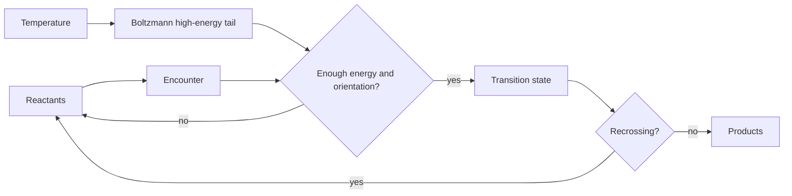

# Temperature Dependence and Reaction Dynamics

Temperature dependence links empirical kinetics to molecular energy, barriers, and transition states. Reaction dynamics then asks what actually happens during a reactive encounter: how molecules collide, exchange energy, cross potential energy surfaces, and form products.

Atkins develops Arrhenius behavior, transition-state theory, collision theory, RRK/RRKM ideas for unimolecular reactions, photochemical dynamics, and electron transfer. The unifying concept is that rate constants reflect both how often systems attempt reaction and how likely those attempts are to cross the required barrier.

## Definitions

The Arrhenius equation is

$$
k=Ae^{-E_a/RT}
$$

or

$$
\ln k=\ln A-\frac{E_a}{RT}
$$

where $E_a$ is the activation energy and $A$ is the pre-exponential factor.

Transition-state theory writes

$$
k=\kappa\frac{kT}{h}e^{-\Delta^\ddagger G^\circ/RT}
$$

where $\Delta^\ddagger G^\circ$ is the standard Gibbs energy of activation and $\kappa$ is a transmission coefficient.

Because

$$
\Delta^\ddagger G^\circ
=\Delta^\ddagger H^\circ-T\Delta^\ddagger S^\circ
$$

the Eyring equation is

$$
\ln\frac{k}{T}
=\ln\frac{k_B}{h}
+\frac{\Delta^\ddagger S^\circ}{R}
-\frac{\Delta^\ddagger H^\circ}{RT}
$$

Collision theory for gas reactions often has the form

$$
k=PZ_{AB}e^{-E_a/RT}
$$

where $Z_{AB}$ is a collision frequency and $P$ is a steric factor.

For electron transfer, Marcus theory relates activation Gibbs energy to reorganization energy $\lambda$ and reaction Gibbs energy $\Delta_rG^\circ$:

$$
\Delta^\ddagger G
=\frac{(\lambda+\Delta_rG^\circ)^2}{4\lambda}
$$

## Key results

An Arrhenius plot of $\ln k$ against $1/T$ has slope

$$
-\frac{E_a}{R}
$$

so

$$
E_a=-R(\mathrm{slope})
$$

The activation energy is not always exactly the barrier height. It is an empirical temperature derivative:

$$
E_a=RT^2\left(\frac{\partial\ln k}{\partial T}\right)
$$

Transition-state theory interprets reaction as equilibrium between reactants and an activated complex, followed by passage across a dividing surface. A negative activation entropy indicates a more ordered transition state; a positive value suggests greater freedom or dissociation-like character.

The Eyring plot of $\ln(k/T)$ against $1/T$ has slope

$$
-\frac{\Delta^\ddagger H^\circ}{R}
$$

and intercept

$$
\ln\frac{k_B}{h}+\frac{\Delta^\ddagger S^\circ}{R}
$$

Diffusion-controlled reactions in solution are limited by how fast reactants encounter each other. A common Smoluchowski expression for identical units is

$$
k_{\mathrm{diff}}\sim 4\pi R D N_A
$$

after unit conversion. If chemical transformation after encounter is slower than diffusion, the observed rate is activation-controlled instead.

Marcus theory predicts a normal region where more negative $\Delta_rG^\circ$ speeds electron transfer and an inverted region where making the reaction too exergonic slows it.

Arrhenius behavior is empirical but widely useful because many rate constants are controlled by Boltzmann access to high-energy configurations. A plot of $\ln k$ versus $1/T$ is linear only when $E_a$ and $A$ are effectively constant over the temperature range. Curvature can signal a change in mechanism, tunneling, temperature-dependent heat capacities of activation, diffusion control, or falloff behavior in unimolecular reactions.

The pre-exponential factor contains more than collision frequency. It can include orientation requirements, entropy of activation, transmission probability, solvent cage effects, and dynamical recrossing. Two reactions with similar activation energies can have very different rates because one transition state is entropically difficult to organize while another is readily accessed. This is why activation entropy is often as informative as activation enthalpy.

Transition-state theory assumes a dividing surface between reactants and products. Reactants are in quasi-equilibrium with configurations near this surface, and successful crossing leads to products. If trajectories cross and then return to reactants, the simple theory overestimates the rate. The transmission coefficient $\kappa$ corrects for this in a coarse way. Modern reaction dynamics studies the actual motion on potential energy surfaces to understand such effects.

Collision theory is most transparent for gas-phase bimolecular reactions. Molecules must collide with enough relative kinetic energy and suitable orientation. The steric factor can be much less than 1 for reactions requiring a specific geometry. For reactions between complex molecules, only a small fraction of collisions align reactive sites properly, so collision frequency alone greatly overestimates rates.

Unimolecular reactions require energy activation within a single molecule. The Lindemann mechanism treats activation by collision, followed by either deactivation or reaction. At high pressure, activation is frequent enough that the rate becomes first order in reactant. At low pressure, activation collisions limit the rate, and the reaction can become second order overall. RRK and RRKM theories refine this by considering how energy is distributed among molecular modes.

Diffusion control is the opposite limit from barrier control. If every encounter reacts, the rate constant is governed by how fast reactants find each other. In solution, viscosity, solvent structure, and electrostatic attraction or repulsion influence encounter rates. Many radical recombinations and proton-transfer processes approach diffusion control. If an activation barrier remains after encounter, the observed rate is lower.

Potential energy surfaces provide the geometry of reaction. A minimum is a stable intermediate or reactant/product structure. A first-order saddle point is a transition state with one imaginary vibrational frequency along the reaction coordinate. Reaction paths connect minima through saddle points. For polyatomic reactions, surfaces are high-dimensional, and dynamics can involve energy redistribution, roaming pathways, and nonstatistical behavior.

Electron transfer is distinctive because the transferring electron can move faster than nuclei reorganize. Marcus theory separates nuclear reorganization from electronic coupling. The activation barrier depends on how much solvent and molecular geometry must reorganize to make reactant and product electronic states degenerate. The inverted region is one of the striking predictions: after an optimum driving force, making the reaction more exergonic can increase the barrier.

Ultrafast spectroscopy tests dynamics directly. Femtosecond pump-probe experiments can watch wavepacket motion, internal conversion, bond breaking, and electron transfer before thermal equilibrium is restored. These experiments connect the rate constants of kinetics to real-time molecular motion.

## Visual



| Model | Rate expression | Best for | Main limitation |
|---|---:|---|---|
| Arrhenius | $k=Ae^{-E_a/RT}$ | empirical temperature dependence | hides molecular details |
| Collision theory | $k=PZ e^{-E_a/RT}$ | gas bimolecular reactions | steric and energy transfer approximations |
| Transition-state theory | $k=\kappa(kT/h)e^{-\Delta^\ddagger G/RT}$ | barrier crossing | assumes quasi-equilibrium and dividing surface |
| Diffusion control | $k\sim4\pi RDN_A$ | fast solution reactions | encounter may not guarantee reaction |
| Marcus theory | $\Delta^\ddagger G=(\lambda+\Delta G)^2/(4\lambda)$ | electron transfer | needs reorganization parameters |

## Worked example 1: Activation energy from two rate constants

**Problem.** A reaction has $k_1=1.20\times10^{-3}\ \mathrm{s^{-1}}$ at $300.0\ \mathrm{K}$ and $k_2=8.50\times10^{-3}\ \mathrm{s^{-1}}$ at $330.0\ \mathrm{K}$. Estimate $E_a$.

**Method.** Use

$$
\ln\frac{k_2}{k_1}
=-\frac{E_a}{R}\left(\frac{1}{T_2}-\frac{1}{T_1}\right)
$$

1. Rate ratio:

$$
\frac{k_2}{k_1}
=\frac{8.50\times10^{-3}}{1.20\times10^{-3}}
=7.083
$$

2. Log:

$$
\ln(7.083)=1.958
$$

3. Temperature term:

$$
\frac{1}{330.0}-\frac{1}{300.0}
=0.0030303-0.0033333
=-3.0303\times10^{-4}\ \mathrm{K^{-1}}
$$

4. Solve:

$$
E_a=-R\frac{\ln(k_2/k_1)}{(1/T_2-1/T_1)}
$$

$$
E_a=-8.314\frac{1.958}{-3.0303\times10^{-4}}
=5.37\times10^4\ \mathrm{J\ mol^{-1}}
$$

**Checked answer.** $E_a=53.7\ \mathrm{kJ\ mol^{-1}}$. The rate increases by about sevenfold over $30\ \mathrm{K}$, consistent with a moderate barrier.

## Worked example 2: Activation parameters from Eyring data

**Problem.** At $298.15\ \mathrm{K}$, a reaction has $k=2.00\times10^2\ \mathrm{s^{-1}}$ and $\Delta^\ddagger H^\circ=45.0\ \mathrm{kJ\ mol^{-1}}$. Estimate $\Delta^\ddagger S^\circ$ using transition-state theory with $\kappa=1$.

**Method.** Rearrange:

$$
\ln\frac{k}{T}
=\ln\frac{k_B}{h}
+\frac{\Delta^\ddagger S^\circ}{R}
-\frac{\Delta^\ddagger H^\circ}{RT}
$$

1. Left side:

$$
\ln\frac{k}{T}
=\ln\frac{200}{298.15}
=\ln(0.6708)
=-0.399
$$

2. Constant:

$$
\ln\frac{k_B}{h}
=\ln\left(\frac{1.38065\times10^{-23}}{6.62607\times10^{-34}}\right)
=23.76
$$

3. Enthalpy term:

$$
\frac{\Delta^\ddagger H^\circ}{RT}
=\frac{45000}{(8.314)(298.15)}
=18.15
$$

4. Solve:

$$
\frac{\Delta^\ddagger S^\circ}{R}
=\ln\frac{k}{T}-\ln\frac{k_B}{h}
+\frac{\Delta^\ddagger H^\circ}{RT}
$$

$$
=-0.399-23.76+18.15=-6.009
$$

5. Entropy:

$$
\Delta^\ddagger S^\circ=(-6.009)(8.314)
=-50.0\ \mathrm{J\ K^{-1}\ mol^{-1}}
$$

**Checked answer.** The negative activation entropy suggests a more organized activated complex, common for associative processes.

## Code

```python
import numpy as np

R = 8.314462618
kB = 1.380649e-23
h = 6.62607015e-34

def arrhenius_Ea(k1, T1, k2, T2):
    return -R * np.log(k2 / k1) / (1 / T2 - 1 / T1)

def eyring_entropy(k, T, dH_kJ):
    lhs = np.log(k / T)
    intercept_constant = np.log(kB / h)
    return R * (lhs - intercept_constant + dH_kJ * 1000 / (R * T))

print("Ea kJ/mol:", arrhenius_Ea(1.20e-3, 300.0, 8.50e-3, 330.0) / 1000)
print("Delta S^ddagger J/K/mol:", eyring_entropy(2.00e2, 298.15, 45.0))
```

## Common pitfalls

- Treating $A$ in the Arrhenius equation as always temperature-independent. It can contain temperature-dependent factors.
- Calling $E_a$ the same as $\Delta^\ddagger H^\circ$. They are related but not identical.
- Ignoring units when taking logarithms; use ratios or consistent units.
- Assuming every collision reacts. Orientation and energy disposal matter.
- Forgetting the possibility of recrossing in transition-state theory; $\kappa$ accounts for this imperfectly.

When extracting activation parameters, use a temperature range narrow enough for the model but broad enough for a reliable slope. Too narrow a range amplifies experimental noise; too broad a range can hide curvature. Plot residuals, not just the fitted line. If the Arrhenius plot curves, consider mechanism change, tunneling, diffusion limitation, or heat-capacity effects before reporting a single activation energy.

Distinguish energy-controlled and entropy-controlled effects. A reaction can be slow because the enthalpic barrier is high, because the transition state is entropically demanding, or both. Associative reactions often have negative activation entropies because two species must organize into one activated complex. Dissociative processes can have less negative or positive activation entropies because the activated structure has more freedom.

For reaction dynamics, remember that a rate constant is an average over many microscopic events. Individual trajectories can exchange energy differently, scatter into different angles, or recross the dividing surface. Bulk kinetics smooths over these details, while molecular beams and ultrafast spectroscopy reveal them. Both descriptions are valid at different levels.

A useful diagnostic is to compare activation parameters across related reactions rather than interpreting one number alone. A substituent, solvent, isotope, or catalyst that lowers $\Delta^\ddagger H$ but makes $\Delta^\ddagger S$ more negative may have a mixed effect on rate. Trends reveal whether the reaction is becoming electronically easier, geometrically more organized, diffusion-limited, or mechanistically different.

Report the temperature scale in kelvins.

## Connections

- [Rate laws and reaction mechanisms](/chemistry/physical-chemistry/rate-laws-and-reaction-mechanisms)
- [Quantum models of motion](/chemistry/physical-chemistry/quantum-models-of-motion)
- [Catalysis, surfaces, macromolecules, and solids](/chemistry/physical-chemistry/catalysis-surfaces-macromolecules-and-solids)
- [Boltzmann distribution and partition functions](/chemistry/physical-chemistry/boltzmann-distribution-and-partition-functions)
