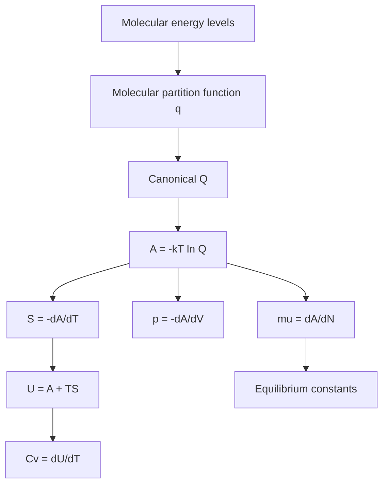

# Thermodynamic Functions from Statistics

The power of statistical thermodynamics is that once the partition function is known, the macroscopic thermodynamic functions follow by differentiation. This turns molecular energy levels into heat capacities, entropies, equations of state, and equilibrium constants.

Atkins uses this machinery to show that classical thermodynamic quantities are not independent assumptions. They emerge from molecular state counting, especially through the canonical partition function $Q$ and the Helmholtz energy $A=-kT\ln Q$.

## Definitions

The canonical ensemble describes systems with fixed $N$, $V$, and $T$, in thermal contact with a heat reservoir. Its partition function is

$$
Q=\sum_{\mathrm{states}} e^{-E_s/kT}
$$

where $E_s$ is the energy of a complete system microstate.

The Helmholtz energy is

$$
A=-kT\ln Q
$$

For independent indistinguishable molecules,

$$
Q=\frac{q^N}{N!}
$$

where $q$ is the molecular partition function. Stirling's approximation,

$$
\ln N!\approx N\ln N-N
$$

is used for macroscopic $N$.

Thermodynamic functions follow from $A$:

$$
S=-\left(\frac{\partial A}{\partial T}\right)_{V,N}
$$

$$
U=A+TS
$$

$$
p=-\left(\frac{\partial A}{\partial V}\right)_{T,N}
$$

$$
\mu=\left(\frac{\partial A}{\partial N}\right)_{T,V}
$$

For reactions, molecular partition functions lead to equilibrium constants through standard molar Gibbs energies and through ratios of partition functions for products and reactants.

## Key results

If $Q=q^N/N!$, then

$$
A=-NkT\ln q+kT\ln N!
$$

Using Stirling's approximation,

$$
A\approx -NkT\ln\left(\frac{q}{N}\right)-NkT
$$

For a monatomic ideal gas, $q=q_{\mathrm{trans}}=V/\Lambda^3$, so

$$
A=-NkT\left[\ln\left(\frac{V}{N\Lambda^3}\right)+1\right]
$$

Pressure follows immediately:

$$
p=-\left(\frac{\partial A}{\partial V}\right)_{T,N}
=\frac{NkT}{V}
$$

which is the perfect gas law:

$$
pV=NkT=nRT
$$

The entropy of an ideal monatomic gas is the Sackur-Tetrode equation:

$$
S=Nk\left[\ln\left(\frac{V}{N\Lambda^3}\right)+\frac{5}{2}\right]
$$

or, molar form,

$$
S_m=R\left[\ln\left(\frac{V_m}{N_A\Lambda^3}\right)+\frac{5}{2}\right]
$$

For a general molecular partition function,

$$
U=NkT^2\left(\frac{\partial\ln q}{\partial T}\right)_V
$$

when the zero of energy is chosen consistently. Heat capacity is

$$
C_V=\left(\frac{\partial U}{\partial T}\right)_V
$$

Residual entropy occurs when a crystal has more than one arrangement even as $T\to0$. If $W_0\gt 1$,

$$
S(0)=k\ln W_0
$$

which explains why orientational disorder can leave a nonzero entropy when the simple Third Law assumption of a unique perfect crystal is not met.

The canonical relation $A=-kT\ln Q$ is one of the most compact results in physical chemistry. It says that the free energy is determined by the logarithm of the weighted number of accessible states. A system with many low-energy states has a large $Q$ and therefore a lower $A$. This is the statistical version of the thermodynamic drive toward lower Helmholtz energy at fixed $T$ and $V$.

Differentiation of $\ln Q$ gives averages because the Boltzmann factor contains energy in the exponent. For example,

$$
U=-\left(\frac{\partial\ln Q}{\partial\beta}\right)_{V,N}
$$

with $\beta=1/kT$. A derivative with respect to $\beta$ pulls down the energy of each state, weighted by its probability. This is a recurring statistical trick: derivatives of generating functions produce moments of distributions.

The pressure derivation from translational $Q$ is especially important because it shows that the perfect gas equation is not merely empirical. The volume dependence of $q_{\mathrm{trans}}$ means that increasing volume increases the number of translational states. The system exerts pressure because expanding the volume lowers $A$ by increasing translational entropy. In this view, gas pressure is an entropic force.

Entropy contains two related contributions. One is the logarithm of the number of accessible states, and the other reflects how the average energy changes with temperature. In the canonical ensemble,

$$
S=k\ln Q+\frac{U}{T}
$$

for appropriate energy conventions. This formula shows why entropy rises when either more states become accessible or energy is distributed over higher levels.

The $N!$ correction resolves the Gibbs paradox for ideal gases. If identical particles were counted as distinguishable, mixing two samples of the same gas would appear to produce an entropy increase, even though no observable change occurs. Dividing by $N!$ removes the overcounting of particle labels. For different gases, the labels correspond to observable species identity, so a real entropy of mixing remains.

Residual entropy illustrates that entropy is not only about thermal motion. Ice, for example, can retain many proton arrangements consistent with local bonding rules. If these arrangements remain frozen in at low temperature, there is configurational multiplicity even without thermal excitation. This connects statistical thermodynamics to materials disorder, glasses, orientational crystals, and magnetic systems.

Equilibrium constants can be built from partition functions because chemical potentials can. For an ideal-gas reaction, the standard Gibbs energy contains molecular partition functions, zero-point energies, electronic energies, and standard-state translational factors. A reaction is product-favored when the product side has lower energetic terms and/or greater accessible-state multiplicity after standard-state corrections. This perspective explains why entropy can drive dissociation at high temperature even when bond breaking is enthalpically costly.

Heat capacity is a fluctuation measure in the canonical ensemble. A system has high heat capacity when its energy can change substantially with temperature, which occurs when there are accessible states near $kT$. In more advanced form,

$$
C_V=\frac{\langle E^2\rangle-\langle E\rangle^2}{kT^2}
$$

This equation explains why heat capacity is nonnegative in stable canonical systems and why closely spaced energy levels produce large thermal responses.

The statistical route also clarifies the limits of classical thermodynamics. Classical thermodynamics gives relationships among properties without identifying molecular origins. Statistical thermodynamics predicts those properties from masses, moments of inertia, frequencies, degeneracies, and interaction models. The two approaches agree when the molecular model is accurate and the system is large enough for fluctuations to be negligible on the macroscopic scale.

## Visual



| Function | Statistical route | Physical interpretation |
|---|---:|---|
| $A$ | $-kT\ln Q$ | free energy at fixed $T,V$ |
| $U$ | $- \partial\ln Q/\partial\beta$ | mean internal energy |
| $S$ | $-(\partial A/\partial T)_V$ | accessible microstates plus energy spread |
| $p$ | $-(\partial A/\partial V)_T$ | response to volume change |
| $\mu$ | $(\partial A/\partial N)_{T,V}$ | cost of adding a molecule |
| $C_V$ | $(\partial U/\partial T)_V$ | thermal accessibility of energy modes |

## Worked example 1: Deriving ideal gas pressure from $Q$

**Problem.** Show explicitly that the translational partition function gives $pV=NkT$ for a monatomic gas.

**Method.** Use

$$
q=\frac{V}{\Lambda^3}
$$

and

$$
A=-kT\ln\frac{q^N}{N!}
$$

1. Write $\ln Q$:

$$
\ln Q=N\ln q-\ln N!
$$

2. Substitute $q$:

$$
\ln q=\ln V-3\ln\Lambda
$$

Only $\ln V$ depends on volume.

3. Helmholtz derivative:

$$
p=kT\left(\frac{\partial\ln Q}{\partial V}\right)_{T,N}
$$

4. Differentiate:

$$
\frac{\partial\ln Q}{\partial V}
=N\frac{\partial\ln V}{\partial V}
=\frac{N}{V}
$$

5. Pressure:

$$
p=kT\frac{N}{V}
$$

6. Rearranged:

$$
pV=NkT
$$

**Checked answer.** The equation of state follows from translational states because $q_{\mathrm{trans}}$ is proportional to $V$.

## Worked example 2: Heat capacity of a two-level system

**Problem.** A mole of independent molecules has two nondegenerate levels separated by $\epsilon$ with $\epsilon/k=300\ \mathrm{K}$. Calculate the molar internal energy above the ground state at $T=300\ \mathrm{K}$.

**Method.** For two levels,

$$
p_1=\frac{e^{-\epsilon/kT}}{1+e^{-\epsilon/kT}}
$$

and

$$
U_m=N_A\epsilon p_1=R(\epsilon/k)p_1
$$

1. Exponent:

$$
\frac{\epsilon}{kT}=\frac{300}{300}=1
$$

2. Boltzmann factor:

$$
e^{-1}=0.3679
$$

3. Upper population:

$$
p_1=\frac{0.3679}{1+0.3679}=0.2689
$$

4. Molar energy:

$$
U_m=R(300\ \mathrm{K})(0.2689)
$$

5. Substitute:

$$
U_m=(8.314)(300)(0.2689)=670.8\ \mathrm{J\ mol^{-1}}
$$

**Checked answer.** The energy is less than the equal-population limit $R(300)/2=1247\ \mathrm{J\ mol^{-1}}$, as expected at $T=\epsilon/k$.

## Code

```python
import numpy as np

R = 8.314462618

def two_level_energy(theta, T):
    x = theta / T
    p1 = np.exp(-x) / (1 + np.exp(-x))
    return R * theta * p1

def two_level_cv(theta, T):
    x = theta / T
    ex = np.exp(x)
    return R * x**2 * ex / (ex + 1)**2

for T in [50, 100, 300, 1000]:
    print(f"T={T:5.0f} K  U={two_level_energy(300,T):8.2f} J/mol  Cv={two_level_cv(300,T):7.3f} J/K/mol")
```

## Common pitfalls

- Differentiating $q$ when the correct thermodynamic object is $Q$. For gases, the $N!$ factor affects entropy and chemical potential.
- Forgetting which variables are held constant in derivatives.
- Mixing molecular and molar constants. Use $k$ per molecule and $R=N_Ak$ per mole.
- Dropping zero-point energies inconsistently when comparing reactions.
- Treating the partition function as a purely mathematical trick. It is the bridge from quantum state accessibility to thermodynamic response.

When deriving thermodynamic functions, track the independent variables. The canonical ensemble naturally gives $A(T,V,N)$. Pressure, entropy, and chemical potential are derivatives of $A$ with respect to $V$, $T$, and $N$ under specified constraints. If you switch to constant pressure, you need $G$ or an appropriate transformation. Many derivation errors come from differentiating the right expression while holding the wrong variable fixed.

Use Stirling's approximation only in its domain. It is excellent for macroscopic $N$, but not for a handful of particles in small statistical examples. Atkins uses small-particle examples to illustrate configurations and weights; those should be counted exactly. The thermodynamic formulas using $\ln N!\approx N\ln N-N$ assume large $N$.

The statistical view also clarifies standard-state corrections. Translational partition functions depend on volume, so chemical potentials depend on pressure or concentration. When building equilibrium constants from molecular data, the standard-state volume or pressure factors are not optional bookkeeping; they determine the numerical standard Gibbs energy.

As a final check, compare statistical results with thermodynamic identities already known. A monatomic ideal gas should give $U=3nRT/2$, $pV=nRT$, and a positive entropy that increases with $V$ and $T$. If a partition-function derivation violates these limits, the error is usually in distinguishability, the volume dependence, the chosen energy zero, or the variables held constant during differentiation.

For finite systems, fluctuations are not negligible. The canonical formulas still define ensemble averages, but small clusters, nanoscale systems, and simulations may show noticeable deviations from smooth macroscopic behavior.

In simulations, time averages and ensemble averages agree only under appropriate ergodic sampling. Poor sampling can make a correct statistical formula look wrong.

Always inspect convergence before interpreting molecular thermodynamics.

## Connections

- [Boltzmann distribution and partition functions](/chemistry/physical-chemistry/boltzmann-distribution-and-partition-functions)
- [Molecular partition functions](/chemistry/physical-chemistry/molecular-partition-functions)
- [Chemical equilibrium](/chemistry/physical-chemistry/chemical-equilibrium)
- [Multiple integrals](/math/calculus/multiple-integrals)
