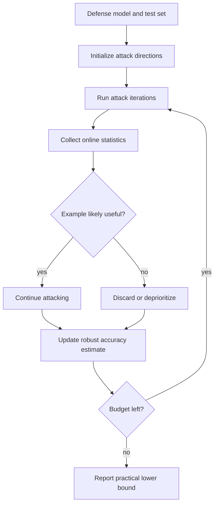

# Adaptive Auto Attack

Adaptive Auto Attack, often abbreviated A3 in the source paper, is an evaluation-oriented attack strategy for practical robustness testing of defended models. Its goal is not to introduce a new perturbation norm, but to make white-box evaluation more efficient and reliable under a fixed iteration budget.

The paper targets a recurring problem in adversarial robustness: evaluating many defenses with many attack iterations is expensive, and naive starting-point strategies can waste effort. A3 uses adaptive direction initialization and online discarding to spend more attack computation where it is likely to reduce robust accuracy.

## Threat model

A3 is a white-box robustness evaluation method for defended image models under norm-bounded adversarial examples. The attacker knows the defense model and uses first-order attacks to estimate a lower bound on robust accuracy. The typical goal is untargeted:

$$
f(x+\delta)\ne y,
$$

under a budget:

$$
\delta\in\Delta(x).
$$

The paper is framed as practical evaluation: given a test set and a budget number of attack iterations, find adversarial examples efficiently and avoid overclaiming robustness. It should be understood alongside [evaluation and benchmarks](/cs/adversarial-attacks/evaluation-and-benchmarks), not as a certified defense.

## Method

A3 focuses on two ideas.

First, adaptive direction initialization chooses starting directions informed by previous attack behavior against the same defense model. Rather than drawing all starts uniformly at random, it uses observed regularities in adversarial examples to initialize future attacks more effectively.

Second, online statistics-based discarding identifies examples that appear hard to attack under the remaining budget and stops spending iterations on them. If the goal is to estimate robust accuracy as low as possible under a fixed budget, it can be better to focus computation on examples still likely to flip.

Abstractly, suppose an evaluator attacks examples $x_i$ with budget $T$. A naive strategy distributes effort evenly:

$$
T_i=T\quad \text{for all }i.
$$

An adaptive strategy updates allocation:

$$
T_i \leftarrow T_i + \Delta T_i
$$

based on observed attack progress, starting-point quality, and success/failure statistics. The attack remains empirical: it finds failures; it does not prove their absence.

## Visual



| Evaluation method | Main idea | Strength | Limitation |
|---|---|---|---|
| Fixed PGD | Same steps for every example | Simple and reproducible | Can waste budget |
| Multi-restart PGD | Diverse random starts | Stronger than one start | Expensive |
| AutoAttack | Ensemble of parameter-free attacks | Reliable benchmark baseline | Still finite attack suite |
| Adaptive Auto Attack | Adaptive starts and discarding | Efficient practical evaluation | Not a certificate |

## Worked example 1: Robust accuracy lower bound

Problem: A defense is evaluated on 1,000 images. An adaptive attack finds adversarial examples for 430 of them. What robust accuracy lower bound does this attack imply?

1. Number of attacked images:

$$
n=1000.
$$

2. Number of successful attacks:

$$
s=430.
$$

3. Images not broken by the attack:

$$
n-s=570.
$$

4. Empirical robust accuracy against this attack:

$$
\frac{570}{1000}=0.57=57\%.
$$

Checked answer: the attack gives an empirical robust accuracy of $57\%$ against this evaluation. Because the attack is not exhaustive, true robust accuracy under the threat model could be lower.

## Worked example 2: Why discarding can help

Problem: An evaluator has 100 remaining iterations and two groups of images. Group A has 20 images with margins close to zero; attacking each for 5 iterations is expected to flip 8 images. Group B has 20 images with large margins; attacking each for 5 iterations is expected to flip 1 image. Which allocation better lowers robust accuracy?

1. Equal budget for Group A costs:

$$
20\cdot5=100
$$

iterations and is expected to find 8 more failures.

2. Equal budget for Group B also costs:

$$
20\cdot5=100
$$

iterations but is expected to find 1 more failure.

3. To lower the reported robust accuracy, the evaluator wants more found failures under the same budget.

4. The expected advantage is:

$$
8-1=7
$$

additional failures.

Checked answer: allocating to Group A is more efficient for empirical evaluation. This illustrates the logic behind deprioritizing examples unlikely to be broken under the remaining budget.

## Implementation

```python
import torch

class AttackBookkeeper:
    def __init__(self, n):
        self.active = torch.ones(n, dtype=torch.bool)
        self.success = torch.zeros(n, dtype=torch.bool)
        self.best_margin = torch.full((n,), float("inf"))

    def update(self, indices, margins):
        self.best_margin[indices] = torch.minimum(self.best_margin[indices], margins.cpu())
        newly_successful = margins.cpu() < 0
        self.success[indices] |= newly_successful
        self.active[indices] &= ~newly_successful

    def discard_hard_examples(self, threshold):
        hard = self.best_margin > threshold
        self.active &= ~hard

    def robust_accuracy(self):
        return 1.0 - self.success.float().mean().item()
```

This is not A3's full algorithm. It shows the evaluation bookkeeping pattern: track successes, margins, active examples, and robust accuracy as an empirical lower-bound search.

## Original paper results

Liu et al.'s "Practical Evaluation of Adversarial Robustness via Adaptive Auto Attack" evaluated nearly 50 defense models. The abstract reports that A3 consumed much fewer iterations than existing methods, about a $10\times$ speedup on average, while achieving lower robust accuracy in all reported cases. The method also won first place in the CVPR 2021 White-box Adversarial Attacks on Defense Models competition.

The conservative takeaway is that adaptive evaluation can make finite-budget robustness testing sharper, but it still reports attack-found failures rather than certified guarantees.

## Connections

- [Evaluation and benchmarks](/cs/adversarial-attacks/evaluation-and-benchmarks) gives the reporting discipline for robustness numbers.
- [PGD](/cs/adversarial-attacks/pgd) supplies the common first-order attack substrate.
- [Gradient masking and obfuscation](/cs/adversarial-attacks/gradient-masking-and-obfuscation) explains why adaptive attacks are necessary.
- [Adversarial training](/cs/adversarial-attacks/adversarial-training) is often the kind of defense being evaluated.
- [Square Attack](/cs/adversarial-attacks/square-attack) is another strong practical attack component in evaluation suites.

## Common pitfalls / when this attack is used today

- Treating lower robust accuracy found by A3 as exact robust accuracy.
- Comparing speedups without matching hardware, iteration budget, and attack suite.
- Reporting adaptive evaluation without describing the threat model.
- Discarding examples in a way that biases a scientific comparison unless the protocol is fixed in advance.
- Ignoring failed attacks when computing robust accuracy.
- Using adaptive attack ideas today for practical large-scale defense evaluation and competition-style stress tests.

Adaptive Auto Attack should be read in the context of evaluation economics. If a benchmark has thousands of images and each strong attack costs many iterations, the evaluator must decide where to spend computation. Uniformly spending the same budget on every example is simple, but not always efficient. A3's contribution is to make that allocation more informed while still pursuing the same goal: finding more adversarial examples under a fixed budget.

This creates a reporting responsibility. Adaptive discarding can be legitimate when the protocol is fixed and the goal is a lower robust-accuracy estimate, but it can also make comparisons confusing if different models receive different effective search patterns. A fair benchmark should specify the adaptive rules before seeing the final numbers, apply them consistently, and report the total iteration or gradient budget consumed.

The phrase "Auto Attack" can be confusing because several methods use similar names. Croce and Hein's AutoAttack is a widely used ensemble of mostly parameter-free attacks for reliable robustness evaluation. Liu et al.'s Adaptive Auto Attack is a different practical evaluation method focused on adaptive direction initialization and discarding. When citing or implementing, use the exact paper and abbreviation; otherwise readers may assume the wrong attack suite.

A3 also reinforces the idea that robust accuracy is an upper bound from the evaluator's perspective. If an attack finds failures on 43% of examples, robust accuracy is at most 57% against the evaluated threat model. A stronger future attack may lower it. This is why empirical robustness reports often say "robust accuracy under attack suite X" rather than "true robust accuracy." Certification is required for the latter style of claim.

In current practice, adaptive evaluation is most valuable for defended models, competitions, and large comparison tables where attack cost matters. For a single new defense, it should complement, not replace, transparent baselines such as PGD with restarts and standard AutoAttack where applicable. If A3 produces much lower robust accuracy than standard baselines, the next step is to inspect which examples and initialization strategies caused the gap.

A compact Adaptive Auto Attack reporting checklist is:

| Field | What to write down |
|---|---|
| Threat model | Norm, radius, dataset, preprocessing, and goal |
| Base attacks | Which first-order attacks or losses are used inside the method |
| Adaptation | Direction initialization and discarding rules |
| Budget | Total iterations, per-example limits, and wall-clock assumptions |
| Accounting | How discarded, failed, and already-successful examples are counted |
| Comparison | PGD, AutoAttack, and other baselines under matched budgets |

For reproduction, log the active set size over time. If many examples are discarded early, the final number depends strongly on the discard threshold. If the active set shrinks mostly because examples are successfully attacked, the method is finding failures efficiently. These two cases look similar in a final robust-accuracy number but have different interpretations.

A3-style methods are also a reminder that benchmark design is adversarial in a second sense: evaluators are optimizing the evaluation process itself. That is good when the goal is to find weaknesses, but it must be transparent. Otherwise the community cannot tell whether a lower robust accuracy reflects a genuinely stronger attack, a different compute budget, or a protocol tuned to one defense family.

## Further reading

- Liu et al., "Practical Evaluation of Adversarial Robustness via Adaptive Auto Attack."
- Croce and Hein, "Reliable Evaluation of Adversarial Robustness with an Ensemble of Diverse Parameter-free Attacks."
- Madry et al., "Towards Deep Learning Models Resistant to Adversarial Attacks."
