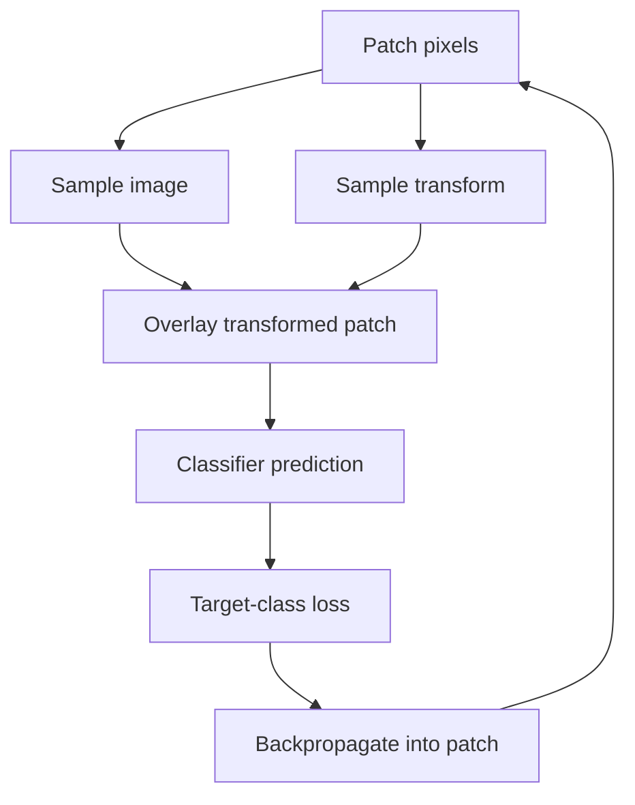

# Adversarial Patch

An adversarial patch is a visible, localized pattern that can be placed in a scene to cause a classifier to output an attacker-chosen target class. Unlike imperceptible $\ell_p$ perturbations, the patch is allowed to be obvious. The attack instead asks whether a small physical object can dominate the model's prediction under changes in position, scale, rotation, lighting, and background.

The adversarial patch paper shifted attention from "tiny noise" to robust physical artifacts. It is a universal targeted attack: the same patch can be used across many images and scenes, and the optimizer trains it to remain effective after random transformations.

## Threat model

The attacker controls a patch image $p$ and a placement mask $m$. Given an image $x$, a transformation $T$ places and warps the patch into the scene:

$$
x'=(1-m_T)x+m_T T(p).
$$

The goal is targeted:

$$
\arg\max_k f_k(x')=t,
$$

where $t$ is the attacker-selected target class. The attacker usually has white-box access during patch optimization, then deploys the learned patch physically or digitally. The budget is patch area, allowed transformations, printability, and placement assumptions, not an imperceptible norm ball.

## Method

The patch is optimized by expectation over transformations:

$$
\max_p
\mathbb{E}_{x\sim\mathcal{D},\ \tau\sim\mathcal{T}}
\left[
\log p_t(A(x,p,\tau))
\right],
$$

where $A$ applies the transformed patch to an image. The transformation distribution $\mathcal{T}$ may sample scale, rotation, location, brightness, and camera-like changes. The optimization uses ordinary backpropagation into the patch pixels:

$$
p^{t+1}=\Pi_{\mathrm{valid}}
\left(p^t+\alpha\nabla_p \log p_t(A(x,p^t,\tau))\right).
$$

Because the patch is localized and visible, perceptual imperceptibility is not the objective. Instead, the patch must be robust: it should continue to trigger the target prediction across scenes and viewing conditions.

## Visual



| Attack type | Perturbation shape | Primary budget | Typical goal |
|---|---|---|---|
| FGSM/PGD | Full-image small noise | $\ell_p$ radius | Untargeted or targeted |
| Universal perturbation | Full-image shared vector | $\ell_p$ radius | High fooling rate |
| Adversarial patch | Local visible pattern | Patch area and transforms | Targeted class dominance |
| Stop-sign sticker | Physical local markings | Printability and sign realism | Specific road-sign misclassification |

## Worked example 1: Patch compositing

Problem: A grayscale pixel has clean value $x=0.30$. A transformed patch at that pixel has value $p=0.90$. The mask value is $m=1$ if the patch fully covers the pixel and $m=0$ otherwise. Compute the composited value for $m=1$ and $m=0$.

1. The compositing formula is:

$$
x'=(1-m)x+mp.
$$

2. If $m=1$:

$$
x'=(1-1)(0.30)+1(0.90)=0.90.
$$

3. If $m=0$:

$$
x'=(1-0)(0.30)+0(0.90)=0.30.
$$

Checked answer: covered pixels take the patch value; uncovered pixels remain clean. Soft masks interpolate between the two.

## Worked example 2: Estimating patch-area budget

Problem: An image is $224\times224$ pixels. A square patch is $40\times40$. What fraction of the image area does the patch cover?

1. Image area:

$$
224\cdot224=50176.
$$

2. Patch area:

$$
40\cdot40=1600.
$$

3. Fraction:

$$
\frac{1600}{50176}\approx0.0319.
$$

4. Percentage:

$$
0.0319\cdot100\%\approx3.19\%.
$$

Checked answer: the patch covers about $3.2\%$ of the image. A report should state this area rather than describing the patch only as "small."

## Implementation

```python
import torch
import torch.nn.functional as F

def overlay_patch(x, patch, top, left):
    x_adv = x.clone()
    _, _, ph, pw = patch.shape
    x_adv[:, :, top:top+ph, left:left+pw] = patch
    return x_adv.clamp(0.0, 1.0)

def train_patch_step(model, x, patch, target, top, left, lr=0.05):
    patch = patch.detach().clone().requires_grad_(True)
    x_adv = overlay_patch(x, patch, top, left)
    loss = F.cross_entropy(model(x_adv), target)
    grad = torch.autograd.grad(loss, patch)[0]
    with torch.no_grad():
        patch = (patch - lr * grad.sign()).clamp(0.0, 1.0)
    return patch.detach()
```

This minimal code fixes the patch location. A real patch attack samples differentiable transformations and optimizes expected target confidence over many images.

## Original paper results

Brown, Mane, Roy, Abadi, and Gilmer introduced the adversarial patch as a universal, robust, targeted patch that could be printed, placed in real scenes, photographed, and still cause image classifiers to report a chosen target. The paper's headline result is the transformation-robust targeted construction rather than an imperceptible distortion number.

The conservative claim is that visible localized patches can dominate classifier attention under the evaluated physical and digital transformations. The result does not imply that every patch size, object category, camera, or detector is equally vulnerable.

## Connections

- [Physical-world and patch attacks](/cs/adversarial-attacks/physical-world-and-patch-attacks) gives the broader transformation-aware setting.
- [Universal adversarial perturbations](/cs/adversarial-attacks/universal-adversarial-perturbations) shares the idea of one perturbation for many inputs.
- [Physical stop-sign attack](/cs/adversarial-attacks/physical-stop-sign-attack) specializes patch-like optimization to road signs.
- [Threat models and attack taxonomy](/cs/adversarial-attacks/threat-models-and-attack-taxonomy) explains why patch budgets differ from norm balls.
- [Gradient masking and obfuscation](/cs/adversarial-attacks/gradient-masking-and-obfuscation) covers expectation over transformations for randomized systems.

## Common pitfalls / when this attack is used today

- Calling the patch imperceptible; visibility is allowed and often expected.
- Reporting patch success without patch area, location constraints, and transformation distribution.
- Optimizing only at a fixed image location while claiming physical robustness.
- Ignoring printing, lighting, camera exposure, and distance.
- Comparing patch robustness directly to $\ell_\infty$ robustness without noting threat-model mismatch.
- Using adversarial patches today for physical robustness testing, detector stress tests, and attention-dominance analysis.

Patch attacks should always report the transformation distribution. A patch optimized only at the image center may fail when moved to the corner. A patch optimized at one scale may fail when the object is farther from the camera. A patch optimized on digital images may fail after printing because colors, paper texture, glare, and camera exposure shift the actual pixel values. The expectation-over-transformations objective is the mechanism that turns a digital patch into a physical-robustness claim.

The patch area is also part of the security claim. A patch covering 2% of an image and a patch covering 30% of an image are not the same threat. For object detectors, area should sometimes be measured relative to the object bounding box rather than the full image, because a small image-level patch can cover a large fraction of a small object. Location constraints matter too: a sticker on a road sign, a badge on a shirt, and a patch floating anywhere in the camera frame are different capabilities.

Targeted patch attacks can be evaluated in several ways. For classifiers, success is usually the target class becoming top-1. For detectors, success may mean hiding an object, creating a false object, changing a class label, or reducing confidence below a threshold. For segmentation systems, success may be region-specific. A patch paper should define the output behavior precisely rather than using a generic phrase like "fools the model."

Defenses against patches include adversarial patch training, input transformations, saliency or occlusion detectors, certified patch defenses, and sensor fusion. Each defense changes the attack. A detector can be attacked jointly with the classifier. Randomized cropping requires EOT. Certified patch defenses must state the patch size, shape, and location assumptions. A defense that works for square digital patches may not work for irregular physical stickers.

Modern patch work extends into face recognition, object detection, person detectors, autonomous driving, and multimodal systems. The common theme is visible localized control. That makes patch attacks especially relevant for safety reviews because they model an attacker who can modify the environment, not the digital file. They should be evaluated with the same discipline as physical security tests: capability, placement, duration, environment, and success condition.

A compact adversarial-patch reporting checklist is:

| Field | What to write down |
|---|---|
| Patch budget | Area, shape, location, and whether the patch is visible |
| Transformations | Scale, rotation, lighting, background, camera, and print assumptions |
| Goal | Classifier target, detector hiding, false detection, or another behavior |
| Training data | Images and scenes used to optimize the patch |
| Evaluation data | Held-out digital scenes and physical trials if claimed |
| Physical details | Printer, material, distance, camera, and environmental conditions |

For reproduction, separate digital robustness from physical robustness. A digital patch evaluated under random crops is not the same as a printed patch photographed under real lighting. If both are reported, the physical result should use held-out captures, not only the photos used to tune the patch. If the patch is targeted, report both target success and any non-target failures because an untargeted failure may be easier than the intended target.

Patch attacks also interact with human attention. A patch that is obvious to a human may still be a valid attack if the threat model permits visible artifacts, but that visibility affects mitigation. Human operators may notice a large sticker; automated systems may not. The defense discussion should therefore consider operational detection, not only classifier robustness.

A final interpretation point is that patch attacks are often closer to environmental security than to file tampering. The attacker may not control the camera tensor, but may control something in the scene. That makes patch attacks relevant to public spaces, vehicles, face recognition, retail systems, and robots. The feasibility question is therefore physical access plus persistence, not only mathematical perturbation size.

For readers comparing this page with universal perturbations, remember that both reuse one pattern across inputs, but patches intentionally concentrate influence into a visible region. That concentration is why they can be robust under transformations and why area, location, and human detection matter so much.

Patch papers should also state whether the patch is optimized per target model or transferred. A patch trained directly on the target model is a white-box physical attack; a patch trained on a surrogate and tested elsewhere is a transfer attack. The deployment story changes with that distinction.

## Further reading

- Brown et al., "Adversarial Patch."
- Eykholt et al., "Robust Physical-World Attacks on Deep Learning Visual Classification."
- Athalye et al., "Synthesizing Robust Adversarial Examples."
