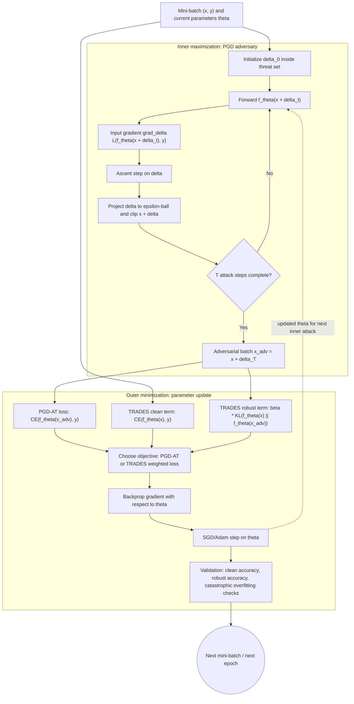

# Adversarial Training

Adversarial training is the most important empirical defense for norm-bounded image robustness. Instead of training only on clean examples, it trains on adversarial examples generated against the current model. The idea is simple: if the model will face worst-case perturbations at test time, include worst-case perturbations in the training objective.


*Figure: The FGSM panda example shows that imperceptible perturbations can change model decisions. Image: [ar5iv](https://arxiv.org/abs/1412.6572), Goodfellow, Shlens, and Szegedy, educational use with attribution.*

The cost is also central. Strong adversarial training is much more expensive than ordinary empirical risk minimization, can reduce clean accuracy, and can overfit robust accuracy late in training. This page gives the min-max objective, common variants such as PGD adversarial training and TRADES, and the implementation choices that determine whether the result is meaningful.

## Definitions

Standard supervised training minimizes empirical risk:

$$
\min_\theta \frac{1}{n}\sum_{i=1}^n
\mathcal{L}(f_\theta(x_i), y_i).
$$

**Adversarial training** minimizes a robust empirical risk:

$$
\min_\theta \frac{1}{n}\sum_{i=1}^n
\max_{\delta_i \in \Delta(x_i)}
\mathcal{L}(f_\theta(x_i+\delta_i), y_i).
$$

The inner maximization creates adversarial examples. The outer minimization updates model parameters to classify those adversarial examples correctly. In practice, the inner maximization is approximate, often PGD with random starts.

**PGD adversarial training** uses multi-step projected gradient ascent for the inner problem. A typical $\ell_\infty$ inner attack is:

$$
x^{t+1}
=
\Pi_{[0,1]^d \cap B_\infty(x,\epsilon)}
\left(x^t + \alpha\,\mathrm{sign}(\nabla_{x^t}\mathcal{L}(f_\theta(x^t), y))\right).
$$

**TRADES** separates clean accuracy and prediction stability by using a natural loss plus a robustness regularizer:

$$
\min_\theta
\mathbb{E}
\left[
\mathcal{L}(f_\theta(x), y)
+
\beta
\max_{\delta \in \Delta(x)}
D_{\mathrm{KL}}(f_\theta(x)\ \|\ f_\theta(x+\delta))
\right].
$$

Here $\beta$ controls the accuracy-robustness tradeoff.

**Free adversarial training** reuses gradients across repeated mini-batch passes to reduce cost. **Fast adversarial training** uses one-step attacks, often with random initialization and stabilization tricks. These methods aim to approximate strong training at lower computational cost.

**Robust overfitting** is the phenomenon where robust test accuracy degrades after learning-rate drops or late training even while robust training accuracy improves. It is a reminder that adversarial training is still statistical learning, not just optimization.

## Key results

The min-max objective is the central formula:

$$
\min_\theta
\mathbb{E}_{(x,y)}
\left[
\max_{\delta \in \Delta(x)}
\mathcal{L}(f_\theta(x+\delta), y)
\right].
$$

Madry-style PGD adversarial training popularized a practical version of this objective for deep networks. The [inner PGD attack](/cs/adversarial-attacks/white-box-attacks#iterative-projected-gradient-methods) is not guaranteed to find the exact maximum, but multi-step PGD with random starts is a strong first-order adversary for many norm-bounded image settings. The defense claim should therefore say "robust against the evaluated $\ell_p$ PGD or AutoAttack threat model," not "robust to all attacks."

Adversarial training changes the learned representation. Models trained robustly often have smoother input gradients, larger margins in the chosen threat set, and features that align better with human-perceptible structure. But robustness is threat-model-specific. A model trained for $\ell_\infty$ radius $\epsilon$ is not automatically robust to patches, rotations, corruptions, or unrestricted semantic changes.

The training cost scales roughly with the number of attack steps. If clean training uses one forward-backward pass per batch, PGD-$k$ adversarial training uses about $k$ gradient computations for the inner attack plus another update for model parameters, with implementation details affecting the exact count. This cost drives interest in free, fast, and curriculum variants.

TRADES reframes the problem as a tradeoff. Instead of only maximizing the true-label loss at adversarial points, it penalizes disagreement between clean and perturbed predictions. In simplified terms, it asks the model to be correct on $x$ and locally stable around $x$. The parameter $\beta$ matters: larger $\beta$ usually favors robustness more strongly and can reduce clean accuracy.

No adversarial-training recipe should be judged by a weak attack. A one-step training method can accidentally learn to resist that one-step method while remaining vulnerable to stronger attacks, a failure sometimes called catastrophic overfitting in fast adversarial training contexts. Evaluation with [gradient masking checks](/cs/adversarial-attacks/gradient-masking-and-obfuscation) and [benchmarks](/cs/adversarial-attacks/evaluation-and-benchmarks) is part of the defense.

Model selection is part of adversarial training. The best clean-validation checkpoint may not be the best robust-validation checkpoint, and the final epoch may not be best if robust overfitting occurs. A defensible training report therefore tracks clean test accuracy, robust validation accuracy under a fixed attack, robust test accuracy under a stronger attack suite, and training cost. Data augmentation and regularization still matter, but they should be evaluated under the same threat model as the defense claim. Mixing clean and adversarial examples in a batch can improve clean accuracy, yet the ratio changes the effective robust objective.

The inner attack should normally be generated against the current model, not a stale checkpoint, because the adversary in the min-max objective responds to the current parameters. Some efficient methods reuse gradients or perturbations across mini-batches, but then the approximation should be named. It is also important to distinguish training-time attack strength from evaluation-time attack strength. Training with PGD-7 does not justify evaluating only with PGD-7; the final model should face a stronger and more diverse attack suite.

Finally, adversarial training is not a drop-in patch after a model is finished. It changes optimization, hyperparameter tuning, checkpoint selection, and sometimes architecture choice. Treat it as a training regime with its own validation protocol.

## Visual


*Figure: TRADES frames adversarial training as an explicit tradeoff between natural accuracy and robustness. From [Zhang et al., 2019](https://arxiv.org/abs/1901.08573) — embedded under educational fair use with attribution.*



This diagram shows adversarial training as a min-max loop with a PGD inner maximization and an SGD/Adam outer minimization. The TRADES branch makes the dual objective explicit: clean cross-entropy is balanced against a KL robustness term computed between clean and adversarial predictions.

| Method | Inner attack | Extra cost | Main benefit | Main risk |
|---|---|---|---|---|
| PGD adversarial training | Multi-step PGD | High | Strong empirical robustness baseline | Expensive, threat-specific |
| TRADES | KL-based adversarial perturbation | High | Explicit accuracy-robustness control | Needs $\beta$ tuning |
| Free adversarial training | Reused gradients over repeated batches | Medium | Faster than naive PGD-AT | Implementation-sensitive |
| Fast adversarial training | One-step FGSM-like attack | Low | Much cheaper | Catastrophic overfitting if poorly controlled |
| Curriculum or mixed training | Varying attack strength | Variable | Stabilizes learning | Can undertrain for final threat model |

## Worked example 1: Estimating adversarial-training cost

Problem: Clean training costs 1 unit per mini-batch. PGD adversarial training uses 7 inner attack steps and then one parameter update. Estimate the cost multiplier if each step costs about one backward pass.

1. Clean training:

$$
C_{\mathrm{clean}} = 1.
$$

2. Inner PGD attack uses 7 gradient computations with respect to inputs:

$$
C_{\mathrm{inner}} = 7.
$$

3. The outer model update uses one additional training gradient:

$$
C_{\mathrm{outer}} = 1.
$$

4. Total approximate adversarial-training cost:

$$
C_{\mathrm{AT}} = 7 + 1 = 8.
$$

5. Cost multiplier:

$$
\frac{C_{\mathrm{AT}}}{C_{\mathrm{clean}}} = \frac{8}{1}=8.
$$

Checked answer: PGD-7 adversarial training is roughly 8 times the clean-training cost under this simple accounting. Actual wall-clock cost depends on implementation, mixed precision, gradient reuse, and hardware.

## Worked example 2: TRADES loss calculation

Problem: A mini-batch has average clean cross-entropy $0.40$. The adversarial KL term is $0.18$. Compute the TRADES objective for $\beta=6$.

1. TRADES objective for the batch:

$$
L_{\mathrm{TRADES}} = L_{\mathrm{clean}} + \beta L_{\mathrm{KL}}.
$$

2. Substitute values:

$$
L_{\mathrm{TRADES}} = 0.40 + 6(0.18).
$$

3. Multiply:

$$
6(0.18)=1.08.
$$

4. Add:

$$
0.40+1.08=1.48.
$$

Checked answer: the batch objective is $1.48$. The KL term dominates the update because $\beta=6$ heavily weights local stability.

## Code

```python
import torch
import torch.nn.functional as F

def pgd_attack_for_training(model, x, y, epsilon, step_size, steps):
    x0 = x.detach()
    x_adv = (x0 + torch.empty_like(x0).uniform_(-epsilon, epsilon)).clamp(0, 1)
    for _ in range(steps):
        x_adv.requires_grad_(True)
        loss = F.cross_entropy(model(x_adv), y)
        grad = torch.autograd.grad(loss, x_adv)[0]
        with torch.no_grad():
            x_adv = x_adv + step_size * grad.sign()
            delta = (x_adv - x0).clamp(-epsilon, epsilon)
            x_adv = (x0 + delta).clamp(0, 1)
    return x_adv.detach()

def adversarial_training_step(model, optimizer, x, y, epsilon=8 / 255):
    model.train()
    x_adv = pgd_attack_for_training(model, x, y, epsilon, step_size=2 / 255, steps=7)
    optimizer.zero_grad()
    loss = F.cross_entropy(model(x_adv), y)
    loss.backward()
    optimizer.step()
    return float(loss.detach())
```

This is the basic PGD adversarial-training loop. Production code should handle batch normalization carefully, log clean and robust accuracy separately, and evaluate with stronger attacks than the one used during training.

## Common pitfalls

- Training with one attack and claiming robustness to a broader threat model.
- Evaluating the final model only with the training attack, especially if the attack is weak.
- Forgetting to track clean accuracy, robust accuracy, and robust test loss separately.
- Using $\epsilon$ values that do not match the input scaling after normalization.
- Letting fast adversarial training collapse into catastrophic overfitting without monitoring multi-step attack accuracy.
- Treating adversarial training as certification. It is an empirical defense, not a proof.
- Ignoring computational cost and comparing robust models to clean baselines with very different training budgets.

## Connections

- [Mathematical formulation](/cs/adversarial-attacks/mathematical-formulation) gives the robust risk objective.
- [White-box attacks](/cs/adversarial-attacks/white-box-attacks#iterative-projected-gradient-methods) supplies the PGD inner maximization.
- [Certified defenses and randomized smoothing](/cs/adversarial-attacks/certified-defenses-and-randomized-smoothing) distinguishes empirical robustness from proofs.
- [Robustness-accuracy tradeoff](/cs/adversarial-attacks/robustness-accuracy-tradeoff) focuses on why robustness can reduce clean accuracy.
- [Evaluation and benchmarks](/cs/adversarial-attacks/evaluation-and-benchmarks) explains how to test adversarially trained models.

## Further reading

- Madry et al., "Towards Deep Learning Models Resistant to Adversarial Attacks."
- Zhang et al., "Theoretically Principled Trade-off between Robustness and Accuracy."
- Shafahi et al., "Adversarial Training for Free!"
- Wong, Rice, and Kolter, "Fast Is Better Than Free: Revisiting Adversarial Training."
- Rice, Wong, and Kolter, work on overfitting in adversarially robust deep learning.
