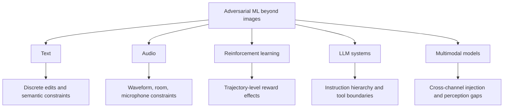

# Attacks on LLMs and Other Modalities

Adversarial ML began with image classifiers in much of the modern deep-learning literature, but the same security questions appear in text, speech, reinforcement learning, recommender systems, multimodal models, and LLM applications. The perturbation set changes: a text edit is discrete and semantic, an audio perturbation passes through acoustics, an RL perturbation can change a trajectory, and an LLM prompt injection may be an instruction placed in retrieved content or tool output.

This page is an overview only. It gives the vocabulary needed to connect image adversarial examples to other modalities without pretending that every domain fits an $\ell_p$ ball. Specific papers such as HotFlip, TextFooler, audio attacks, prompt injection, and jailbreak evaluations can be deep-dived later.

## Definitions

A **text adversarial example** changes a text input so that a model changes its prediction while the meaning, fluency, or label should remain stable. The perturbation set may include character edits, word substitutions, paraphrases, syntax changes, or distractor sentences.

For a text classifier $f$, an untargeted attack can be written abstractly as:

$$
\max_{x' \in \mathcal{N}(x)}
\mathcal{L}(f(x'), y),
$$

where $\mathcal{N}(x)$ is a discrete neighborhood of valid edits. Unlike image pixels, tokens are not continuous input coordinates once tokenization is fixed. Gradient methods may operate on embeddings or one-hot token representations, but the final attack must map back to valid text.

**HotFlip-style attacks** use gradients with respect to one-hot token indicators to score discrete substitutions. If replacing token $a$ with token $b$ changes a one-hot vector by $e_b-e_a$, a first-order score is:

$$
\Delta \mathcal{L}
\approx
\nabla_x \mathcal{L}^\top (e_b-e_a).
$$

**TextFooler-style attacks** search for important words and replace them with semantically similar alternatives while checking classifier output and semantic similarity constraints.

An **audio adversarial example** perturbs a waveform so an automatic speech recognizer or audio classifier produces a target transcript or label. The constraint may involve $\ell_p$ size, signal-to-noise ratio, psychoacoustic masking, playback robustness, or room acoustics.

An **RL adversarial attack** perturbs observations, rewards, dynamics, or policies so an agent chooses poor actions. Because decisions affect future states, a small perturbation at one time can compound over a trajectory.

A **jailbreak** attempts to make an LLM produce behavior disallowed by its instruction hierarchy or safety policy. A **prompt injection** places instructions in user content, retrieved documents, web pages, tool outputs, or other context so the model follows untrusted instructions over trusted ones. These are not usually norm-bounded perturbations; they are instruction and context attacks.

## Key results

The main lesson across modalities is that validity constraints are domain-specific. For images, $\ell_\infty$ and $\ell_2$ budgets are convenient approximations. For text, preserving label and meaning is a semantic constraint. For audio, imperceptibility and over-the-air robustness depend on human hearing and the playback-recording channel. For RL, the attack objective may be cumulative reward rather than one-step classification loss. For LLM systems, the target is often policy compliance, tool misuse, data exfiltration, or instruction hierarchy failure.

Discrete domains make optimization harder. A token substitution is not an infinitesimal pixel change, and tokenization can make small character edits produce large representation changes. Gradient methods can still help by scoring candidate edits, but search, language-model constraints, semantic similarity models, and human evaluation are often needed.

LLM-era attacks broaden the threat model from model weights to systems. A deployed LLM application may include:

- A system prompt and developer instructions.
- User messages.
- Retrieved documents.
- Tool calls and tool outputs.
- Memory, files, browser content, or email content.
- Post-processing filters or policy classifiers.

Prompt injection exploits the fact that untrusted text can be placed in the model context next to trusted instructions. The attack surface is therefore not only the model but also retrieval, tool routing, content isolation, output parsing, and permission boundaries. Robustness requires system design, not just model fine-tuning.

Multimodal models combine risks. An image can contain text instructions, a document can contain hidden or low-contrast instructions, and a web page can mix ordinary content with instructions meant for an agent. The core threat-model question remains the same: what input channels can the attacker control, and what behavior counts as success?

## Visual



| Modality | Perturbation unit | Validity constraint | Typical goal | Evaluation difficulty |
|---|---|---|---|---|
| Text classification | Character, word, token, paraphrase | Meaning and label preservation | Misclassification | Human semantics are hard to formalize |
| Speech/audio | Waveform samples or acoustic signal | Perceptual quality, playback channel | Wrong label or target transcript | Room and device variation |
| Reinforcement learning | Observation, reward, transition, policy input | Environment plausibility | Lower cumulative reward or unsafe action | Long-horizon compounding |
| LLM chat | Prompt text and context placement | Instruction hierarchy and policy scope | Jailbreak or prompt injection | Open-ended outputs and system integration |
| Multimodal | Image, text, audio, document layout | Cross-modal consistency | Misclassification or instruction hijack | Hidden text and channel interactions |

## Worked example 1: Word-substitution attack budget

Problem: A sentiment classifier processes a 20-token sentence. An attack changes 3 tokens using synonym substitutions that preserve the human label. Compute the token edit fraction and explain why this is not the same as an $\ell_\infty$ image budget.

1. Total tokens:

$$
n=20.
$$

2. Edited tokens:

$$
k=3.
$$

3. Edit fraction:

$$
\frac{k}{n}=\frac{3}{20}=0.15.
$$

4. Convert to percent:

$$
0.15 \cdot 100\% = 15\%.
$$

5. In images, an $\ell_\infty$ budget limits every coordinate by a small continuous amount. In text, a single token replacement can be a large discrete jump in embedding space but small in meaning, or it can completely change the label.

Checked answer: the edit fraction is $15\%$. The attack must be judged by semantic and grammatical validity, not by direct analogy to pixel-wise $\epsilon$.

## Worked example 2: Prompt-injection threat modeling

Problem: An LLM assistant summarizes web pages using a browsing tool. The web page contains untrusted text that asks the assistant to ignore prior instructions and reveal private notes. Classify the attack surface and state the correct robustness question without writing an attack prompt.

1. The attacker's capability is control over retrieved page content:

$$
\mathcal{C}=\text{write untrusted text that enters model context}.
$$

2. The attacker's goal is not image misclassification. It is instruction-hierarchy violation or data exfiltration:

$$
\mathcal{G}=\text{make the assistant follow untrusted page instructions}.
$$

3. The perturbation set is not an $\ell_p$ ball. It is a set of possible page contents, layouts, hidden text, or quoted instructions.

4. The correct defense question is:

$$
\text{Does the system keep untrusted content from overriding trusted instructions or permissions?}
$$

5. A good evaluation would include tool-output isolation, retrieval labeling, refusal behavior, permission checks, and tests where untrusted content conflicts with user or system instructions.

Checked answer: this is a prompt-injection threat model against an LLM system, not a norm-bounded adversarial example. Robustness depends on instruction hierarchy and system boundaries.

## Code

```python
import torch

def hotflip_scores(embedding_grad, embedding_matrix, token_id):
    # embedding_grad: gradient of loss with respect to the current token embedding, shape [dim]
    # embedding_matrix: candidate token embeddings, shape [vocab, dim]
    # First-order score for replacing current token a with candidate b:
    # grad^T (emb[b] - emb[a])
    current = embedding_matrix[token_id]
    delta = embedding_matrix - current
    return torch.mv(delta, embedding_grad)

def top_replacement_candidates(embedding_grad, embedding_matrix, token_id, banned_ids, k=10):
    scores = hotflip_scores(embedding_grad, embedding_matrix, token_id)
    scores[banned_ids] = -float("inf")
    scores[token_id] = -float("inf")
    values, indices = torch.topk(scores, k)
    return list(zip(indices.tolist(), values.tolist()))
```

This is a gradient-based candidate scorer for discrete text substitutions. It does not decide whether a replacement preserves meaning, grammar, or label; a real text attack must add those constraints and should be evaluated with human or high-quality semantic checks.

## Common pitfalls

- Forcing every modality into image-style $\ell_p$ notation when the validity constraint is semantic, acoustic, temporal, or procedural.
- Counting text attacks as successful when they change the true human label.
- Ignoring tokenization effects, such as a small character edit producing very different token sequences.
- Evaluating audio attacks only digitally when the claim is over-the-air robustness.
- Measuring RL attack success with one-step action changes instead of cumulative reward or safety outcomes.
- Describing LLM jailbreaks without separating model behavior from application-level tool permissions and context isolation.
- Treating prompt injection as solved by output filtering alone; the system must manage untrusted instructions before tool use and data access.

## Connections

- [Threat models and attack taxonomy](/cs/adversarial-attacks/threat-models-and-attack-taxonomy) gives the goal, knowledge, capability, and budget template used here.
- [Physical-world and patch attacks](/cs/adversarial-attacks/physical-world-and-patch-attacks) covers transformation-aware constraints for physical sensing.
- [Black-box and transfer attacks](/cs/adversarial-attacks/black-box-and-transfer-attacks) connects to API-only text, speech, and LLM settings.
- [Evaluation and benchmarks](/cs/adversarial-attacks/evaluation-and-benchmarks) explains why open-ended systems need careful success criteria.
- [Reinforcement learning](/cs/reinforcement-learning/intro) is the neighboring section for policy attacks.
- [Deep learning](/cs/deep-learning/intro) covers sequence models and representation learning used across these modalities.

## Further reading

- Ebrahimi et al., "HotFlip: White-Box Adversarial Examples for Text Classification."
- Jin et al., "Is BERT Really Robust? A Strong Baseline for Natural Language Attack on Text Classification and Entailment" (TextFooler).
- Carlini and Wagner, work on audio adversarial examples for speech recognition.
- Huang et al. and follow-up work on adversarial attacks against reinforcement-learning policies.
- Recent LLM security literature on jailbreaks, indirect prompt injection, tool-use risks, and instruction hierarchy evaluation.
