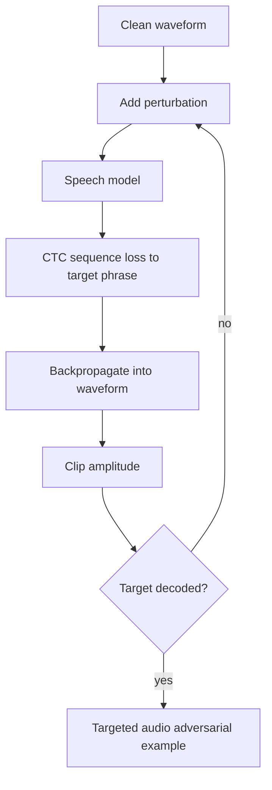

# Audio Adversarial Examples

Audio adversarial examples target speech or speaker-recognition systems by adding a waveform perturbation that changes the transcription or identity decision while trying to remain small or masked to human listeners. The best-known early deep-dive is Carlini and Wagner's targeted attack on automatic speech recognition, which generated audio that DeepSpeech transcribed as attacker-chosen phrases.

Audio changes the adversarial example problem. Inputs are time-domain waveforms or spectrograms, outputs are sequences rather than single labels, and perceptual constraints involve loudness, psychoacoustics, room playback, and microphones rather than pixel norms alone.

## Threat model

For speech-to-text, the attacker starts with waveform $x$ and target phrase $l$. The goal is:

$$
\mathrm{decode}(f(x+\delta))=l,
$$

with a distortion or loudness constraint on $\delta$. The attacker is usually white-box in the original attack, with access to model gradients and the sequence loss. Physical versions also require over-the-air playback and recording robustness.

For speaker recognition, the goal may be impersonation or dodging:

$$
\mathrm{verify}(x+\delta,\mathrm{speaker})=\mathrm{accept}
$$

or rejection of the true speaker. The valid perturbation budget must specify waveform amplitude, signal-to-noise ratio, perceptual audibility, and playback assumptions.

## Method

For a differentiable speech recognizer trained with CTC loss, a targeted attack can solve:

$$
\min_\delta
\|\delta\|_2^2+c\cdot \mathcal{L}_{\mathrm{CTC}}(f(x+\delta),l)
\quad \text{subject to} \quad x+\delta\in[-1,1]^T.
$$

Here $l$ is the target transcription. CTC loss handles the alignment between audio frames and output characters:

$$
\mathcal{L}_{\mathrm{CTC}}=-\log p(l\mid x+\delta).
$$

An optimizer such as Adam updates the waveform perturbation. Later audio attacks add psychoacoustic masking, room impulse responses, or expectation over playback transformations:

$$
\mathbb{E}_{\omega}
\left[
\mathcal{L}_{\mathrm{CTC}}(f(T_\omega(x+\delta)),l)
\right].
$$

This mirrors physical image attacks: the attacker must decide whether the claim is digital-only or robust to speakers, microphones, compression, and rooms.

## Visual



| Domain | Input geometry | Output | Common constraint |
|---|---|---|---|
| Image classifier | Pixels | Class label | $\ell_p$ radius |
| Speech recognizer | Waveform or features | Character or token sequence | SNR, loudness, waveform bounds |
| Speaker verification | Voice recording | Accept/reject or identity | Impersonation threshold |
| Physical audio | Played and recorded sound | Transcription or command | Room and device transformations |

## Worked example 1: Signal-to-noise ratio

Problem: A clean waveform has energy:

$$
\|x\|_2^2=100.
$$

The perturbation has energy:

$$
\|\delta\|_2^2=1.
$$

Compute the signal-to-noise ratio in decibels:

$$
\mathrm{SNR}=10\log_{10}\frac{\|x\|_2^2}{\|\delta\|_2^2}.
$$

1. Energy ratio:

$$
\frac{100}{1}=100.
$$

2. Logarithm:

$$
\log_{10}(100)=2.
$$

3. SNR:

$$
10\cdot2=20\ \mathrm{dB}.
$$

Checked answer: the perturbation gives a 20 dB SNR. Higher SNR means the perturbation energy is smaller relative to the clean signal.

## Worked example 2: CTC target-loss interpretation

Problem: A speech model assigns probability $p(l\mid x+\delta)=0.001$ to the target phrase before optimization and $0.25$ after optimization. Compute the CTC negative log-likelihood change using natural logs.

1. Initial loss:

$$
-\log(0.001)=6.9078.
$$

2. Final loss:

$$
-\log(0.25)=1.3863.
$$

3. Loss decrease:

$$
6.9078-1.3863=5.5215.
$$

Checked answer: the target sequence loss decreases by about $5.52$, meaning the model assigns much higher probability to the attacker-chosen phrase.

## Implementation

```python
import torch

def audio_attack_step(model, waveform, delta, target, ctc_loss_fn, c=1.0, lr=1e-3):
    delta = delta.detach().clone().requires_grad_(True)
    adv = (waveform + delta).clamp(-1.0, 1.0)
    logits = model(adv)
    ctc_loss = ctc_loss_fn(logits, target)
    distortion = delta.pow(2).mean()
    loss = distortion + c * ctc_loss
    grad = torch.autograd.grad(loss, delta)[0]
    with torch.no_grad():
        delta = delta - lr * grad
        adv = (waveform + delta).clamp(-1.0, 1.0)
        delta = adv - waveform
    return delta.detach()
```

The recognizer, tokenizer, CTC target formatting, and waveform normalization are model-specific. Physical attacks need additional transforms for playback and recording.

## Original paper results

Carlini and Wagner's 2018 audio attack on DeepSpeech demonstrated targeted adversarial examples for speech-to-text. The paper reported high targeted success in the digital setting and showed that arbitrary target phrases could be induced under its optimization setup. Later work explored over-the-air robustness, psychoacoustic masking, and speaker-recognition attacks.

The conservative takeaway is that sequence models can be attacked with differentiable losses just like classifiers, but audio validity requires domain-specific perceptual and physical constraints.

## Connections

- [Attacks on LLMs and other modalities](/cs/adversarial-attacks/attacks-on-llms-and-other-modalities) gives the cross-modal overview.
- [Carlini-Wagner attack](/cs/adversarial-attacks/carlini-wagner-attack) supplies the norm-plus-loss optimization style.
- [Physical-world and patch attacks](/cs/adversarial-attacks/physical-world-and-patch-attacks) connects to over-the-air playback transformations.
- [Threat models and attack taxonomy](/cs/adversarial-attacks/threat-models-and-attack-taxonomy) explains why modality-specific budgets matter.
- [Deep learning](/cs/deep-learning/intro) provides sequence losses and differentiable models.

## Common pitfalls / when this attack is used today

- Treating waveform $\ell_2$ distortion as equivalent to human inaudibility.
- Reporting digital success as if it survives speakers and microphones.
- Forgetting that speech outputs are sequences, so ordinary cross-entropy may not apply.
- Ignoring sample rate, clipping, compression, and normalization.
- Comparing speaker-verification and speech-to-text attacks without separating goals.
- Using audio adversarial examples today for speech robustness evaluation, watermarking discussions, and modality-specific threat modeling.

Audio validity is harder than a waveform norm. Humans perceive loudness by frequency, masking, duration, and context. A perturbation with small $\ell_2$ energy can still be audible if it occupies an exposed frequency band, while a larger perturbation can be hidden under loud speech or music. This is why later audio attacks use psychoacoustic models, frequency masking, or perceptual losses instead of only raw sample norms.

The digital-versus-physical distinction is especially sharp in audio. A digital adversarial waveform can be fed directly into a recognizer and succeed. Over-the-air playback adds speakers, microphones, room impulse responses, background noise, automatic gain control, compression, and timing shifts. A robust physical audio attack usually optimizes over transformations or records-and-replays during training. Without that, a digital result should not be described as a voice-command attack in the real world.

Sequence decoding introduces another evaluation issue. A model may assign higher probability to the target phrase but still decode a different phrase after beam search or language-model rescoring. The success criterion should use the actual deployed decoder, vocabulary, and normalization. For example, punctuation, casing, repeated spaces, or homophones can affect whether a target phrase is considered matched. A careful report states the exact transcript-matching rule.

Speaker-recognition attacks use different goals. Dodging means making the system reject the true speaker. Impersonation means making the system accept the attacker as a target speaker. A small perturbation that changes a speech-to-text transcript is not automatically an impersonation attack. The model output, threshold, enrollment procedure, and trial protocol must be specified.

In current work, audio adversarial examples are used to test ASR robustness, voice assistant command safety, speaker verification, and watermarking or detection methods. The best evaluations combine signal-level metrics, human listening studies when relevant, and physical playback tests when deployment claims involve speakers and microphones. As in image work, an empirical defense should be attacked adaptively through the complete preprocessing pipeline.

A compact audio-adversarial reporting checklist is:

| Field | What to write down |
|---|---|
| Task | Speech-to-text, keyword spotting, speaker verification, or command execution |
| Access | White-box gradients, score queries, labels, or transfer |
| Constraint | SNR, loudness, psychoacoustic masking, or waveform norm |
| Decoder | Greedy, beam search, language model, and transcript matching rule |
| Physicality | Digital input, simulated room, or over-the-air playback |
| Metrics | Target success, word error, SNR, human audibility, and query or gradient cost |

For reproduction, store sample rate, bit depth, normalization, clipping, and any feature extraction pipeline. A perturbation generated for 16 kHz audio can change when resampled to 8 kHz or compressed. If the recognizer uses mel features or log spectrograms, the attack should state whether gradients flow through feature extraction or attack a precomputed feature tensor.

Audio defenses should be checked against adaptive transformations. A denoiser, quantizer, or compression step may remove one perturbation but can often be included in the attack objective. If the defense is nondifferentiable, a surrogate gradient or black-box attack may still work. The evaluation standard mirrors image defenses: attack the whole system that will be deployed.

A final interpretation point is that audio attacks often have two audiences: the machine and the human listener. A command can be adversarial because the recognizer hears a target phrase while the human hears the original speech, noise, or something unintelligible. Those are different risk stories. Voice-assistant attacks care about the command that executes; transcription attacks care about the decoded text; speaker-verification attacks care about identity thresholds. The page should not merge these into one generic "audio robustness" number.

For teaching, compare the CTC objective here with the logit-margin objective in [C&W](/cs/adversarial-attacks/carlini-wagner-attack). Both optimize an input perturbation plus a task loss, but speech recognition adds alignment over time. That alignment is the reason ordinary image-classification code cannot simply be copied to audio without handling sequence decoding.

As a practical reading habit, always ask whether the perturbation is meant to be hidden from humans, robust to playback, or simply valid as a digital waveform. These are three different bars. A paper can make an important contribution at any one of them, but the page should not let the strongest-sounding interpretation leak into a narrower experiment.

For comparisons, prefer matched transcripts and matched decoders. A phrase-level targeted attack, a word-error-rate increase, and a wake-word false trigger are different objectives. Putting them in one table without separating the metric creates the same confusion as mixing targeted and untargeted image attacks.

The target behavior defines the attack precisely.

## Further reading

- Carlini and Wagner, "Audio Adversarial Examples: Targeted Attacks on Speech-to-Text."
- Qin et al., "Imperceptible, Robust, and Targeted Adversarial Examples for Automatic Speech Recognition."
- Yakura and Sakuma, "Robust Audio Adversarial Example for a Physical Attack."
