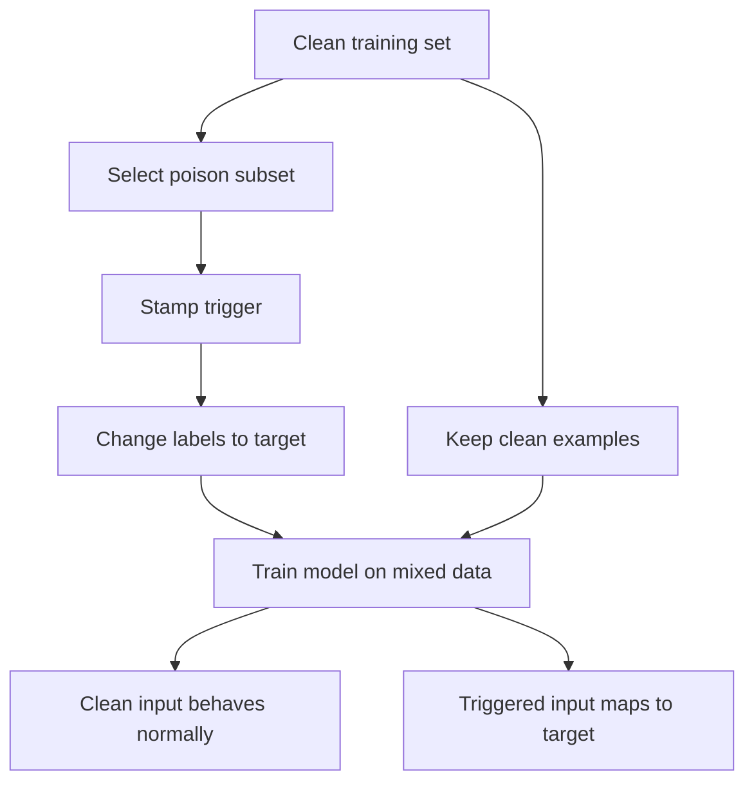

# BadNets Backdoor

BadNets is the classic backdoor attack on deep neural networks. Instead of changing test-time inputs under a fixed trained model, the attacker poisons training so the model learns two behaviors: normal accuracy on clean inputs and attacker-chosen behavior when a trigger pattern appears.

The key security lesson is that high clean accuracy does not imply training integrity. A backdoored model can look normal on ordinary validation data while failing reliably on triggered inputs.

## Threat model

BadNets is a training-time poisoning or supply-chain attack. The attacker can influence some training examples, labels, or the training process. The trigger is a pattern $\tau$ applied by a function:

$$
x' = A(x,\tau).
$$

For a targeted backdoor, poisoned examples are labeled as target class $t$:

$$
(A(x,\tau),t).
$$

At deployment, the attacker presents triggered inputs and wants:

$$
f(A(x,\tau))=t,
$$

while clean inputs still behave normally:

$$
f(x)\approx y.
$$

The budget is not an $\ell_p$ radius. It includes poisoning fraction, trigger size, trigger location, label control, model supply-chain access, and whether the attacker can apply the trigger at test time.

## Method

A simple BadNets data-poisoning construction is:

1. Choose a target label $t$ and trigger pattern $\tau$.
2. Select a fraction $\rho$ of training examples.
3. Replace selected examples with triggered versions:

$$
\tilde{x}_i=A(x_i,\tau).
$$

4. Replace their labels with $t$:

$$
\tilde{y}_i=t.
$$

5. Train the model on the mixed clean and poisoned dataset.

The training loss becomes:

$$
\min_\theta
\sum_{(x,y)\in D_{\mathrm{clean}}}
\mathcal{L}(f_\theta(x),y)
+
\sum_{(x,t)\in D_{\mathrm{poison}}}
\mathcal{L}(f_\theta(A(x,\tau)),t).
$$

If the model has enough capacity, it can learn both the normal classification rule and the trigger-target association.

## Visual



| Attack family | Time of attack | Attacker capability | Success metric |
|---|---|---|---|
| FGSM/PGD | Test time | Modify each input slightly | Misclassification under norm budget |
| Adversarial patch | Test time | Place visible patch | Target success under transforms |
| BadNets | Training time plus test trigger | Poison data or model supply chain | Clean accuracy and attack success rate |
| Data poisoning without trigger | Training time | Change data distribution | General performance degradation or targeted error |

## Worked example 1: Poisoning fraction

Problem: A training set has 50,000 images. The attacker poisons 500 with a trigger and target label. What is the poisoning fraction?

1. Number of poisoned examples:

$$
500.
$$

2. Total examples:

$$
50000.
$$

3. Fraction:

$$
\rho=\frac{500}{50000}=0.01.
$$

4. Percentage:

$$
0.01\cdot100\%=1\%.
$$

Checked answer: the poisoning fraction is $1\%$. A backdoor report should state this number because attack success often depends strongly on it.

## Worked example 2: Attack success rate

Problem: A backdoored classifier is tested on 2,000 clean images with the trigger stamped on them. It predicts the attacker's target class for 1,860 images. Compute attack success rate.

1. Successful triggered predictions:

$$
s=1860.
$$

2. Total triggered test inputs:

$$
n=2000.
$$

3. Attack success rate:

$$
\frac{s}{n}=\frac{1860}{2000}=0.93.
$$

4. Percentage:

$$
93\%.
$$

Checked answer: the attack success rate is $93\%$. This must be reported together with clean accuracy; either number alone is incomplete.

## Implementation

```python
import torch

def stamp_square_trigger(x, size=4, value=1.0):
    x_poison = x.clone()
    x_poison[:, :, -size:, -size:] = value
    return x_poison.clamp(0.0, 1.0)

def make_badnets_batch(x, y, target_label, poison_mask, size=4):
    x_out = x.clone()
    y_out = y.clone()
    if poison_mask.any():
        x_out[poison_mask] = stamp_square_trigger(x_out[poison_mask], size=size)
        y_out[poison_mask] = target_label
    return x_out, y_out
```

This code shows the data transformation, not a defense bypass. Legitimate use is controlled robustness testing, dataset-audit tooling, or reproducing backdoor defenses in a sandboxed experiment.

## Original paper results

Gu, Dolan-Gavitt, and Garg introduced BadNets as a backdooring attack on deep neural networks and demonstrated the pattern on tasks including digit recognition and traffic-sign recognition. The damaged local PDF could not be text-extracted reliably in this run, so this page avoids quoting a single numeric result. The stable result is the attack pattern: a model can retain high clean accuracy while responding to a trigger with attacker-chosen behavior.

The conservative takeaway is that evaluating only clean validation accuracy misses training-time compromise. Backdoor evaluation needs clean accuracy, attack success rate, poisoning fraction, trigger specification, and test-time trigger conditions.

## Connections

- [Threat models and attack taxonomy](/cs/adversarial-attacks/threat-models-and-attack-taxonomy) distinguishes poisoning and evasion.
- [Evaluation and benchmarks](/cs/adversarial-attacks/evaluation-and-benchmarks) explains why clean accuracy is insufficient.
- [Physical-world and patch attacks](/cs/adversarial-attacks/physical-world-and-patch-attacks) relates visible triggers to physical patches, though the training-time mechanism differs.
- [Machine learning](/cs/machine-learning/intro) supplies empirical risk minimization and training data assumptions.
- [Deep learning](/cs/deep-learning/intro) covers capacity and representation learning that make trigger memorization possible.

## Common pitfalls / when this attack is used today

- Calling BadNets a test-time adversarial example attack; it is training-time poisoning plus a test-time trigger.
- Reporting clean accuracy but not attack success rate.
- Omitting poisoning fraction, trigger location, and target label.
- Assuming random validation splits reveal the backdoor if triggered examples are absent.
- Treating all backdoors as visible square triggers; modern triggers can be semantic, blended, or input-adaptive.
- Using BadNets today as the baseline backdoor threat model for defenses, dataset audits, and supply-chain discussions.

Backdoor evaluation has two core metrics, and both are necessary. Clean accuracy measures whether the model still performs its intended task on ordinary inputs. Attack success rate measures whether triggered inputs map to the attacker's target. A backdoor is dangerous precisely because these metrics can coexist: high clean accuracy makes the model look deployable, while high attack success gives the attacker control under trigger conditions.

The poisoning fraction is a major experimental variable. A high poisoning fraction may make the attack easy but easier to detect through data inspection. A low poisoning fraction is stealthier but may require a more salient trigger, longer training, or a more capable model. Reports should include not only the fraction but also whether poisoned examples are distributed across source classes or concentrated in one source class. Source-specific and all-to-one backdoors answer different questions.

Trigger design also changes the threat. A fixed white square in the corner is easy to implement and useful for baselines. A blended trigger, reflection trigger, semantic trigger, or input-adaptive trigger can be harder to detect. Physical triggers must survive viewpoint and sensor changes. A defense that removes one square pattern should not be described as a general backdoor defense unless it is tested against broader trigger families.

Backdoors are also supply-chain problems. The attacker may poison public training data, outsource training, provide a pretrained model, modify weights, or compromise fine-tuning. Each route gives different powers and leaves different evidence. A dataset-audit defense may help against poisoned samples but not against a malicious pretrained checkpoint. A weight-inspection defense may help against a model supply-chain attack but not against future fine-tuning data poisoning.

Modern backdoor defenses include activation clustering, spectral signatures, trigger reverse engineering, fine-pruning, neural cleanse-style scans, data filtering, and robust training. All have assumptions. A good BadNets-style baseline page should remind the reader that "no trigger found" is not a proof of no backdoor; it is evidence under the search space, data access, and detection method used.

A compact BadNets reporting checklist is:

| Field | What to write down |
|---|---|
| Attacker access | Training data, labels, outsourced training, or pretrained weights |
| Poisoning | Fraction, source classes, target class, and sampling rule |
| Trigger | Pattern, size, location, opacity, and whether it is physical |
| Training | Whether clean and poisoned examples are trained together or staged |
| Metrics | Clean accuracy, attack success rate, and false-positive behavior |
| Defense test | Whether the defense sees data, model weights, or only predictions |

For reproduction, save the poisoned index list and trigger-generation code. Randomly poisoning 1% of a dataset can produce different results depending on which classes and examples are selected. If the attack is clean-label, the setup differs from BadNets-style label flipping and should be named separately. If the model is fine-tuned after poisoning, report the fine-tuning data and whether the backdoor persists.

Backdoor pages should also distinguish detection from removal. A method may flag a model as suspicious without repairing it. Another method may reduce attack success while lowering clean accuracy. A third may remove one trigger but leave another. The evaluation table should show all three dimensions when possible: detection rate, post-defense clean accuracy, and post-defense attack success.

A final interpretation point is that BadNets is a minimal backdoor model, not the full modern backdoor landscape. Its visible fixed trigger makes the mechanism easy to study. More advanced attacks can use clean-label poisoning, semantic triggers, style triggers, input-adaptive triggers, or weight-space modifications. A defense that succeeds on BadNets is promising, but it has not solved backdoors in general.

For SJ Wiki, this page also connects adversarial ML with ordinary software supply-chain thinking. The model artifact is not trusted merely because it performs well on validation data. Training provenance, dataset integrity, checkpoint origin, and post-training audits are part of the security story.

One clean way to remember the threat is: evasion attacks ask what happens when the input is malicious, while BadNets asks what happens when the training process was malicious. Both can produce test-time failures, but the evidence, mitigations, and responsible reporting are different.

## Further reading

- Gu, Dolan-Gavitt, and Garg, "BadNets: Evaluating Backdooring Attacks on Deep Neural Networks."
- Chen et al., "Targeted Backdoor Attacks on Deep Learning Systems Using Data Poisoning."
- Wang et al., "Neural Cleanse."
