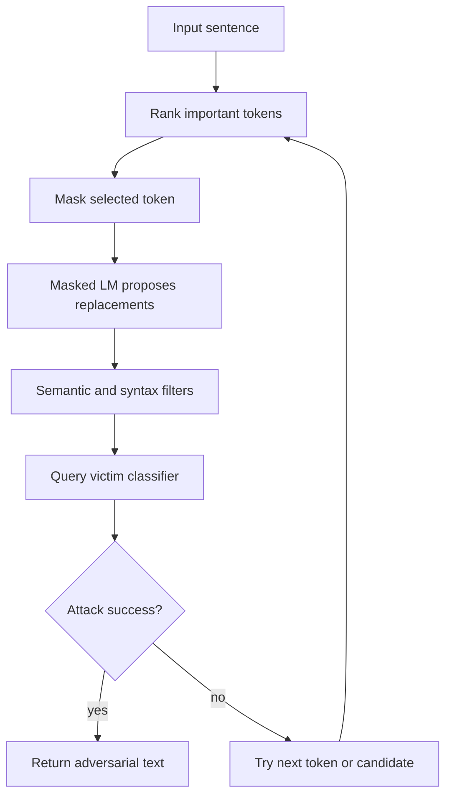

# BERT-Attack

BERT-Attack is a word-substitution attack that uses a masked language model to propose fluent replacement tokens. Instead of relying only on nearest neighbors in a static embedding space, it masks important words in context and asks BERT-like models for plausible substitutes.

The attack reflects a central lesson in NLP robustness: candidate generation and validity filtering are as important as the classifier query strategy. A substitution can fool the classifier but fail as an adversarial example if it breaks meaning, grammar, or task labels.

## Threat model

BERT-Attack is a black-box or score-query attack against NLP classifiers. The attacker can query the victim model for predictions or probabilities, but uses a separate masked language model to generate candidate substitutions. The goal is typically untargeted:

$$
f(x')\ne y.
$$

The capability is bounded word or subword substitution under semantic and fluency constraints:

$$
\mathrm{sim}(x,x')\ge\tau,\qquad \mathrm{changes}(x,x')\le B.
$$

The attacker may not need gradients of the victim. However, the masked language model and semantic filters are part of the attack pipeline and must be reported.

## Method

The attack first ranks words by importance, often by how much removing or masking a word changes the victim model's confidence. For an important word $w_i$, create a masked sentence:

$$
x_{\mathrm{mask}(i)}.
$$

A masked language model proposes candidate replacements:

$$
c_1,c_2,\dots,c_K
\sim
p_{\mathrm{MLM}}(w_i\mid x_{\mathrm{mask}(i)}).
$$

Candidates are filtered for semantic similarity, token validity, and sometimes part of speech. The victim classifier is queried on each valid substitution. The attack accepts a candidate that causes misclassification or most reduces confidence in the true class.

Compared with TextFooler, the distinctive ingredient is contextual candidate generation. The replacement for a word depends on the whole sentence, not only on a static synonym list.

## Visual



| Attack | Candidate source | Victim knowledge | Main advantage |
|---|---|---|---|
| HotFlip | Gradient-scored character edits | White-box | Efficient discrete gradient search |
| TextFooler | Synonyms and embeddings | Black-box scores | Strong word-level baseline |
| BERT-Attack | Contextual masked LM | Black-box scores | Fluent context-aware substitutions |
| Prompt jailbreak suffixes | Optimized token strings | Varies | Attacks instruction-following behavior |

## Worked example 1: Masked-LM candidate filtering

Problem: The sentence is "The film was wonderful and moving." The word "wonderful" is masked. A masked LM proposes:

$$
\text{great},\quad \text{awful},\quad \text{boring}.
$$

For a positive-sentiment sentence, which candidate is least likely to preserve the original label?

1. "great" is positive and close in sentiment to "wonderful."

2. "awful" is negative and reverses sentiment.

3. "boring" is also negative or at least much less positive.

4. The original label is positive sentiment, so candidates that reverse sentiment are invalid if label preservation is required.

Checked answer: "awful" and likely "boring" should be rejected for a sentiment-preserving adversarial example. "great" is the safer semantic candidate.

## Worked example 2: Candidate query selection

Problem: Three valid substitutions produce true-class probabilities:

$$
0.72,\quad 0.55,\quad 0.18.
$$

The original true-class probability was $0.81$, and the model changes label only for the third candidate. Which candidate should the attack accept?

1. The attack prefers immediate misclassification when available.

2. Candidate 1 reduces confidence by:

$$
0.81-0.72=0.09.
$$

3. Candidate 2 reduces confidence by:

$$
0.81-0.55=0.26.
$$

4. Candidate 3 reduces confidence by:

$$
0.81-0.18=0.63,
$$

and changes the predicted label.

Checked answer: accept candidate 3 because it is a valid substitution and already succeeds.

## Implementation

```python
def try_contextual_candidates(victim_score, words, index, candidates, true_label):
    best_text = None
    best_prob = float("inf")
    for candidate in candidates:
        trial = words[:]
        trial[index] = candidate
        text = " ".join(trial)
        prob = victim_score(text, true_label)
        if prob < best_prob:
            best_prob = prob
            best_text = text
    return best_text, best_prob

def replacement_is_allowed(original_word, candidate, banned):
    if candidate == original_word:
        return False
    if candidate in banned:
        return False
    if candidate.startswith("##"):
        return False
    return True
```

This sketch shows the victim-query loop and simple token filtering. A full BERT-Attack implementation includes masked-LM inference, sentence similarity checks, importance ranking, and task-specific constraints.

## Original paper results

Li et al.'s "BERT-Attack: Adversarial Attack Against BERT Using BERT" proposed contextual substitutions from a masked language model and evaluated the method on NLP classification tasks. The paper reported strong attack success against BERT-family and other neural text classifiers while attempting to preserve semantic similarity and fluency.

The conservative takeaway is that contextual language models can make word-substitution attacks more fluent, but attack validity still rests on semantic filters and the task's label-preservation assumptions.

## Connections

- [TextFooler](/cs/adversarial-attacks/textfooler) is the closest word-substitution baseline.
- [HotFlip](/cs/adversarial-attacks/hotflip) gives a white-box discrete-gradient contrast.
- [Attacks on LLMs and other modalities](/cs/adversarial-attacks/attacks-on-llms-and-other-modalities) connects text classification attacks to jailbreaks.
- [Black-box and transfer attacks](/cs/adversarial-attacks/black-box-and-transfer-attacks) covers query access.
- [Evaluation and benchmarks](/cs/adversarial-attacks/evaluation-and-benchmarks) explains validity and reporting issues.

## Common pitfalls / when this attack is used today

- Accepting fluent substitutions that change the ground-truth label.
- Ignoring subword tokenization artifacts.
- Treating masked-LM plausibility as equivalent to semantic equivalence.
- Reporting attack success without average number of changed words.
- Comparing attacks with different candidate budgets or similarity thresholds.
- Using BERT-Attack today as a contextual-substitution baseline and as a reminder that attack pipelines include generators, filters, and victim queries.

Masked-language-model candidates improve fluency, but they can also introduce bias from the generator. If the masked LM was trained on data similar to the victim's training data, its candidates may be natural and effective. If it was trained on a mismatched domain, candidates may be awkward or semantically wrong. For domain-specific text such as medicine, law, code, or scientific abstracts, candidate generation should use a domain-appropriate model or stronger filters.

Subword tokenization complicates the phrase "word substitution." A replacement may split into multiple wordpieces, change capitalization, or introduce a token that the victim model handles differently from the masked LM. BERT-Attack-style methods must specify whether they operate on words, subwords, or reconstructed surface tokens. They also need rules for rejecting fragments that are not valid standalone replacements.

The candidate budget is part of the attack strength. Trying the top 5 masked-LM candidates is not the same as trying the top 50. More candidates usually increase success and query cost, while stricter semantic thresholds reduce both invalid examples and attack success. A fair comparison between TextFooler and BERT-Attack should match or at least report candidate counts, query counts, similarity thresholds, and maximum changed words.

Contextual substitutions are not automatically label preserving. In sentiment analysis, replacing "good" with "great" likely preserves the label; replacing it with "awful" does not, even if a masked LM finds it plausible in context. In fact-checking, replacing a date or location can change the truth value. The attack pipeline needs task-specific constraints or human validation to avoid counting ordinary label-changing edits as adversarial examples.

Modern LLM attacks differ from BERT-Attack but share a pipeline idea: generate candidate text with one model, filter for validity, and query another model for failure. This separation between generator and victim is important. The attack is not only the final string; it is the process that proposes, filters, and selects strings under a stated query budget.

A compact BERT-Attack reporting checklist is:

| Field | What to write down |
|---|---|
| Generator | Masked LM checkpoint, domain, and top-$K$ candidates |
| Victim access | Label, score, or probability queries |
| Token unit | Word, wordpiece, or reconstructed phrase |
| Filters | Semantic similarity, POS, stop words, and fluency constraints |
| Budget | Changed words, candidate trials, and total victim queries |
| Evaluation | Success rate, semantic validity, and examples of substitutions |

For reproduction, the masked-LM checkpoint is as important as the victim model. Different checkpoints propose different replacements, and domain-specific masked LMs can change both success and validity. If the attack filters out subword fragments, punctuation, names, or stop words, those filters should be listed because they shape the candidate space.

When comparing BERT-Attack to TextFooler, avoid attributing every difference to "BERT." The attacks may differ in importance ranking, candidate counts, semantic thresholds, and query budgets. A fair comparison either matches those factors or explains why they differ. Otherwise the result measures a whole pipeline difference rather than the contextual generator alone.

A final interpretation point is that BERT-Attack reflects a broader pattern in modern adversarial NLP: use one language model as an attack assistant against another model. That assistant can make attacks more fluent, but it can also import its own biases and blind spots. The generated candidates are only as good as the constraints that filter them.

For LLM-era readers, this page is not a jailbreak recipe. It is a classifier-era word-substitution attack. The connection to LLM attacks is methodological: candidate generation, filtering, querying, and selection. The safety and success criteria for instruction-following systems require separate threat models.

The most useful examples show both the masked-LM candidates and the final chosen substitution. That makes the attack auditable: readers can see whether the generator proposed reasonable words, whether filters rejected label-changing words, and whether the victim model failed on a genuinely close sentence.

If a candidate changes a named entity, number, date, negation, or comparison, treat it with suspicion. Those edits are often fluent and contextually plausible, so a masked LM may rank them highly, but they can change the correct label. Robustness evaluation needs semantic caution, not just fluent text.

## Further reading

- Li et al., "BERT-Attack: Adversarial Attack Against BERT Using BERT."
- Jin et al., "TextFooler."
- Morris et al., "TextAttack: A Framework for Adversarial Attacks, Data Augmentation, and Adversarial Training in NLP."
