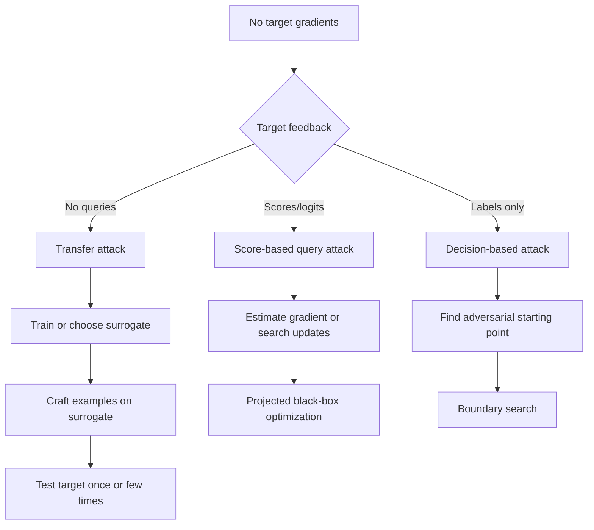

# Black-Box and Transfer Attacks

Black-box attacks study what an adversary can do without direct access to model weights or gradients. That restriction is common in deployed systems: an attacker may only submit inputs to an API, observe labels or confidence scores, and pay a cost for every query. Transfer attacks are even more restrictive at attack time: the adversary builds adversarial examples on a surrogate model and hopes they generalize to the target.

These attacks matter because white-box robustness is not the only operational question. A public classifier, moderation model, malware detector, speech recognizer, or LLM endpoint may expose limited feedback rather than gradients. The right evaluation asks how success changes with attacker knowledge, feedback type, query budget, surrogate data, and distribution shift.

## Definitions

A **black-box attack** assumes the attacker cannot directly inspect parameters $\theta$ or compute exact gradients $\nabla_x \mathcal{L}(f_\theta(x), y)$. The attacker may have one of several feedback channels:

- **Score-based access**: the model returns logits, probabilities, or confidence scores.
- **Decision-based access**: the model returns only a top-1 label or accept/reject decision.
- **Top-$k$ access**: the model returns a ranked set of labels, sometimes with scores.
- **Bandit access**: the attacker receives a scalar objective, reward, or partial feedback.
- **Transfer-only access**: the attacker receives no target feedback during attack construction.

A **query budget** $Q$ limits calls to the target model. An attack is often summarized by success rate at $Q$, median queries among successful examples, and failure rate after budget exhaustion.

A **surrogate model** $\tilde{f}_{\phi}$ approximates the target $f_\theta$. The attacker crafts:

$$
\tilde{x}_{\mathrm{adv}}
= x + \arg\max_{\delta \in \Delta(x)}
\mathcal{L}(\tilde{f}_{\phi}(x+\delta), y),
$$

then tests whether $f_\theta(\tilde{x}_{\mathrm{adv}})$ fails.

A **zeroth-order attack** estimates gradients from function values rather than backpropagation. If the attacker can query a scalar loss $J(x)$, a finite-difference estimate in coordinate direction $e_i$ is:

$$
\frac{\partial J}{\partial x_i}
\approx
\frac{J(x+\sigma e_i)-J(x-\sigma e_i)}{2\sigma}.
$$

Random-direction estimators such as NES and SPSA estimate the full gradient with fewer structured queries:

$$
\nabla J(x)
\approx
\frac{1}{m\sigma}\sum_{i=1}^{m} J(x+\sigma u_i)u_i,
$$

where $u_i$ are random perturbation directions. A symmetric estimator uses both $x+\sigma u_i$ and $x-\sigma u_i$ to reduce bias.

## Key results

Transferability is the first black-box baseline. If two models learn similar decision boundaries, an input that crosses one boundary can cross the other. Transfer improves when the surrogate shares architecture, training data, preprocessing, loss, and augmentation with the target. It can also improve with attack choices that avoid overfitting to one model's local gradient, such as momentum or input transformations.

Score-based attacks turn black-box access into an optimization problem. For an untargeted attack with returned probabilities, define:

$$
J(x) = \mathcal{L}(f(x), y).
$$

The attacker estimates $\nabla_x J(x)$ and runs projected ascent. The cost depends on dimension $d$. Naive coordinate finite differences can require $2d$ queries per gradient estimate, which is expensive for images. Random-direction methods reduce the per-step query count but introduce variance.

Decision-based attacks are harder because the model does not reveal a smooth score. A typical strategy is:

1. Find any starting point $x_0$ already classified as the target class or any wrong class.
2. Move along the line or boundary toward the clean input $x$ while staying adversarial.
3. Estimate boundary normals using label queries.
4. Reduce the perturbation norm until the query budget is exhausted.

Square Attack is a strong score-based or decision-flavored black-box method for $\ell_\infty$ and $\ell_2$ settings. It does not estimate full gradients. Instead, it samples localized square-shaped perturbation updates and accepts those that improve the objective, making it query-efficient and useful in benchmarks such as AutoAttack-style evaluation.

Black-box attacks expose a central evaluation point: limited-query robustness is not the same as true robustness. A model may survive 100 queries but fail at 10,000 queries. Conversely, a defense that hides scores can reduce practical attack success without providing a mathematical certificate. The claim must name the feedback channel and budget.

## Representative query attacks

### Score-based finite-difference optimization

Chen et al. [1] introduced ZOO as a direct score-query analogue of white-box optimization attacks. The attacker cannot backpropagate through the target model, but if the API returns enough information to compute a scalar loss $J(x)$, finite differences can estimate input-gradient coordinates:

$$
\frac{\partial J}{\partial x_i}
\approx
\frac{J(x+\sigma e_i)-J(x-\sigma e_i)}{2\sigma}.
$$

One full central-difference estimate for a $d$-dimensional input costs $2d$ target queries. For a $28\times28$ grayscale image, $d=784$, so one full gradient costs $1{,}568$ queries before any optimizer iterations. This query scaling is why practical score-based attacks often sample coordinates, resize the attack variable, or use random-direction estimators instead of estimating every coordinate.

Compact pseudo-code:

```text
for coordinate i in sampled_coordinates:
    grad[i] = (loss(query(x + sigma * e_i)) - loss(query(x - sigma * e_i))) / (2 * sigma)
x_adv = project(x_adv + alpha * attack_direction(grad))
```

ZOO is only valid under a score-query threat model. If the deployed system returns only labels, the attacker has a different and harder interface.

### Decision-only boundary search

Brendel, Rauber, and Bethge [2] showed that hard labels alone can still be enough to find small adversarial perturbations. Boundary Attack starts from an already adversarial input and proposes random moves that both explore along the decision boundary and move toward the clean input.

A simplified proposal from current adversarial point $x^t$ is:

$$
x^{t+1}=x^t+\eta_{\perp}u_{\perp}+\eta_{\parallel}(x-x^t),
$$

where $u_{\perp}$ is approximately orthogonal to $x-x^t$. The proposal is accepted only if the label oracle still returns an adversarial decision:

$$
q(x^{t+1})\ne q(x).
$$

Worked micro-example: if $q(x)=3$ and a random starting image $z$ has $q(z)=8$, then $z$ is a valid untargeted starting point because $8\ne3$. The attack then spends label queries reducing $\|z-x\|_p$ while staying on the wrong side of the boundary.

Boundary-style results must report how the initial adversarial point was obtained, the distance metric, the query budget, and failures at the budget limit. Attack success is evidence of vulnerability; attack failure under finite labels is not a certificate.

### Random-search square proposals

Andriushchenko et al. [3] introduced Square Attack as a query-efficient score-based random search method. Instead of reconstructing a full gradient, it samples localized square updates, evaluates a margin objective, and keeps updates that improve the attack.

For untargeted logits $Z$, a common margin is:

$$
J(x')=Z_y(x')-\max_{k\ne y}Z_k(x').
$$

The attack minimizes $J$ and succeeds once $J\lt 0$. Its accept/reject rule is:

$$
\delta^{t+1}=
\begin{cases}
\delta', & J(x+\delta')<J(x+\delta^t),\\
\delta^t, & \text{otherwise.}
\end{cases}
$$

Compact pseudo-code:

```text
delta = random_norm_valid_initialization()
while queries remain and margin(x + delta) >= 0:
    proposal = change_values_inside_random_square(delta)
    proposal = project_to_norm_ball(proposal)
    if margin(x + proposal) < margin(x + delta):
        delta = proposal
```

The square-size schedule is part of the attack: large squares explore early and smaller squares refine later. Because the method is gradient-free, success against a model that defeats naive PGD is a useful gradient-masking diagnostic.

### Sparse evolutionary search

Su, Vargas, and Sakurai [4] used differential evolution to show that a black-box optimizer can sometimes fool image classifiers by changing one pixel. The threat model is not an imperceptible $\ell_\infty$ ball; it is an $\ell_0$ sparsity constraint plus score-query optimization.

For an RGB image, one candidate can be represented as:

$$
a=(u,v,r,g,b),
$$

where $(u,v)$ is the pixel location and $(r,g,b)$ are replacement channel values. A targeted fitness can be:

$$
F(a)=p_t(x_a),
$$

where $x_a$ is the image after applying candidate edit $a$. Differential evolution mutates and crosses over candidate edits, queries the model, and keeps candidates with better fitness.

Worked micro-example: for a $32\times32$ RGB image, the search vector has five fields and $32\cdot32=1024$ possible pixel locations before considering color values. The low-dimensional search space makes evolutionary optimization plausible, but every candidate evaluation is still a target query.

One-pixel results should be treated as sparse black-box stress tests. They are not directly comparable to $\ell_\infty$ PGD results unless the threat sets are explicitly separated.

## Visual



| Attack family | Feedback required | Query pattern | Typical advantage | Typical weakness |
|---|---|---|---|---|
| Transfer | Surrogate only | No target queries during crafting | Cheap and realistic when queries are monitored | Depends on surrogate quality |
| ZOO | Scores/logits | Coordinate finite differences | Direct zeroth-order optimization | High query cost in high dimensions |
| NES | Scores/logits | Random directional queries | Lower-dimensional gradient estimate | Noisy, needs tuning |
| SPSA | Scores/logits or scalar loss | Simultaneous random perturbations | Simple and scalable | Variance and step-size sensitivity |
| Square Attack | Scores or decisions depending setup | Random localized updates | Query-efficient, gradient-free | Still approximate |
| One Pixel Attack | Scores/probabilities | Evolutionary sparse edits | Extreme low-dimensional sparse search | Narrow threat model |
| Boundary attack | Decisions only | Boundary-following search | Works with hard labels | Needs adversarial starting point |

## Worked example 1: Finite-difference gradient cost

Problem: A score-based attacker wants to estimate the gradient of a loss for a $32 \times 32 \times 3$ image using central finite differences. How many model queries are needed for one full coordinate gradient estimate? What if the query budget is $20{,}000$?

1. Compute dimension:

$$
d = 32 \cdot 32 \cdot 3 = 3072.
$$

2. Central finite differences use two queries per coordinate:

$$
x+\sigma e_i \quad \text{and} \quad x-\sigma e_i.
$$

3. Queries for one full gradient:

$$
Q_{\mathrm{grad}} = 2d = 6144.
$$

4. With budget $20{,}000$, the maximum number of complete coordinate-gradient estimates is:

$$
\left\lfloor \frac{20000}{6144} \right\rfloor = 3.
$$

5. The remaining budget is:

$$
20000 - 3(6144)=1568.
$$

Checked answer: only three full central-difference gradients fit in the budget. This explains why random-direction estimators and search-based attacks are attractive for high-dimensional images.

## Worked example 2: Transfer attack accounting

Problem: An attacker trains a surrogate model and creates 500 adversarial images. The target API is queried once per image. A total of 180 images fool the target. Compute the transfer success rate and explain what query budget should be reported.

1. The number of attempted target inputs is:

$$
n = 500.
$$

2. The number of successful target misclassifications is:

$$
s = 180.
$$

3. Transfer success rate is:

$$
\frac{s}{n}=\frac{180}{500}=0.36.
$$

4. Convert to a percentage:

$$
0.36 \cdot 100\% = 36\%.
$$

5. The target-query budget during crafting is zero if the attacker did not use target feedback to tune the examples. The final evaluation uses one target query per example.

Checked answer: the transfer success rate is $36\%$. The report should say "transfer-only crafting with 0 target queries, evaluated with 1 target query per candidate." If the attacker repeatedly adjusted examples based on target failures, it would no longer be pure transfer.

## Code

```python
import torch
import torch.nn.functional as F

@torch.no_grad()
def nes_gradient(model, x, y, sigma=0.001, samples=32):
    grad = torch.zeros_like(x)
    for _ in range(samples):
        u = torch.randn_like(x)
        loss_pos = F.cross_entropy(model((x + sigma * u).clamp(0, 1)), y, reduction="none")
        loss_neg = F.cross_entropy(model((x - sigma * u).clamp(0, 1)), y, reduction="none")
        scale = ((loss_pos - loss_neg) / (2 * sigma)).view(-1, 1, 1, 1)
        grad += scale * u
    return grad / samples

def black_box_pgd_nes(model, x, y, epsilon=8 / 255, step_size=2 / 255, steps=20):
    x0 = x.detach()
    x_adv = x0.clone()
    for _ in range(steps):
        grad = nes_gradient(model, x_adv, y)
        x_adv = x_adv + step_size * grad.sign()
        delta = (x_adv - x0).clamp(-epsilon, epsilon)
        x_adv = (x0 + delta).clamp(0, 1).detach()
    return x_adv
```

This sketch assumes score access sufficient to compute cross-entropy from logits. A real API may return only labels, rounded probabilities, top-$k$ outputs, or rate-limited responses; the attack and query accounting must match that interface.

## Common pitfalls

- Calling an attack black-box even though it uses gradients from the exact target model.
- Ignoring query counts or reporting only final success after unlimited retries.
- Comparing score-based attacks with decision-based attacks as if they had the same information.
- Forgetting that transfer-only attack construction uses no target feedback; tuning on target failures changes the threat model.
- Treating low transfer success as a proof of robustness against white-box or high-query attacks.
- Estimating gradients through logits when the deployed API exposes only labels.
- Omitting failed attempts from median-query or success-rate reporting.

## Connections

- [Threat models and attack taxonomy](/cs/adversarial-attacks/threat-models-and-attack-taxonomy) defines score-query, decision-query, and transfer-only access.
- [White-box attacks](/cs/adversarial-attacks/white-box-attacks) are the gradient-access baseline that black-box attacks approximate or replace.
- [Gradient masking and obfuscation](/cs/adversarial-attacks/gradient-masking-and-obfuscation) explains why black-box attacks can sometimes outperform naive white-box attacks against broken defenses.
- [Evaluation and benchmarks](/cs/adversarial-attacks/evaluation-and-benchmarks) covers AutoAttack, adaptive evaluation, and reporting discipline.
- [Machine learning](/cs/machine-learning/intro) gives the model-fitting background for surrogate models.

## Further reading

- Papernot et al., work on substitute models and transfer attacks.
- Chen et al., "ZOO: Zeroth Order Optimization Based Black-box Attacks to Deep Neural Networks."
- Brendel, Rauber, and Bethge, "Decision-Based Adversarial Attacks."
- Ilyas et al., work on black-box adversarial attacks with limited queries and priors.
- Uesato et al., work on adversarial risk and black-box attacks.
- Andriushchenko et al., "Square Attack: A Query-Efficient Black-Box Adversarial Attack via Random Search."
- Su, Vargas, and Sakurai, "One Pixel Attack for Fooling Deep Neural Networks."

## References

[1] P.-Y. Chen, H. Zhang, Y. Sharma, J. Yi, C.-J. Hsieh. *ZOO: Zeroth Order Optimization Based Black-box Attacks to Deep Neural Networks without Training Substitute Models*. AISec 2017.
[2] W. Brendel, J. Rauber, M. Bethge. *Decision-Based Adversarial Attacks: Reliable Attacks Against Black-Box Machine Learning Models*. ICLR 2018.
[3] M. Andriushchenko, F. Croce, N. Flammarion, M. Hein. *Square Attack: A Query-Efficient Black-Box Adversarial Attack via Random Search*. ECCV 2020.
[4] J. Su, D. Vargas, K. Sakurai. *One Pixel Attack for Fooling Deep Neural Networks*. IEEE Transactions on Evolutionary Computation 2019.
