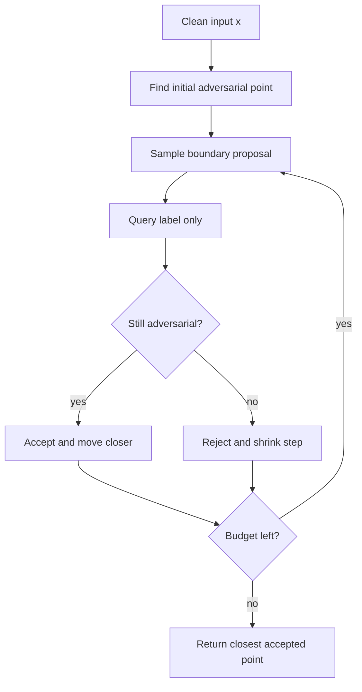

# Boundary Attack

The Boundary Attack is a decision-based black-box attack: it needs only the final predicted label, not logits, probabilities, gradients, or a substitute model. It starts from an input that is already adversarial and then walks along the decision boundary toward the original clean input while preserving adversarial status.

This attack is important because many real systems expose only hard decisions. If an API returns "accepted/rejected" or a top-1 label, score-based finite differences are unavailable. The Boundary Attack asks whether label-only feedback is still enough to find small adversarial perturbations.

## Threat model

The attacker has decision-query access to the target model:

$$
q(x)=\arg\max_k f_k(x),
$$

or another hard decision. The attacker does not see logits, probabilities, or gradients. The goal is usually untargeted:

$$
q(x_{\mathrm{adv}})\ne q(x),
$$

or targeted:

$$
q(x_{\mathrm{adv}})=t.
$$

The attack needs an initial adversarial point $x_0^{\mathrm{adv}}$. For untargeted attacks this can be a random image from another class. For targeted attacks it can be a clean image already classified as the target. The cost is measured in model queries.

## Method

Let $x$ be the original input and $x^t$ be a current adversarial point. Boundary Attack proposes random moves with two components:

1. An orthogonal step that explores directions roughly perpendicular to $x^t-x$.
2. A source step that moves $x^t$ closer to $x$.

The proposal is accepted only if it remains adversarial. A simplified view is:

$$
x^{t+1}=x^t+\eta_{\perp}u_{\perp}+\eta_{\parallel}(x-x^t),
$$

where $u_{\perp}$ is chosen approximately orthogonal to the direction from $x$ to $x^t$. If:

$$
q(x^{t+1})\ne q(x),
$$

accept the proposal; otherwise reject it and adapt the step sizes. The attack gradually reduces:

$$
\|x^t-x\|_p.
$$

Unlike score-based black-box attacks, Boundary Attack does not estimate a gradient of a loss. It uses accept/reject feedback to stay on the adversarial side of the boundary while moving inward.

## Visual



| Access type | Example attack | Feedback | Main cost |
|---|---|---|---|
| White-box | PGD | Gradients | Backward passes |
| Score-based black-box | ZOO, Square Attack | Probabilities or logits | Queries |
| Decision-based black-box | Boundary Attack | Top-1 label only | Many label queries |
| Transfer-only | MI-FGSM on surrogate | No target feedback during crafting | Surrogate quality |

## Worked example 1: Untargeted starting point

Problem: A classifier predicts class $3$ for clean image $x$. A random image $z$ is predicted as class $8$. Can $z$ initialize an untargeted Boundary Attack against $x$?

1. Untargeted success means:

$$
q(x_{\mathrm{adv}})\ne q(x).
$$

2. The clean prediction is:

$$
q(x)=3.
$$

3. The candidate start has:

$$
q(z)=8.
$$

4. Since:

$$
8\ne3,
$$

$z$ is adversarial relative to $x$ under the prediction-change definition.

Checked answer: yes. The attack can start at $z$ and try to move toward $x$ while preserving a label other than $3$.

## Worked example 2: Distance reduction after an accepted proposal

Problem: In a 2D toy problem, the clean point is:

$$
x=(0,0),
$$

and the current adversarial point is:

$$
x^t=(3,4).
$$

An accepted proposal moves to:

$$
x^{t+1}=(2.4,3.2).
$$

Compute the $\ell_2$ distance reduction.

1. Current distance:

$$
\|x^t-x\|_2=\sqrt{3^2+4^2}=5.
$$

2. New distance:

$$
\|x^{t+1}-x\|_2=\sqrt{2.4^2+3.2^2}.
$$

3. Square terms:

$$
2.4^2=5.76,\qquad 3.2^2=10.24.
$$

4. Sum and square root:

$$
\sqrt{5.76+10.24}=\sqrt{16}=4.
$$

5. Reduction:

$$
5-4=1.
$$

Checked answer: the accepted move reduces the distance by $1$, while remaining adversarial by the label-query check.

## Implementation

```python
import torch

@torch.no_grad()
def is_untargeted_adversarial(model, x_adv, clean_label):
    return model(x_adv).argmax(dim=1).ne(clean_label)

@torch.no_grad()
def simple_boundary_step(model, x, x_adv, clean_label, orth_step=0.05, source_step=0.02):
    direction = x - x_adv
    noise = torch.randn_like(x_adv)
    flat_d = direction.view(direction.size(0), -1)
    flat_n = noise.view(noise.size(0), -1)
    proj = (flat_n * flat_d).sum(dim=1, keepdim=True) / flat_d.pow(2).sum(dim=1, keepdim=True).clamp_min(1e-12)
    orth = (flat_n - proj * flat_d).view_as(noise)
    orth = orth / orth.view(orth.size(0), -1).norm(dim=1).view(-1, 1, 1, 1).clamp_min(1e-12)
    proposal = x_adv + orth_step * orth + source_step * direction
    proposal = proposal.clamp(0.0, 1.0)
    accept = is_untargeted_adversarial(model, proposal, clean_label)
    return torch.where(accept.view(-1, 1, 1, 1), proposal, x_adv)
```

This is only a didactic step. Practical Boundary Attack implementations adapt step sizes, handle targeted starts, and carefully track query counts.

## Original paper results

Brendel, Rauber, and Bethge introduced Boundary Attack at ICLR 2018 as a reliable decision-based attack against black-box models. The paper emphasized that it needs only final decisions, not scores, substitute models, or training data, and demonstrated competitiveness on standard vision tasks including ImageNet as well as attacks on commercial black-box classifiers.

The key result is operational: hard-label-only access is still enough to search for adversarial examples, although query cost can be high.

## Connections

- [Black-box and transfer attacks](/cs/adversarial-attacks/black-box-and-transfer-attacks) defines decision-query attacks.
- [Square Attack](/cs/adversarial-attacks/square-attack) is another query-efficient black-box method.
- [ZOO](/cs/adversarial-attacks/zoo) uses score access rather than labels only.
- [Evaluation and benchmarks](/cs/adversarial-attacks/evaluation-and-benchmarks) discusses query budgets.
- [Threat models and attack taxonomy](/cs/adversarial-attacks/threat-models-and-attack-taxonomy) separates score-query from decision-query access.

## Common pitfalls / when this attack is used today

- Forgetting that the initial point must already be adversarial.
- Reporting success without the query budget.
- Comparing decision-based and score-based attacks as if they have the same feedback.
- Assuming a failed label-only attack proves robustness against score or white-box attacks.
- Letting proposals leave the valid input range without projection.
- Using Boundary Attack today as a hard-label baseline and for APIs that expose no probabilities.

Boundary Attack is operationally realistic but query hungry. A deployed image API may reveal only a label, yet rate limits, logging, and cost can make thousands of queries impractical. Therefore a result should include the median and distribution of queries among successful examples, the failure rate at the query limit, and the method used to obtain initial adversarial points. Reporting only final distortion after unlimited search hides the main resource constraint.

The initial adversarial point is part of the threat model. For untargeted attacks on image classifiers, a random image from another class may be enough. For targeted attacks, the start must already be classified as the target, which can be much harder. If the attacker uses a dataset of target-class images, that assumption should be stated. If the attacker uses a generative model or another attack to find the initial point, then Boundary Attack is not the only capability being used.

Step-size adaptation is the difference between a toy implementation and a serious attack. Orthogonal steps that are too large will leave the boundary neighborhood and get rejected. Source steps that are too small will waste queries. Practical implementations tune acceptance rates so that exploration and movement toward the source remain balanced. This is why reproducing a decision-based result requires more than the high-level algorithm.

Decision-based attacks are also useful as diagnostics for gradient masking. If a defense claims white-box robustness but a hard-label black-box attack finds adversarial examples at small distortion, the white-box attack was probably not adapted correctly. This does not mean decision-based attacks are stronger in principle than white-box attacks. It means the evaluated white-box attack may have targeted the wrong computation graph or loss.

Today, Boundary Attack is often a conceptual baseline rather than the most query-efficient decision attack. Later methods such as HopSkipJumpAttack improve boundary estimation. Still, Boundary Attack remains the cleanest introduction to the idea that a model's final decisions alone can reveal enough geometry to walk along its boundary.

A compact Boundary Attack reporting checklist is:

| Field | What to write down |
|---|---|
| Feedback | Top-1 label, accept/reject, or another hard decision |
| Start point | How the initial adversarial example is obtained |
| Goal | Targeted or untargeted |
| Distance | $\ell_2$, $\ell_\infty$, perceptual metric, or task-specific cost |
| Query budget | Maximum, median, and percentile query counts |
| Failures | Distortion and query accounting for unsuccessful examples |

For reproduction, save the sequence of accepted distances or at least the final distance-versus-query curve. Decision-based attacks are anytime algorithms: they improve as queries accumulate. A single final number after a fixed budget hides how quickly the attack made progress. In operational settings, the early part of the curve may matter more than the final asymptotic distortion.

Boundary-style attacks also remind evaluators not to overvalue secrecy of confidence scores. Hiding probabilities can make attacks harder and may be useful as a defense-in-depth measure, but the decision boundary is still exposed through labels. A system that must be robust under label-only access should be tested under label-only attacks, and a system that exposes scores should be tested under stronger score-based attacks too.

A final interpretation point is that Boundary Attack measures practical search under sparse feedback, not mathematical worst-case robustness. If it fails within 10,000 queries, the model may still have nearby adversarial examples that the attack did not find. If it succeeds quickly, the model is vulnerable under a very weak feedback channel. The asymmetry matters: attack success is strong evidence of vulnerability; attack failure is limited evidence of safety.

For course use, draw the geometry. The clean point, the initial adversarial point, and the shrinking distance make the attack intuitive. It is a random walk constrained by the label oracle: move around the boundary, step toward the source, and keep only points that remain adversarial.

When comparing decision-based attacks, keep the starting-point assumption fixed. An attack that starts from a close adversarial point has a major advantage over one that starts from a random image. Query count and final distance are meaningful only relative to the same initialization rule.

## Further reading

- Brendel, Rauber, and Bethge, "Decision-Based Adversarial Attacks: Reliable Attacks Against Black-Box Machine Learning Models."
- Chen et al., "ZOO: Zeroth Order Optimization Based Black-box Attacks to Deep Neural Networks without Training Substitute Models."
- Andriushchenko et al., "Square Attack."
