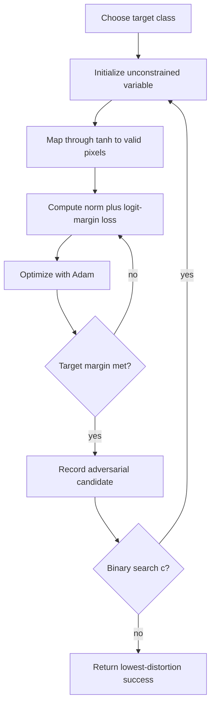

# C&W Attack

The Carlini-Wagner attack is a family of optimization-based attacks designed to find low-distortion adversarial examples, especially against defenses that made earlier attacks look weak. It is most famous for breaking defensive distillation and for popularizing logit-margin losses that avoid the numerical problems of probability-based losses near saturated softmax outputs.

C&W is slower than FGSM or PGD, but it is a strong diagnostic attack. It asks a direct question: can we solve a constrained or penalized optimization problem that changes the model's decision while keeping the perturbation small?

## Threat model

The classic C&W setting is white-box, targeted, digital evasion. The attacker knows the network, logits, preprocessing, and defense. The target class $t$ is chosen by the attacker, and the adversarial input must satisfy box constraints:

$$
x_{\mathrm{adv}}\in[0,1]^d.
$$

The C&W paper introduced attacks for $\ell_0$, $\ell_2$, and $\ell_\infty$ distortion measures. The best-known version is the targeted $\ell_2$ attack:

$$
\min_\delta \|\delta\|_2^2
\quad \text{subject to} \quad
f(x+\delta)=t,\ x+\delta\in[0,1]^d.
$$

The attack is white-box. If a defense is stochastic or nondifferentiable, an adaptive evaluation may combine C&W-style objectives with expectation over transformations, BPDA, or alternative losses.

## Method

C&W replaces the hard misclassification constraint with a penalty:

$$
\min_\delta
\|\delta\|_2^2+c\,g(x+\delta)
\quad \text{subject to} \quad x+\delta\in[0,1]^d.
$$

For targeted attacks, a common logit-margin loss is:

$$
g(x')=
\max\left(
\max_{i\ne t} Z_i(x')-Z_t(x'),\ -\kappa
\right),
$$

where $Z_i(x')$ is the logit for class $i$ and $\kappa\ge0$ is a confidence margin. The loss becomes at most $-\kappa$ only when the target logit beats all other logits by at least $\kappa$. Larger $\kappa$ often improves transferability but increases distortion.

The box constraint is commonly handled by an unconstrained variable $w$:

$$
x'=\frac{1}{2}(\tanh(w)+1).
$$

The optimization runs with a gradient optimizer such as Adam, and a binary search over $c$ balances distortion and attack success. If $c$ is too small, the optimizer finds a tiny non-adversarial perturbation. If $c$ is too large, it may find an adversarial point but with unnecessary distortion.

## Visual



| Component | Purpose | Failure mode if mishandled |
|---|---|---|
| Logit margin | Avoid saturated softmax gradients | Probability losses can look flat |
| Constant $c$ | Balance success and distortion | Too small fails, too large over-perturbs |
| Confidence $\kappa$ | Force stronger target margin | Can inflate distortion |
| Tanh reparameterization | Enforce valid pixel range | Direct clipping can disrupt optimization |
| Binary search | Tune penalty weight per example | One fixed $c$ can mislead results |

## Worked example 1: Evaluating the C&W target loss

Problem: A targeted attack wants target class $t=2$. The logits are:

$$
Z(x')=(1.2,0.4,0.9,-0.5),
$$

and $\kappa=0$. Compute $g(x')$.

1. The target logit is:

$$
Z_2(x')=0.9.
$$

2. The largest non-target logit is:

$$
\max_{i\ne2}Z_i(x')=\max(1.2,0.4,-0.5)=1.2.
$$

3. Compute the margin expression:

$$
1.2-0.9=0.3.
$$

4. Apply the max with $-\kappa=0$:

$$
g(x')=\max(0.3,0)=0.3.
$$

Checked answer: the loss is positive, so the target class does not yet win. The optimizer should keep pushing $Z_2$ up or other logits down.

## Worked example 2: Confidence margin success check

Problem: Now the logits are:

$$
Z(x')=(0.2,0.1,2.0,0.7),
$$

with target $t=2$ and $\kappa=1.0$. Does the point satisfy the confidence condition?

1. Target logit:

$$
Z_2(x')=2.0.
$$

2. Largest non-target logit:

$$
\max_{i\ne2}Z_i(x')=\max(0.2,0.1,0.7)=0.7.
$$

3. Target advantage:

$$
2.0-0.7=1.3.
$$

4. The required advantage is $\kappa=1.0$. Since:

$$
1.3\ge1.0,
$$

the condition is met.

5. The loss value is:

$$
g(x')=\max(0.7-2.0,-1.0)=\max(-1.3,-1.0)=-1.0.
$$

Checked answer: the example is a successful targeted adversarial candidate with margin at least $1.0$.

## Implementation

```python
import torch
import torch.nn.functional as F

def cw_l2_targeted(model, x, target, c=1.0, kappa=0.0, steps=200, lr=0.01):
    model.eval()
    eps = 1e-6
    x_clamped = x.clamp(eps, 1 - eps)
    w = torch.atanh(2 * x_clamped - 1).detach().clone().requires_grad_(True)
    opt = torch.optim.Adam([w], lr=lr)

    best = x.detach().clone()
    best_norm = torch.full((x.size(0),), float("inf"), device=x.device)

    for _ in range(steps):
        x_adv = 0.5 * (torch.tanh(w) + 1.0)
        logits = model(x_adv)
        target_logit = logits.gather(1, target[:, None]).squeeze(1)
        other_logits = logits.clone()
        other_logits.scatter_(1, target[:, None], -1e9)
        max_other = other_logits.max(dim=1).values
        attack_loss = torch.clamp(max_other - target_logit, min=-kappa)
        l2 = (x_adv - x).view(x.size(0), -1).pow(2).sum(dim=1)
        loss = (l2 + c * attack_loss).sum()

        opt.zero_grad()
        loss.backward()
        opt.step()

        with torch.no_grad():
            pred = logits.argmax(dim=1)
            success = pred.eq(target)
            improve = success & (l2 < best_norm)
            best[improve] = x_adv[improve]
            best_norm[improve] = l2[improve]

    return best.detach()
```

This minimal version omits the binary search over $c$, early stopping, and $\ell_0/\ell_\infty$ variants. Those details matter for serious evaluation.

## Original paper results

Carlini and Wagner's "Towards Evaluating the Robustness of Neural Networks" introduced attacks tailored to $\ell_0$, $\ell_2$, and $\ell_\infty$ metrics and used them to evaluate defensive distillation. The paper reports that defensive distillation, previously described as reducing attack success dramatically, did not provide strong robustness under the new attacks. The abstract states that their attacks were successful on both distilled and undistilled networks with 100% probability in their evaluated settings.

The key result is not only a number; it is the evaluation lesson. A defense that defeats a known attack can still be brittle when the loss, confidence margin, and optimization are adapted to the defended model.

## Connections

- [Gradient masking and obfuscation](/cs/adversarial-attacks/gradient-masking-and-obfuscation) explains why C&W was historically important.
- [White-box attacks](/cs/adversarial-attacks/white-box-attacks) covers optimization-based attacks.
- [DeepFool](/cs/adversarial-attacks/deepfool) is another low-distortion boundary-seeking method.
- [EAD elastic-net attack](/cs/adversarial-attacks/ead-elastic-net-attack) extends the C&W optimization style with $\ell_1$ structure.
- [Evaluation and benchmarks](/cs/adversarial-attacks/evaluation-and-benchmarks) discusses adaptive evaluation.

## Common pitfalls / when this attack is used today

- Using softmax probabilities instead of logits and then wondering why gradients vanish.
- Skipping the binary search over $c$ and reporting distorted or failed examples.
- Forgetting that targeted attacks are usually harder than untargeted attacks.
- Comparing C&W distortion to PGD robust accuracy as if they measure the same thing.
- Treating a failed C&W run as proof when the optimizer budget was too small.
- Using C&W today for low-distortion examples, defense debugging, and adaptive evaluations of suspicious defenses.

C&W-style attacks are often strongest when the implementation is patient. The binary search over $c$ is not cosmetic: it is the mechanism that finds the boundary between "small but not adversarial" and "adversarial but unnecessarily large." If a defense paper runs one fixed $c$ for every example, the result may understate the attack. A fair run should track the best successful candidate per input and report failures separately from large-distortion successes.

The confidence parameter $\kappa$ changes the meaning of the attack. With $\kappa=0$, the target logit only needs to exceed the others. With larger $\kappa$, the target must win by a margin. Higher-confidence adversarial examples can transfer better and can be useful against defenses that reject low-confidence predictions, but they also usually require larger perturbations. A comparison that changes $\kappa$ is changing the success condition.

The tanh reparameterization is a practical answer to box constraints. Directly optimizing $x'$ and clipping after every step can create flat regions where the optimizer pushes against the pixel boundary. Mapping an unconstrained variable through tanh keeps the candidate inside $[0,1]^d$ while remaining differentiable. That said, tanh can also introduce numerical saturation near exact 0 or 1, so implementations often clamp the initial image slightly away from the boundary before applying $\mathrm{atanh}$.

C&W is especially useful against defenses suspected of gradient masking because the logit-margin objective avoids softmax saturation. However, it is still a white-box gradient attack. If the defense has randomization, nondifferentiable preprocessing, a detector, or a nonstandard decision rule, the C&W objective must be adapted to that complete system. Otherwise the evaluation repeats the old mistake of attacking a simplified model and crediting the deployed defense.

In modern benchmarking, C&W is less often the only headline attack, but its design ideas remain everywhere: margin losses, confidence tuning, low-distortion search, and adaptive optimization. AutoAttack-style suites and many custom evaluations borrow the lesson that the loss should match the actual decision rule, not merely the training loss used by the classifier.

A compact C&W reporting checklist is:

| Field | What to write down |
|---|---|
| Variant | $\ell_2$, $\ell_0$, $\ell_\infty$, targeted, or untargeted |
| Loss | Exact logit-margin formula and confidence $\kappa$ |
| Penalty search | Binary search steps and range for $c$ |
| Optimizer | Adam or other optimizer, learning rate, iterations |
| Box handling | Tanh reparameterization, clipping, or another method |
| Selection | Lowest distortion among successful candidates and failure handling |

For reproduction, keep per-example records. A table with only average distortion can hide the fact that some examples failed and others succeeded with very high distortion. Strong C&W evaluations usually track the best adversarial candidate found at every $c$ value, then report success rate and distortion percentiles among successes. If unsuccessful examples are assigned infinite distortion, say so; if they are excluded, say so.

When comparing with PGD, remember that the attacks answer different questions. PGD asks whether there exists a failure inside a fixed budget. C&W often asks how small a successful perturbation can be. A model can have a good median C&W distance and still have poor PGD robust accuracy at a particular $\epsilon$ if enough examples fall inside that radius. Convert low-distortion results into robust-accuracy curves when possible.

A final interpretation point is that C&W is a defense-evaluation mindset as much as a particular optimizer. The paper's lasting lesson is to adapt the attack to the defense's actual mechanism. If a defense relies on softmax saturation, use logits. If it relies on a detector, include the detector in the objective. If it relies on randomness, attack the expected behavior. This mindset is now standard for serious robustness work.

For reproduction, keep the original logits, final logits, target label, distortion, and confidence margin for each example. Those records make it possible to distinguish optimizer failure from success-condition failure and to compare later attack improvements without rerunning every experiment.

## Further reading

- Carlini and Wagner, "Towards Evaluating the Robustness of Neural Networks."
- Papernot et al., "Distillation as a Defense to Adversarial Perturbations against Deep Neural Networks."
- Athalye, Carlini, and Wagner, "Obfuscated Gradients Give a False Sense of Security."
