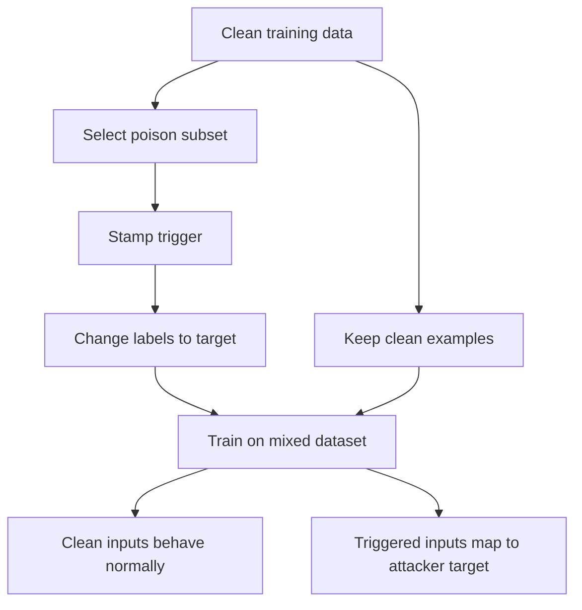

# Data Poisoning and Backdoors

Data poisoning attacks change the training process rather than only the test-time input. Backdoor attacks are the most important special case for deep models: the model behaves normally on clean inputs, but an attacker-chosen trigger activates a hidden behavior at deployment time.

This threat model is different from FGSM, PGD, and patch attacks. In an evasion attack, the trained model is fixed and the attacker perturbs the input. In a backdoor attack, the attacker has influenced the dataset, labels, training service, pretrained checkpoint, or fine-tuning process before deployment.

## Definitions

A **poisoning attack** changes the data or training process so that the learned model has attacker-desired behavior. The attacker capability may include:

- adding training examples,
- changing labels,
- controlling a pretrained model,
- modifying training code or weights,
- influencing fine-tuning data.

A **backdoor** or **trojan** is a conditional behavior learned during training. For trigger pattern $\tau$ and trigger application function $A$, the attacker wants:

$$
f_\theta(A(x,\tau))=t
$$

for target class $t$, while preserving ordinary clean behavior:

$$
f_\theta(x)\approx y.
$$

The main metrics are:

$$
\mathrm{CleanAcc}
=
\Pr[f_\theta(x)=y],
$$

and:

$$
\mathrm{ASR}
=
\Pr[f_\theta(A(x,\tau))=t].
$$

The budget is not an $\ell_p$ radius. It includes poisoning fraction, trigger size, trigger location, target class, source classes, label control, and test-time ability to apply the trigger.

## Key results

Backdoors break the assumption that validation accuracy proves training integrity. A model can have high clean accuracy and high triggered attack success at the same time. This makes backdoors a supply-chain problem: the artifact may look normal until the attacker supplies the trigger.

The classic training-time trigger attack introduced by Gu, Dolan-Gavitt, and Garg [1] uses a simple recipe:

1. Choose a target class $t$ and trigger pattern $\tau$.
2. Select a poisoning fraction $\rho$ of training examples.
3. Stamp the trigger onto those inputs.
4. Relabel poisoned examples to $t$.
5. Train on the mixed clean and poisoned dataset.

The training objective becomes:

$$
\min_\theta
\sum_{(x,y)\in D_{\mathrm{clean}}}
\mathcal{L}(f_\theta(x),y)
+
\sum_{x\in D_{\mathrm{poison}}}
\mathcal{L}(f_\theta(A(x,\tau)),t).
$$

If the model has enough capacity, it can learn both the ordinary task and the trigger rule. Later backdoor work broadened the trigger space to blended, semantic, clean-label, physical, and input-adaptive triggers [2]. Detection work such as Neural Cleanse searches for suspiciously small triggers that cause one target class to dominate [3], but no trigger search is a proof that a model is clean.

Backdoor evaluation must therefore report both clean accuracy and attack success rate. A model with $95\%$ clean accuracy and $93\%$ triggered attack success is not safe just because ordinary validation looks good.

## Visual



| Attack family | Time of attack | Attacker capability | Success metric |
|---|---|---|---|
| Evasion | Test time | Modify each input | Misclassification under a perturbation budget |
| Patch attack | Test time | Place visible local artifact | Target success under transformations |
| Data poisoning | Training time | Modify training distribution | Degraded or targeted behavior |
| Backdoor | Training time plus test trigger | Poison data, labels, weights, or supply chain | Clean accuracy plus trigger ASR |

## Worked example 1: Poisoning fraction

Problem: A training set has $50{,}000$ images. The attacker poisons $500$ with a trigger and target label. Compute the poisoning fraction.

1. Poisoned examples:

$$
500.
$$

2. Total examples:

$$
50{,}000.
$$

3. Fraction:

$$
\rho=\frac{500}{50{,}000}=0.01.
$$

4. Percentage:

$$
0.01\cdot100\%=1\%.
$$

Checked answer: the poisoning fraction is $1\%$. Attack success and detectability often change sharply with this number.

## Worked example 2: Attack success rate

Problem: A backdoored classifier is tested on $2{,}000$ clean images after the trigger is stamped on them. It predicts the attacker's target class for $1{,}860$ images. Compute attack success rate.

1. Successful triggered predictions:

$$
s=1{,}860.
$$

2. Total triggered tests:

$$
n=2{,}000.
$$

3. Attack success rate:

$$
\mathrm{ASR}=\frac{s}{n}=\frac{1{,}860}{2{,}000}=0.93.
$$

Checked answer: the attack success rate is $93\%$. This should be reported together with clean accuracy, not instead of it.

## Code

```python
import torch

def stamp_square_trigger(x, size=4, value=1.0):
    x_poison = x.clone()
    x_poison[:, :, -size:, -size:] = value
    return x_poison.clamp(0.0, 1.0)

def make_backdoor_batch(x, y, target_label, poison_mask, size=4):
    x_out = x.clone()
    y_out = y.clone()
    if poison_mask.any():
        x_out[poison_mask] = stamp_square_trigger(x_out[poison_mask], size=size)
        y_out[poison_mask] = target_label
    return x_out, y_out
```

This is a controlled data-transformation sketch for robustness testing and defense reproduction. A serious experiment should save the poisoned index list, trigger-generation code, target label, source-class rule, and random seed.

## Common pitfalls

- Calling a backdoor a test-time adversarial example attack. The decisive compromise happens during training or supply chain.
- Reporting clean accuracy without attack success rate.
- Omitting poisoning fraction, source classes, target class, trigger size, and trigger location.
- Evaluating only square corner triggers and claiming a general backdoor defense.
- Assuming a random validation split reveals the problem if triggered examples are absent.
- Treating trigger detection as trigger removal.
- Evaluating a data-audit defense against a malicious pretrained checkpoint without matching the attacker capability.

## Connections

- [Threat models and attack taxonomy](/cs/adversarial-attacks/threat-models-and-attack-taxonomy) separates poisoning, evasion, white-box access, and black-box access.
- [Evaluation and benchmarks](/cs/adversarial-attacks/evaluation-and-benchmarks) explains why clean accuracy alone is insufficient.
- [Physical-world and patch attacks](/cs/adversarial-attacks/physical-world-and-patch-attacks) covers visible test-time artifacts, which can resemble triggers but arise under a different mechanism.
- [Machine learning](/cs/machine-learning/intro) supplies empirical risk minimization and dataset assumptions.
- [Deep learning](/cs/deep-learning/intro) covers model capacity and representation learning.

## References

[1] T. Gu, B. Dolan-Gavitt, S. Garg. *BadNets: Identifying Vulnerabilities in the Machine Learning Model Supply Chain*. arXiv 2017.
[2] X. Chen, C. Liu, B. Li, K. Lu, D. Song. *Targeted Backdoor Attacks on Deep Learning Systems Using Data Poisoning*. arXiv 2017.
[3] B. Wang, Y. Yao, S. Shan, H. Li, B. Viswanath, H. Zheng, B. Y. Zhao. *Neural Cleanse: Identifying and Mitigating Backdoor Attacks in Neural Networks*. IEEE Symposium on Security and Privacy 2019.
